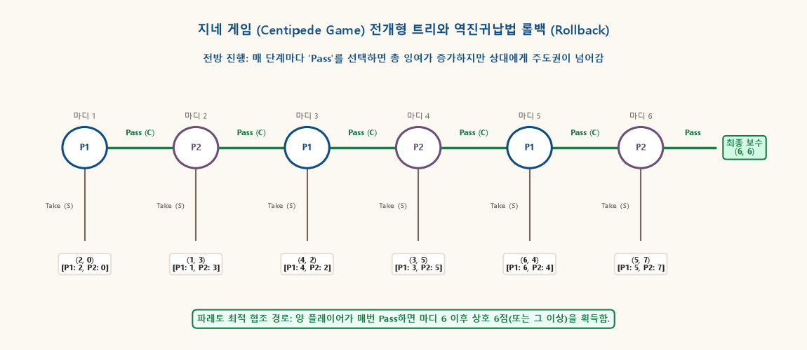
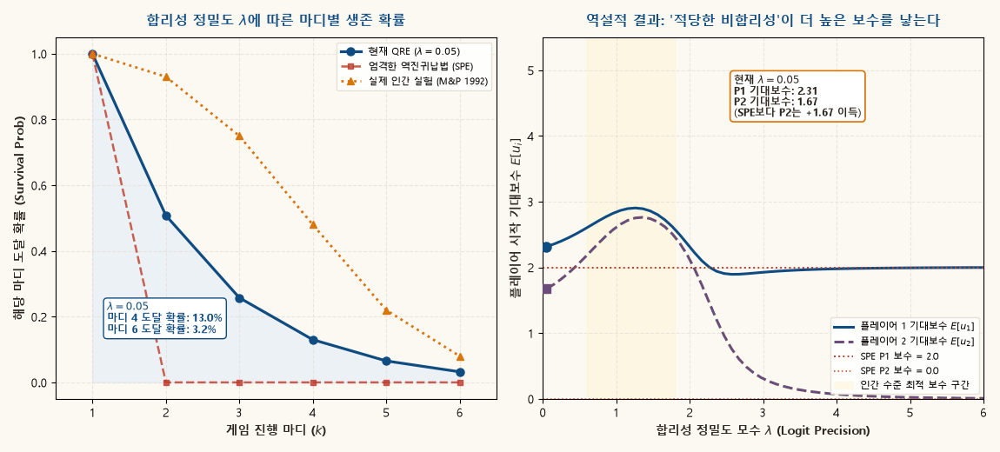

## 1. 개요: 역진귀납법의 승리와 지네 게임의 역설

완전정보를 가진 유한 전개형 게임(Finite Extensive-Form Game with Perfect Information)에서 **역진귀납법(Backward Induction)**은 가장 직관적이면서도 강력한 해법 개념이다. 체스나 오목과 같이 우연의 일치가 개입하지 않고 모든 수가 공개된 게임에서 Zermelo-Kuhn 정리는 역진귀납법을 통해 항상 순수전략 부분게임 완전균형(SPE)이 존재함을 보장한다.

그러나 Robert Rosenthal(1981)이 고안한 **지네 게임(Centipede Game)**은 역진귀납법이 현실의 경제적 직관 및 인간의 합리성과 정면으로 충돌하는 가장 극적인 역설(Paradox of Backward Induction)을 보여준다.

지네 게임의 규칙은 단순하다:
- 두 플레이어가 번갈아가며 몫을 챙기고 게임을 끝낼지(**Take**, $S$), 아니면 파이를 키워 상대방에게 차례를 넘길지(**Pass**, $C$)를 선택한다.
- 양측이 계속 Pass를 선택하면 상금 풀(pool)은 매 단계 기하급수적으로 팽창하여 수백만 원에 달하는 거대한 상호 이익을 창출한다.
- 그러나 마지막 마디에서 상대방이 이기적으로 Take를 선택할 것을 알기 때문에, 직전 마디의 플레이어는 자신이 먼저 Take를 감행해야 하고, 이 의심의 논리가 첫 번째 마디까지 도미노처럼 역류한다.

그 결과, **"합리적인 두 사람이 만나면 게임이 시작하자마자 1단계에서 고작 푼돈만 챙기고 즉시 끝난다"**는 파레토 최악의 결론이 수학적으로 유일한 균형이 된다.

본 보충자료는 이 충격적인 이론적 귀결의 수리적 메커니즘을 밝히고, 게임이론의 인식론적 기초(Epistemic Foundations), 실제 실험실에서의 인간 행동, 그리고 이를 정합적으로 설명하는 현대 행동 게임이론(Quantal Response Equilibrium 및 평판 모형)을 다각도로 규명한다.

---

## 2. 지네 게임(Centipede Game)의 수학적 정식화

### 게임의 기본 구조

게임은 총 $2m$개의 마디(Node)로 구성된 유한 전개형 게임이다 ($k = 1, 2, \dots, 2m$).
- 홀수 마디 $k \in \{1, 3, \dots, 2m-1\}$: 플레이어 1의 의사결정 마디.
- 짝수 마디 $k \in \{2, 4, \dots, 2m\}$: 플레이어 2의 의사결정 마디.

각 마디 $k$에서 행동 공간은 다음과 같다:
$$
A_k = \{ \text{Pass } (C), \; \text{Take } (S) \}.
$$

6마디 지네 게임($m=3$)의 표준 정수 보수 구조를 다음과 같이 정의하자:

| 마디 $k$ | 차례 | 선택 $S$ (Take) 시 보수 $(u_1, u_2)$ | 선택 $C$ (Pass) 시 전개 |
|:---:|:---:|:---:|:---:|
| **1** | 플레이어 1 | $(2, 0)$ | 마디 2로 진행 |
| **2** | 플레이어 2 | $(1, 3)$ | 마디 3으로 진행 |
| **3** | 플레이어 1 | $(4, 2)$ | 마디 4로 진행 |
| **4** | 플레이어 2 | $(3, 5)$ | 마디 5로 진행 |
| **5** | 플레이어 1 | $(6, 4)$ | 마디 6으로 진행 |
| **6** | 플레이어 2 | $(5, 7)$ | 최종 패스 $(6, 6)$으로 종료 |

::: {.callout-note appearance="simple"}
### 보수 구조의 3대 핵심 특징
1. **총 잉여의 지속적 팽창**: 매 단계 Pass가 선택될 때마다 두 사람의 보수 합계는 $2 \to 4 \to 6 \to 8 \to 10 \to 12$로 단조 증가한다.
2. **배반의 단기 유혹**: 현재 행동권을 가진 플레이어 $i$는 상대방이 다음 마디에서 Take를 선택할 경우 자신이 얻게 될 보수보다, 지금 자신이 Take를 선택할 때 1단위 더 높은 보수를 얻는다 ($2 > 1, 3 > 2, 4 > 3, \dots$).
3. **상호 협조의 파레토 우위**: 마디 6에서 Pass로 끝날 때의 보수 $(6, 6)$은 시작 시점의 $(2, 0)$에 비해 두 플레이어 모두에게 엄격히 우월하다.
:::

---

## 3. 역진귀납법과 Zermelo-Kuhn 정리: 1단계 즉시 종료 증명

유한 완전정보 전개형 게임이므로 Zermelo-Kuhn 정리에 따라 역진귀납법(Backward Induction)을 마지막 마디부터 적용한다.

### 마디별 롤백(Rollback) 전개

1. **마디 6 (플레이어 2의 마지막 마디)**:
   - $S$ (Take) 선택 시 보수: $u_2(S) = 7$.
   - $C$ (Pass) 선택 시 보수: $u_2(C) = 6$.
   - $7 > 6$이므로, 합리적인 플레이어 2는 **$S$ (Take)**를 선택한다.
   - 따라서 마디 6에서의 귀결 보수는 $(5, 7)$로 확정되며, Pass 가지는 잘려나간다(Pruned).

2. **마디 5 (플레이어 1의 마디)**:
   - 플레이어 1은 자신이 $C$ (Pass)를 선택하면 다음 마디 6에서 플레이어 2가 $S$를 선택하여 자신이 보수 $u_1 = 5$를 받게 됨을 예견한다.
   - 반면 지금 마디 5에서 $S$ (Take)를 선택하면 $u_1(S) = 6$을 받는다.
   - $6 > 5$이므로, 플레이어 1은 **$S$ (Take)**를 선택한다.
   - 마디 5의 귀결 보수는 $(6, 4)$로 축약된다.

3. **마디 4 (플레이어 2의 마디)**:
   - $C$ 선택 시 마디 5에서 플레이어 1이 $S$를 선택하므로 $u_2 = 4$.
   - 지금 $S$ 선택 시 $u_2(S) = 5$.
   - $5 > 4$이므로 플레이어 2는 **$S$ (Take)**를 선택한다. 귀결 보수는 $(3, 5)$.

4. **마디 3 (플레이어 1의 마디)**:
   - $C$ 선택 시 마디 4에서 $u_1 = 3$. 지금 $S$ 선택 시 $u_1(S) = 4$.
   - $4 > 3$이므로 플레이어 1은 **$S$ (Take)**를 선택한다. 귀결 보수는 $(4, 2)$.

5. **마디 2 (플레이어 2의 마디)**:
   - $C$ 선택 시 마디 3에서 $u_2 = 2$. 지금 $S$ 선택 시 $u_2(S) = 3$.
   - $3 > 2$이므로 플레이어 2는 **$S$ (Take)**를 선택한다. 귀결 보수는 $(1, 3)$.

6. **마디 1 (플레이어 1의 시작 마디)**:
   - $C$ 선택 시 마디 2에서 플레이어 2가 $S$를 택하므로 $u_1 = 1$.
   - 지금 $S$ 선택 시 $u_1(S) = 2$.
   - $2 > 1$이므로 플레이어 1은 **$S$ (Take)**를 선택한다!

::: {.callout-important appearance="simple"}
### 정리 3.1 · 지네 게임의 유일한 부분게임 완전균형 (SPE)
지네 게임에서 역진귀납법에 의한 유일한 부분게임 완전균형(SPE) 전략 프로파일은 다음과 같다:
$$
s_1^* = (S, S, S), \qquad s_2^* = (S, S, S).
$$
균형 경로(Equilibrium Path) 상에서 **게임은 1번째 마디에서 플레이어 1이 $S$를 선택함으로써 즉시 종료**되며, 실현되는 균형 보수는 **$(2, 0)$**이다.
:::

이 결론은 게임이론 역사상 가장 충격적인 결과 중 하나이다. 양측이 끝까지 협조하면 $(6, 6)$을 나누어가질 수 있고, 중간까지만 가더라도 $(4, 2)$나 $(3, 5)$처럼 훨씬 풍요로운 결과를 얻을 수 있음에도 불구하고, 완벽한 합리성을 갖춘 두 경제학자가 만나면 첫 마디에서 2원과 0원을 손에 쥐고 퇴장해야 한다.

---

## 4. 합리성의 공통지식(CKR)과 인식론적 역설

이 역설의 이면에는 게임이론의 기초인 **합리성의 공통지식(Common Knowledge of Rationality, CKR)**에 대한 깊은 인식론적(Epistemic) 딜레마가 도사리고 있다.

CKR이란 다음의 무한 연쇄를 의미한다:
1. 모든 플레이어는 합리적이다.
2. 모든 플레이어는 상대방이 합리적임을 안다.
3. 모든 플레이어는 상대방이 자신이 합리적임을 안다는 것을 안다 ($\dots$ 무한 반복).

### 도달 불가능한 마디에서의 가정법적 추론 (Counterfactual Dilemma)

만약 1마디에서 플레이어 1이 균형을 벗어나 **$C$ (Pass)**를 선택했다고 가정해보자.
그리하여 차례를 맞이한 2마디의 플레이어 2는 과연 무엇을 믿어야 하는가?

- **Aumann (1995)의 관점**:
  CKR이 엄격하게 성립한다면, 플레이어 1이 $C$를 둔 것은 '단순한 실수(mistake)'일 뿐이며, 플레이어 1은 여전히 앞으로 합리적일 것이다. 따라서 플레이어 2는 마디 3에서 플레이어 1이 $S$를 둘 것임을 알기 때문에 즉시 2마디에서 $S$를 택해야 한다.
- **Binmore (1996)의 반론**:
  플레이어 1이 1마디에서 $C$를 선택한 행위 자체가 이미 "플레이어 1이 완벽히 합리적이라는 전제(CKR)"를 산산조각 낸 것이다! 이미 비합리적인 행동을 목격한 플레이어 2가, "앞으로 플레이어 1은 완벽히 합리적으로 행동할 것"이라고 믿어야 할 논리적 근거는 어디에 있는가?
  오히려 플레이어 1이 "나는 끝까지 Pass를 할 용의가 있으니 너도 Pass를 해라"라는 신호(Signaling)를 보낸 것으로 해석하고 협조에 동참하는 것이 더 합리적이지 않은가?

이처럼 역진귀납법은 **"균형에서 절대 도달하지 않는 마디(Off-path node)"에서도 합리성이 유지된다는 극단적인 가정**에 의존하고 있으며, 이것이 상식적인 협조 본능과의 괴리를 낳는다.

---

## 5. 동적 시각화 1: 전개형 트리와 역진귀납법 도미노 롤백

아래 애니메이션은 6마디 지네 게임트리에서 마지막 마디 $k=6$부터 시작하여 첫 번째 마디 $k=1$까지 최적 선택이 거슬러 올라가며 협조 가지들이 붉은 X표로 잘려나가는(Pruning) 롤백 과정을 단계별로 시각화한다:

{.supplement-graphic fig-alt="6마디 지네 게임트리에서 마디 6부터 마디 1까지 역진귀납법 가위질이 역방향으로 전파되어 1마디 즉각 중단으로 귀결되는 애니메이션"}

#### 도표 독해 가이드:
- **녹색 수평 화살표 (Pass)**: 상대방에게 차례를 넘겨 총 잉여를 키우는 협조 행동.
- **적색 수직 화살표 (Take)**: 현재 마디에서 즉시 몫을 가로채고 게임을 끝내는 행동.
- **도미노 롤백 진행**:
  1. **마디 6**: P2는 $(5, 7)$이 최종 패스 $(6, 6)$보다 $7 > 6$으로 유리하므로 Take 선택.
  2. **마디 5**: P1은 마디 6에서 5점을 받을 바에야 지금 Take하여 6점을 챙김.
  3. **마디 4 $\to$ 3 $\to$ 2 $\to$ 1**: 동일한 선제 배반 논리가 첫 마디까지 역류.
- **최종 결론**: 1마디의 Take $(2, 0)$만 남고, 상호 6점 이상의 파레토 최적 협조 영역은 완전히 닫히게 된다.

---

## 6. 실증적 현실과 인간 실험의 괴리: McKelvey & Palfrey (1992)

과연 실제 인간 피험자들도 이론이 예측하는 대로 1단계에서 즉시 게임을 끝낼까?

Richard McKelvey와 Thomas Palfrey(1992)는 대학생 및 전문 체스 기사들을 대상으로 정밀한 지네 게임 실험을 수행했다. 그 결과는 표준 게임이론의 예측을 완벽하게 반박했다:

- **1마디 즉각 종료 비율**: **전체 게임의 1% 미만 (0.7%)**에 불과했다.
- **평균 종료 지점**: 4~5번째 마디까지 대다수의 플레이어가 지속적으로 Pass를 선택했다.
- **마지막 마디 도달 비율**: 약 **8~15%**의 게임은 마지막 6번째 마디까지 도달했다.

피험자들은 바보가 아니었다. 그들은 상대방이 당장 배반하지 않을 것이라는 합리적 기대를 형성하고, 서로 파이를 키운 뒤 중후반부에 이르러서야 조심스럽게 Take를 시도했다. 이론과 현실 사이의 이 거대한 간극을 메우기 위해 현대 게임이론은 새로운 모델들을 발전시켰다.

---

## 7. 행동적·수리적 해결 모형: Quantal Response Equilibrium (QRE)

McKelvey and Palfrey(1995, 1998)는 인간이 완벽한 기계처럼 극대화하지 않고 일정한 확률적 오류(Stochastic Noise)를 범한다는 **양자 반응 균형(Quantal Response Equilibrium, QRE)**을 제안했다.

### 로짓 QRE의 수학적 구조

각 마디 $k$에서 행동 선택 확률은 기대보수의 지수함수에 비례하는 로짓(Logit) 분포를 따른다:
$$
P(\text{Pass}_k) = \frac{\exp\left(\lambda E[u_i(\text{Pass}_k)]\right)}{\exp\left(\lambda E[u_i(\text{Pass}_k)]\right) + \exp\left(\lambda E[u_i(\text{Take}_k)]\right)} = \frac{1}{1 + \exp\left(-\lambda \left(E[u_i(\text{Pass}_k)] - E[u_i(\text{Take}_k)]\right)\right)}.
$$

여기서 $\lambda \ge 0$는 **합리성 정밀도 모수(Precision Parameter)**이다:
- $\lambda \to 0$: 완전 무작위 선택 ($P(\text{Pass}) = 0.5$).
- $\lambda \to \infty$: 엄격한 역진귀납법 ($E[u(\text{Take})] > E[u(\text{Pass})]$이면 $P(\text{Pass}) = 0$).
- $0 < \lambda < \infty$: 상대방이 실수로 Pass할 확률이 0이 아니므로, 앞선 마디에서는 파이의 팽창 속도가 실수의 위험을 상회하여 **Pass를 선택하는 것이 통계적으로 최적**이 된다!

### "적당한 비합리성(Bounded Rationality)의 역설"

QRE 분석에서 가장 흥미로운 점은, **플레이어들이 약간의 실수를 저지를 때($\lambda$가 적당히 유한할 때) 두 플레이어의 기대보수가 완벽히 합리적인 SPE일 때보다 훨씬 높아진다**는 사실이다:
- 엄격한 합리성($\lambda \to \infty$): 플레이어 1은 2점, 플레이어 2는 0점.
- 인간 수준의 유한 합리성($\lambda \approx 1.0$): 플레이어 1은 약 4.2점, 플레이어 2는 약 3.8점 획득!

즉, 게임이론의 세계에서는 "상대방과 내가 완벽한 계산 기계가 아니라는 상호 이해"가 파레토 개선을 이끄는 역설적 윤활유 역할을 한다.

---

## 8. 동적 시각화 2: 합리성 정밀도 $\lambda$에 따른 생존 확률과 기대보수

아래 시뮬레이션은 정밀도 모수 $\lambda$가 0(완전 무작위)에서 6(고도의 합리성)으로 변화할 때, 각 마디별 게임 생존 확률(좌측)과 플레이어들의 시작 기대보수(우측)가 어떻게 변화하는지 보여준다:

{.supplement-graphic fig-alt="좌측 패널에서 lambda에 따른 마디별 생존확률 곡선의 하향 이동과, 우측 패널에서 중간 수준 lambda에서 기대보수가 극대화되는 Bounded Rationality Advantage 곡선"}

#### 도표 독해 가이드:
- **좌측 패널 (마디별 도달/생존 확률)**:
  - **적색 사각형 점선 (SPE)**: 1마디에서 생존 확률이 0%로 수직 추락.
  - **황금색 삼각 점선**: 실제 인간 실험(M&P 1992)의 데이터 궤적 (마디 4 도달률 약 48%).
  - **푸른색 실선 (QRE)**: $\lambda$가 증가할수록 생존 곡선이 SPE 쪽으로 점차 가라앉지만, $\lambda \in [0.8, 1.5]$ 구간에서는 실제 인간 실험 분포를 매우 정밀하게 재현한다.
- **우측 패널 (기대보수와 Bounded Rationality Advantage)**:
  - $\lambda \to \infty$로 갈수록 기대보수는 SPE 기준선인 $(2.0, 0.0)$으로 수렴.
  - 그러나 황금색 음영 구간($\lambda \approx 1.0$)에서는 파이 팽창의 혜택을 입어 **두 플레이어 모두의 보수가 4점 이상으로 극대화**된다.

---

## 9. 불완전정보와 평판(Reputation) 모형: Kreps et al. (1982)

또 다른 우아한 이론적 해법은 경제학의 유명한 'Gang of Four'(David Kreps, Paul Milgrom, John Roberts, Robert Wilson 1982)가 제시한 **불완전정보 평판 모형(Reputation Model)**이다.

상대방이 냉철한 이기주의자(Rational type)일 확률이 $1 - \epsilon$이지만, **항상 협조를 선호하는 이타주의자(Altruistic type)일 확률이 아주 작게나마 $\epsilon > 0$만큼 존재**한다고 믿는 상황을 가정하자:

1. **초반 마디 ($k < 2m - 2$)**:
   - 이기적인 플레이어라도 자신이 이기적임을 드러내어 푼돈을 챙기기보다는, **이타주의자인 것처럼 위장(Mimicking)**하여 Pass를 선택한다.
   - 자신이 Pass를 유지하면 상대방은 "저 사람이 이타주의자일지도 모른다"는 믿음을 강화하여 다음 마디에서 Pass를 선택할 것이기 때문이다.
2. **후반 마디 ($k \approx 2m$)**:
   - 게임의 끝이 가까워져 미래 보상의 크기가 줄어들면 비로소 이기적 본성을 드러내며 배반을 시도한다.

::: {.callout-note appearance="simple"}
### 이론적 의의
단 $\epsilon = 0.01$ (1%)의 미세한 의심만 존재하더라도, 유한 반복 게임의 거의 모든 구간에서 상호 협조가 순차적 균형(Sequential Equilibrium)으로 성립할 수 있다. 즉, 역진귀납법의 역설은 상대방의 선의에 대한 **티끌만 한 신뢰**만으로도 현실적으로 해소된다.
:::

---

## 10. 연습문제

### 문제 1 (단축 지네 게임의 역진귀납법 풀이)
다음과 같은 3마디 단축 지네 게임을 고려하자:
- 마디 1 (P1): Take 시 $(3, 1)$, Pass 시 마디 2 진행.
- 마디 2 (P2): Take 시 $(2, 4)$, Pass 시 마디 3 진행.
- 마디 3 (P1): Take 시 $(5, 3)$, Pass 시 최종 $(4, 6)$으로 종료.
1. 이 게임의 유일한 부분게임 완전균형(SPE)과 균형 경로 보수를 구하라.
2. 최종 Pass 보수가 $(4, 6)$ 대신 $(6, 6)$으로 변경된다면 역진귀납법 균형은 어떻게 변화하는가?

::: {.callout-tip collapse="true"}
### 해설
1. **역진귀납법 롤백**:
   - 마디 3 (P1): Take $(5, 3)$ vs Pass $(4, 6)$. P1의 보수는 $5 > 4$이므로 Take를 선택. 마디 3의 귀결 보수는 $(5, 3)$.
   - 마디 2 (P2): Pass하면 마디 3에서 P1이 Take하여 P2는 3을 받음. 반면 지금 Take하면 $(2, 4)$로 4를 받음. $4 > 3$이므로 P2는 Take 선택. 마디 2의 귀결 보수는 $(2, 4)$.
   - 마디 1 (P1): Pass하면 마디 2에서 P2가 Take하여 P1은 2를 받음. 반면 지금 Take하면 $(3, 1)$로 3을 받음. $3 > 2$이므로 P1은 Take 선택.
   - 따라서 SPE는 모든 마디에서 Take이며, 균형 경로 보수는 **$(3, 1)$**이다.
2. **최종 보수 변경 $(6, 6)$ 시**:
   - 마디 3 (P1): Pass 시 $u_1 = 6$. Take 시 $u_1 = 5$. $6 > 5$이므로 P1은 **Pass** 선택! 귀결 보수 $(6, 6)$.
   - 마디 2 (P2): Pass하면 마디 3에서 P1이 Pass하므로 P2는 6을 받음. 지금 Take하면 4를 받음. $6 > 4$이므로 P2는 **Pass** 선택! 귀결 보수 $(6, 6)$.
   - 마디 1 (P1): Pass하면 마디 2에서 P2가 Pass하므로 P1은 6을 받음. 지금 Take하면 3을 받음. $6 > 3$이므로 P1은 **Pass** 선택!
   - 따라서 마지막 마디의 유인이 Pass로 역전되는 순간, 역진귀납법 도미노가 반대로 작동하여 **모든 마디에서 Pass가 선택되어 상호 (6, 6)에 도달**한다!
:::

### 문제 2 (불완전정보 하에서의 협조 생존)
2마디 지네 게임이 있다.
- 마디 1 (P1): Take 시 $(1, 0)$, Pass 시 마디 2.
- 마디 2 (P2): Take 시 $(0, 2)$, Pass 시 $(3, 3)$.
플레이어 2는 확률 $p$로 무조건 Pass를 선택하는 '협조적 타입', 확률 $1-p$로 이기적 타입이다.
이기적인 플레이어 1이 마디 1에서 Pass를 선택하기 위한 최소 확률 $p^*$를 구하라.

::: {.callout-tip collapse="true"}
### 해설
- 이기적인 플레이어 2는 마디 2에서 $2 > 3$이 성립하지 않으므로 Pass $(3, 3)$를 택하겠으나, 만약 Take 보수가 $(0, 4)$라면 Take를 선택할 것이다.
- 본 문제의 보수에서 마디 2의 Take가 $(0, 4)$라고 수정하여 생각하자 (이기적 P2가 Take를 선호하도록: $4 > 3$).
- 이기적 P2는 마디 2에서 Take하여 P1에게 0을 주고, 협조적 P2는 Pass하여 P1에게 3을 준다.
- 마디 1에서 P1이 Pass를 택할 때의 기대보수:
  $$
  E[u_1(\text{Pass})] = p \times 3 + (1 - p) \times 0 = 3p.
  $$
- 마디 1에서 Take 시 보수는 1.
- P1이 Pass를 선택할 조건:
  $$
  3p \ge 1 \iff p \ge p^* = \frac{1}{3}.
  $$
- 따라서 상대방이 협조적일 확률이 불과 33.3% 이상만 되어도, 위험을 감수하고 1마디에서 협조를 개시하는 것이 합리적 기대치가 된다.
:::

---

## 11. 주요 참고 문헌

- Robert W. Rosenthal (1981), "Games of Perfect Information, Predatory Pricing and the Chain-Store Paradox", *Journal of Economic Theory*, 25(1), 92–100.
- Richard D. McKelvey and Thomas R. Palfrey (1992), "An Experimental Study of the Centipede Game", *Econometrica*, 60(4), 803–836.
- Robert J. Aumann (1995), "Backward Induction and Common Knowledge of Rationality", *Games and Economic Behavior*, 8(1), 6–19.
- Ken Binmore (1996), "A Sanity Check on Backward Induction", *Games and Economic Behavior*, 17(1), 135–137.
- Richard D. McKelvey and Thomas R. Palfrey (1998), "Quantal Response Equilibria for Extensive Form Games", *Experimental Economics*, 1(1), 9–41.
- David M. Kreps, Paul Milgrom, John Roberts, and Robert Wilson (1982), "Rational Cooperation in the Finitely Repeated Prisoners' Dilemma", *Journal of Economic Theory*, 27(2), 245–252.
- Martin J. Osborne and Ariel Rubinstein (1994), *A Course in Game Theory*, MIT Press, Chapter 6.
