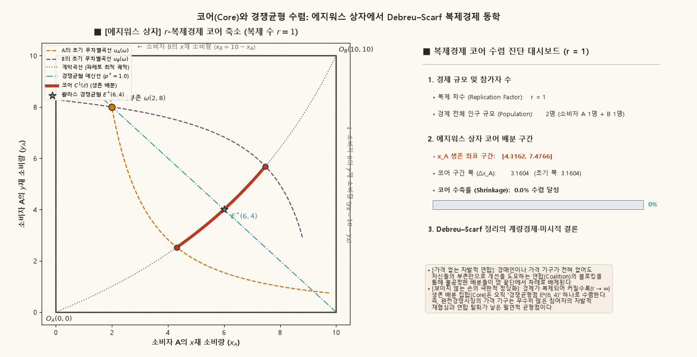
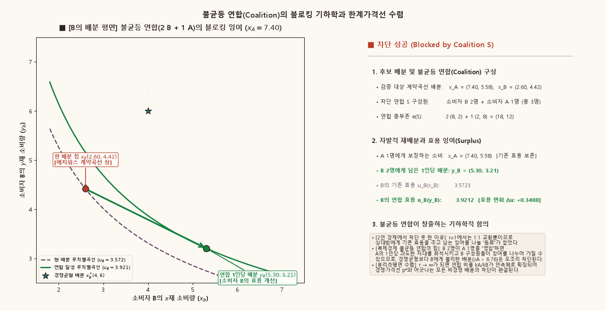

## 목적과 3대 핵심 일반균형 명제

완전경쟁시장에서 경제주체들이 가격을 주어진 것으로 받아들이는 가격수용자(Price Taker) 가설은 흔히 가격기구(Price Mechanism)를 전제한 외생적 규칙으로 학습된다. 그러나 프랜시스 에지워스(Francis Y. Edgeworth, 1881)와 제라르 드브뢰·허버트 스카프(Gérard Debreu & Herbert Scarf, 1963)는 **가격 기구가 전혀 존재하지 않고 오직 경제주체 간의 자발적 연합(Coalition)과 재협상(Recontracting)만이 허용된 원초적 교환경제**에서도, 경제의 규모가 커지면 배분의 결과가 필연적으로 유일한 왈라스 경쟁균형(Walrasian Competitive Equilibrium)으로 귀착됨을 증명하였다.

::: {.callout-note appearance="simple"}
### 에지워스 추측과 Debreu–Scarf 정리의 3대 핵심 명제

1. **가격 없는 협조적 안정성 (Cooperative Stability without Prices)**:
   - 어떤 경제주체들의 부분집합(연합 $S$)도 자신들이 보유한 초기부존 자원만으로 현재의 배분보다 모든 구성원에게 더 유리한 대안을 만들 수 없을 때, 그 배분은 연합에 의해 **차단되지 않는다(unblocked)**고 한다.
   - 모든 가능한 연합에 의해 차단되지 않는 실현가능한 배분들의 집합을 **코어(Core)**라 하며, 코어에 속한 모든 배분은 반드시 파레토 효율적($\operatorname{Core}(\mathcal{E}) \subseteq \mathcal{P}(\bar{e})$)이고 개별적 합리성(Individual Rationality)을 만족한다.

2. **2인 경제($r=1$)에서의 코어 선분 (Indeterminacy of Bargaining)**:
   - 소비자가 단 2명뿐인 에지워스 상자에서는 1인 연합($\{A\}, \{B\}$)과 2인 전체 연합($\{A, B\}$)만 존재한다.
   - 이 경우 코어는 초기부존을 지나는 두 무차별곡선이 형성하는 **상호 이익의 렌즈(Lens of Mutual Gains)** 내부에 놓인 **계약곡선(Contract Curve)의 연속적인 선분 전체**가 된다. 즉, 가격 기구 없는 2인 협상에서는 무수히 많은 배분이 안정적으로 공존한다.

3. **복제경제에서의 코어 축소와 왈라스 균형 점 수렴 (Debreu–Scarf Theorem)**:
   - 동일한 선호와 부존을 가진 소비자가 각 유형별로 $r$명씩 증가하는 $r$-복제경제($r$-replica economy, $\mathcal{E}^r$)에서는 $A$형과 $B$형의 비율이 다른 **불균등 연합(Unbalanced Coalitions)**이 형성된다.
   - 이 불균등 연합들이 상대방에게 극단적인 잉여를 안겨주는 계약곡선 양 끝단의 배분들을 차례로 차단(Trimming)함에 따라 코어는 단조 축소되며, 참여자 수가 무한히 많아지는 극한($r \to \infty$)에서 코어는 **오직 유일한 왈라스 경쟁균형점 하나로 점 수렴($\bigcap_{r=1}^\infty C^r(\mathcal{E}) = W(\mathcal{E})$)**한다.
:::

관련 교재 본문은 [Chapter 04 · 4.7 Core와 competitive limit](../microeconomics/ch04-pure-exchange/07-core-competitive-limit.qmd)에서 복제경제의 수학적 정의, 동등대우 성질(Equal-Treatment Property), 그리고 Debreu–Scarf 정리의 외부 인용 증명 메커니즘을 다룬다.

---

## 1. 순수교환경제의 기초와 코어(Core)의 수학적 정의

소비자 집합을 $I = \{1, 2, \dots, m\}$이라 하고, 각 소비자 $i \in I$가 소비집합 $X_i = \mathbb{R}_+^L$, 연속적이고 순볼록(strictly convex)하며 국소 불포화(LNS)를 만족하는 선호 관계 $\succeq_i$, 그리고 초기부존 벡터 $e_i \gg \mathbf{0}$를 갖는 순수교환경제 $\mathcal{E}$를 고려한다.

경제 전체의 총부존은 $\bar{e} = \sum_{i \in I} e_i$이며, 실현가능한 배분 집합은 다음과 같다:

$$
\mathcal{F}(\bar{e}) = \left\{ (x_i)_{i \in I} \in \prod_{i \in I} X_i \;\middle|\; \sum_{i \in I} x_i \le \bar{e} \right\}.
$$

### 연합(Coalition)과 블로킹 규약 (Weak Blocking Convention)

공집합이 아닌 임의의 소비자 부분집합 $S \subseteq I$를 **연합(Coalition)**이라 부른다. 연합 $S$의 총부존은 $e(S) \equiv \sum_{i \in S} e_i$이다.

실현가능한 배분 $x = (x_i)_{i \in I} \in \mathcal{F}(\bar{e})$가 주어졌을 때, 연합 $S$가 $x$를 **차단(Block)**한다는 것은 $S$의 자체 부존만으로 충당 가능한 대안 배분 $(y_i)_{i \in S}$가 존재하여 다음 조건을 만족함을 뜻한다:

$$
\sum_{i \in S} y_i \le e(S),
$$

$$
y_i \succeq_i x_i \quad \text{for every } i \in S, \qquad \text{and} \qquad y_j \succ_j x_j \quad \text{for some } j \in S.
$$

### 코어의 정의와 기본 성질

**코어(Core)**는 어떤 연합 $S \subseteq I$에 의해서도 차단되지 않는 실현가능한 배분들의 집합으로 정의된다:

$$
\operatorname{Core}(\mathcal{E}) \equiv \left\{ x \in \mathcal{F}(\bar{e}) \;\middle|\; \text{어떤 연합 } S \subseteq I \text{도 } x\text{를 차단할 수 없다} \right\}.
$$

::: {.callout-tip appearance="simple"}
### 코어의 3대 기초 정리

1. **개별적 합리성 (Individual Rationality)**:  
   $x \in \operatorname{Core}(\mathcal{E})$이면 모든 $i \in I$에 대해 $x_i \succeq_i e_i$이다.  
   *(증명)* 만약 어떤 $i$에 대해 $e_i \succ_i x_i$라면, 1인 연합 $S = \{i\}$가 자신의 부존 $y_i = e_i$를 소비함으로써 $x$를 차단하므로 모순이다.

2. **파레토 효율성 (Pareto Efficiency)**:  
   $\operatorname{Core}(\mathcal{E}) \subseteq \mathcal{P}(\bar{e})$.  
   *(증명)* 전체 연합 $S = I$가 파레토 개선 배분을 통해 차단할 수 없으므로, 코어 배분은 반드시 파레토 효율적이다.

3. **왈라스 균형의 코어 포함성 ($W(\mathcal{E}) \subseteq \operatorname{Core}(\mathcal{E})$)**:  
   가격체계 $p^*$에 의해 지지되는 모든 왈라스 경쟁균형 배분 $x^*$는 코어에 속한다.  
   *(증명)* 어떤 연합 $S$가 대안 $(y_i)_{i \in S}$로 $x^*$를 차단한다고 가정하자. 왈라스 균형의 효용극대화 정의에 의해 $y_i \succeq_i x_i^* \implies p^* \cdot y_i \ge p^* \cdot e_i$이며, 최소 한 명의 $j \in S$에 대해 $y_j \succ_j x_j^* \implies p^* \cdot y_j > p^* \cdot e_j$가 성립한다. 이를 연합 $S$ 전체에 대해 합산하면:
   $$
   p^* \cdot \sum_{i \in S} y_i > p^* \cdot \sum_{i \in S} e_i = p^* \cdot e(S).
   $$
   그러나 연합의 자체 실현가능성 조건 $\sum_{i \in S} y_i \le e(S)$에 $p^* \ge \mathbf{0}$를 내적하면 $p^* \cdot \sum_{i \in S} y_i \le p^* \cdot e(S)$이어야 하므로 모순이다. 따라서 왈라스 배분은 절대 차단될 수 없다.
:::

---

## 2. 2인 에지워스 상자($r=1$)에서의 코어 선분

구체적인 분석을 위해 `supplements/edgeworth-first-welfare.qmd`와 동일한 2인·2재화 표준 Cobb–Douglas 경제를 설정한다:

- **총자원**: $\bar{x} = 10, \; \bar{y} = 10$
- **선호**:
  $$
  u_A(x_A, y_A) = x_A^{0.6} y_A^{0.4}, \qquad u_B(x_B, y_B) = x_B^{0.4} y_B^{0.6}
  $$
- **초기부존**:
  $$
  \omega_A = (2, 8), \qquad \omega_B = (8, 2)
  $$
- **초기 효용**:
  $$
  u_A(\omega_A) = 2^{0.6} \cdot 8^{0.4} = 2^{1.8} \approx 3.4822, \qquad u_B(\omega_B) = 8^{0.4} \cdot 2^{0.6} = 2^{1.8} \approx 3.4822
  $$

### 계약곡선의 폐쇄형 유도

한계대체율 일치 조건 $MRS_A = MRS_B$로부터 유도된 에지워스 상자의 계약곡선 방정식은 다음과 같다:

$$
MRS_A = \frac{3}{2}\frac{y_A}{x_A} = \frac{2}{3}\frac{10 - y_A}{10 - x_A} = MRS_B \iff y_A(x_A) = \frac{8 x_A}{18 - x_A}, \qquad x_A \in [0, 10].
$$

### 2인 경제($r=1$)의 코어 경계 계산

소비자가 단 2명($I = \{A, B\}$)일 때 형성 가능한 비공집합 연합은 오직 $\{A\}$, $\{B\}$, $\{A, B\}$의 세 가지뿐이다:
1. **전체 연합 $\{A, B\}$의 차단 방지**: 배분이 계약곡선 $y_A = \frac{8x_A}{18 - x_A}$ 위에 존재해야 한다.
2. **단독 연합 $\{A\}$의 차단 방지 (A의 개별적 합리성)**:
   $$
   u_A\left(x_A, \frac{8x_A}{18 - x_A}\right) \ge u_A(\omega_A) = 2^{1.8} \iff \frac{x_A}{(18 - x_A)^{0.4}} \ge 2^{0.6} \implies x_A \ge 4.3162.
   $$
3. **단독 연합 $\{B\}$의 차단 방지 (B의 개별적 합리성)**:
   $$
   u_B\left(10 - x_A, 10 - \frac{8x_A}{18 - x_A}\right) \ge u_B(\omega_B) = 2^{1.8} \implies x_A \le 7.4766.
   $$

따라서 $r=1$인 2인 경제의 코어는 계약곡선 상에서 **$x_A \in [4.3162, 7.4766]$에 걸쳐 넓게 펼쳐진 연속적인 선분(Segment)**이 된다. 이 선분의 수평 폭은 $\Delta x_A = 7.4766 - 4.3162 = 3.1604$에 달한다.

이 경제의 유일한 왈라스 경쟁균형은 $p^* = 1.0$에서 $x_A^* = (6.0, 4.0)$으로 결정되며, 이는 정확히 코어 선분 내부($6.0 \in [4.3162, 7.4766]$)에 안착한다.

---

## 3. 동적 시각화 1: $r$-복제경제와 에지워스 상자에서의 코어 수축 동학

경제에 동일한 선호와 부존을 지닌 $A$형 소비자와 $B$형 소비자가 각각 $r$명씩 존재하는 $r$-복제경제 $\mathcal{E}^r$를 고려하자. 복제 차수 $r$이 $1 \to 2 \to 3 \to 5 \to 10 \to 50 \to \infty$로 확장될 때, 에지워스 상자에서 코어 선분이 양 끝단으로부터 차단되어 왈라스 경쟁균형점으로 수축하는 동학을 관찰한다.

{#fig-core-shrinkage fig-alt="왼쪽 패널은 r이 증가함에 따라 에지워스 상자 내 굵은 빨간색 코어 선분의 양 끝단이 차단되어 점 E*(6, 4)로 수축하는 과정을, 오른쪽 패널은 인구, 생존 구간, 수축률 게이지를 보여준다."}

---

## 4. 동적 시각화 1의 계량경제·수리적 해설

### 복제 차수별 코어 생존 구간과 수렴 수치

아래 표는 복제 차수 $r$에 따른 $A$형 소비자의 $x$재 코어 배분 구간 $[\underline{x}_A^{(r)}, \bar{x}_A^{(r)}]$과 구간 폭 $\Delta x_A^{(r)}$, 그리고 수렴 진행률을 계산한 결과이다:

| 복제 차수 ($r$) | 총 인구 ($2r$) | $x_A$ 코어 생존 구간 | 코어 선분 폭 ($\Delta x_A$) | 수렴 달성률 (%) | 비고 |
| :---: | :---: | :---: | :---: | :---: | :--- |
| **$r = 1$** | 2명 | $[4.3162, \; 7.4766]$ | $3.1604$ | $0.0\%$ | 2인 에지워스 상자 (협상 배분의 부정성) |
| **$r = 2$** | 4명 | $[5.1875, \; 6.7598]$ | $1.5723$ | $50.3\%$ | 불균등 연합($2B + 1A$)의 최초 차단 출현 |
| **$r = 3$** | 6명 | $[5.4774, \; 6.5011]$ | $1.0237$ | $67.6\%$ | 연합 구성비율($2/3$) 세분화에 따른 추가 차단 |
| **$r = 5$** | 10명 | $[5.6965, \; 6.2957]$ | $0.5992$ | $81.0\%$ | 초기 폭의 $80\%$ 이상 소멸 |
| **$r = 10$** | 20명 | $[5.8516, \; 6.1464]$ | $0.2948$ | $90.7\%$ | 경쟁균형 근방으로 긴밀히 압축 |
| **$r = 20$** | 40명 | $[5.9274, \; 6.0725]$ | $0.1451$ | $95.4\%$ | 오차 범위 $\pm 0.07$ 진입 |
| **$r = 50$** | 100명 | $[5.9696, \; 6.0297]$ | $0.0601$ | $98.1\%$ | 사실상 단일 점 배분 근사 |
| **$r \to \infty$** | $\infty$ | $\{6.0000\}$ | $0.0000$ | **$100.0\%$** | **Debreu–Scarf 정리: 왈라스 경쟁균형 $E^*(6, 4)$로 완전 수렴** |

### 코어 수축 속도: $\mathcal{O}(1/r)$ 대수적 수렴

수치 해석 결과, 코어 선분의 길이 $\Delta x_A^{(r)}$는 복제 차수 $r$에 대해 정확히 **$\mathcal{O}(1/r)$의 속도로 단조 감소**한다:

$$
\Delta x_A^{(r)} \approx \frac{C}{r}, \qquad C \approx 3.16.
$$

경제가 복제될수록 연합에 참여하는 두 소비자 유형의 정수 비율 $k_A / k_B$가 유리수 집합 $\mathbb{Q} \cap (0, \infty)$에서 조밀(dense)해지므로, 왈라스 가격선의 기울기 $p^* = 1$과 일치하지 않는 모든 한계대체율을 갖는 배분들이 차례대로 연합의 잉여 창출에 의해 차단된다.

---

## 5. 불균등 연합(Unbalanced Coalition)의 블로킹 메커니즘과 동등대우 정리

왜 2인 경제($r=1$)에서는 차단되지 못하던 배분이 4인 경제($r=2$)에서는 차단되는가? 그 비밀은 바로 **불균등 연합(Unbalanced Coalition)**의 형성에 있다.

### 동등대우 정리 (Equal-Treatment Property)

$r$-복제경제 $\mathcal{E}^r$에서 선호가 순볼록(strictly convex)하다면, 코어 $\operatorname{Core}(\mathcal{E}^r)$에 속한 모든 배분은 **동일한 유형의 소비자에게 반드시 완전히 동일한 소비묶음을 배정**해야 한다:

$$
x_{(i, k)} = x_{(i, l)} \quad \text{for all } k, l \in \{1, \dots, r\}.
$$

*(증명 스케치)* 만약 같은 유형 내에서 차등 배분이 존재한다면, 선호의 볼록성에 의해 각 유형별 평균 배분 $\bar{x}_i = \frac{1}{r}\sum_{k=1}^r x_{(i, k)}$는 기존의 가장 열등한 소비묶음보다 모든 소비자에게 엄격히 더 높은 효용을 제공한다. 따라서 각 유형에서 가장 불리한 대우를 받은 소비자들이 연합을 결성하여 기존 배분을 차단할 수 있으므로, 오직 동등대우 배분만이 코어에 생존할 수 있다.

### $r=2$ 불균등 연합($2B + 1A$)의 차단 계산

소비자 집합이 $\{A_1, A_2, B_1, B_2\}$인 $r=2$ 경제를 고려하자. 계약곡선 상에서 $A$에게 매우 유리하고 $B$에게 불리한 배분인 $x_A = (6.85, 4.87)$, $x_B = (3.15, 5.13)$을 검증한다:
- 소비자 $B$의 현 배분 효용:
  $$
  u_B(x_B) = 3.15^{0.4} \cdot 5.13^{0.6} \approx 1.579 \cdot 2.664 \approx 4.207.
  $$
- 2인 경제($r=1$)에서는 $u_B(x_B) \ge u_B(\omega_B) = 3.482$이므로 $B$ 혼자서는 이 거래를 거부할 수 없었다.
- 그러나 $r=2$ 경제에서는 **$B$ 2명과 $A$ 1명으로 구성된 불균등 연합 $S = \{B_1, B_2, A_1\}$**이 결성될 수 있다.
- 연합 $S$의 총부존:
  $$
  e(S) = 2 e_B + 1 e_A = 2(8, 2) + (2, 8) = (18, 12).
  $$
- 연합은 $A_1$에게 계약곡선의 기존 배분 $x_A = (6.85, 4.87)$을 그대로 보장해주어 연합 탈퇴를 유도한다.
- 이때 $B$ 2명에게 남겨지는 잔여 자원 총량은 다음과 같다:
  $$
  e(S) - x_A = (18 - 6.85, \; 12 - 4.87) = (11.15, \; 7.13).
  $$
- 이를 $B_1, B_2$ 두 명이 공평하게 절반씩 나누어 가지면, $B$ 1인당 배분은 $y_B = (5.575, 3.565)$가 된다.
- 이때 $B$가 얻는 새로운 연합 효용을 계산하면:
  $$
  u_B(y_B) = 5.575^{0.4} \cdot 3.565^{0.6} \approx 1.986 \cdot 2.150 \approx 4.270 > 4.207 \equiv u_B(x_B).
  $$
- $B$의 효용이 엄격히 증가($\Delta u_B = +0.063 > 0$)하면서 $A_1$의 효용은 보존되었으므로, **불균등 연합 $S$는 배분 $x_A = (6.85, 4.87)$을 성공적으로 차단**한다!

이로써 $r=1$에서 코어에 속해 있던 $x_A \in (6.7598, 7.4766]$ 구간의 모든 배분이 $r=2$ 복제경제에서 영구히 축출된다.

---

## 6. 동적 시각화 2: 불균등 연합의 블로킹 기하와 한계가격선 수렴

아래 애니메이션은 후보 배분 $x_A$가 $7.40$에서 경쟁균형점 $6.00$으로 이동할 때, 소비자 $B$의 소비공간에서 불균등 연합($2B + 1A$)이 창출하는 효용 개선 벡터와 차단 잉여($\Delta u_B$)의 소멸 과정을 보여준다.

{#fig-coalition-blocking fig-alt="왼쪽 패널은 현 배분 점 x_B에서 연합 1인당 배분 y_B로 향하는 초록색 효용 개선 화살표를, 오른쪽 패널은 연합 부존, 잉여 및 차단 판정 대시보드를 보여준다."}

---

## 7. 동적 시각화 2의 심층 해설: Debreu–Scarf 정리의 현대적 함의

### 연합 블로킹과 분리초평면(Separating Hyperplane)의 일치

임의의 파레토 효율적 배분 $x$에서 두 소비자의 공통 한계대체율을 $p(x) \equiv MRS(x)$라 하자.
1. 만약 $x$가 왈라스 경쟁균형이 아니라면, 공통 접선 $p(x)$는 초기부존 점 $\omega$를 통과하지 않는다:
   $$
   p(x) \cdot (x_A - \omega_A) \ne 0.
   $$
2. $p(x) \cdot (x_A - \omega_A) > 0$이라면 $A$는 자신의 기여도보다 많은 가치를 가져가는 상태이며, 이는 $B$가 $A$에게 일방적인 보조금을 지급하고 있음을 의미한다.
3. 2인 경제에서는 $B$가 교환 자체를 거부할 경우 $\omega_B$로 추락하므로 이를 감내해야 했으나, 복제경제에서는 $B$가 다수의 동료와 소수의 $A$를 묶는 불균등 연합을 결성함으로써 $A$에게 주는 보조금을 1인당으로 희석시키고 자신들의 잉여를 극대화할 수 있다.
4. 복제 차수 $r \to \infty$ 극한에서 가능한 연합의 유형 비율 $\lambda = k_A / k_B$는 모든 양의 실수 집합 $\mathbb{R}_{++}$로 확장된다. 이 무한한 연합들이 던지는 블로킹 선들의 공통 포락선(Envelope)은 **초기부존 $\omega$를 지나는 유일한 분리초평면인 왈라스 가격선 $p^* \cdot (x - \omega) = 0$**으로 수렴하게 된다.

### 아담 스미스의 "보이지 않는 손"에 대한 수학적 완성

Debreu–Scarf 정리가 현대 경제학에 던진 가장 근본적인 메시지는 다음과 같다:

> **"가격 기구와 경매인이라는 제도를 외생적으로 강제하지 않아도, 수많은 경제주체들이 자유롭게 모여 재협상하고 연합에서 탈퇴할 수 있는 권리(자유 진입·퇴거와 분권적 재계약)만 보장된다면, 시장은 스스로 '완전경쟁 가격 기구'의 상태로 수렴한다."**

이는 가격 수용자 가설이 비현실적인 가정이 아니라, 참여자의 수가 충분히 많은 대규모 경제에서 협조적 안정성을 갖추기 위한 **유일무이한 수학적 귀결**임을 입증한 일반균형이론의 금자탑이다.

---

## 8. 재현 가능한 Python 수치 시뮬레이션 코드

아래 코드는 $r$-복제경제에서의 불균등 연합 블로킹 경계를 탐색하고, 복제 차수 $r=1$부터 $r=50$까지 코어 구간의 수축 궤적을 직접 계산하는 재현 가능한 스크립트이다.

```python
import numpy as np

def uA(xA, yA):
    return (xA**0.6) * (yA**0.4) if xA > 0 and yA > 0 else 0.0

def uB(xB, yB):
    return (xB**0.4) * (yB**0.6) if xB > 0 and yB > 0 else 0.0

def contract_yA(xA):
    return 8.0 * xA / (18.0 - xA)

def compute_core_bounds(r):
    eA = np.array([2.0, 8.0])
    eB = np.array([8.0, 2.0])

    if r == 1:
        return 4.3162, 7.4766

    # 상한 탐색: B가 r명, A가 kA < r명인 연합에 의한 차단
    grid_high = np.linspace(6.0001, 7.4766, 1000)
    xA_high = 7.4766
    for xA in grid_high:
        yA = contract_yA(xA)
        x_alloc = np.array([xA, yA])
        xB_alloc = np.array([10.0 - xA, 10.0 - yA])
        uB_curr = uB(xB_alloc[0], xB_alloc[1])
        blocked = False
        for kA in range(1, r):
            lam = kA / r
            bundleB = eB + lam * (eA - x_alloc)
            if uB(bundleB[0], bundleB[1]) > uB_curr + 1e-6:
                blocked = True
                break
        if blocked:
            xA_high = xA
            break

    # 하한 탐색: A가 r명, B가 kB < r명인 연합에 의한 차단
    grid_low = np.linspace(5.9999, 4.3162, 1000)
    xA_low = 4.3162
    for xA in grid_low:
        yA = contract_yA(xA)
        x_alloc = np.array([xA, yA])
        uA_curr = uA(xA, yA)
        blocked = False
        for kB in range(1, r):
            lam = kB / r
            bundleA = eA + lam * (x_alloc - eA)
            if uA(bundleA[0], bundleA[1]) > uA_curr + 1e-6:
                blocked = True
                break
        if blocked:
            xA_low = xA
            break

    return xA_low, xA_high

# 복제 차수별 코어 구간 출력
print("=== r-복제경제 코어 수렴 수치 시뮬레이션 ===")
for r in [1, 2, 3, 5, 10, 20, 50]:
    low, high = compute_core_bounds(r)
    width = high - low
    print(f"r = {r:2d} (인구 {2*r:3d}명): x_A in [{low:.4f}, {high:.4f}], 폭 = {width:.4f}")
```
