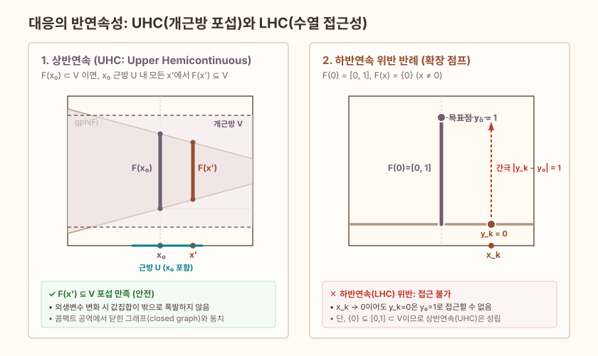

## 목적

미시경제이론에서는 최적해나 균형이 유일하지 않은 경우가 흔하므로 함수 대신 집합값 사상인
**대응(correspondence)**을 기본 도구로 사용합니다. 이때 모수 변화에 따른 해의 안정성과
존재성을 보장하기 위해 일반적인 연속성 대신 **상반연속(Upper Hemicontinuity, UHC)**과
**하반연속(Lower Hemicontinuity, LHC)**을 구분하여 다룹니다.

이 보충자료는 점프와 비콤팩트 치역을 가진 대표적인 대응 프리셋들을 통해 UHC의 개집합 포섭 조건,
LHC의 수열 접근 조건, 그리고 닫힌 그래프(closed graph)와의 관계를 대화형으로 시각화합니다.

관련 본문은 [0.5 함수와 대응](../microeconomics/ch00-foundations/05-functions-correspondences.qmd)과
[0.8 모수화된 최적화, Berge 최대정리, Envelope 정리](../microeconomics/ch00-foundations/08-parameterized-optimization.qmd)입니다.

## 조작 도구

<iframe class="interactive-frame" title="대응의 반연속성과 닫힌 그래프 탐색 도구" src="interactive/correspondence-hemicontinuity/index.html" loading="lazy"></iframe>

### 조작 도구 읽는 법

- **대표 대응 프리셋 (A~E)**:
  - **A. 연속 대응**: $F(x) = [x/3, 1 - x/3]$ — 모든 점에서 콤팩트 볼록 집합이며 UHC와 LHC를 모두 충족합니다.
  - **B. 확장 점프**: $x=0$에서 갑자기 $[0, 1]$로 확장 — $F(x') \subseteq V$이므로 **UHC는 만족**하지만, $y=1$로 접근하는 수열이 존재하지 않아 **LHC는 위반**됩니다.
  - **C. 수축 점프**: $x=0$에서 갑자기 $\{0\}$으로 수축 — 0 근방에서 $F(x')=[0,1]$이 개근방 $V$를 탈출하므로 **UHC는 위반**되지만, 0을 만나는 개근방은 항상 교차하므로 **LHC는 만족**합니다.
  - **D. 비콤팩트 치역**: $F(0)=\{0\}, F(x)=\{1/|x|\} \; (x \ne 0)$ — 그래프는 닫혀 있으나(closed graph), 치역이 비콤팩트하여 $x \to 0$일 때 무한대로 발산하므로 **UHC가 성립하지 않는** 표준 반례입니다.
  - **E. 예산 대응**: $B(p) = [0, w/p] \; (p > 0)$ — 소비자 이론의 예산집합 단면으로, 양의 가격 영역에서 연속(UHC + LHC)임을 확인합니다.
- **검증 모드 전환**:
  - **UHC 검증 모드**: $F(x_0)$를 감싸는 개집합 $V = (F_{\min} - \varepsilon, F_{\max} + \varepsilon)$의 띠(band)를 표시하고, 근방의 점 $x'$에서의 값집합 $F(x')$가 $V$ 안에 온전히 포섭되는지 검증합니다.
  - **LHC 검증 모드**: $F(x_0)$ 안의 임의의 목표점 $y_0$를 설정하고, $x_k \to x_0$로 다가갈 때 $F(x_k)$ 안에서 $y_0$로 수렴하는 점 $y_k$를 찾을 수 있는지(거리 $|y_k - y_0| \to 0$) 확인합니다.
- **위상적 성질 배지**:
  - 비공집합, 콤팩트값, 볼록값, 닫힌 그래프, UHC, LHC, 정리 적용 가능 여부 등 8개 항목의 성립 여부를 실시간으로 판정합니다.

## 위상수학적 정의와 핵심 직관

대응 $F: X \rightrightarrows Y$에 대해 정의역 $X$와 공역 $Y$가 거리공간(또는 위상공간)일 때 다음 두 연속성 개념을 구별합니다.

### 1. 상반연속 (Upper Hemicontinuity, UHC)

$F$가 $x_0 \in X$에서 **상반연속**이라는 것은, $F(x_0)$를 포함하는 임의의 열린 집합 $V \subseteq Y$에 대해 $x_0$의 어떤 열린 근방 $U \subseteq X$가 존재하여 다음이 성립하는 것입니다.

$$
\forall x' \in U \quad \Longrightarrow \quad F(x') \subseteq V.
$$

- **직관**: 외생변수 $x$가 미세하게 변하더라도, 값집합 $F(x')$가 기존의 $F(x_0)$ 바깥으로 **갑자기 튀어나가거나 폭발(explosion)하지 않는** 성질입니다.
- **수축은 허용, 폭발은 불허**: $F(x_0)$가 컸다가 주변에서 작아지는 것(프리셋 B)은 UHC를 만족하지만, $F(x_0)$가 작았는데 주변에서 갑자기 커지는 것(프리셋 C)은 UHC를 위반합니다.

### 2. 하반연속 (Lower Hemicontinuity, LHC)

$F$가 $x_0 \in X$에서 **하반연속**이라는 것은, $F(x_0)$와 교차하는($F(x_0) \cap V \ne \varnothing$) 임의의 열린 집합 $V \subseteq Y$에 대해 $x_0$의 어떤 열린 근방 $U \subseteq X$가 존재하여 다음이 성립하는 것입니다.

$$
\forall x' \in U \quad \Longrightarrow \quad F(x') \cap V \ne \varnothing.
$$

거리공간에서는 다음의 동치인 **수열 판정법**이 특히 직관적입니다.

$$
x_k \to x_0 \quad \text{and} \quad y_0 \in F(x_0) \quad \Longrightarrow \quad \exists y_k \in F(x_k) \text{ s.t. } y_k \to y_0.
$$

- **직관**: 기존에 선택 가능했던 임의의 점 $y_0 \in F(x_0)$에 대해, 외생변수가 조금 변하더라도 그 점 근처로 **언제나 다가갈 수 있는 선택지 $y_k \in F(x_k)$가 갑자기 소멸(implosion)하지 않는** 성질입니다.

## 정적 그림

상호작용 환경을 사용할 수 없는 환경을 위한 기준 위상 도표입니다. 좌측은 UHC의 개근방 포섭 구조를, 우측은 확장 점프에서 LHC가 위반되는 기하학적 메커니즘을 보여줍니다.

{.supplement-fallback fig-alt="좌측은 UHC의 개근방 포섭 구조를, 우측은 확장 점프에서 LHC가 위반되는 메커니즘을 보여주는 정적 도표"}

## 미시경제학 핵심 정리와의 연결

### 1. Kakutani 부동점 정리와 UHC

게임이론의 Nash 균형과 일반균형이론의 Walrasian 균형 증명에 사용되는 Kakutani 부동점 정리는 다음과 같은 가정을 요구합니다.

- 정의역 $S$가 공집합이 아닌 콤팩트 볼록 집합이다.
- 대응 $F: S \rightrightarrows S$가 모든 점에서 공집합이 아닌 콤팩트 볼록 값을 가진다.
- $F$가 **상반연속(UHC)**이다.

공역 $S$ 자체가 콤팩트하므로, 본문 Proposition 0.5.2에 따라 **UHC는 닫힌 그래프($\operatorname{gph} F$ is closed)와 동치**입니다. 따라서 균형 분석에서는 최적반응대응 $BR(s)$의 그래프가 닫혀 있는지를 점검하는 것으로 충분합니다.

### 2. Berge 최대정리와 제약대응의 연속성

모수화된 최적화 문제 $\max_{x \in B(\theta)} f(x, \theta)$에서 가치함수 $v(\theta)$의 연속성과 해 대응 $D(\theta) = \operatorname{arg\,max}_{x \in B(\theta)} f(x, \theta)$의 UHC를 보장하기 위해, Berge 최대정리는 제약대응 $B(\theta)$가 **UHC와 LHC를 동시에 만족(즉 연속)**할 것을 요구합니다.

- **UHC의 역할**: $\theta^k \to \theta$일 때 실행가능집합들이 국소적으로 유계인 공통 콤팩트 집합 안에 머물게 하여, 해의 부분수열 수렴 $\limsup v(\theta^k) \le v(\theta)$을 보장합니다 (상한 통제).
- **LHC의 역할**: 기존 최적해 $x^* \in D(\theta)$로 접근하는 경로 $x^k \in B(\theta^k)$를 항상 확보하여, 갑작스러운 제약 수축으로 인한 효용 급락을 방지하고 $\liminf v(\theta^k) \ge v(\theta)$를 보장합니다 (접근성 보장).

### 3. 비콤팩트 공역과 닫힌 그래프의 한계

공역이 콤팩트하지 않거나 국소 유계성을 만족하지 못하면, **닫힌 그래프를 갖더라도 UHC가 성립하지 않을 수 있습니다** (프리셋 D). 수열 $(x_k, y_k) = (1/k, k)$는 그래프 상에 있지만 $y_k \to \infty$로 발산하므로 $\mathbb{R}$ 안에서 수렴하지 않아 그래프의 닫힘성을 깨지 못합니다. 그러나 $x \to 0$일 때 함숫값이 무한히 발산하므로 $F(0)=\{0\}$의 임의의 유계 근방 $V$를 벗어나 UHC가 깨집니다. 이 반례는 자원 제약이나 소비집합이 비유계일 때 주의해야 하는 핵심 수학적 사실입니다.

## 재현과 범위

- 대화형 도구: [`supplements/interactive/correspondence-hemicontinuity/index.html`](interactive/correspondence-hemicontinuity/index.html) (외부 CDN이나 서버 없이 순수 HTML, CSS, SVG, JavaScript로 동작)
- 정적 도표: [`assets/images/correspondence-hemicontinuity-static.svg`](../assets/images/correspondence-hemicontinuity-static.svg)
- 메타데이터: [`assets/data/correspondence-hemicontinuity-metadata.json`](../assets/data/correspondence-hemicontinuity-metadata.json)
- 이 자료는 1차원 정의역과 공역 상에서 반연속성의 핵심 개념을 직관적으로 검증하도록 설계되었습니다. 일반적인 다차원 위상공간에서의 엄밀한 증명은 본문 [Chapter 00 · Mathematical Foundations](../microeconomics/ch00-foundations/index.qmd)을 참조하십시오.
