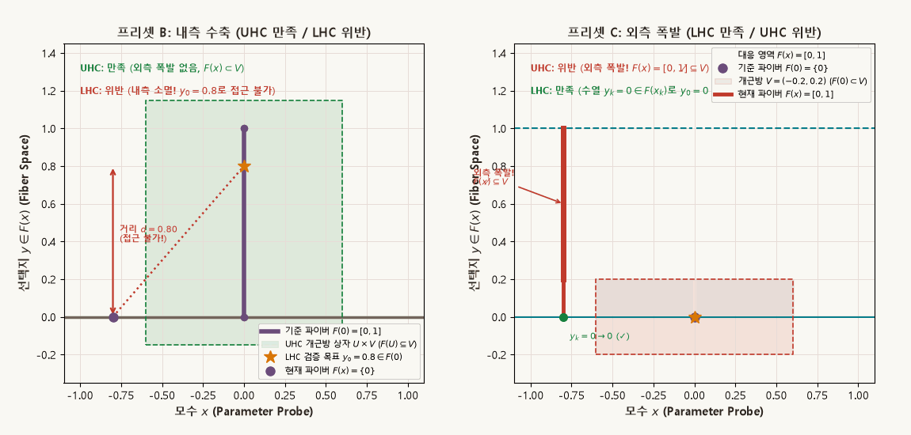
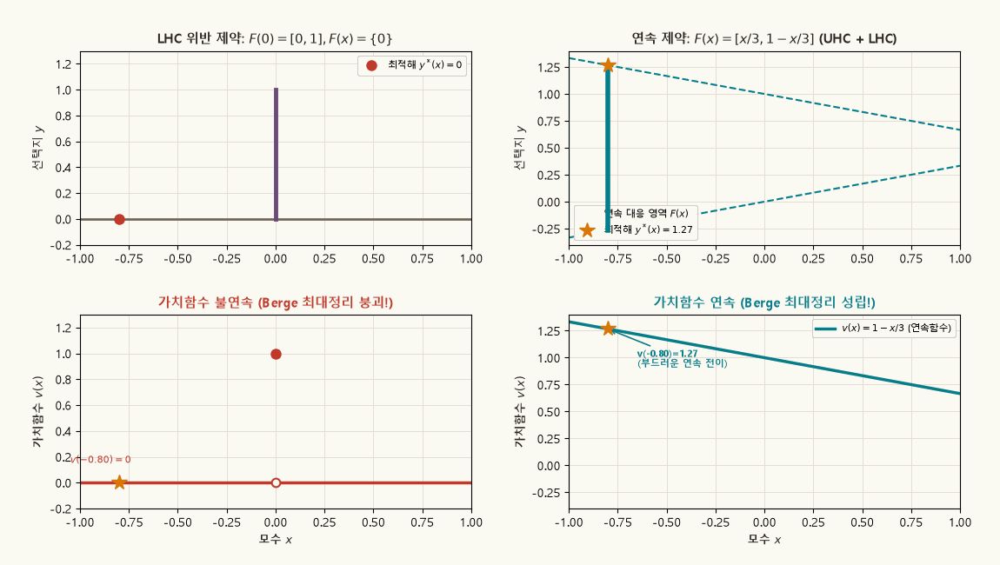

## 목적과 3대 핵심 위상경제학 명제

미시경제이론과 일반균형이론에서는 최적 소비묶음이나 생산자 공급 계획, 시장 청산 가격이 유일하지 않은(non-unique) 경우가 일반적입니다. 따라서 단일 값을 대응시키는 통상적인 함수(function) 대신, 하나의 입력값에 여러 원소로 이루어진 부분집합을 대응시키는 **집합값 사상(set-valued mapping)**인 **대응(correspondence)**이 경제학의 핵심적인 수학적 언어로 사용됩니다.

그러나 정의역의 외생 모수(가격, 소득, 정책 변수 등)가 연속적으로 변할 때 "값집합(파이버, fiber)이 연속적으로 움직인다"는 개념은 함수처럼 단순하지 않습니다. 집합은 밖으로 갑자기 팽창할 수도 있고, 안쪽에서 특정 선택지가 갑자기 증발할 수도 있기 때문입니다. 수리경제학은 이를 **상반연속(Upper Hemicontinuity, UHC)**과 **하반연속(Lower Hemicontinuity, LHC)**이라는 두 가지 상호보완적(쌍대적) 연속성 개념으로 분해하여 엄밀하게 다룹니다.

::: {.callout-note appearance="simple"}
### 대응의 연속성과 경제학적 귀결의 3대 핵심 명제

1. **상반연속(UHC)과 외측 폭발 억제 (Outer Explosion Suppression)**:
   - 대응 $F: X \rightrightarrows Y$가 $x_0$에서 상반연속(UHC)이라는 것은, $F(x_0)$를 감싸는 임의의 열린 근방 $V$가 주어졌을 때, $x_0$ 근방의 모든 $x$에 대해 $F(x)$가 온전히 $V$ 내부로 포섭됨($F(x) \subseteq V$)을 뜻합니다.
   - 이는 파이버가 기준 집합 $F(x_0)$ 바깥으로 **갑작스럽게 팽창하거나 도약(outer explosion)하지 못하도록 통제**하는 성질입니다. 파이버가 안쪽으로 급격히 수축(inner collapse)하는 것은 UHC 정의를 위배하지 않습니다.

2. **하반연속(LHC)과 내측 소멸 방지 (Inner Collapse Prevention)**:
   - 대응 $F: X \rightrightarrows Y$가 $x_0$에서 하반연속(LHC)이라는 것은, 기준 파이버 $F(x_0)$에서 선택 가능했던 임의의 원소 $y_0 \in F(x_0)$에 대해, $x_k \to x_0$로 다가갈 때 $y_k \to y_0$로 접근할 수 있는 선택지 수열 $y_k \in F(x_k)$가 반드시 존재함을 의미합니다.
   - 이는 경제 주체가 선택할 수 있었던 대안이 국소 섭동 하에서 **안쪽에서 급작스럽게 사라지거나 증발(inner evaporation)하지 않도록 보장**하는 성질입니다. 파이버가 바깥으로 갑자기 커지는 것은 LHC 정의를 위배하지 않습니다.

3. **닫힌 그래프 정리(Closed Graph Theorem)와 Berge 최대정리(Maximum Theorem)**:
   - 공역 $Y$가 콤팩트(compact)하면, 대응이 닫힌값(closed-valued)을 갖고 UHC인 것은 그래프 $\operatorname{gph}(F)$가 닫혀 있는 것과 동치입니다. 그러나 공역이 비콤팩트하면 무한대로의 도피로 인해 닫힌 그래프이면서도 UHC가 붕괴될 수 있습니다.
   - **Berge 최대정리**: 제약대응 $B(x)$가 콤팩트값을 갖고 **연속(UHC + LHC)**일 때에만 가치함수 $v(x) = \max_{y \in B(x)} f(x, y)$가 연속함수가 되며, 최적해 대응 $D(x)$가 UHC를 만족합니다. LHC가 깨지면 가치함수가 하방으로 급락(또는 상방으로 점프)하여 경제학적 최적화의 연속성이 파괴됩니다.
:::

관련 교재 본문은 [Chapter 00 · 0.5 함수와 대응](../microeconomics/ch00-foundations/05-functions-correspondences.qmd)과 [0.8 모수화된 최적화, Berge 최대정리, Envelope 정리](../microeconomics/ch00-foundations/08-parameterized-optimization.qmd)에서 공리적 기초와 다차원 일반화를 다룹니다.

---

## 1. 대응의 기본 개념과 상·하 역상 (Upper & Lower Inverses)

### 대응의 정의

두 위상공간 $X, Y$가 주어졌을 때, 정의역 $X$의 각 원소 $x$에 공역 $Y$의 공집합이 아닌 부분집합 $F(x) \subseteq Y$를 할당하는 규칙을 **대응(Correspondence)**이라 하며 다음과 같이 표기합니다:

$$
F: X \rightrightarrows Y \qquad (\text{또는 } F: X \to \mathcal{P}(Y) \setminus \{\emptyset\}).
$$

이때 각 $x$에 대응하는 부분집합 $F(x)$를 $x$에서의 **파이버(Fiber)** 또는 **값집합(Value Set)**이라 합니다.

### 상역상(Upper Inverse)과 하역상(Lower Inverse)

일반적인 함수 $f: X \to Y$에서는 공역의 부분집합 $V \subseteq Y$에 대해 역상 $f^{-1}(V) = \{x \in X \mid f(x) \in V\}$이 유일하게 정의됩니다. 그러나 집합값 사상에서는 "값집합 $F(x)$가 $V$와 어떻게 관계를 맺는가?"에 따라 두 가지 상이한 역상이 존재합니다:

1. **상역상 (Upper Inverse Image)**: 파이버가 $V$에 **완전히 포함**되는 $x$들의 집합
   $$
   F^+(V) \equiv \{ x \in X \mid F(x) \subseteq V \}.
   $$
2. **하역상 (Lower Inverse Image)**: 파이버가 $V$와 **조금이라도 만나는(교차하는)** $x$들의 집합
   $$
   F^-(V) \equiv \{ x \in X \mid F(x) \cap V \neq \emptyset \}.
   $$

### 상·하 역상의 여집합 쌍대성 (Duality)

임의의 부분집합 $V \subseteq Y$와 그 여집합 $V^c = Y \setminus V$에 대해 다음의 근본적인 위상수학적 드모르간 쌍대성이 항등적으로 성립합니다:

$$
X \setminus F^+(V) = F^-(Y \setminus V), \qquad X \setminus F^-(V) = F^+(Y \setminus V).
$$

만약 대응 $F$가 모든 $x$에서 단일 원소만을 갖는 단가 사상(함수 $f$)으로 퇴화한다면, $F(x) \subseteq V \iff F(x) \cap V \neq \emptyset \iff f(x) \in V$이므로 $F^+(V) = F^-(V) = f^{-1}(V)$로 완벽히 일치합니다.

---

## 2. 상반연속 (Upper Hemicontinuity, UHC): 외측 폭발 억제

::: {.callout-important appearance="simple"}
### 상반연속(UHC)의 위상적 정의

대응 $F: X \rightrightarrows Y$가 점 $x_0 \in X$에서 **상반연속(Upper Hemicontinuous, UHC)**이라는 것은, $F(x_0)$를 포함하는 임의의 열린집합 $V \subseteq Y$ ($F(x_0) \subseteq V$)에 대하여, $x_0$의 적절한 열린 근방 $U \subseteq X$가 존재하여 다음을 만족하는 것이다:

$$
\forall x \in U \implies F(x) \subseteq V \quad \Longleftrightarrow \quad U \subseteq F^+(V).
$$

대응 $F$가 정의역 $X$의 모든 점에서 UHC이면 $F$를 상반연속 대응이라 하며, 이는 **임의의 열린집합 $V \subseteq Y$에 대해 상역상 $F^+(V)$가 $X$에서 열린집합**인 것과 동치이다.
:::

### 기하학적 직관과 허용되는 불연속성

- **외측 폭발 억제 (No Outer Explosion)**: 모수 $x$가 $x_0$ 주변에서 미세하게 요동칠 때, 파이버 $F(x)$는 기존의 $F(x_0)$가 차지하던 영역 밖으로 갑자기 튀어나가거나 부풀어 오를 수 없습니다.
- **내측 수축의 허용 (Shrinking is Allowed)**: 반면, 기준점 $F(x_0)$가 큰 구간이었다가 주변 $x \ne x_0$에서 하나의 점으로 쪼그라드는 것은 UHC 정의를 전혀 위배하지 않습니다. 왜냐하면 $F(x_0)$를 포함하도록 잡은 큰 개집합 $V$ 안에는 쪼그라든 작은 파이버 $F(x)$가 여전히 안전하게 포함되기 때문입니다.

### 콤팩트값 대응에서의 수열 판정법 (Sequential Characterization)

거리공간 $(X, d_X)$와 $(Y, d_Y)$ 사이에서 대응 $F$가 모든 점에서 **콤팩트값(compact-valued)**을 가질 때, UHC는 다음 수열 조건과 동치입니다:

$$
x_k \to x_0 \quad \text{and} \quad y_k \in F(x_k) \quad \Longrightarrow \quad \{y_k\}\text{는 } F(x_0)\text{의 어떤 원소 } y_0\text{로 수렴하는 부분수열을 갖는다.}
$$

만약 $F$가 단가 함수 $f$라면, $y_k = f(x_k)$의 유일한 부분수열 극한은 $f(x_0)$이어야 하므로 통상적인 함수의 연속성($f(x_k) \to f(x_0)$)으로 환원됩니다.

---

## 3. 하반연속 (Lower Hemicontinuity, LHC): 내측 소멸 방지

::: {.callout-important appearance="simple"}
### 하반연속(LHC)의 위상적 정의

대응 $F: X \rightrightarrows Y$가 점 $x_0 \in X$에서 **하반연속(Lower Hemicontinuous, LHC)**이라는 것은, $F(x_0)$와 교차하는 임의의 열린집합 $V \subseteq Y$ ($F(x_0) \cap V \neq \emptyset$)에 대하여, $x_0$의 적절한 열린 근방 $U \subseteq X$가 존재하여 다음을 만족하는 것이다:

$$
\forall x \in U \implies F(x) \cap V \neq \emptyset \quad \Longleftrightarrow \quad U \subseteq F^-(V).
$$

대응 $F$가 정의역 $X$의 모든 점에서 LHC이면 $F$를 하반연속 대응이라 하며, 이는 **임의의 열린집합 $V \subseteq Y$에 대해 하역상 $F^-(V)$가 $X$에서 열린집합**인 것과 동치이다.
:::

### 거리공간에서의 수열 판정법 (Sequential Approachability)

거리공간에서 LHC의 의미는 경제학적으로 훨씬 명쾌합니다:

$$
x_k \to x_0 \quad \text{and} \quad y_0 \in F(x_0) \quad \Longrightarrow \quad \exists y_k \in F(x_k) \text{ s.t. } y_k \to y_0.
$$

### 기하학적 직관과 허용되는 불연속성

- **내측 소멸 방지 (No Inner Collapse / Evaporation)**: 기준 모수 $x_0$에서 경제 주체가 선택할 수 있었던 임의의 대안 $y_0 \in F(x_0)$에 대해, 모수가 $x_k \to x_0$로 전이될 때 각 단계에서 $y_0$로 점진적으로 다가갈 수 있는 실행가능 경로 $y_k \in F(x_k)$가 반드시 보장되어야 합니다. 선택지가 내측에서 갑자기 증발하면 LHC가 깨집니다.
- **외측 팽창의 허용 (Expansion is Allowed)**: 반면, 기준점 $F(x_0)$가 하나의 점이었다가 주변 $x \ne x_0$에서 큰 구간으로 부풀어 오르는 것은 LHC를 전혀 위배하지 않습니다. 기존 점 $y_0$는 여전히 팽창된 파이버 안에 포함되어 있으므로 접근 수열을 $y_k = y_0$로 잡으면 되기 때문입니다.

---

## 4. 동적 시각화 1: UHC와 LHC의 쌍대 기하

아래 애니메이션은 대학원 교재의 가장 유명한 두 반례인 **프리셋 B(내측 수축)**와 **프리셋 C(외측 폭발)**를 나란히 비교하여, UHC와 LHC가 서로 어떻게 다른 형태의 불연속성을 통제하는지 보여줍니다.

{.supplement-graphic fig-alt="프리셋 B(내측 수축, UHC 만족 vs LHC 위반)와 프리셋 C(외측 폭발, LHC 만족 vs UHC 위반)의 파이버 거동과 개근방 상자 포섭 검증 애니메이션"}

#### 도표 독해 가이드:
- **좌측 패널: 프리셋 B (UHC 만족 / LHC 위반: 내측 수축)**
  - 대응 식: $F(0) = [0, 1]$, $x \ne 0$일 때 $F(x) = \{0\}$.
  - **UHC 검증 (녹색 상자)**: $F(0)=[0, 1]$을 감싸는 개근방 $V = (-0.15, 1.15)$를 잡으면, $x \ne 0$인 모든 점에서 $F(x)=\{0\} \subset V$가 되어 상자 밖으로 전혀 벗어나지 않습니다. 따라서 **외측 폭발이 없어 UHC는 완벽히 성립**합니다.
  - **LHC 검증 (황금색 별표 $y_0 = 0.8$)**: $F(0)$ 안에서 $y_0 = 0.8$을 고르면, $x \ne 0$인 순간 파이버 내에 0 이외의 원소가 없습니다. 따라서 거리 $d(y_0, F(x)) = |0.8 - 0| = 0.8$로 단절되어 접근 수열이 전무합니다. 즉, **선택지가 내측에서 증발하여 LHC는 위반**됩니다.
- **우측 패널: 프리셋 C (LHC 만족 / UHC 위반: 외측 폭발)**
  - 대응 식: $F(0) = \{0\}$, $x \ne 0$일 때 $F(x) = [0, 1]$.
  - **UHC 검증 (적색 상자)**: $F(0)=\{0\}$의 작은 개근방 $V = (-0.2, 0.2)$를 잡으면, $x \ne 0$인 순간 파이버 $F(x)=[0, 1]$이 $V$ 상자 밖으로 튀어나와 붉은색으로 폭발합니다. 아무리 작은 근방 $U$를 잡아도 포섭이 불가능하므로 **외측 폭발이 발생하여 UHC는 위반**됩니다.
  - **LHC 검증**: 기준 집합의 원소는 $y_0 = 0$뿐이며, 모든 $x$에서 $0 \in F(x)$이므로 $y_k = 0 \to 0$인 접근 경로가 항상 존재합니다. 따라서 **LHC는 완벽히 성립**합니다.

---

## 5. 닫힌 그래프 정리 (Closed Graph Theorem)와 콤팩트성의 역할

대응의 연속성을 판정할 때 가장 강력하고 널리 사용되는 도구는 그래프의 위상적 닫힘성입니다.

### 그래프의 정의와 닫힘성

대응 $F: X \rightrightarrows Y$의 **그래프(Graph)**는 다음과 같이 정의되는 직적공간 $X \times Y$의 부분집합입니다:

$$
\operatorname{gph}(F) \equiv \{ (x, y) \in X \times Y \mid y \in F(x) \}.
$$

그래프가 닫혀 있다는 것($\operatorname{gph}(F)$ is closed)은 수열 판정법으로 다음과 동치입니다:

$$
x_k \to x_0, \quad y_k \in F(x_k), \quad y_k \to y_0 \quad \Longrightarrow \quad y_0 \in F(x_0).
$$

### 닫힌 그래프 정리 (Closed Graph Theorem for Correspondences)

::: {.callout-note appearance="simple"}
### 정리: 대응의 닫힌 그래프 정리

공역 $Y$가 **콤팩트(compact)**하다고 하자. 대응 $F: X \rightrightarrows Y$에 대하여 다음 두 명제는 동치이다:
1. $F$는 닫힌값(closed-valued)을 갖고 상반연속(UHC)이다.
2. 그래프 $\operatorname{gph}(F)$는 $X \times Y$에서 닫힌집합이다.
:::

경제학에서 이 정리가 유용한 이유는, 게임이론의 혼합전략 공간이나 소비자이론의 유계 예산집합처럼 공역이 콤팩트한 환경에서는 복잡한 개집합 포섭 조건($F^+(V)$)을 일일이 증명할 필요 없이, **수열의 극한 $y_k \to y_0$가 $F(x_0)$에 속하는지만 확인하면 UHC가 자동으로 성립**하기 때문입니다.

### 비콤팩트 공역의 경고: 프리셋 D의 반례

공역 $Y$가 콤팩트하지 않다면 닫힌 그래프 성질이 UHC를 보장하지 못합니다. 대학원 미시경제학의 대표적 반례는 다음과 같습니다:

$$
F: \mathbb{R} \rightrightarrows \mathbb{R}, \qquad F(0) = \{0\}, \quad F(x) = \left\{ \frac{1}{|x|} \right\} \;\; (x \ne 0).
$$

1. **그래프는 닫혀 있는가?**  
   $(x_k, 1/|x_k|) \in \operatorname{gph}(F)$에서 $x_k \to 0$이면 $y_k = 1/|x_k| \to +\infty$로 발산합니다. $\mathbb{R}^2$ 공간 내에서 수렴하는 극한점 자체가 존재하지 않으므로, 그래프의 닫힘성 정의($y_k \to y_0 \in \mathbb{R}$일 때 $y_0 \in F(0)$)를 위배하는 수열이 존재하지 않습니다. 따라서 **$\operatorname{gph}(F)$는 닫힌집합**입니다.
2. **UHC는 성립하는가?**  
   $F(0)=\{0\}$의 임의의 유계 개근방 $V = (-1, 1)$을 잡습니다. 아무리 작은 근방 $U = (-\delta, \delta)$를 잡더라도 $0 < |x| < 1$인 점에서는 $F(x) = 1/|x| > 1 \notin V$가 되어 값집합이 $V$를 완전히 벗어납니다. 즉, 수열 $y_k$가 유한한 경계를 뚫고 **무한대로 도피(escape to infinity)**하기 때문에 **UHC는 처참하게 파괴**됩니다.

이 반례는 UHC 판정 시 왜 공역의 콤팩트성이나 국소 유계성(Local Boundedness) 가설이 필수적인지를 명확히 보여줍니다.

---

## 6. 미시경제학 응용: Berge 최대정리와 Kakutani 부동점 정리

### Berge 최대정리 (Maximum Theorem)

소비자의 효용극대화, 기업의 비용극소화 등 모수 $\theta \in \Theta$에 의해 지배되는 경제학의 모든 최적화 문제는 다음과 같이 정식화됩니다:

$$
v(\theta) \equiv \max_{y \in B(\theta)} f(\theta, y), \qquad D(\theta) \equiv \arg\max_{y \in B(\theta)} f(\theta, y).
$$

::: {.callout-important appearance="simple"}
### 클로드 베르주(Claude Berge) 최대정리 (1963)

목적함수 $f: \Theta \times Y \to \mathbb{R}$가 연속함수이고, 제약대응 $B: \Theta \rightrightarrows Y$가 공집합이 아닌 콤팩트값을 가지며 **동시에 상반연속(UHC)이자 하반연속(LHC) (즉, 연속)**이라 하자. 그러면:
1. **가치함수(Value Function)** $v: \Theta \to \mathbb{R}$는 **연속함수**이다.
2. **최적해 대응(Policy Correspondence)** $D: \Theta \rightrightarrows Y$는 공집합이 아닌 콤팩트값을 가지며 **상반연속(UHC)**이다.
:::

### UHC와 LHC의 필수적 역할 분담

왜 제약대응 $B(\theta)$에 UHC와 LHC가 둘 다 요구되는가?
- **UHC의 역할 (가치의 상방 도약 억제)**:  
  제약집합이 밖으로 폭발하지 않으므로 실행가능한 대안들의 집합이 유계로 묶입니다. 따라서 $\limsup_{k \to \infty} v(\theta_k) \le v(\theta_0)$를 보장합니다.
- **LHC의 역할 (가치의 하방 급락 방지)**:  
  기준 최적해 $y^* \in D(\theta_0)$로 접근하는 수열 $y_k \in B(\theta_k)$가 존재하므로, 각 단계에서 적어도 $f(\theta_k, y_k) \approx f(\theta_0, y^*)$ 수준의 효용을 달성할 수 있습니다. 따라서 $\liminf_{k \to \infty} v(\theta_k) \ge v(\theta_0)$를 보장합니다.

아래 애니메이션은 제약대응의 LHC가 깨졌을 때 가치함수 $v(x)$가 어떻게 단절되는지를 연속 대응과의 대비를 통해 명확히 증명합니다.

{.supplement-graphic fig-alt="LHC 위반 시 가치함수의 상방 점프 불연속 발생과 연속 대응 하에서의 부드러운 가치함수 전이를 비교하는 4분할 애니메이션"}

#### 도표 독해 가이드:
- **좌측 열 (LHC 위반: 프리셋 B 제약)**:
  - 상단: 제약 파이버 $F(x)$. $x \ne 0$에서는 원소가 $0$뿐이므로 최적해는 $y^*(x) = 0$입니다. 그러나 $x=0$에 도달하는 순간 파이버가 $[0, 1]$로 확장되며 최적해가 $y^*(0) = 1$로 도약합니다.
  - 하단: 가치함수 $v(x)$. $x \ne 0$에서 $v(x) = 0$으로 평평하다가 $x=0$에서 $v(0) = 1$로 불연속 점프가 일어납니다. 즉, **LHC가 위반되면 가치함수의 연속성이 산산조각**납니다.
- **우측 열 (연속 제약: 프리셋 A, $F(x) = [x/3, 1 - x/3]$)**:
  - 상단: 파이버의 상한과 하한이 $x$에 따라 매끄럽게 변화하며, 최적해 $y^*(x) = 1 - x/3$ 역시 선형으로 이동합니다.
  - 하단: 가치함수 $v(x) = 1 - x/3$가 완벽한 직선 형태로 연속성을 유지하여 **Berge 최대정리의 예측을 정확히 실현**합니다.

### Kakutani 부동점 정리와 UHC의 독점적 지위

내쉬 균형(Nash Equilibrium)과 왈라스 일반균형(Walrasian Equilibrium)을 증명하는 **가쿠타니 부동점 정리(Kakutani Fixed Point Theorem)**는 다음과 같습니다:

$$
S \text{가 콤팩트 볼록 집합이고 } F: S \rightrightarrows S\text{가 공집합 아닌 콤팩트 볼록값을 갖는 UHC 대응이면, } \exists s^* \in F(s^*).
$$

> [!NOTE]
> **왜 부동점 정리에는 LHC가 필요 없는가?**  
> 경기자들의 전략 집합 $S$는 콤팩트하므로, 각 경기자의 최적반응대응 $BR_i(s_{-i})$는 닫힌 그래프만 만족하면 자동으로 UHC가 성립합니다. 부동점 정리는 제약의 내측 수축(LHC 위반)에는 영향을 받지 않으며, 오직 외측 폭발 억제(UHC)와 볼록값(Convex-valuedness)만을 필요로 합니다. 이것이 게임이론과 일반균형이론에서 UHC가 LHC보다 훨씬 더 빈번하게 등장하는 본질적인 이유입니다.

---

## 7. 5대 대표 대응 프리셋의 종합 비교 벤치마크

미시경제학 문헌에서 검증 표준으로 사용하는 5대 대표 대응의 성질을 체계적으로 비교한 결과입니다.

| 프리셋 구분 | 대응의 정의 ($F: X \rightrightarrows Y$) | UHC 여부 | LHC 여부 | 닫힌 그래프 | 콤팩트값 | 볼록값 | Berge 최대정리 적용 | 경제학적 의의 및 해석 |
| :--- | :--- | :---: | :---: | :---: | :---: | :---: | :---: | :--- |
| **A. 양측 연속 대응** | $F(x) = [x/3, 1 - x/3]$ on $[-1, 1]$ | **O** | **O** | **O** | **O** | **O** | **적용 가능 (가치함수 연속)** | 연속적인 생산/소비 가능집합의 이상적 표준 |
| **B. 내측 수축 (선택지 증발)** | $F(0) = [0, 1], \; F(x) = \{0\} \; (x \ne 0)$ | **O** | **X** | **O** | **O** | **O** | **적용 불가 ($v(x)$ 상방 점프)** | 외측 폭발 없으나 선택지 급소멸로 하한 파괴 |
| **C. 외측 폭발 (상한 이탈)** | $F(0) = \{0\}, \; F(x) = [0, 1] \; (x \ne 0)$ | **X** | **O** | **X** | **O** | **O** | **적용 불가 ($v(x)$ 하방 추락)** | 기존 선택지 접근 보장되나 상한 통제 상실 |
| **D. 비콤팩트 공역 반례** | $F(0) = \{0\}, \; F(x) = \{1/\|x\|\} \; (x \ne 0)$ | **X** | **X** | **O** | **O** | **O** | **적용 불가 (비유계 발산)** | 그래프는 닫혀 있으나 무한대 도피로 UHC 붕괴 |
| **E. 소비자 예산대응** | $B(p) = \{x \in \mathbb{R}_+^L \mid p \cdot x \le w\}$ ($p \gg 0$) | **O** | **O** | **O** | **O** | **O** | **적용 가능 (간접효용 연속)** | 마샬 수요의 UHC 및 간접효용 $v(p, w)$ 연속성 보장 |

### 벤치마크 핵심 요약:
1. **연속성의 두 기둥**: 완전한 연속성(Continuity)을 달성하려면 UHC(외측 통제)와 LHC(내측 통제)가 동시에 충족되어야 합니다 (프리셋 A와 E).
2. **닫힌 그래프의 한계**: 그래프가 닫혀 있다는 사실만으로는 UHC를 확신할 수 없으며, 반드시 공역의 콤팩트성이나 국소 유계성이 결합되어야 합니다 (프리셋 D).
3. **경제학적 비대칭성**: 균형 존재성(부동점 정리)에는 UHC만으로 충분하지만, 모수 변화에 따른 후생 평가(Berge 최대정리)에는 반드시 LHC가 동반되어야 합니다.

---

## 8. 파이썬 재현 안내 및 본문 연계

### 파이썬 애니메이션 재현
본 보충자료에 수록된 2종의 고해상도 시각화 GIF는 리포지토리의 Python 스크립트를 통해 온전히 다시 생성할 수 있습니다:

```bash
# 대응 반연속성 및 Berge 최대정리 애니메이션 생성
python scripts/generate_correspondence_gifs.py
```

스크립트 구조:
- `scripts/generate_correspondence_gifs.py`:
  - `generate_gif_uhc_lhc()`: 프리셋 B(내측 수축)와 C(외측 폭발)의 파이버 거동, $U \times V$ 개근방 포섭 판정 및 거리 $d(y_0, F(x))$ 추적 GIF 생성.
  - `generate_gif_berge_theorem()`: LHC 위반 시 가치함수 $v(x)$의 불연속 도약과 연속 제약 하에서의 Berge 정리 성립을 4분할 격자로 비교 렌더링.
  - 고정된 `subplots_adjust` 여백을 적용하여 프레임 간 크기 왜곡이나 찌그러짐을 방지합니다.

### 본문 교재 연계 바로가기
- [Chapter 00 · 0.5 함수와 대응](../microeconomics/ch00-foundations/05-functions-correspondences.qmd): 상·하 역상의 위상수학적 공리, 점별 연속성과 대역적 연속성의 관계.
- [Chapter 00 · 0.8 모수화된 최적화, Berge 최대정리, Envelope 정리](../microeconomics/ch00-foundations/08-parameterized-optimization.qmd): 콤팩트 볼록 최적화에서의 Berge 최대정리 상세 증명과 포락선 정리(Envelope Theorem) 유도.
