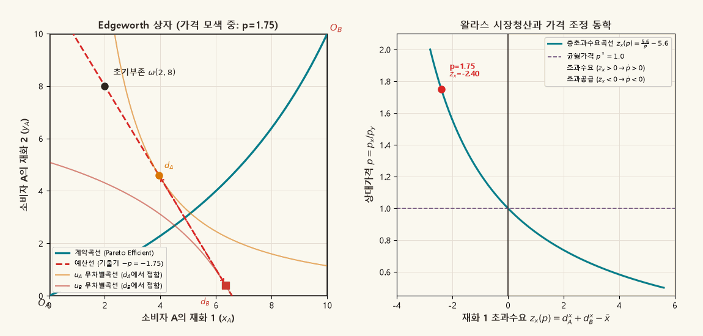
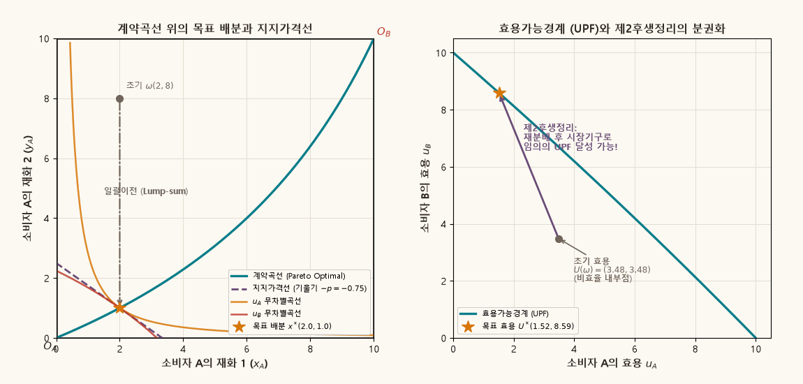

## 목적과 3대 핵심 일반균형 명제

미시경제학의 일반균형이론(General Equilibrium Theory)은 수많은 경제 주체들이 각자의 효용과 이윤을 극대화하고자 분권적으로 내린 의사결정이 가격기구(Price Mechanism)를 매개로 어떻게 조화를 이루는지를 분석합니다. 프랜시스 에지워스(Francis Y. Edgeworth, 1881)가 고안하고 아서 보울리(Arthur L. Bowley, 1924)가 정형화한 **에지워스 상자(Edgeworth Box)**는 자원의 총량이 고정된 2인·2재화 순수교환경제(pure exchange economy)에서 발생하는 거래의 상호작용과 효율성을 평면상에 완결적으로 투영하는 가장 강력한 기하학적 분석 도구입니다.

::: {.callout-note appearance="simple"}
### 에지워스 상자와 후생경제학의 3대 핵심 명제

1. **계약곡선과 파레토 효율성 (Contract Curve and Pareto Efficiency)**:
   - 에지워스 상자 내부의 임의의 점 중, 두 소비자의 무차별곡선이 서로 접하여 **한계대체율이 일치($MRS_A = MRS_B$)하는 배분들의 궤적**을 계약곡선(Contract Curve)이라 합니다.
   - 계약곡선 위의 배분은 어느 한 소비자의 효용을 감소시키지 않고서는 다른 소비자의 효용을 높일 수 없는 **파레토 최적(Pareto Optimum)** 상태이며, 상자 안의 모든 비효율적 배분에서는 상호 이익의 렌즈(lens of mutual gains)를 통해 파레토 개선이 가능합니다.

2. **후생경제학 제1정리와 보이지 않는 손 (First Fundamental Welfare Theorem)**:
   - 소비자의 선호가 **국소 불포화(Local Nonsatiation, LNS)**를 만족할 때, 시장의 가격기구를 통해 달성된 모든 **왈라스 경쟁균형(Walrasian Competitive Equilibrium) 배분은 반드시 파레토 효율적**입니다.
   - 기하학적으로 이는 초기부존을 지나는 경쟁균형 예산선과 두 소비자의 최적 소비묶음이 정확히 일치하며, 이 균형점이 반드시 **계약곡선 상에 안착**함을 의미합니다. 놀랍게도 제1정리는 선호의 볼록성이나 연속성을 요구하지 않는 최소 가설 정리입니다.

3. **후생경제학 제2정리와 분권화된 소득 재분배 (Second Fundamental Welfare Theorem)**:
   - 소비자의 선호가 연속적이고 **볼록(convex)**하며 LNS를 만족한다면, 계약곡선 위의 **임의의 파레토 효율적 배분은 적절한 정액 일괄이전(Lump-sum transfers)을 거친 후 경쟁균형으로 분권화(decentralize)**될 수 있습니다.
   - 이는 **민코프스키 분리초평면 정리(Minkowski Separating Hyperplane Theorem)**에 기초하며, 효율성을 해치는 가격 왜곡(가격 통제, 왜곡세) 없이도 소득의 일괄 재분배만으로 사회가 지향하는 임의의 공평한 파레토 최적을 시장기구를 통해 달성할 수 있음을 입증합니다.
:::

관련 교재 본문은 [Chapter 04 · 4.3 Walrasian equilibrium](../microeconomics/ch04-pure-exchange/03-walrasian-equilibrium-law.qmd)과 [4.6 Welfare theorems](../microeconomics/ch04-pure-exchange/06-welfare-theorems.qmd)에서 순수교환경제의 일반균형, 왈라스 법칙, 그리고 후생정리의 일반 차원 증명을 엄밀하게 다룹니다.

---

## 1. 에지워스 상자의 기하학적 구조와 배분 공간

경제 전체에 두 명의 소비자 $A, B$와 두 가지 소비재 $x, y$가 존재한다고 가정합니다. 경제에 부존된 두 재화의 총량을 $(\bar{x}, \bar{y})$라 합시다.

### 배분 공간 (Feasible Allocation Space)

실현 가능한 배분(Feasible Allocation)이란 두 소비자의 소비량의 합이 총부존량을 초과하지 않는 비음의 벡터 쌍입니다:

$$
\mathcal{F} = \left\{ \bigl((x_A, y_A), (x_B, y_B)\bigr) \in \mathbb{R}_+^2 \times \mathbb{R}_+^2 \;\middle|\; x_A + x_B \le \bar{x},\; y_A + y_B \le \bar{y} \right\}.
$$

자원이 낭비되지 않는 완전 사용 배분에서는 등호가 성립하므로, 소비자 $B$의 소비량은 소비자 $A$의 소비량에 의해 완전히 결정됩니다:

$$
x_B = \bar{x} - x_A, \qquad y_B = \bar{y} - y_A.
$$

에지워스 상자는 가로 길이가 $\bar{x}$, 세로 길이가 $\bar{y}$인 직사각형으로 구성됩니다:
- **소비자 A의 원점 ($O_A$)**: 상자의 왼쪽 아래 모서리 $(0, 0)$에 위치하며, 오른쪽으로 갈수록 $x_A$ 증가, 위로 갈수록 $y_A$가 증가합니다.
- **소비자 B의 원점 ($O_B$)**: 상자의 오른쪽 위 모서리 $(\bar{x}, \bar{y})$에 위치하며, 180도 회전되어 왼쪽으로 갈수록 $x_B$ 증가, 아래로 갈수록 $y_B$가 증가합니다.

### 초기부존과 상호 이익의 렌즈 (Lens of Mutual Gains)

교환이 이루어지기 전 두 소비자가 보유한 초기 자원을 초기부존(Initial Endowment)이라 하며 $\omega = (\omega_A, \omega_B)$로 표기합니다:

$$
\omega_A = (e_A^x, e_A^y), \qquad \omega_B = (\bar{x} - e_A^x, \bar{y} - e_A^y).
$$

초기부존 점 $\omega$를 지나는 소비자 $A$의 무차별곡선 $u_A(x_A, y_A) = u_A(\omega_A)$의 북동쪽 영역은 $A$에게 더 유리한 배분들의 집합입니다. 반면 $O_B$ 기준에서 점 $\omega$를 지나는 소비자 $B$의 무차별곡선 $u_B(x_B, y_B) = u_B(\omega_B)$의 남서쪽 영역은 $B$에게 더 유리한 배분들의 집합입니다.

두 무차별곡선이 겹치는 볼록한 렌즈 모양의 교집합 영역을 **상호 이익의 렌즈(Lens of Mutual Gains)** 또는 **개별 합리성 영역(Individually Rational Allocations)**이라 부르며, 자발적 교환에 참여한 합리적 경제주체들은 반드시 이 렌즈 내부의 배분으로 이동하게 됩니다.

---

## 2. 계약곡선의 대수적·기하학적 도출

파레토 효율적 배분(Pareto Efficient Allocation)이란 다른 소비자의 효용을 낮추지 않고서는 특정 소비자의 효용을 증대시키는 것이 불가능한 배분입니다.

### 파레토 효율성의 1계 조건

소비자 $B$의 효용을 특정 기준 수준 $\bar{u}_B$ 이상으로 묶어두고 소비자 $A$의 효용을 극대화하는 최적화 문제를 설정합니다:

$$
\max_{(x_A, y_A)} u_A(x_A, y_A) \quad \text{s.t.} \quad u_B(\bar{x} - x_A, \bar{y} - y_A) \ge \bar{u}_B.
$$

라그랑지안(Lagrangian)을 구성하면:

$$
\mathcal{L}(x_A, y_A, \lambda) = u_A(x_A, y_A) + \lambda \left[ u_B(\bar{x} - x_A, \bar{y} - y_A) - \bar{u}_B \right].
$$

내부해(interior solution)에 대한 1계 필요조건은 다음과 같습니다:

$$
\frac{\partial \mathcal{L}}{\partial x_A} = \frac{\partial u_A}{\partial x_A} - \lambda \frac{\partial u_B}{\partial x_B} = 0 \implies \frac{\partial u_A}{\partial x_A} = \lambda \frac{\partial u_B}{\partial x_B},
$$

$$
\frac{\partial \mathcal{L}}{\partial y_A} = \frac{\partial u_A}{\partial y_A} - \lambda \frac{\partial u_B}{\partial y_B} = 0 \implies \frac{\partial u_A}{\partial y_A} = \lambda \frac{\partial u_B}{\partial y_B}.
$$

두 식을 나누어 라그랑주 승수 $\lambda$를 소거하면, 파레토 최적의 핵심 필요조건인 **한계대체율 일치 조건(Equi-marginal Condition)**이 도출됩니다:

$$
MRS_A(x_A, y_A) = \frac{\partial u_A / \partial x_A}{\partial u_A / \partial y_A} = \frac{\partial u_B / \partial x_B}{\partial u_B / \partial y_B} = MRS_B(\bar{x} - x_A, \bar{y} - y_A).
$$

기하학적으로 이는 점 $(x_A, y_A)$에서 두 소비자의 무차별곡선이 공통의 접선(common tangent line)을 공유하며 맞닿아 있음을 의미합니다.

### Cobb–Douglas 경제에서의 폐쇄형 계약곡선 유도

다음과 같은 구체적 모형 경제를 설정합니다:
- 총부존: $\bar{x} = 10, \bar{y} = 10$
- 선호: $u_A(x_A, y_A) = x_A^{0.6} y_A^{0.4}$, $\quad u_B(x_B, y_B) = x_B^{0.4} y_B^{0.6}$

각 소비자의 한계대체율을 계산하면:

$$
MRS_A = \frac{0.6\, x_A^{-0.4} y_A^{0.4}}{0.4\, x_A^{0.6} y_A^{-0.6}} = \frac{3}{2} \frac{y_A}{x_A},
$$

$$
MRS_B = \frac{0.4\, x_B^{-0.6} y_B^{0.6}}{0.6\, x_B^{0.4} y_B^{-0.4}} = \frac{2}{3} \frac{y_B}{x_B} = \frac{2}{3} \frac{10 - y_A}{10 - x_A}.
$$

$MRS_A = MRS_B$ 조건을 연립하여 $y_A$에 대해 정리합니다:

$$
\frac{3}{2} \frac{y_A}{x_A} = \frac{2}{3} \frac{10 - y_A}{10 - x_A} \iff 9 y_A (10 - x_A) = 4 x_A (10 - y_A).
$$

$$
90 y_A - 9 x_A y_A = 40 x_A - 4 x_A y_A \iff 90 y_A - 5 x_A y_A = 40 x_A.
$$

양변을 5로 나누면 $18 y_A - x_A y_A = 8 x_A \iff y_A(18 - x_A) = 8 x_A$가 되므로, 다음과 같은 명시적 **폐쇄형 계약곡선 방정식**을 얻습니다:

$$
y_A(x_A) = \frac{8 x_A}{18 - x_A}, \qquad x_A \in [0, 10].
$$

이 곡선은 $O_A(0, 0)$에서 시작하여 $O_B(10, 10)$에 도달하며, 도함수가 $y_A'(x_A) = \frac{144}{(18 - x_A)^2} > 0$이고 $y_A''(x_A) = \frac{288}{(18 - x_A)^3} > 0$이므로 원점 $O_A$에 대해 아래로 볼록(convex)한 형태를 띱니다.

---

## 3. 왈라스 경쟁균형의 형성과 타토느망 가격 동학

완전경쟁시장에서 두 소비자는 가격 수용자(price taker)로서 행동합니다. $y$재화를 계산화폐(numeraire)로 삼아 $p_y = 1$로 정규화하고, $x$재화의 상대가격을 $p = p_x / p_y$라 합시다.

초기부존이 $\omega_A = (2, 8)$, $\omega_B = (8, 2)$로 주어져 있을 때 각 소비자의 명목소득은 다음과 같습니다:

$$
m_A(p) = p \cdot 2 + 1 \cdot 8 = 2p + 8,
$$

$$
m_B(p) = p \cdot 8 + 1 \cdot 2 = 8p + 2.
$$

### 개별 마샬 수요함수

Cobb–Douglas 효용함수의 지출비중 불변 특성에 따라 각 소비자의 수요함수는 다음과 같이 계산됩니다:

$$
x_A(p) = 0.6 \frac{m_A}{p} = 0.6 \frac{2p + 8}{p} = 1.2 + \frac{4.8}{p}, \qquad y_A(p) = 0.4 m_A = 0.8p + 3.2,
$$

$$
x_B(p) = 0.4 \frac{m_B}{p} = 0.4 \frac{8p + 2}{p} = 3.2 + \frac{0.8}{p}, \qquad y_B(p) = 0.6 m_B = 4.8p + 1.2.
$$

### 총초과수요함수와 왈라스 법칙 (Walras' Law)

$x$재화에 대한 시장 전체의 초과수요(Excess Demand) $z_x(p)$는 다음과 같습니다:

$$
z_x(p) = x_A(p) + x_B(p) - \bar{x} = \left( 1.2 + \frac{4.8}{p} \right) + \left( 3.2 + \frac{0.8}{p} \right) - 10 = \frac{5.6}{p} - 5.6.
$$

마찬가지로 $y$재화의 초과수요 $z_y(p)$는:

$$
z_y(p) = y_A(p) + y_B(p) - \bar{y} = (0.8p + 3.2) + (4.8p + 1.2) - 10 = 5.6p - 5.6.
$$

이 두 식에 가격벡터 $(p, 1)$을 내적하면:

$$
p \cdot z_x(p) + 1 \cdot z_y(p) = p \left( \frac{5.6}{p} - 5.6 \right) + (5.6p - 5.6) = 5.6 - 5.6p + 5.6p - 5.6 \equiv 0.
$$

모든 양의 가격 $p > 0$에 대해 **가치 기준의 총초과수요의 합이 항상 0**이 되는 **왈라스 법칙(Walras' Law)**이 항등적으로 성립함을 확인할 수 있습니다.

### 시장 청산 균형 가격과 배분

시장 청산 조건 $z_x(p^*) = 0$을 풀면:

$$
\frac{5.6}{p^*} - 5.6 = 0 \implies p^* = 1.0.
$$

균형 상대가격 $p^* = 1.0$에서의 균형 소비 배분은 다음과 같습니다:

$$
x_A^* = 1.2 + \frac{4.8}{1.0} = 6.0, \qquad y_A^* = 0.8(1.0) + 3.2 = 4.0,
$$

$$
x_B^* = 10 - 6.0 = 4.0, \qquad y_B^* = 10 - 4.0 = 6.0.
$$

이때 각 소비자의 한계대체율을 계산하면:

$$
MRS_A(6, 4) = \frac{3}{2} \frac{4}{6} = 1.0, \qquad MRS_B(4, 6) = \frac{2}{3} \frac{6}{4} = 1.0.
$$

두 소비자의 한계대체율이 시장 균형 가격비율 $p^* = 1.0$과 정확히 일치($MRS_A = MRS_B = p^*$)합니다. 또한 계약곡선 방정식 $y_A(6) = \frac{8 \times 6}{18 - 6} = \frac{48}{12} = 4.0$을 완벽하게 만족하므로, **경쟁균형 배분은 정확히 계약곡선 위에 위치**합니다.

---

## 4. 후생경제학 제1정리의 엄밀 증명과 기하학

::: {.callout-important appearance="simple"}
### 후생경제학 제1정리 (First Fundamental Welfare Theorem)

각 소비자의 선호가 국소 불포화성(Local Nonsatiation, LNS)을 만족할 때, 순수교환경제의 임의의 왈라스 경쟁균형 배분 $(x^*, p^*)$은 파레토 효율적(Pareto efficient)이다.
:::

### 귀류법에 의한 엄밀 증명 (Proof by Contradiction)

**가정**: 균형 배분 $x^* = (x_1^*, \dots, x_I^*)$가 파레토 효율적이 아니라고 하자.

그러면 경제 전체에서 실현 가능한(feasible) 다른 배분 $x' = (x_1', \dots, x_I')$가 존재하여 다음을 만족해야 합니다:
1. 모든 소비자 $i$에 대하여: $x_i' \succsim_i x_i^*$ (누구의 효용도 감소하지 않음)
2. 적어도 한 소비자 $k$에 대하여: $x_k' \succ_k x_k^*$ (적어도 한 명은 엄밀히 더 선호함)
3. 총자원 실현가능성: $\sum_{i=1}^I x_i' \le \sum_{i=1}^I \omega_i$.

**소비자 최적화와 예산제약 검토**:
- 소비자 $k$는 $x_k^*$를 최적 선택했습니다. 만약 $p^* \cdot x_k' \le p^* \cdot \omega_k$라면 소비자 $k$는 예산 범위 내에서 $x_k'$를 구매할 수 있었음에도 $x_k^*$를 선택했으므로 $x_k' \succ_k x_k^*$에 모순됩니다. 따라서:
  $$
  p^* \cdot x_k' > p^* \cdot \omega_k. \tag{식 1}
  $$
- 다른 모든 소비자 $i$에 대해 $x_i' \succsim_i x_i^*$입니다. 만약 $p^* \cdot x_i' < p^* \cdot \omega_i$라면, **국소 불포화(LNS)**에 의해 $x_i'$의 무한소 근방에 $x_i'' \succ_i x_i' \succsim_i x_i^*$이면서 여전히 $p^* \cdot x_i'' \le p^* \cdot \omega_i$인 점 $x_i''$가 반드시 존재합니다. 이는 $x_i^*$가 효용극대화 점이라는 사실에 모순되므로, 다음이 성립해야 합니다:
  $$
  p^* \cdot x_i' \ge p^* \cdot \omega_i \quad (\forall i). \tag{식 2}
  $$

**합산 모순 도출**:
모든 소비자 $i=1, \dots, I$에 대해 부등식 (식 1)과 (식 2)를 합산합니다. 소비자 $k$에 대해 엄밀 부등호가 성립하므로:

$$
\sum_{i=1}^I p^* \cdot x_i' > \sum_{i=1}^I p^* \cdot \omega_i \iff p^* \cdot \sum_{i=1}^I x_i' > p^* \cdot \sum_{i=1}^I \omega_i.
$$

그런데 $x'$는 실행가능한 배분이므로 $\sum_i x_i' \le \sum_i \omega_i$이고, 양의 가격벡터 $p^* \gg 0$에 대해 다음이 성립합니다:

$$
p^* \cdot \sum_{i=1}^I x_i' \le p^* \cdot \sum_{i=1}^I \omega_i.
$$

이는 $p^* \cdot \sum_i \omega_i > p^* \cdot \sum_i \omega_i$라는 명백한 모순(contradiction)을 발생시킵니다. 따라서 경쟁균형 배분 $x^*$는 반드시 파레토 효율적이어야 합니다. $\blacksquare$

> [!NOTE]
> **가설의 최소성**: 이 증명 과정에서 효용함수의 미분가능성이나 연속성은 물론, 선호의 볼록성(convexity)조차 사용되지 않았습니다. 오직 개별 소비자의 최적화와 국소 불포화(LNS) 가설만으로 시장의 보이지 않는 손이 자원을 파레토 최적으로 이끈다는 결론이 도출됩니다.

### 동적 시각화 1: 타토느망 가격 탐색과 경쟁균형

아래 애니메이션은 경매인(Walrasian Auctioneer)이 호가하는 상대가격 $p$의 변화에 따라 예산선이 초기부존 점 $\omega(2, 8)$을 축으로 회전하며, 불균형(초과수요/초과공급)을 해소하고 $p^*=1.0$에서 계약곡선과 접하는 경쟁균형 $x^*(6, 4)$에 수렴하는 과정을 보여줍니다.

{.supplement-graphic fig-alt="Edgeworth 상자에서 타토느망 가격 탐색을 거쳐 초과수요가 0이 되고 예산선이 계약곡선과 접하는 경쟁균형에 수렴하는 애니메이션"}

#### 도표 독해 가이드:
- **좌측 패널 (Edgeworth Box)**:
  - 빨간색 파선: 초기부존 $\omega(2, 8)$을 통과하는 공통 예산선. 기울기는 $-p = -p_x/p_y$입니다.
  - 청록색 실선: 파레토 효율적 배분들의 궤적인 **계약곡선(Contract Curve)**.
  - 노란색 실선: 각 가격에서 소비자가 선택하는 최적 소비묶음 및 무차별곡선.
  - 가격이 너무 높을 때($p > 1.0$): $x$재화는 초과공급(A와 B의 수요 합계 < 10) 상태이며, 경매인은 가격을 하향 조정합니다.
  - 균형($p^* = 1.0$): 예산선이 두 소비자의 무차별곡선과 공통으로 접하며, 그 접점 $(6, 4)$는 정확히 계약곡선 위에 놓입니다 ($MRS_A = MRS_B = p^*$).
- **우측 패널 (시장 초과수요곡선 $z_x(p)$)**:
  - $p > 1.0$ 영역에서는 $z_x(p) < 0$ (초과공급), $p < 1.0$ 영역에서는 $z_x(p) > 0$ (초과수요)입니다.
  - 움직이는 점이 수평축 0과 만나는 점이 바로 왈라스 균형 가격 $p^* = 1.0$입니다.

---

## 5. 후생경제학 제2정리와 지지 가격체계

제1후생정리가 "완전경쟁시장의 결과는 효율적이다"를 보장한다면, 정책 입안자에게 중요한 질문은 그 반대입니다: **"사회가 원하는 특정한 파레토 최적 배분이 주어졌을 때, 시장 가격기구를 파괴하지 않고 이를 달성할 수 있는가?"**

::: {.callout-important appearance="simple"}
### 후생경제학 제2정리 (Second Fundamental Welfare Theorem)

각 소비자의 선호가 연속적이고 단조적이며 **볼록(convex)**하다고 하자. 모든 재화의 총량이 양수인 경제에서 임의의 파레토 효율적 배분 $x^{**} \gg 0$가 주어지면, 적절한 소득의 **정액 일괄 재분배(Lump-sum wealth transfers)** $(T_1, \dots, T_I)$ ($\sum_i T_i = 0$)를 통해 $x^{**}$를 경쟁균형으로 분권화(decentralize)할 수 있는 가격벡터 $p \neq 0$가 존재한다.
:::

### 민코프스키 분리초평면 정리와 지지 가격 (Supporting Price)

제2후생정리의 수학적 토대는 **민코프스키 분리초평면 정리(Separating Hyperplane Theorem)**입니다.

배분 $x^{**}$에서 각 소비자 $i$의 엄밀한 상한 선호집합(Strict Upper Contour Set)을 다음과 같이 정의합니다:

$$
V_i(x_i^{**}) = \left\{ x_i \in \mathbb{R}_+^L \;\middle|\; x_i \succ_i x_i^{**} \right\}.
$$

선호의 볼록성에 의해 각 집합 $V_i$는 볼록집합(convex set)이며, 이들의 민코프스키 합(Minkowski sum) $V = \sum_{i=1}^I V_i(x_i^{**})$ 역시 볼록집합입니다. 또한 총부존 이하의 실현 가능한 총소비 집합을 $\mathcal{W} = \{ z \in \mathbb{R}_+^L \mid z \le \sum \omega_i \}$라 할 때:

$$
V \cap \mathcal{W} = \emptyset.
$$

만약 교집합이 비어있지 않다면 $x^{**}$의 파레토 효율성에 모순되기 때문입니다. 서로 만나지 않는 두 볼록집합 $V$와 $\mathcal{W}$ 사이에는 분리초평면(Separating Hyperplane)이 존재하여, 초평면의 법선벡터 $p \neq 0$가 존재합니다:

$$
p \cdot v \ge p \cdot \sum_{i=1}^I \omega_i \ge p \cdot w \quad (\forall v \in V, \forall w \in \mathcal{W}).
$$

이 법선벡터 $p$가 바로 효율적 배분 $x^{**}$를 지지하는 **지지 가격체계(Supporting Price Vector)**입니다.

### 정액 일괄이전(Lump-sum Transfer)의 계산

목표로 하는 파레토 최적점 $x_A^{**} = (x_A^{**}, y_A^{**})$에서의 공통 한계대체율을 지지 상대가격 $p_{sup}$로 설정합니다:

$$
p_{sup} = MRS_A(x_A^{**}, y_A^{**}).
$$

지지 예산선은 점 $x^{**}$를 통과하므로 기울기는 $-p_{sup}$입니다. 소비자가 이 배분을 스스로 구입하도록 만들기 위해 필요한 소득은 $m_A = p_{sup} x_A^{**} + y_A^{**}$입니다. 반면 원래의 초기부존 $\omega_A$가 가진 시장 가치는 $p_{sup} e_A^x + e_A^y$입니다.

따라서 정부가 소비자 $A$에게 지급(또는 징수)해야 하는 **정액 일괄이전액 $T_A$**는 다음과 같습니다:

$$
T_A = \left( p_{sup} x_A^{**} + y_A^{**} \right) - \left( p_{sup} e_A^x + e_A^y \right) = p_{sup}(x_A^{**} - e_A^x) + (y_A^{**} - e_A^y).
$$

정부의 재정 수지 균형에 의해 소비자 $B$에 대한 이전액은 $T_B = -T_A$로 주어집니다.

### 효용가능경계 (Utility Possibility Frontier, UPF)

계약곡선 상의 배분 $(x_A, y_A(x_A))$를 따라 소비자 $A$의 소비를 $0$에서 $10$까지 증가시키면, 소비자 $A$의 효용 $u_A$는 단조증가하고 소비자 $B$의 효용 $u_B$는 단조감소합니다.

이를 $(u_A, u_B)$ 효용 평면에 매핑한 곡선을 **효용가능경계(Utility Possibility Frontier, UPF)**라 합니다:

$$
u_A(x_A) = x_A^{0.6} \left( \frac{8 x_A}{18 - x_A} \right)^{0.4} = x_A \left( \frac{8}{18 - x_A} \right)^{0.4},
$$

$$
u_B(x_A) = (10 - x_A)^{0.4} \left( 10 - \frac{8 x_A}{18 - x_A} \right)^{0.6} = (10 - x_A) \left( \frac{18}{18 - x_A} \right)^{0.6}.
$$

UPF 위의 모든 점은 파레토 효율적이며, 제2후생정리는 **정액 소득이전을 통해 UPF 상의 임의의 점을 시장 메커니즘을 통해 완벽하게 구현할 수 있음**을 의미합니다.

### 동적 시각화 2: 계약곡선 순회와 효용가능경계

아래 애니메이션은 계약곡선 위의 다양한 파레토 최적 배분을 순회할 때, 각 배분을 지지하는 가격선(Supporting Budget Line), 초기부존 $\omega$로부터 필요한 일괄이전 벡터 $T$, 그리고 우측의 효용가능경계(UPF) 상의 위치 변화를 보여줍니다.

{.supplement-graphic fig-alt="계약곡선 위의 파레토 최적점을 따라 회전하는 지지 예산선과 부존점으로부터의 정액 이전 벡터, 우측 효용가능경계 궤적을 보여주는 애니메이션"}

#### 도표 독해 가이드:
- **좌측 패널 (Edgeworth Box)**:
  - 보라색 실선: 현재 파레토 최적점 $x^{**}$에 접하는 지지 예산선. 기울기 $-p_{sup} = -MRS(x^{**})$.
  - 갈색 화살표 벡터: 초기부존 $\omega(2, 8)$에서 지지 예산선으로 향하는 정액 일괄이전 벡터 $T$.
  - $x_A$가 증가할수록(우측 상단으로 이동할수록): 소비자 $A$에게 유리한 배분이 되며, 지지 가격 $p_{sup}$는 완만해지고 $A$로의 순이전액($T_A > 0$)이 커집니다.
- **우측 패널 (효용가능경계 UPF)**:
  - 청록색 실선: 경제에서 달성 가능한 최대 효용 조합들의 경계인 UPF.
  - 내부 회색 영역: 파레토 비효율적인 실현 가능 배분 영역.
  - 황금색 별표: 초기부존 $\omega$에서의 효용 조합 $(3.48, 3.48)$로, UPF 내부에 위치합니다.
  - 보라색 점: 자발적 교환에 의한 경쟁균형 $CE(5.10, 5.10)$로, UPF 경계 위에 안착합니다.

---

## 6. Cobb–Douglas 교환경제의 완전 수치 벤치마크

모형 경제의 주요 기준점들과 파레토 효율 배분들의 수치 결과를 정리하면 다음과 같습니다.

| 지표 / 배분 상태 | 초기부존 ($\omega$) | 경쟁균형 ($CE^*$) | A 우위 파레토점 | B 우위 파레토점 |
| :--- | :---: | :---: | :---: | :---: |
| **소비자 A 배분 $(x_A, y_A)$** | $(2.00, 8.00)$ | $(6.00, 4.00)$ | $(8.00, 6.40)$ | $(3.00, 1.60)$ |
| **소비자 B 배분 $(x_B, y_B)$** | $(8.00, 2.00)$ | $(4.00, 6.00)$ | $(2.00, 3.60)$ | $(7.00, 8.40)$ |
| **한계대체율 $MRS_A$** | $6.000$ | $1.000$ | $1.200$ | $0.800$ |
| **한계대체율 $MRS_B$** | $0.167$ | $1.000$ | $1.200$ | $0.800$ |
| **지지 상대가격 $p_{sup}$** | 불일치 ($MRS_A \neq MRS_B$) | $1.000$ | $1.200$ | $0.800$ |
| **A 소득 일괄이전액 $T_A$** | $0.00$ | $0.00$ | $+5.60$ | $-5.60$ |
| **소비자 A 효용 $u_A$** | $3.482$ | $5.102$ | $7.309$ | $2.316$ |
| **소비자 B 효용 $u_B$** | $3.482$ | $5.102$ | $2.825$ | $7.518$ |
| **파레토 효율성 여부** | 비효율 (내부) | **효율 (계약곡선 위)** | **효율 (계약곡선 위)** | **효율 (계약곡선 위)** |

### 수치 분석의 주요 함의:
1. **자발적 교환의 이득**: 초기부존 $\omega$에서 두 소비자의 한계대체율은 각각 $6.000$과 $0.167$로 극심한 불일치를 보입니다. 시장 교환을 통해 균형 $CE^*$에 도달하면 양측 모두 효용이 $3.482 \to 5.102$로 크게 증가합니다.
2. **소득 이전과 가격 신호의 독립성**: A 우위 파레토점 $(8.0, 6.4)$를 달성하기 위해 정부는 $A$재화의 가격을 인위적으로 통제할 필요가 없습니다. 단지 소비자 $B$로부터 $5.60$의 소득을 일괄 징수하여 $A$에게 지급($T_A = +5.60$)한 후, 시장에서 $p_{sup} = 1.20$의 가격신호에 따라 자율적으로 거래하게 두면 충분합니다.

---

## 7. 파이썬 애니메이션 재현 및 계산 스크립트

본 보충자료에 수록된 고해상도 GIF 애니메이션 2종은 리포지토리의 Python 스크립트를 통해 온전히 재현할 수 있습니다:

```bash
# 에지워스 상자 및 후생경제학 애니메이션 생성
python scripts/generate_edgeworth_gifs.py
```

스크립트 구조 및 파라미터 제어:
- `scripts/generate_edgeworth_gifs.py`:
  - `generate_gif_equilibrium()`: 타토느망 가격 탐색($p: 2.2 \to 0.55 \to 1.0$), 예산선 피벗, 초과수요 곡선 $z_x(p)$ 추적 애니메이션 생성.
  - `generate_gif_second_welfare()`: 계약곡선 순회($x_A: 1.5 \to 8.5$), 지지 예산선 및 이전 벡터 $T$, 효용가능경계(UPF) 매핑 애니메이션 생성.
  - Matplotlib `subplots_adjust` 고정 레이아웃을 채택하여 프레임 간 크기 왜곡이나 찌그러짐 현상을 방지합니다.

---

## 8. 본문 교재 연계 및 심화 질문

### 본문 챕터 바로가기
- [Chapter 04 · 4.3 Walrasian equilibrium](../microeconomics/ch04-pure-exchange/03-walrasian-equilibrium-law.qmd): 왈라스 균형의 엄밀한 공리적 정의, 왈라스 법칙, 자유재화 조건.
- [Chapter 04 · 4.6 Welfare theorems](../microeconomics/ch04-pure-exchange/06-welfare-theorems.qmd): $N$차원 일반교환경제에서의 제1·제2 후생정리 및 생산을 포함한 경제로의 확장.

### 심화 사고 질문
1. **비볼록 선호와 제2후생정리의 붕괴**:
   만약 소비자의 무차별곡선이 원점에 대해 오목(concave)하여 선호의 볼록성이 위배된다면, 계약곡선 위의 파레토 최적점에서 접하는 지지 예산선을 설정했을 때 소비자는 접점이 아닌 모서리해(corner solution)를 선택하게 됩니다. 이것이 제2후생정리에서 볼록성 가설이 본질적인 이유를 기하학적으로 설명해 보세요.
2. **정보의 비대칭성과 일괄이전의 비현실성**:
   제2후생정리가 말하는 "정액 일괄세/이전"이 현실에서 시행되기 어려운 이유는 무엇입니까? 능력이나 선천적 생산성에 부과되는 이상적 정액세가 정보 불완전성 하에서 소득세나 소비세와 같은 왜곡세(distortionary tax)로 대체될 때 파레토 효율성에 어떤 왜곡이 발생하는지 고찰해 보세요.
