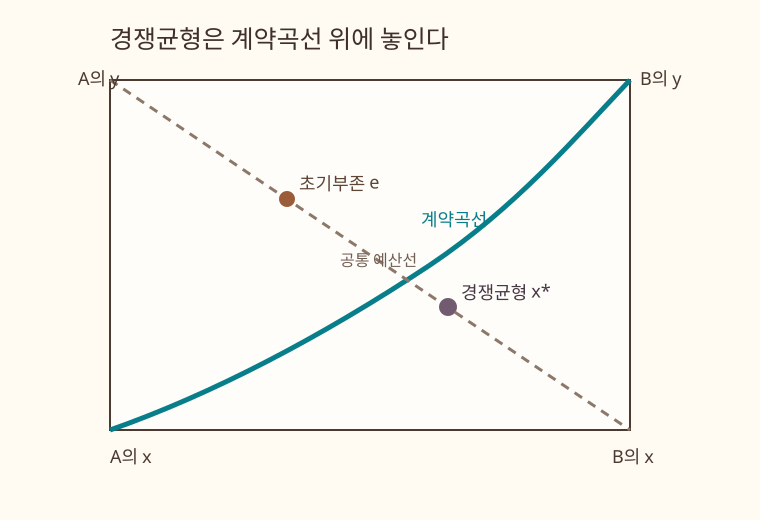

## 목적

후생경제학 제1정리는 Walrasian 경쟁균형이 Pareto efficient하다고 말합니다. 두 소비자·두 재화의
Edgeworth 상자에서는 이 명제를 **경쟁균형 배분이 계약곡선 위에 놓인다**는 그림으로 읽을 수 있습니다.

관련 본문은 [4.3 Walrasian equilibrium](../microeconomics/ch04-pure-exchange/03-walrasian-equilibrium-law.qmd)과
[4.6 Welfare theorems](../microeconomics/ch04-pure-exchange/06-welfare-theorems.qmd)입니다.

## 조작 도구

<iframe class="interactive-frame" title="Edgeworth 상자와 제1후생정리 탐색 도구" src="interactive/edgeworth-first-welfare/index.html" loading="lazy"></iframe>

### 읽는 법

- 상자의 왼쪽 아래 원점은 소비자 A, 오른쪽 위 원점은 소비자 B입니다. 상자 안의 모든 점은
  두 재화의 총량을 정확히 나눈 feasible allocation입니다.
- **초기부존** 점은 소비자 A가 처음 가진 묶음입니다. 회색 선은 그 부존을 통과하는 경쟁가격의
  공통 예산선입니다.
- **계약곡선** 위에서는 두 소비자의 한계대체율이 같습니다. 이 Cobb--Douglas 예시에서는
  접하는 무차별곡선들이 더 이상 Pareto 개선을 허용하지 않습니다.
- **경쟁균형** 점은 두 소비자의 수요가 시장을 청산시키는 점입니다. 보라색 점이 청록 곡선 위에
  놓이고, 카드의 $|MRS_A-MRS_B|$가 0에 가까운지를 확인하세요.

두 소비자의 효용은 다음과 같습니다.

$$
u_A=x_A^{\alpha_A}y_A^{1-\alpha_A},
\qquad
u_B=x_B^{\alpha_B}y_B^{1-\alpha_B}.
$$

계약곡선 내부에서는 $MRS_A=MRS_B$이며, 이 조건은 다음 곡선을 만듭니다.

$$
y_A(x_A)=
\frac{\frac{\alpha_B}{1-\alpha_B}\,x_A\bar y}
     {\frac{\alpha_A}{1-\alpha_A}\,\bar x+
      \left(\frac{\alpha_B}{1-\alpha_B}-\frac{\alpha_A}{1-\alpha_A}\right)x_A}.
$$

## 정적 그림

상호작용을 사용할 수 없는 환경을 위한 기준 설정입니다. 초기부존과 경쟁균형은 같은 예산선 위에 있고,
경쟁균형은 계약곡선 위에 놓입니다.

{.supplement-fallback fig-alt="초기부존에서 출발한 경쟁예산선이 계약곡선 위의 경쟁균형을 지난다."}

## 범위

- 도구는 외부 라이브러리나 서버를 사용하지 않는 HTML, CSS, JavaScript 파일입니다.
- 총부존은 두 재화 모두 10으로 고정하며, 각 소비자의 선호와 소비자 A의 초기부존을 조절합니다.
- 이 그림은 Cobb--Douglas, 엄밀히 양의 가격, 두 소비자·두 재화의 교환경제 예시입니다. 일반적인
제1후생정리는 본문에서처럼 local nonsatiation과 Walrasian equilibrium의 정의로 증명합니다.
