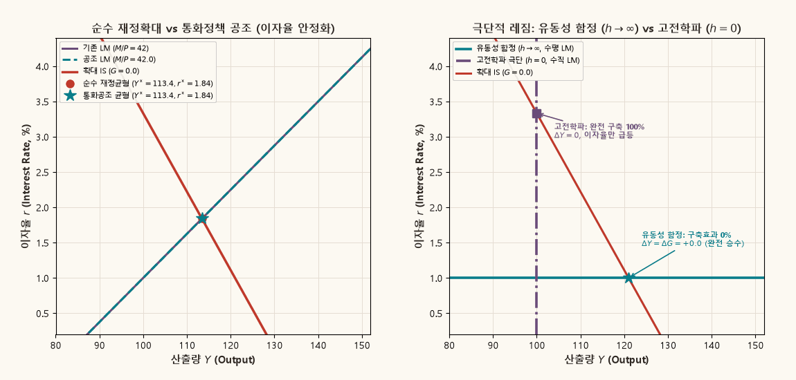

## 목적과 3대 핵심 거시경제학 명제

IS–LM 모형은 존 힉스(John Hicks, 1937)와 앨빈 한센(Alvin Hansen, 1949)이 케인즈(John Maynard Keynes)의 일반이론을 정식화한 단기 거시경제 분석의 표준 틀이다. 재화시장(IS)과 화폐시장(LM)의 동시적 상호작용을 통해 총산출과 이자율이 어떻게 결정되는지 설명한다.

물가수준이 단기에 경직적인 환경에서 재정지출($G$)의 확대는 총수요를 직접 자극한다. 그러나 재화시장의 팽창은 화폐수요 증가를 유발하여 이자율을 상승시키며, 이는 민간 투자를 위축시키는 구축효과(crowding-out effect)를 낳는다.

::: {.callout-note appearance="simple"}
### IS–LM 재정충격의 3대 핵심 명제

1. **실효 재정승수와 단순 케인즈 승수의 감쇄**:
   - 이자율이 고정된 단순 케인즈 교차 모형의 승수는 $\frac{1}{1 - c_1}$이다.
   - 반면 IS–LM 모형의 실효 재정승수는 $\frac{dY^*}{dG} = \frac{h}{h(1 - c_1) + bk}$로 감쇄된다. 화폐시장의 유동성 제약이 재정정책의 팽창 효과를 제약한다.

2. **이자율 전달경로와 민간투자 구축효과 (Crowding-out)**:
   - 산출 증가에 따른 거래적 화폐수요 증가는 이자율을 $\frac{dr^*}{dG} = \frac{k}{h(1 - c_1) + bk} > 0$만큼 상승시킨다.
   - 이자율 상승은 민간 투자를 $\Delta I = -b \Delta r^* < 0$만큼 감소시킨다. 따라서 최종 산출 증가는 $\Delta Y^* = \Delta G + \Delta I < \Delta G$가 된다.

3. **통화정책 공조와 화폐수요 탄력성에 따른 극단적 레짐**:
   - 중앙은행이 이자율을 일정하게 유지하도록 화폐공급을 확대($\Delta m > 0$)하면 구축효과가 완전히 제거된다.
   - **유동성 함정($h \to \infty$)**: LM 곡선이 수평이 되어 구축효과가 0%이며, 완전한 케인즈 승수가 실현된다.
   - **고전학파 극단($h \to 0$)**: LM 곡선이 수직이 되어 완전 구축(100%)이 발생하며, 산출 증가는 0이고 이자율만 급등한다.
:::

관련 교재 본문은 [거시경제학 Chapter 지도](../macroeconomics/index.qmd)에서 단기 총수요 결정, 경기변동 동학 및 거시경제 안정화 정책을 다룬다.

---

## 1. 폐쇄경제 선형 IS–LM 모형의 구조

경제는 재화시장과 화폐시장으로 구성된다. 물가수준 $P$는 단기에 고정되어 있다.

### 1. 재화시장과 IS 곡선

총지출 $Z$는 민간소비 $C$, 민간투자 $I$, 정부지출 $G$의 합이다:

$$
Z = C + I + G.
$$

- **소비함수**: $C = c_0 + c_1(Y - T)$ ($0 < c_1 < 1$: 한계소비성향, $T$: 조세)
- **투자함수**: $I = \bar{I} - b r$ ($b > 0$: 투자의 이자율 민감도)
- **재화시장 균형조건**: $Y = Z$

이를 정리하면 다음과 같다:

$$
Y = c_0 + c_1(Y - T) + \bar{I} - b r + G.
$$

자율적 지출을 $A \equiv c_0 - c_1 T + \bar{I}$로 정의하고, 한계저축성향을 $s \equiv 1 - c_1$이라 하자. 표준 벤치마크에서는 수식의 단순화를 위해 $s = 1$로 정규화하거나 자율지출에 흡수한다:

$$
r_{IS}(Y; G) = \frac{A + G - Y}{b}.
$$

IS 곡선의 기울기는 $\left.\frac{dr}{dY}\right|_{IS} = -\frac{1}{b} < 0$이다. 투자의 이자율 민감도 $b$가 클수록 IS 곡선은 완만해진다. 정부지출 $G$가 증가하면 동일한 이자율에서 산출량이 $\Delta G$만큼 증가하므로 IS 곡선은 우측으로 평행 이동한다.

### 2. 화폐시장과 LM 곡선

실질화폐수요 $L$은 거래적·예비적 수요와 투기적 자산수요로 구성된다:

$$
L(Y, r) = k Y - h r.
$$

- $k > 0$: 화폐수요의 소득 탄력성 계수 (거래적 동기)
- $h > 0$: 화폐수요의 이자율 탄력성 계수 (투기적 동기)
- $m \equiv M/P$: 외생적으로 주어진 실질화폐공급

화폐시장 균형조건 $M/P = L(Y, r)$에 따라 LM 곡선 방정식이 도출된다:

$$
m = k Y - h r \iff r_{LM}(Y; m) = \frac{k Y - m}{h}.
$$

LM 곡선의 기울기는 $\left.\frac{dr}{dY}\right|_{LM} = \frac{k}{h} > 0$이다. 소득 민감도 $k$가 클수록, 이자율 민감도 $h$가 작을수록 LM 곡선은 가팔라진다. 실질화폐공급 $m$이 증가하면 LM 곡선은 우측(하방)으로 이동한다.

---

## 2. 동시 일반균형해와 비교정태 재정승수

단기 거시경제 균형은 IS 곡선과 LM 곡선이 교차하는 점에서 결정된다:

$$
r_{IS}(Y; G) = r_{LM}(Y; m) \iff \frac{A + G - Y}{b} = \frac{k Y - m}{h}.
$$

양변에 $b h$를 곱하여 정리한다:

$$
h(A + G - Y) = b(k Y - m) \iff (h + bk) Y = h(A + G) + bm.
$$

### 균형 산출량과 이자율의 폐쇄형 해

$$
Y^*(G, m) = \frac{h(A + G) + bm}{h + bk},
$$

$$
r^*(G, m) = \frac{k(A + G) - m}{h + bk}.
$$

### 비교정태 재정승수 (Fiscal Policy Multipliers)

정부지출 $G$의 한계적 변동에 따른 산출량과 이자율의 변화율은 다음과 같다:

$$
\frac{dY^*}{dG} = \frac{h}{h + bk} = \frac{1}{1 + \frac{bk}{h}} > 0,
$$

$$
\frac{dr^*}{dG} = \frac{k}{h + bk} > 0.
$$

$\frac{bk}{h} > 0$이므로, 실효 재정승수는 항상 단순 케인즈 승수($1.0$)보다 작다:

$$
0 < \frac{dY^*}{dG} = \frac{h}{h + bk} < 1.
$$

---

## 3. 구축효과(Crowding-Out Effect)의 대수적·기하학적 분해

재정지출 증가 $\Delta G > 0$가 발생했을 때 거시경제적 파급효과는 두 단계로 분해된다.

### 1단계: 가상적 케인즈 팽창 (이자율 불변)

이자율이 초기 수준 $r_0^*$에서 고정되어 있다고 가정하자. 재화시장 수요 증가로 인한 산출량 팽창은 다음과 같다:

$$
\Delta Y_{Keynes} = \Delta G = Y_{Keynes} - Y_0^*.
$$

이 가상적 균형점을 $E_{Keynes}(Y_0^* + \Delta G, r_0^*)$라 한다.

### 2단계: 화폐시장 불균형과 이자율 상승에 따른 투자 위축

산출량이 $Y_{Keynes}$로 늘어나면 거래적 화폐수요가 $k \Delta Y_{Keynes}$만큼 증가한다. 그러나 실질화폐공급 $m$은 고정되어 있으므로 화폐시장에 초과수요가 발생한다. 경제 주체들이 유동성을 확보하고자 채권을 매각하면서 채권 가격이 하락하고 이자율이 상승한다.

이자율은 $r_0^*$에서 $r_1^*$로 상승한다:

$$
\Delta r^* = \frac{k}{h + bk} \Delta G > 0.
$$

이자율 상승은 민간 투자를 직접적으로 위축시킨다:

$$
\Delta I = -b \Delta r^* = -b \left( \frac{k}{h + bk} \Delta G \right) = -\frac{bk}{h + bk} \Delta G < 0.
$$

### 구축효과의 정량적 정의

이자율 상승으로 인해 상실된 산출량 감소분을 **구축효과(Crowding-out Effect)**라 정의한다:

$$
\Delta Y_{crowd} \equiv \Delta Y_{Keynes} - \Delta Y^* = \Delta G - \frac{h}{h + bk} \Delta G = \frac{bk}{h + bk} \Delta G = -\Delta I.
$$

총산출 변동은 다음의 항등적 구성을 갖는다:

$$
\Delta Y^* = \underbrace{\Delta G}_{\text{정부지출 팽창}} + \underbrace{\Delta I}_{\text{민간투자 구축}} = \Delta G - \Delta Y_{crowd}.
$$

구축률(Crowding-out Ratio)은 다음과 같이 정의된다:

$$
\text{구축률} \equiv \frac{\Delta Y_{crowd}}{\Delta Y_{Keynes}} = \frac{bk}{h + bk} = 1 - \frac{h}{h + bk}.
$$

---

## 4. 동적 시각화 1: 재정확대와 구축효과의 실시간 궤적

아래 애니메이션은 재정지출이 $G=0$에서 $G=24$까지 점진적으로 확대될 때, IS 곡선의 우측 이동, 이자율 상승 경로, 그리고 구축효과에 따른 총수요 구성요소의 실시간 변동을 보여준다.

{.supplement-graphic fig-alt="IS 곡선 우측 이동에 따른 이자율 상승과 케인즈 승수 대비 투자 구축효과를 나타내는 2분할 애니메이션"}

#### 도표 독해 가이드:
- **좌측 패널 (IS–LM 평면)**:
  - 보라색 실선: 고정된 LM 곡선 ($m=42$).
  - 붉은색 실선: $G$ 증가에 따라 오른쪽으로 이동하는 IS 곡선.
  - 녹색 점 $E_{Keynes}$: 이자율이 $r_0^*=1.84$로 묶여 있을 때 도달하는 가상적 케인즈 팽창점.
  - 황금색 별표 $E^*$: 화폐시장 청산을 반영한 실제 단기 균형점.
  - 붉은색 역방향 화살표: $E_{Keynes}$에서 $E_1$으로 되돌아오는 **구축효과($\Delta Y_{crowd} = 8.64$)**.
- **우측 패널 (총수요 구성요소 폭포수 차트)**:
  - 녹색 막대: 정부지출 확대분 ($\Delta G = +24.0$).
  - 붉은색 막대: 이자율 상승($+0.96\%p$)으로 인한 민간투자 손실분 ($\Delta I = -8.64$).
  - 청록색 막대: 실제 최종 산출 증가분 ($\Delta Y^* = +15.36$, 실효 승수 $0.64$).

---

## 5. 거시경제 정책 조합과 극단적 레짐 (Policy Regimes)

재정정책의 유효성은 중앙은행의 통화정책 반응 및 화폐수요 탄력성에 따라 질적으로 변화한다.

### 1. 통화정책 공조 (Accommodative Monetary Policy)

재정확대에 수반되는 이자율 상승과 투자 구축을 방지하기 위해, 중앙은행이 화폐공급을 동시에 늘리는 정책을 **통화공조(Accommodative Policy)**라 한다.

이자율을 초기 수준 $r_0^*$로 고정하기 위해 요구되는 화폐공급 증가분 $\Delta m$은 다음과 같다:

$$
r_{LM}(Y_{Keynes}; m + \Delta m) = r_0^* \implies \frac{k(Y_0^* + \Delta G) - (m + \Delta m)}{h} = r_0^*.
$$

$$
\Delta m = k \Delta G.
$$

중앙은행이 화폐공급을 $\Delta m = k \Delta G$만큼 확대하면 LM 곡선이 우측으로 동반 이동한다. 이자율 상승이 억제되므로 민간투자가 위축되지 않으며($\Delta I = 0$), 경제는 완전한 케인즈 승수($\Delta Y^* = \Delta G$)를 누린다.

### 2. 유동성 함정 (Liquidity Trap, $h \to \infty$)

명목이자율이 0 하한(Zero Lower Bound, ZLB)에 도달하면 채권과 화폐가 완전 대체재가 된다. 화폐수요의 이자율 탄력성이 무한대($h \to \infty$)가 되어 **LM 곡선은 수평선**을 이룬다:

$$
\lim_{h \to \infty} \frac{dY^*}{dG} = \lim_{h \to \infty} \frac{h}{h + bk} = 1, \qquad \lim_{h \to \infty} \frac{dr^*}{dG} = 0.
$$

구축효과가 0%이며, 통화정책은 무력하지만 재정정책의 경기부양 효과는 극대화된다.

### 3. 고전학파 극단 (Classical Case, $h \to 0$)

투기적 화폐수요가 전무하고 화폐수요가 소득에만 비례하는 화폐수량설($M/P = kY$) 환경이다. $h \to 0$이므로 **LM 곡선은 수직선**이 된다:

$$
\lim_{h \to 0} \frac{dY^*}{dG} = 0, \qquad \lim_{h \to 0} \frac{dr^*}{dG} = \frac{1}{b}.
$$

정부지출이 증가해도 산출량은 고정되며($\Delta Y^* = 0$), 이자율만 $\Delta r = \Delta G / b$만큼 급등한다. 민간 투자가 재정지출 증가분만큼 정확히 100% 구축된다 ($\Delta I = -\Delta G$).

아래 애니메이션은 통화정책 공조와 극단적 레짐 하에서의 균형 거동을 정량적으로 비교한다.

{.supplement-graphic fig-alt="순수 재정확대와 통화공조의 비교, 그리고 유동성 함정과 고전학파 극단에서의 IS-LM 균형 이동을 나타내는 애니메이션"}

---

## 6. 수치 벤치마크와 정책 시나리오 종합 비교

모형의 기준 파라미터($A=130, b=9, k=0.5, h=8, m=42$) 하에서 도출된 정책 시나리오별 수치 결과는 다음과 같다.

| 정책 시나리오 구분 | 재정지출 충격 ($\Delta G$) | 화폐공급 변동 ($\Delta m$) | 균형 산출량 ($Y^*$) | 균형 이자율 ($r^*$) | 순 산출변동 ($\Delta Y^*$) | 투자 변동 ($\Delta I$) | 구축률 ($\%$) | 정책적 의의 및 메커니즘 |
| :--- | :---: | :---: | :---: | :---: | :---: | :---: | :---: | :--- |
| **0. 초기 기준 상태** | $0.00$ | $0.00$ | $113.44$ | $1.84\%$ | $0.00$ | $0.00$ | $-$ | 벤치마크 단기 거시균형 ($E_0$) |
| **1. 순수 재정확대** | $+24.00$ | $0.00$ | $128.80$ | $2.80\%$ | $+15.36$ | $-8.64$ | $36.0\%$ | 부분 구축 발생 (실효 재정승수 $0.64$) |
| **2. 가상 케인즈 승수점** | $+24.00$ | $-$ | $137.44$ | $1.84\%$ | $+24.00$ | $0.00$ | $0.0\%$ | 이자율 불변 가설 하의 재화시장 청산점 |
| **3. 통화정책 공조** | $+24.00$ | $+12.00$ | $137.44$ | $1.84\%$ | $+24.00$ | $0.00$ | $0.0\%$ | 중앙은행 이자율 페깅으로 완전 승수 달성 |
| **4. 유동성 함정 ($h \to \infty$)** | $+24.00$ | $0.00$ | $137.44$ | $1.84\%$ | $+24.00$ | $0.00$ | $0.0\%$ | 수평 LM, 이자율 불변, 구축효과 0% |
| **5. 고전학파 극단 ($h \to 0$)** | $+24.00$ | $0.00$ | $113.44$ | $4.51\%$ | $0.00$ | $-24.00$ | $100.0\%$ | 수직 LM, 산출 불변, 이자율 급등 및 완전 구축 |

### 수치 분석의 주요 함의:
1. **화폐시장의 감쇄 효과**: 순수 재정지출 확대를 단행할 경우, 재정투입액 $24.0$ 중 $36\%$에 해당하는 $8.64$가 민간투자 구축으로 상쇄된다.
2. **정책 조합(Policy Mix)의 위력**: 통화당국이 $\Delta m = 12.0$의 유동성을 적시에 공급하면 구축효과를 원천 차단하여 산출 증대 효과를 $56.25\%$ ($15.36 \to 24.0$) 증폭시킬 수 있다.
3. **위기 국면에서의 재정정책**: 유동성 함정 환경에서는 민간투자가 이자율 상승으로 위축되지 않으므로 재정정책의 경기부양 효율성이 극대화된다.

---

## 7. 파이썬 애니메이션 재현 및 계산 스크립트

본 보충자료에 수록된 고해상도 GIF 애니메이션은 리포지토리의 Python 스크립트로 재생성할 수 있다:

```bash
# IS-LM 재정확대 및 정책 레짐 애니메이션 생성
python scripts/generate_islm_gifs.py
```

스크립트 구조:
- `scripts/generate_islm_gifs.py`:
  - `generate_gif_fiscal_expansion()`: IS 곡선 우측 이동, 이자율 상승 궤적, 총수요 구성요소 폭포수 차트 생성.
  - `generate_gif_policy_regimes()`: 순수 재정확대 vs 통화공조, 유동성 함정 vs 고전학파 비교 격자 생성.
  - `subplots_adjust` 고정 레이아웃을 채택하여 프레임 간 크기 왜곡 현상을 배제한다.

---

## 8. 본문 교재 연계 및 동학적 확장

### 본문 챕터 연계
- [거시경제학 Chapter 지도](../macroeconomics/index.qmd): 단기 균형에서 중장기 물가 조정(AD–AS 모형)으로의 전이.
- [IS–LM 대화형 도표 원본](matlab/islm_fiscal_animation.m): MATLAB 기준 계산 및 시나리오 경로.

### 중장기 동학으로의 확장: 물가 조정과 완전 구축
단기 IS–LM 모형에서 산출량이 잠재산출량($Y_n$)을 초과($Y^* > Y_n$)하면, 중기적으로 임금과 기대인플레이션이 상승하여 총공급곡선(AS)이 상방 이동한다.

물가수준 $P$가 상승하면 실질화폐공급 $M/P$가 감소하여 LM 곡선이 좌측으로 이동한다. 경제는 이자율이 더욱 상승하면서 잠재산출량 $Y_n$으로 복귀한다. 즉, 단기에는 부분 구축이 발생하지만, 중장기적으로는 물가 조정을 통해 **완전 구축(100%)**이 완성된다.
