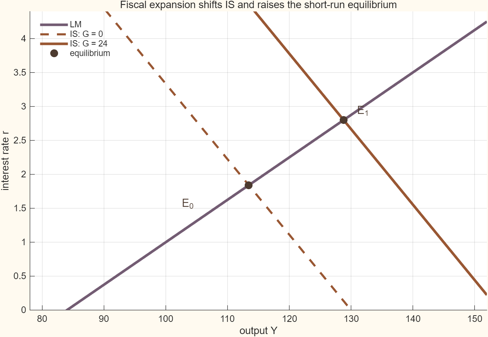
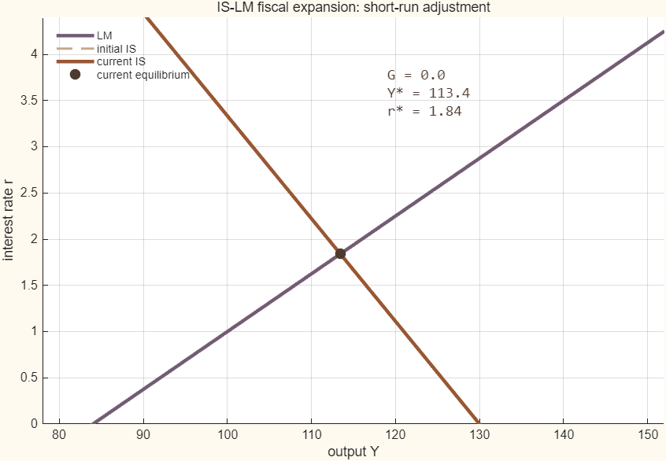

## 목적

재정지출 확대는 재화시장 수요를 늘려 IS 곡선을 오른쪽으로 이동시킵니다. 화폐공급이 고정된
단기에는 산출과 이자율이 함께 변합니다. 이 보충자료는 충격 전 균형에서 충격 후 균형으로
이동하는 과정을 대화형 도구와 애니메이션으로 보여줍니다.

관련 본문은 [Chapter 06 · Nominal Rigidity](../macroeconomics/ch06-nominal-rigidity/contents.qmd)와
[Chapter 08 · Monetary Policy](../macroeconomics/ch08-monetary-policy/contents.qmd)입니다.

## 조작 도구

<iframe class="interactive-frame" title="IS–LM 재정충격과 단기 균형 탐색 도구" src="interactive/islm-fiscal-shock/index.html" loading="lazy"></iframe>

### 조작 도구 읽는 법

- **재정지출 충격 $G$**를 오른쪽으로 움직이면, 재화시장 수요 증가로 IS 곡선이 우측으로 평행 이동합니다.
- 화폐공급이 일정한 상태에서 산출이 증가하면 거래적 화폐수요가 늘어나 이자율 $r$이 상승합니다.
- 이자율 상승은 민간 투자·소비 수요를 일부 위축시키므로(**구축효과, crowding-out effect**), 최종 산출 증가분 $\Delta Y$는 이자율이 고정되었을 때의 단순 승수 효과보다 작아집니다.
- 지표 카드의 **재정승수**는 $\frac{dY}{dG} = \frac{h}{h+bk}$로 계산되며, 기준 모수($h=8, b=9, k=0.5$) 아래에서 약 $0.64$입니다.
- 버튼을 눌러 **기준 상태 ($G=0$)**와 **충격 상태 ($G=24$)**를 원클릭으로 비교할 수 있습니다.

## 기준 IS–LM 도표


산출 $Y$, 이자율 $r$, 재정지출 충격 $G$를 다음처럼 둡니다.

$$
r_{IS}(Y;G)=\frac{A+G-Y}{b},
\qquad
r_{LM}(Y)=\frac{kY-m}{h}.
$$

두 식이 만나는 점이 단기 균형입니다. $G$가 증가하면 $r_{IS}$가 위·오른쪽으로 이동합니다.
기준값은 $A=130$, $b=9$, $k=0.5$, $h=8$, $m=42$입니다.

{.supplement-fallback fig-alt="IS 곡선이 오른쪽으로 이동하고, 산출과 이자율이 함께 상승하는 IS-LM 도표"}

## 재정지출 확대의 애니메이션

아래 GIF는 $G=0$에서 $G=24$까지 늘어날 때 IS 곡선과 균형점이 이동하는 16개 장면을 보여줍니다.
각 장면의 우측 상단에는 해당 재정지출, 산출, 이자율이 표시됩니다.

{fig-alt="재정지출이 증가하면서 IS 곡선과 균형점이 오른쪽 위로 이동하는 애니메이션"}

### 읽는 법

- 재정지출이 늘면 같은 이자율에서 재화시장 수요가 커지므로 IS 곡선이 이동합니다.
- LM 곡선은 실질화폐공급이 고정되어 있으므로 움직이지 않습니다.
- 새 균형에서는 산출이 증가하고 화폐시장 균형을 위해 이자율도 상승합니다.
- 이 그림은 가격수준과 기대가 단기에 고정된 비교정태 모형입니다. 이후의 물가 조정·통화정책 반응은 AD–AS 및 신케인지언 모형에서 별도로 다룹니다.

## 재현과 범위

- MATLAB 원본: [`supplements/matlab/islm_fiscal_animation.m`](matlab/islm_fiscal_animation.m)
- 균형 경로: [`assets/data/islm-fiscal-path.csv`](../assets/data/islm-fiscal-path.csv)
- 실행 메타데이터: [`assets/data/islm-fiscal-metadata.json`](../assets/data/islm-fiscal-metadata.json)
- 권장 실행환경: MATLAB R2025b (base MATLAB, 별도 toolbox 없음)

프로젝트 루트에서 아래 명령으로 정적 그림과 GIF를 다시 생성할 수 있습니다.

```text
matlab -batch "run('supplements/matlab/islm_fiscal_animation.m')"
```

이 자료는 폐쇄경제의 선형 IS–LM 비교정태를 시각화합니다. 투자·소비의 미시적 기초, 동학,
가격수준 변화, 개방경제의 환율경로는 이 단순화된 그림에 포함하지 않습니다.
