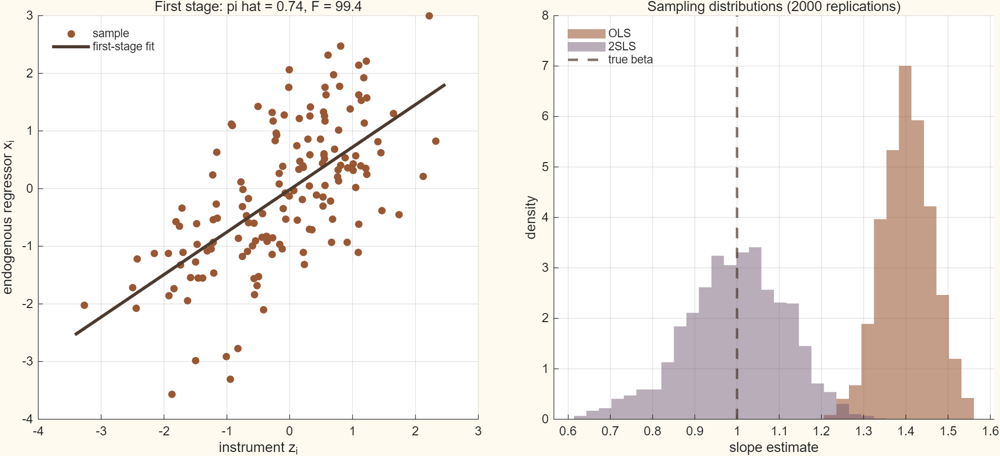

## 목적

내생성은 설명변수와 오차가 함께 움직일 때 생깁니다. 이 보충자료는 유효한 도구변수 $z$가
설명변수 $x$와 얼마나 강하게 연결되는지에 따라 OLS와 2SLS가 어떻게 달라지는지 보여줍니다.
강한 도구변수는 OLS의 내생성 편향을 줄이는 데 도움이 되지만, 약한 도구변수는 2SLS의 표본분포를
매우 넓고 불안정하게 만들 수 있습니다.

관련 본문은 [Chapter 03 · Target, Model, and Identification](../econometrics/ch03-target-model-identification/contents.qmd),
[Chapter 06 · Population Linear Regression](../econometrics/ch06-population-linear-regression/contents.qmd),
그리고 [Chapter 10 · Large-Sample Theory of Least Squares](../econometrics/ch10-large-sample-least-squares/contents.qmd)입니다.

## 조작 도구

<iframe class="interactive-frame" title="도구변수와 약한 도구변수 탐색 도구" src="interactive/iv-weak-instruments/index.html" loading="lazy"></iframe>

### 읽는 법

- **도구 강도 $\pi$**는 첫 단계 $x=\pi z+v$에서 $z$가 $x$를 설명하는 정도입니다.
  $\pi$가 작으면 첫 단계 F 통계량도 작아집니다.
- **내생성 $\rho$**는 $x$를 움직이는 $v$와 구조오차 $u$의 연결입니다. $\rho$가 0에서 멀어질수록
  OLS의 Monte Carlo 평균은 참 기울기 $\beta$에서 멀어집니다.
- $z$가 유효하다는 가정 아래 2SLS는 강한 도구변수에서 참값 주위에 모입니다. 그러나 $\pi$가 작으면
  2SLS 분포의 꼬리가 길어지고 한 번의 추정치도 신뢰하기 어려워집니다.

도구는 절편을 포함한 다음 모형을 사용합니다.

$$
x_i=\pi z_i+v_i,\qquad
y_i=\beta x_i+u_i,\qquad
u_i=\rho v_i+\sqrt{1-\rho^2}\,e_i.
$$

여기서 $z_i$, $v_i$, $e_i$는 서로 독립인 표준정규 난수입니다. 따라서 $z$는 오차와 독립이지만,
$x$와 $u$는 $v$를 통해 연결됩니다. 단일 도구변수의 2SLS 기울기는 다음과 같습니다.

$$
\hat\beta_{2SLS}=
\frac{\sum_i(z_i-\bar z)(y_i-\bar y)}
     {\sum_i(z_i-\bar z)(x_i-\bar x)}.
$$

## 정적 그림

상호작용을 사용할 수 없는 환경을 위한 MATLAB 기준 설정의 첫 단계와 추정치 분포입니다.

{.supplement-fallback fig-alt="왼쪽에는 도구변수와 내생 설명변수의 첫 단계 산점도, 오른쪽에는 OLS와 2SLS 기울기 추정치의 분포가 있다."}

## 재현과 범위

- MATLAB 원본: [`supplements/matlab/iv_weak_instruments.m`](matlab/iv_weak_instruments.m)
- 기준 표본: [`assets/data/iv-weak-instruments-baseline.csv`](../assets/data/iv-weak-instruments-baseline.csv)
- 실행 메타데이터: [`assets/data/iv-weak-instruments-metadata.json`](../assets/data/iv-weak-instruments-metadata.json)
- 권장 실행환경: MATLAB R2025b (base MATLAB, 별도 toolbox 없음)

프로젝트 루트에서 아래 명령으로 기준 산출물을 다시 생성할 수 있습니다.

```text
matlab -batch "run('supplements/matlab/iv_weak_instruments.m')"
```

기준 계산은 random seed를 고정하고 $n=150$, $\beta=1$, $\pi=0.7$, $\rho=0.6$,
Monte Carlo 2,000회를 사용합니다. 이는 하나의 유효한 도구변수와 하나의 내생 설명변수만을 둔
교육용 실험입니다. 실제 응용에서는 도구변수의 외생성·배제제약을 경제이론과 제도적 근거로
검토하고, 약한 도구변수에 강건한 추론도 별도로 확인해야 합니다.
