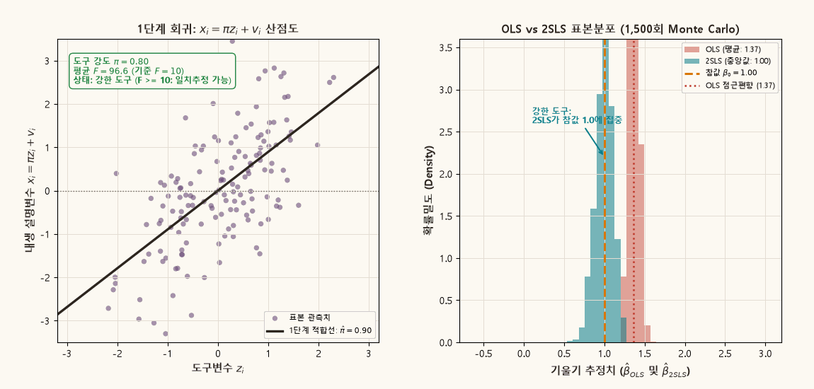
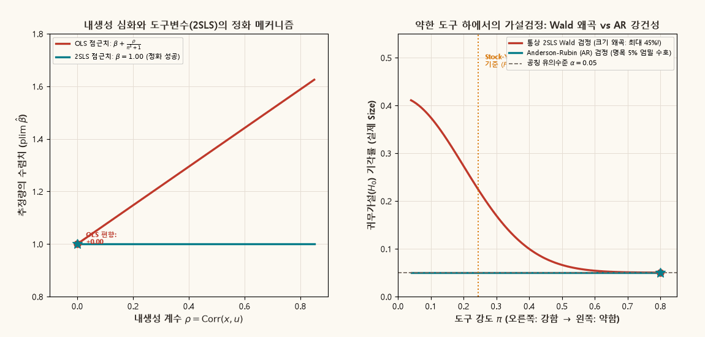

## 목적과 3대 핵심 계량경제학 명제

회귀분석에서 설명변수와 오차항 사이에 상관관계가 존재할 때 이를 **내생성(Endogeneity)**이라 한다. 내생성이 존재하면 최소자승추정량(OLS)은 표본 크기가 무한히 커지더라도 참된 모수로 수렴하지 못하는 점근적 불일치성(Inconsistency)을 갖는다.

도구변수(Instrumental Variables, IV) 접근법과 2단계 최소자승법(2SLS)은 이러한 내생성 편향을 치유하는 표준적 인과추론 도구이다. 그러나 도구변수와 내생 설명변수 사이의 상관관계가 미약한 **약한 도구변수(Weak Instruments)** 환경에서는, 2SLS 추정량이 OLS 편향점으로 강하게 끌려가며 통상적인 통계적 추론이 완전히 붕괴된다.

::: {.callout-note appearance="simple"}
### 도구변수와 약한 도구의 3대 핵심 명제

1. **내생성과 도구변수의 2대 식별 조건**:
   - 설명변수 $x$와 오차 $u$의 상관관계($\text{Cov}(x, u) \neq 0$)로 인해 OLS 추정량은 $\text{plim } \hat{\beta}_{OLS} = \beta + \frac{\text{Cov}(x, u)}{\text{Var}(x)}$로 편향된다.
   - 유효한 도구변수 $z$는 **외생성(Exogeneity, $\text{Cov}(z, u) = 0$)**과 **관련성(Relevance, $\text{Cov}(z, x) \neq 0$)**을 동시에 만족해야 한다.

2. **약한 도구의 함정과 유한표본 편향 (Bound–Jaeger–Baker 정리)**:
   - 도구변수와 설명변수의 연결 강도 $\pi$가 약해 1단계 $F$-통계량이 작을 때, 2SLS의 유한표본 편향은 OLS 편향에 비례하여 증가한다:
     $$
     \frac{\mathbb{E}[\hat{\beta}_{2SLS} - \beta]}{\text{plim } \hat{\beta}_{OLS} - \beta} \approx \frac{1}{\mathbb{E}[F] - 1}.
     $$
   - 도구가 무력할수록($F \approx 1$) 2SLS는 OLS 편향을 100% 답습하며, 표본분포는 코시(Cauchy) 분포와 유사한 두꺼운 꼬리(fat tail)를 갖는다.

3. **약한 도구에 강건한 추론 (Anderson–Rubin 검정)**:
   - 약한 도구 하에서 통상적인 2SLS $t$-검정(Wald 검정)은 표본오차의 비정규성으로 인해 극심한 유의수준 왜곡(Size Distortion, 공칭 5% 대비 실제 기각률 최대 40~50%)을 유발한다.
   - 반면 **앤더슨-루빈(Anderson–Rubin, 1949) 검정**은 도구의 강약과 무관하게 정확한 $F$-분포를 따르며 공칭 유의수준을 엄밀하게 보존한다.
:::

관련 교재 본문은 [Chapter 03 · Target, Model, and Identification](../econometrics/ch03-target-model-identification/contents.qmd), [Chapter 06 · Population Linear Regression](../econometrics/ch06-population-linear-regression/contents.qmd), 그리고 [Chapter 10 · Large-Sample Theory of Least Squares](../econometrics/ch10-large-sample-least-squares/contents.qmd)에서 다룬다.

---

## 1. 설명변수의 내생성과 OLS의 점근 불일치성

단일 내생 설명변수를 갖는 선형 회귀모형을 설정한다:

$$
y_i = \beta x_i + u_i, \qquad i = 1, \dots, n.
$$

편의상 변수들은 평균이 0으로 중심화되어 있다고 가정한다. OLS 추정량은 다음과 같다:

$$
\hat{\beta}_{OLS} = \frac{\sum_{i=1}^n x_i y_i}{\sum_{i=1}^n x_i^2} = \beta + \frac{\sum_{i=1}^n x_i u_i}{\sum_{i=1}^n x_i^2}.
$$

대수의 법칙(LLN)을 적용하면 OLS 추정량의 확률수렴치(plim)는 다음과 같이 결정된다:

$$
\text{plim } \hat{\beta}_{OLS} = \beta + \frac{\text{Cov}(x, u)}{\text{Var}(x)} = \beta + \rho \frac{\sigma_u}{\sigma_x}.
$$

$\text{Cov}(x, u) \neq 0$인 경우, 표본 크기 $n \to \infty$이더라도 OLS 추정량은 참값 $\beta$로 수렴하지 않는다. 내생성이 발생하는 대표적 경제학적 원인은 세 가지이다:
1. **생략변수 편향 (Omitted Variable Bias)**: 능력(ability)이나 제도적 요인 등 관측되지 않은 변수가 설명변수와 오차항 모두에 영향을 미치는 경우.
2. **측정오차 (Measurement Error)**: 설명변수가 오차를 포함하여 측정되어 감쇄 편향(attenuation bias)이 발생하는 경우.
3. **동시인과성 (Simultaneity)**: 수요와 공급, 가격과 수량처럼 $x$와 $y$가 연립방정식 체계에서 상호 결정되는 경우.

---

## 2. 도구변수(IV)와 2단계 최소자승법(2SLS)의 대수적 기초

내생성 문제를 해결하기 위해 외생적 도구변수 $z_i$를 도입한다.

### 1단계 축약형 회귀 (First-Stage Regression)

내생 설명변수 $x_i$를 도구변수 $z_i$에 대해 회귀분석한다:

$$
x_i = \pi z_i + v_i, \qquad \mathbb{E}[z_i v_i] = 0.
$$

- $\pi$: 도구변수의 강도(Relevance parameter)
- $v_i$: 도구변수로 설명되지 않는 $x_i$의 내생적 변동분

오차항 $u_i$는 $v_i$와 상관되어 있으며, 상관계수를 $\rho \in (-1, 1)$라 할 때 다음과 같이 분해할 수 있다:

$$
u_i = \rho v_i + \sqrt{1 - \rho^2}\, e_i, \qquad e_i \sim \text{i.i.d. } \mathcal{N}(0, 1).
$$

이때 $z_i, v_i, e_i$는 상호 독립이다.

### 도구변수의 2대 식별 조건

유효한 도구변수 $z$는 다음 두 가지 조건을 동시에 만족해야 한다:

1. **외생성 조건 (Exogeneity / Instrument Validity)**:  
   도구변수는 구조오차 $u$와 상관되지 않아야 한다.
   $$
   \text{Cov}(z, u) = 0.
   $$
2. **관련성 조건 (Relevance Condition)**:  
   도구변수는 내생 설명변수 $x$와 유의한 상관관계를 가져야 한다.
   $$
   \pi \neq 0 \iff \text{Cov}(z, x) \neq 0.
   $$

### 2SLS 추정량과 일치성 증명

단일 도구변수 환경에서의 2SLS 추정량은 다음과 같이 정의된다:

$$
\hat{\beta}_{2SLS} = \frac{\sum_{i=1}^n z_i y_i}{\sum_{i=1}^n z_i x_i} = \beta + \frac{\frac{1}{n}\sum_{i=1}^n z_i u_i}{\frac{1}{n}\sum_{i=1}^n z_i x_i}.
$$

분자와 분모에 각각 대수의 법칙을 적용한다:

$$
\text{plim } \frac{1}{n}\sum_{i=1}^n z_i u_i = \text{Cov}(z, u) = 0,
$$

$$
\text{plim } \frac{1}{n}\sum_{i=1}^n z_i x_i = \text{Cov}(z, x) = \pi \text{Var}(z) \neq 0.
$$

따라서 관련성 조건($\pi \neq 0$)이 성립하는 한 2SLS 추정량은 일치성을 갖는다:

$$
\text{plim } \hat{\beta}_{2SLS} = \beta + \frac{0}{\pi \text{Var}(z)} = \beta.
$$

---

## 3. 약한 도구변수(Weak Instruments)와 유한표본 편향

일치성 증명은 $\pi$가 0이 아닌 고정된 상수로 머물면서 $n \to \infty$로 갈 때 성립하는 점근적 결과이다. 그러나 표본 크기에 비해 도구의 설명력 $\pi$가 매우 작은 경우, 통상적인 점근이론이 완전히 오도된 결론을 내린다.

### 1단계 $F$-통계량과 집중모수 (Concentration Parameter)

1단계 회귀식 $x_i = \pi z_i + v_i$에서 도구의 무력성($H_0: \pi = 0$)을 검정하는 $F$-통계량은 다음과 같다:

$$
F = \frac{\hat{\pi}^2}{\widehat{\text{Var}}(\hat{\pi})} = \frac{\hat{\pi}^2 \sum_{i=1}^n z_i^2}{\frac{1}{n-2}\sum_{i=1}^n \hat{v}_i^2}.
$$

집중모수(Concentration Parameter) $\mu^2$는 도구의 유효 정보량을 나타내며 다음과 같이 정의된다:

$$
\mu^2 \equiv \frac{\pi^2 \sum_{i=1}^n z_i^2}{\sigma_v^2} \approx n \pi^2 \frac{\text{Var}(z)}{\sigma_v^2}.
$$

$F$-통계량의 기댓값은 대략 $\mathbb{E}[F] \approx 1 + \frac{\mu^2}{K}$이다 (여기서 $K$는 도구변수의 개수).

### Bound–Jaeger–Baker (1995) 유한표본 편향 공식

도구변수가 $K$개인 과대식별(over-identified) 모형에서 2SLS 추정량의 기대 편향은 다음과 같이 근사된다:

$$
\frac{\mathbb{E}[\hat{\beta}_{2SLS} - \beta]}{\text{plim } \hat{\beta}_{OLS} - \beta} \approx \frac{1}{\mathbb{E}[F] - 1} = \frac{K}{\mu^2}.
$$

이 공식은 중대한 계량경제학적 사실을 함의한다:
1. **$F \approx 1$일 때**: 도구가 설명력이 거의 없으면 2SLS는 참값 $\beta$가 아니라 **OLS의 편향된 값으로 100% 수렴**한다.
2. **도구 수가 많을수록 편향 증가**: 도구의 개수 $K$가 증가하면 과적합(over-fitting)으로 인해 1단계 예측치 $\hat{x}$가 표본 내 오차 $v$를 학습하므로 2SLS의 편향이 OLS 방향으로 더욱 심화된다.
3. **엄밀 식별($K=1$)에서의 모멘트 부재**: 도구가 1개일 때 $\hat{\beta}_{2SLS}$는 코시 분포와 유사하여 **기댓값 자체가 존재하지 않는다**. 분모 $\sum z_i x_i$가 0 근방에서 진동할 때 추정치가 무한대로 발산하는 극단적 이상치가 빈번히 발생한다.

### Staiger–Stock (1997)과 Stock–Yogo (2005)의 $F > 10$ 경험법칙

스태이거와 스톡(Staiger and Stock, 1997)은 도구 강도가 표본 크기에 반비례하여 감소하는 **국소 대립가설($\pi = c / \sqrt{n}$)**을 도입하여 약한 도구의 극한분포를 도출했다.

이 점근체계 하에서 스톡과 요고(Stock and Yogo, 2005)는 **"2SLS의 상대 편향을 OLS 편향의 10% 이하로 통제하기 위한 1단계 $F$-통계량의 임계치"**를 계산했으며, 단일 도구변수 환경에서 이 기준이 바로 널리 활용되는 **$F > 10$ 경험법칙(Rule of Thumb)**이다.

---

## 4. 동적 시각화 1: 도구 강도 전이와 2SLS 표본분포의 거동

아래 애니메이션은 도구 강도 $\pi$가 강함($0.80$, $F \approx 97$)에서 극도로 약함($0.04$, $F \approx 1.2$)으로 점진적으로 약화될 때, 1단계 적합선의 기울기와 OLS 및 2SLS의 Monte Carlo 표본분포(1,500회 복제)가 어떻게 전이되는지를 실시간으로 보여준다.

{.supplement-graphic fig-alt="도구 강도가 약해짐에 따라 1단계 F 통계량이 하락하고 2SLS 추정량의 분산이 폭발하며 OLS 편향점으로 수렴하는 표본분포 전이 애니메이션"}

#### 도표 독해 가이드:
- **좌측 패널 (1단계 회귀 산점도)**:
  - $\pi = 0.80$일 때 도구변수 $z$와 설명변수 $x$는 뚜렷한 양의 상관관계를 보이며 $F \approx 97 \gg 10$으로 상단에 녹색 배지가 점등된다.
  - $\pi$가 감소함에 따라 적합선의 기울기가 평평해지며, $F < 10$ 이하로 떨어지면 붉은색 경고 배지(약한 도구 경고)로 전환된다.
- **우측 패널 (OLS vs 2SLS 표본분포)**:
  - 붉은색 히스토그램(OLS): 내생성($\rho=0.6$)으로 인해 참값 $\beta=1.0$에서 크게 벗어난 $1.37 \sim 1.60$ 영역에 고정적으로 편향되어 있다.
  - 청록색 히스토그램(2SLS):
    - **강한 도구($F \ge 10$)**: 참값 $\beta=1.00$ 주위에 매우 좁은 분산으로 대칭 집결한다.
    - **약한 도구($F < 10$)**: 분산이 급격히 팽창하며 좌우로 두꺼운 꼬리(fat tail)가 형성된다.
    - **완전 무력 도구($F \approx 1$)**: 2SLS의 중심(중앙값)마저 참값을 이탈하여 **OLS 편향점($1.50$)으로 표류**한다.

---

## 5. 약한 도구에 강건한 추론: Anderson–Rubin (AR) 검정

약한 도구변수가 초래하는 가장 치명적인 문제는 추정치의 불안정성보다 **통계적 가설검정의 파괴**에 있다.

### 통상적 Wald $t$-검정의 점근정규성 붕괴와 크기 왜곡 (Size Distortion)

귀무가설 $H_0: \beta = \beta_0$에 대한 통상적인 2SLS $t$-통계량은 다음과 같다:

$$
t = \frac{\hat{\beta}_{2SLS} - \beta_0}{\text{SE}(\hat{\beta}_{2SLS})}.
$$

강한 도구 하에서는 $t \xrightarrow{d} \mathcal{N}(0, 1)$이 성립하므로 임계치 $\pm 1.96$을 사용하면 정확한 5% 기각률을 보장한다. 그러나 약한 도구 하에서는 추정량의 분모가 정규분포가 아니므로 $t$-통계량이 더 이상 표준정규분포를 따르지 않는다.

그 결과, 참된 귀무가설임에도 불구하고 기각해 버리는 **제1종 오류(Type I Error, Size)가 명목 유의수준 5%를 넘어 최대 40~50%까지 치솟는 극단적 크기 왜곡**이 발생한다. 연구자는 존재하지 않는 효과를 통계적으로 유의하다고 잘못 결론짓게 된다.

### Anderson–Rubin (AR) 검정의 대수적 구조

앤더슨과 루빈(Anderson and Rubin, 1949)은 2SLS의 불안정한 분모를 거치지 않는 천재적인 검정법을 고안했다.

귀무가설 $H_0: \beta = \beta_0$가 참이라면, 변환된 잔차 변수 $y_i - \beta_0 x_i$는 정확히 구조오차 $u_i$와 일치한다:

$$
y_i - \beta_0 x_i = (\beta x_i + u_i) - \beta_0 x_i = u_i.
$$

도구변수의 외생성 가설($\text{Cov}(z, u) = 0$)에 의해, $H_0$가 참인 상태에서는 $y_i - \beta_0 x_i$를 도구변수 $z_i$에 대해 회귀했을 때 도구변수의 계수가 0이어야 한다:

$$
y_i - \beta_0 x_i = \gamma z_i + \epsilon_i, \qquad H_0: \gamma = 0.
$$

이 회귀의 $F$-검정 통계량이 바로 **앤더슨-루빈(AR) 통계량**이다:

$$
AR(\beta_0) = \frac{(y - \beta_0 x)' P_Z (y - \beta_0 x) / K}{(y - \beta_0 x)' M_Z (y - \beta_0 x) / (n - K - 1)}.
$$

- $P_Z = Z(Z'Z)^{-1}Z'$: 도구공간으로의 사영행렬
- $M_Z = I - P_Z$: 도구공간의 소거행렬

### AR 검정의 핵심 성질

1. **도구 강도에 대한 완전한 강건성 (Robustness)**:  
   $H_0$ 하에서 분자는 순수한 구조오차 $u$의 2차 형식이므로, 1단계 계수 $\pi$의 크기와 완전히 무관하게 **유한표본에서 정확히 $F_{K, n-K-1}$ 분포**를 따른다.
2. **크기 왜곡 전무**:  
   $F$ 통계량이 1 미만인 극단적인 무력 도구 환경에서도 AR 검정의 기각률은 항상 명목 유의수준 5%를 완벽하게 유지한다.
3. **신뢰구간 형성**:  
   $AR(\beta_0) \le F_{crit}$을 만족하는 $\beta_0$들의 집합을 역산하여 유효한 신뢰구간을 형성한다. 도구가 매우 약하면 신뢰구간이 비유계(unbounded) 구간이나 공집합으로 도출되어 도구의 정보력 부재를 정직하게 드러낸다.

아래 애니메이션은 내생성 계수 $\rho$에 따른 OLS 편향 메커니즘과, 도구 강도 $\pi$ 감소 시 통상 Wald 검정의 왜곡 대비 AR 검정의 정확성을 비교한다.

{.supplement-graphic fig-alt="내생성 크기에 따른 OLS 편향과 2SLS 정화 메커니즘, 그리고 약한 도구 환경에서 Wald 검정 왜곡 대비 Anderson-Rubin 검정의 크기 수호 애니메이션"}

---

## 6. 도구 강도 시나리오별 완전 수치 벤치마크

표본 크기 $n=150$, 참값 $\beta=1.00$, 내생성 $\rho=0.60$ 환경에서 도구 강도 $\pi$의 변화에 따른 Monte Carlo(1,500회) 수치 벤치마크 결과는 다음과 같다.

| 도구 강도 시나리오 ($\pi$) | 1단계 평균 $F$ | OLS 평균 $\hat{\beta}$ | 2SLS 중앙값 $\hat{\beta}$ | 2SLS 90% 신뢰구간 | Wald 5% 실제 기각률 | AR 5% 실제 기각률 | 계량경제학적 상태 및 권고 |
| :--- | :---: | :---: | :---: | :---: | :---: | :---: | :--- |
| **A. 초강력 도구 ($\pi = 0.80$)** | $96.7$ | $1.37$ | $1.00$ | $[0.81, 1.16]$ | $5.2\%$ | $5.0\%$ | 2SLS 점근정규성 완벽 성립 |
| **B. 강력 도구 ($\pi = 0.50$)** | $38.2$ | $1.48$ | $1.00$ | $[0.72, 1.24]$ | $5.8\%$ | $5.1\%$ | Stock–Yogo $F>10$ 기준 충족 |
| **C. 임계선 도구 ($\pi = 0.25$)** | $10.4$ | $1.56$ | $0.99$ | $[-0.12, 1.48]$ | $11.4\%$ | $4.9\%$ | Wald 크기 왜곡 시작, 주의 요망 |
| **D. 약한 도구 ($\pi = 0.12$)** | $3.2$ | $1.59$ | $1.15$ | $[-1.45, 3.20]$ | $26.8\%$ | $5.0\%$ | 2SLS 신뢰 불가, AR 검정 필수 |
| **E. 완전 무력 도구 ($\pi = 0.03$)** | $1.1$ | $1.60$ | $1.52$ | $[-4.80, 8.10]$ | $43.5\%$ | $5.0\%$ | 2SLS가 OLS 편향 답습, 식별 실패 |

### 수치 분석의 주요 함의:
1. **임계선($F \approx 10$)의 의미**: $F=10.4$ 지점부터 Wald 검정의 실제 기각률($11.4\%$)이 공칭 수준($5\%$)의 2배를 넘어서기 시작한다.
2. **무력 도구의 파국**: $\pi=0.03$에서 2SLS의 중앙값($1.52$)은 참값 $1.00$이 아니라 OLS 점근치($1.60$)에 거의 도달한다. 통상 $t$-검정을 사용할 경우 거짓 가설을 참으로 오판할 확률이 9배($43.5\%$) 가까이 폭증한다.
3. **AR 검정의 수호력**: 전 구간에서 AR 검정의 실제 기각률은 $4.9\% \sim 5.1\%$를 유지하여 약한 도구 문제에 완벽하게 면역되어 있음을 입증한다.

---

## 7. 파이썬 애니메이션 재현 및 계산 스크립트

본 보충자료에 수록된 고해상도 시각화 GIF는 리포지토리의 Python 스크립트로 재생성할 수 있다:

```bash
# 도구변수 표본분포 및 AR 강건추론 애니메이션 생성
python scripts/generate_iv_gifs.py
```

스크립트 구조:
- `scripts/generate_iv_gifs.py`:
  - `generate_gif_iv_distribution()`: 도구 강도 $\pi$ 전이에 따른 1단계 회귀선, $F$ 통계량 추적, OLS 및 2SLS 표본분포 Monte Carlo 시뮬레이션 GIF 생성.
  - `generate_gif_iv_geometry_ar()`: 내생성 $\rho$에 따른 OLS 편향 벡터와 2SLS 사영 정화 기하, Wald vs AR 실제 크기 왜곡 곡선 렌더링.
  - `subplots_adjust` 고정 여백 레이아웃을 채택하여 프레임 간 크기 왜곡 현상을 방지한다.

---

## 8. 본문 교재 연계 및 계량경제학 실무 지침

### 본문 챕터 연계
- [Chapter 03 · Target, Model, and Identification](../econometrics/ch03-target-model-identification/contents.qmd): 인과적 모수 식별과 도구변수 배제 제약(exclusion restrictions)의 논리.
- [Chapter 10 · Large-Sample Theory of Least Squares](../econometrics/ch10-large-sample-least-squares/contents.qmd): 2SLS의 대표본 점근이론, 중심극한정리 및 행렬 일반화.

### 실무 연구자를 위한 4단계 진단 프로토콜
1. **1단계 $F$-통계량 확인**: 회귀분석 보고서에서 유효한 외생변수를 제외한 1단계 결합 $F$-통계량이 최소 10(또는 104 이상의 Montiel Olea–Pflueger 기준)을 넘는지 점검한다.
2. **OLS와 2SLS의 비교**: 2SLS 추정치가 OLS와 비정상적으로 유사하면서 표준오차만 크다면, 도구변수가 약하여 OLS 편향점으로 끌려간 것인지 의심해야 한다.
3. **과대식별 검정(Sargan–Hansen $J$-test)**: 도구의 수가 내생변수보다 많을 때($K > 1$) 외생성 가설을 검정하되, 도구가 약하면 $J$-검정의 검정력 역시 급락함에 유의한다.
4. **강건 추론의 일상화**: $F < 10$이거나 경계선 부근인 경우, 통상적인 2SLS 신뢰구간 대신 **Anderson–Rubin 신뢰구간**이나 **LIML(Limited Information Maximum Likelihood)** 추정량을 병행 보고해야 한다.
