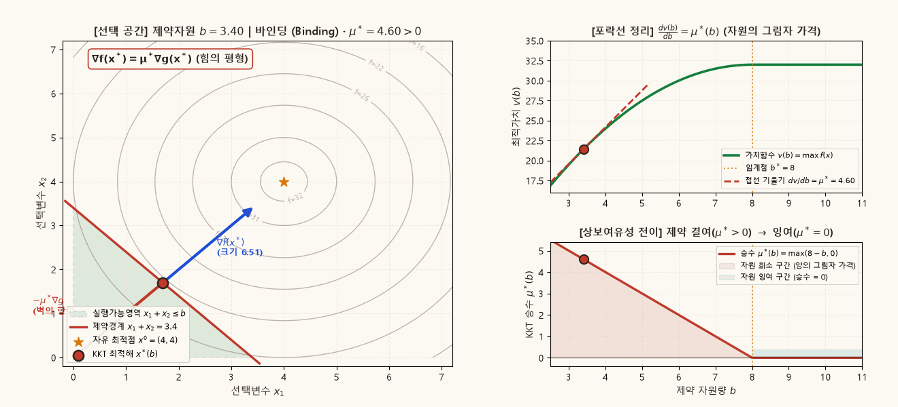
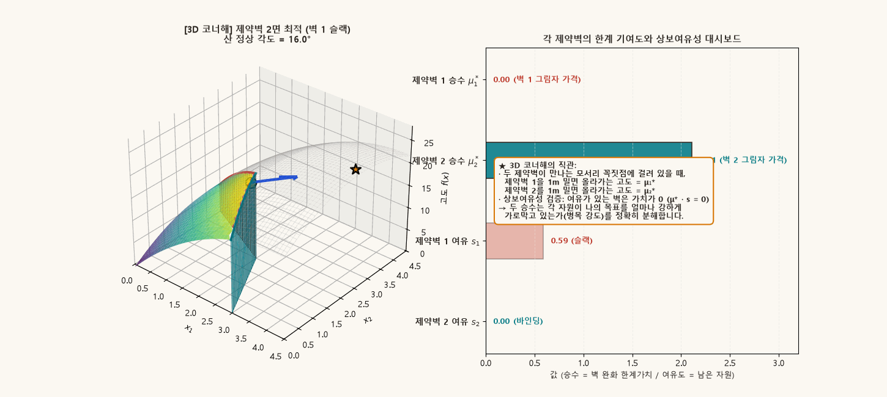

## 목적과 4대 핵심 최적화 명제

경제학의 거의 모든 현실적 의사결정은 **부등식 제약(Inequality Constraints)**에 의해 규정된다. 소비자의 지출은 소득을 초과할 수 없고($p \cdot x \le I$), 생산요소 투입량은 음수일 수 없으며($x \ge 0$), 금융시장의 차입은 담보가치로 제한된다. 등식제약이 해를 매끄러운 다양체(Surface/Manifold) 위에 묶어두는 반면, 부등식 제약은 닫힌 반공간들의 교집합인 **실행가능 영역(Feasible Set)**의 경계선뿐만 아니라 내부(Interior)까지 탐색 공간으로 허용한다.

부등식 제약 최적화의 정수인 **KKT(Karush–Kuhn–Tucker) 조건**과 **라그랑주 승수(Multiplier, $\mu^*$)**는 단순한 대수적 계산 공식이 아니다. 그것은 최적점에서 작용하는 **역학적 힘의 평형(Force Balance)**이자, 자원의 희소성이 완화될 때 주어지는 **잠재가격(Shadow Price)**의 기하학적 실체이다.

::: {.callout-note appearance="simple"}
### 부등식 제약 최적화와 승수 이론의 4대 핵심 명제

1. **접공간(Tangent Space)에서 실행가능 원뿔(Feasible Cone)로의 전이**:
   - 등식제약에서는 국소적 이동 방향이 선형 부분공간(접공간)에 갇히지만, 부등식 제약에서는 경계면에서 안쪽으로 들어가는 방향들까지 허용되어 **원뿔(Cone)** 구조를 형성한다.
   - 해의 위치에 따라 제약식이 등식으로 딱 맞물려 작용하는 **활성 집합(Active/Binding Set)**과 헐거운 여유를 갖는 **비활성 집합(Inactive/Slack Set)**으로 시스템이 동적으로 분해된다.

2. **KKT 조건의 본질: 법선 원뿔(Normal Cone)과 힘의 평형**:
   - 국소 최적점 $x^*$에서 목적함수가 더 높은 곳으로 상승하려는 견인력 벡터 $\nabla f(x^*)$는, 활성 제약들의 외향 법선벡터들이 형성하는 **비음 극원뿔(Normal Cone)** 내부에 포섭되어야 한다.
   - 이는 자유 극대점으로 나가려는 목적함수의 추진력과, 제약 경계를 뚫지 못하도록 밀어내는 벽의 **수직 반작용력 $-\sum \mu_j^* \nabla g_j(x^*)$이 완전히 상쇄(Stationarity)**됨을 뜻한다.

3. **승수(Multiplier, $\mu^*$)의 이중적 실체: 반작용력과 그림자 가격(Shadow Price)**:
   - **기하학적/역학적 실체**: 제약벽이 선택변수를 밀어내는 힘의 세기이다. 제약이 헐거우면(비활성) 벽에 닿지 않으므로 힘은 $0$($\mu^* = 0$, 상보여유성)이다.
   - **경제학적 실체 (포락선 정리, Envelope Theorem)**: 제약 자원 $b_j$가 1단위 완화될 때 목적함수 최적가치가 증가하는 한계가치($\frac{\partial v(b)}{\partial b_j} = \mu_j^*$)이다. 즉, 자원의 기회비용이자 지불의사액이다.

4. **제약자격(Constraint Qualifications, CQ)과 승수 붕괴의 방지**:
   - 국소 최적점이라 할지라도 제약면들이 비정상적으로 겹치거나 첨점(Cusp)을 형성하면, KKT 승수가 아예 존재하지 않는 수학적 퇴화가 발생할 수 있다.
   - 선형독립 제약자격(LICQ)과 볼록 최적화에서의 슬레이터 조건(Slater's Condition: 엄격 내부점의 존재)은 승수 표현의 정당성을 보장하는 절대적 안전장치이다.
:::

관련 교재 본문은 [경제학을 위한 수학 Chapter 06 · 최적화, KKT 조건과 Envelope 정리](../math-economics/ch06-optimization/index.qmd)에서 공리적 기초와 정리 증명을 다룬다.

---

## 1. 부등식 제약 최적화의 정식화와 활성 집합 (Active Set)

### 표준 최대화 문제 (Canonical Maximization Problem)

선택변수 $x \in \mathbb{R}^n$, 외생 매개변수 $\theta \in \Theta \subseteq \mathbb{R}^p$에 대해 $m$개의 등식제약과 $q$개의 부등식제약을 갖는 표준 최적화 문제는 다음과 같이 정식화된다:

$$
\begin{aligned}
\max_{x \in \mathbb{R}^n} \quad & f(x; \theta) \\
\text{s.t.} \quad & h_i(x; \theta) = 0, \quad i = 1, \ldots, m, \\
& g_j(x; \theta) \le b_j(\theta), \quad j = 1, \ldots, q.
\end{aligned}
$$

실행가능 영역(Feasible Set)을 $\mathcal{F}(\theta) \equiv \{ x \in \mathbb{R}^n \mid h(x; \theta) = 0, \; g(x; \theta) \le b(\theta) \}$라 하자.

### 활성 집합(Active Set)과 비활성 집합(Inactive Set)

실행가능한 점 $x \in \mathcal{F}(\theta)$에서 $q$개의 부등식 제약은 두 부류로 엄격히 양분된다:

1. **활성 제약 (Active / Binding Set)**:
   $$
   A(x) \equiv \{ j \in \{1, \ldots, q\} \mid g_j(x; \theta) = b_j(\theta) \}.
   $$
   부등식으로 주어졌으나 실제로는 경계선에 닿아 등식처럼 행동하는 제약들이다.
2. **비활성 제약 (Inactive / Slack Set)**:
   $$
   I(x) \equiv \{ j \in \{1, \ldots, q\} \mid g_j(x; \theta) < b_j(\theta) \}.
   $$
   여유(Slack $s_j = b_j - g_j(x) > 0$)가 남아 있어 국소적인 미세 섭동에 대해 아무런 벽으로 작용하지 않는 제약들이다.

### 접공간에서 실행가능 원뿔로의 확장

등식제약 $h(x) = 0$만 존재할 때, $x^*$에서의 국소 이동 방향 $d \in \mathbb{R}^n$은 $Dh(x^*) d = 0$을 만족해야 하므로 선형 부분공간인 **접공간(Tangent Space)** $T_{x^*}\mathcal{F}$를 형성한다.

반면 부등식 제약 $g_j(x) \le b_j$의 경우, 활성 제약 $j \in A(x^*)$에 대해 허용되는 1계 방향은 바깥으로 나가지 않는 방향($\nabla g_j(x^*)^\top d \le 0$)뿐이다. 따라서 실행가능 방향들의 모임은 부분공간이 아니라 **원뿔(Cone)**을 형성한다:

$$
T_{\mathcal{F}}(x^*) = \{ d \in \mathbb{R}^n \mid Dh(x^*) d = 0, \;\; \forall j \in A(x^*): \nabla g_j(x^*)^\top d \le 0 \}.
$$

KKT 조건은 바로 이 실행가능 원뿔의 기하학적 구조를 쌍대 승수(Dual Multiplier)로 번역한 1계 필요조건이다.

---

## 2. Karush–Kuhn–Tucker (KKT) 조건과 그래디언트 원뿔

::: {.callout-important appearance="simple"}
### 정리: 정규성 하에서의 KKT 1계 필요조건 (Theorem of Karush–Kuhn–Tucker)

목적함수와 제약함수들이 $C^1$급이고, $x^* \in \mathcal{F}$가 국소 극대해(Local Maximizer)이며, 활성 제약들에 대해 **제약자격(Constraint Qualification)**이 성립한다고 하자.

그러면 등식제약 승수 벡터 $\lambda^* \in \mathbb{R}^m$와 부등식제약 승수 벡터 $\mu^* \in \mathbb{R}^q$가 존재하여 다음 4대 KKT 시스템을 만족한다:

$$
\begin{aligned}
\text{1. 정류성 (Stationarity):}\quad & \nabla f(x^*) - \sum_{i=1}^m \lambda_i^* \nabla h_i(x^*) - \sum_{j=1}^q \mu_j^* \nabla g_j(x^*) = 0, \\[2mm]
\text{2. 원시 실행가능성 (Primal Feasibility):}\quad & h_i(x^*) = 0 \; (\forall i), \qquad g_j(x^*) \le b_j \; (\forall j), \\[2mm]
\text{3. 쌍대 실행가능성 (Dual Feasibility):}\quad & \mu_j^* \ge 0 \quad (\forall j = 1, \ldots, q), \\[2mm]
\text{4. 상보여유성 (Complementary Slackness):}\quad & \mu_j^* \cdot \big[ b_j - g_j(x^*) \big] = 0 \quad (\forall j = 1, \ldots, q).
\end{aligned}
$$
:::

### 상보여유성(Complementary Slackness)의 함의

상보여유성 조건은 각 부등식 제약에 대해 승수와 여유도의 곱이 정확히 $0$이어야 함을 명시한다. 따라서 다음의 양자택일이 항등적으로 성립한다:

$$
\begin{aligned}
b_j - g_j(x^*) > 0 \;\text{(여유 자원 존재)} \quad &\Longrightarrow \quad \mu_j^* = 0 \;\text{(자원의 잠재가치는 0)}, \\
\mu_j^* > 0 \;\text{(자원의 잠재가치 존재)} \quad &\Longrightarrow \quad g_j(x^*) = b_j \;\text{(제약이 완전히 바인딩됨)}.
\end{aligned}
$$

- **엄격 상보성 (Strict Complementarity)**: $g_j(x^*) = b_j \iff \mu_j^* > 0$가 성립하여, 활성 제약의 승수가 결코 $0$이 되지 않는 정상적인 상태를 말한다.
- **퇴화 KKT 점 (Degenerate KKT Point)**: $g_j(x^*) = b_j$이면서 동시에 $\mu_j^* = 0$인 경우로, 제약 경계선에 우연히 접했으나 제약을 약간 밀어내도 목적함수값에 즉각적인 이득이 없는 임계 상태를 가리킨다.

---

## 3. 동적 시각화 1: 3D 곡면과 수직 제약벽 — 산 정상을 향한 오르막 경사와 승수 $\mu^*$ (그림자 가격)

승수(Multiplier, $\mu^*$)의 직관을 가장 명쾌하게 이해하는 방법은 **3차원 지형(Mountain Surface)과 수직 장벽(Vertical Barrier Wall)**의 비유이다. 

우리가 도달하고 싶은 목적함수는 3차원 공간에 솟아 있는 산($z = f(x_1, x_2)$)이고, 산의 정상은 자유 극대점 $x^0 = (4, 4)$이다. 이때 자원 제약 $x_1 + x_2 \le b$는 지표면에서 수직으로 솟아올라 산을 가로지르는 **수직 제약벽(붉은 장벽 커튼)**으로 작용한다.

아래 시뮬레이션은 자원 한도 $b$가 완화됨에 따라 수직 제약벽이 산 정상을 향해 전진할 때, **최적점 $x^*(b)$의 이동과 산 정상을 향한 오르막 경사(승수 $\mu^* = \frac{dz}{db}$)**가 어떻게 작동하는지 3D 곡면과 2D 수직 단면도로 동시에 규명한다.

- **목적함수 (3D 산)**: 엄격오목 2차 효용 $f(x_1, x_2) = -(x_1 - 4)^2 - (x_2 - 4)^2 + 32$ (산 정상 $x^0 = (4, 4)$, 최대 고도 $z = 32$).
- **수직 제약벽**: $x_1 + x_2 \le b$ ($b$를 $3.4$에서 $9.6$까지 확장).

{.supplement-graphic fig-alt="3D 효용 곡면을 가로지르는 수직 제약벽 위의 최고점과 산 정상을 향한 오르막 경사가 라그랑주 승수이자 그림자 가격임을 입증하는 동적 시뮬레이션"}

### 도표 독해 가이드

#### 1. 좌측 패널: 3D 곡면과 전진하는 수직 제약벽
- **허용된 산 표면 vs 금지된 산 표면**:
  - 제약벽 안쪽의 실행가능한 영역은 **컬러 곡면(Viridis)**으로, 제약벽 바깥의 금지된 영역은 **반투명 회색 와이어프레임**으로 표시된다.
- **수직 제약벽(붉은 커튼)과 단면선(Slice Curve)**:
  - 수직 붉은 벽이 산을 칼로 자르듯 가로지르며, 벽의 윗모서리에 붉은 단면 곡선이 형성된다.
  - 최적해 $x^*(b)$는 바로 이 **수직 제약벽 위에서 가장 높은 고도를 갖는 점(붉은 원 마커)**이다.
- **오르막 경사 벡터(청색 화살표)**:
  - 최적점에서 벽을 따라 좌우로 움직이면 고도가 낮아지지만(단면선 최고점이므로), **벽 너머 산 정상을 수직으로 올려다보면 가파른 오르막길(청색 화살표)**이 이어진다.
  - 이 오르막 경사의 가파른 정도가 바로 **라그랑주 승수 $\mu^*$**이다.
- **자원 완화 동학**:
  - $b$가 커질수록 수직 벽이 산 정상(황금색 별표, $z=32$)을 향해 전진한다.
  - 벽 위의 최고점 고도가 점점 높아지며, 정상에 가까워질수록 오르막길이 완만해져 **승수 $\mu^* = 8 - b$가 점차 감소**한다.
  - $b \ge 8.0$이 되는 순간, 산 정상 자체가 벽 안쪽으로 들어온다. 이제 최적점은 벽을 벗어나 산 정상에 도달하며, 정상의 경사는 평평하므로 **승수는 $\mu^* = 0$**으로 소멸한다.

#### 2. 우측 패널: 2D 대각선 수직 단면 투영도 (그림자 가격의 수학적 실체)
- 산을 대각선 방향($x_1 = x_2 = r$)으로 수직 절단한 고도 프로파일 곡선 $z(r) = -2(r-4)^2 + 32$이다.
- **수직 붉은 선**: 제약벽의 위치 $r_{\text{wall}} = b/2$이다. 녹색 영역은 갈 수 있는 곳, 우측 흰 영역은 금지된 곳이다.
- **파란 점선 (접선의 기울기)**:
  - 벽 위치에서의 산의 오르막 경사이다:
    $$
    \mu^* = \frac{dv(b)}{db} = \frac{1}{2} \frac{dz}{dr} = 8 - b.
    $$
  - **직관적 핵심**: "벽을 오른쪽으로 1단위 밀어주면(자원 $b$를 1단위 더 주면), 나는 파란 점선의 기울기만큼 더 높은 고도로 올라갈 수 있다."
  - 따라서 **승수 $\mu^*$는 자원을 1단위 얻었을 때 얻을 수 있는 고도 증가율, 즉 자원의 그림자 가격(Shadow Price)**이다.
- **상보여유성(Complementary Slackness)**:
  - 산 정상(별표, $r=4$)을 지나쳐 벽이 $r > 4$ ($b > 8$)로 밀려나면, 우리는 이미 정상에 서 있으므로 벽을 더 밀어줘도 고도가 $1\text{mm}$도 오르지 않는다 ($\mu^* = 0$).

---

## 4. 동적 시각화 2: 3D 코너해 — 두 개의 수직 제약벽이 만나는 모서리와 승수 분해

현실에서는 여러 자원이 동시에 한계를 맞이한다. 3차원 공간에서 두 개의 부등식 제약은 **서로 비스듬히 교차하는 두 개의 수직 제약벽(Wall 1: 붉은 벽, Wall 2: 청록색 벽)**으로 나타나며, 두 벽이 만나는 곳에 **수직 모서리(Corner/Vertex)**가 형성된다.

아래 시뮬레이션은 산 정상(목표 지향점)이 회전할 때, **모서리 꼭짓점 $(2, 2)$에 갇힌 최적해에서 두 제약벽의 승수 $(\mu_1^*, \mu_2^*)$가 어떻게 각 벽의 병목 기여도를 분해하는지**를 보여준다.

- **제약벽 1 (붉은 벽)**: $x_1 + 2x_2 \le 6$ (법선 경사각 $63.4^\circ$).
- **제약벽 2 (청록색 벽)**: $2x_1 + x_2 \le 6$ (법선 경사각 $26.6^\circ$).
- **교차 모서리 꼭짓점**: $(x_1, x_2) = (2, 2)$.

{.supplement-graphic fig-alt="두 수직 제약벽이 교차하는 모서리에 갇힌 3D 코너해에서 두 승수로 분해되는 병목 기여도와 상보여유성 막대그래프 동학"}

### 도표 독해 가이드

#### 1. 좌측 패널: 두 제약벽의 교차와 3D 모서리 해
- **두 개의 수직 벽**:
  - 붉은 벽(제약 1)과 청록색 벽(제약 2)이 $V$자형 골짜기를 형성하며 산을 가로막고 있다.
  - 두 벽이 교차하는 모서리 위의 꼭짓점 $(2, 2, z_c)$(황금색 원 마커)이 최적점이 된다.
- **산 정상(황금색 별표)의 회전과 세 가지 국면**:
  1. **산 정상이 2번 벽 쪽으로 치우칠 때 ($\theta < 26.6^\circ$)**:
     - 최적해는 모서리를 벗어나 청록색 2번 벽의 면을 타고 이동한다.
     - 1번 벽은 닿지 않는 슬랙($s_1 > 0$)이므로 **$\mu_1^* = 0, \mu_2^* > 0$**이다.
  2. **산 정상이 두 벽의 모서리 방향을 향할 때 ($26.6^\circ \le \theta \le 63.4^\circ$, 코너해)**:
     - 최적점은 두 벽이 단단히 맞물린 **모서리 꼭짓점 $(2, 2)$에 고정**된다!
     - 모서리에서 산 정상을 올려다보는 경사(청색 화살표)는 두 벽 너머로 솟아 있다.
     - 이때 **$\mu_1^*$은 '1번 붉은 벽을 1m 밀어냈을 때 올라가는 추가 고도'**이고, **$\mu_2^*$는 '2번 청록색 벽을 1m 밀어냈을 때 올라가는 추가 고도'**이다.
     - 두 승수는 청색 화살표를 두 벽의 수직 방향으로 분해한 크기이며, 두 자원의 상대적 병목 강도를 나타낸다.
  3. **산 정상이 1번 벽 쪽으로 치우칠 때 ($\theta > 63.4^\circ$)**:
     - 최적해는 붉은 1번 벽의 면을 타고 이동한다.
     - 2번 벽은 슬랙($s_2 > 0$)이 되므로 **$\mu_1^* > 0, \mu_2^* = 0$**이다.

#### 2. 우측 패널: 각 제약벽의 한계 기여도와 상보여유성 대시보드
- 상단 2개 막대는 **KKT 승수(자원의 그림자 가격 $\mu_1^*, \mu_2^*$)**, 하단 2개 막대는 **제약의 여유도(남은 자원 $s_1, s_2$)**이다.
- **상보여유성 원리의 시각적 각인**:
  - $s_1 > 0$ (1번 자원이 남음) $\implies \mu_1^* = 0$ (1번 자원의 추가 공급 가치는 0).
  - $s_2 > 0$ (2번 자원이 남음) $\implies \mu_2^* = 0$ (2번 자원의 추가 공급 가치는 0).
  - 둘 다 바인딩($s_1 = 0, s_2 = 0$, 코너해) $\implies$ 두 자원이 모두 희소하므로 둘 다 양의 그림자 가격($\mu_1^* > 0, \mu_2^* > 0$)을 갖는다.
- 이 대시보드를 통해 **"어느 벽이 나의 성공을 더 가로막고 있는가(병목 강도)"**를 정량적으로 비교할 수 있다.

---

## 5. 제약자격(Constraint Qualifications)과 승수 존재의 위기

KKT 조건은 모든 최적점에서 무조건 성립하는 만병통치약이 아니다. 실행가능영역의 경계면이 미분기하학적으로 비정상적이거나 첨점(Cusp)을 형성하면, **명백한 국소 최적점임에도 KKT 승수가 아예 존재하지 않는 치명적 실패**가 발생한다.

### 고전적 반례: Kuhn–Tucker 첨점(Cusp) 문제

다음의 2차원 최적화 문제를 생각하자:

$$
\max_{x \in \mathbb{R}^2} \quad x_1 \qquad \text{s.t.} \quad g_1(x) = x_2 - (1 - x_1)^3 \le 0, \quad g_2(x) = -x_2 \le 0.
$$

1. **최적해의 기하학**:
   - $x_2 \ge 0$이고 $x_2 \le (1 - x_1)^3$이므로, 실행가능영역은 점 $(1, 0)$을 향해 바늘처럼 뾰족하게 모여드는 쐐기(첨점) 형태이다.
   - $x_1$을 극대화하는 실행가능한 최적점은 명백히 **$x^* = (1, 0)$**이며, 이때의 최댓값은 $1$이다.
2. **KKT 조건의 검증**:
   - 최적점 $x^* = (1, 0)$에서 두 제약의 그래디언트를 계산하면:
     $$
     \nabla g_1(x^*) = \begin{pmatrix} 3(1 - x_1)^2 \\ 1 \end{pmatrix}_{(1,0)} = \begin{pmatrix} 0 \\ 1 \end{pmatrix}, \qquad \nabla g_2(x^*) = \begin{pmatrix} 0 \\ -1 \end{pmatrix}.
     $$
   - 두 그래디언트가 모두 $x_2$축(수직) 방향으로 일직선상에 놓여 서로 반대를 가리킨다.
   - 목적함수의 그래디언트는 수평 방향이다: $\nabla f(x^*) = \begin{pmatrix} 1 \\ 0 \end{pmatrix}$.
   - KKT 정류성 조건을 세우면:
     $$
     \nabla f(x^*) - \mu_1 \nabla g_1(x^*) - \mu_2 \nabla g_2(x^*) = \begin{pmatrix} 1 \\ 0 \end{pmatrix} - \mu_1 \begin{pmatrix} 0 \\ 1 \end{pmatrix} - \mu_2 \begin{pmatrix} 0 \\ -1 \end{pmatrix} = \begin{pmatrix} 1 \\ -\mu_1 + \mu_2 \end{pmatrix} = \begin{pmatrix} 0 \\ 0 \end{pmatrix}.
     $$
   - 첫 번째 성분에서 **$1 = 0$이라는 모순**이 도출된다! 어떤 실수 $\mu_1, \mu_2 \ge 0$를 가져와도 정류성을 만족시킬 수 없다.

### 왜 실패하는가? 선형독립 제약자격(LICQ)의 위반

위 반례에서 두 활성 제약의 그래디언트 벡터 $\{\nabla g_1(x^*), \nabla g_2(x^*)\} = \{(0, 1), (0, -1)\}$은 선형종속($1 \cdot \nabla g_1 + 1 \cdot \nabla g_2 = 0$)이다. 즉, **선형독립 제약자격(LICQ)이 위반**되었다. 제약 경계선들의 1계 선형 근사가 실제 영역의 접선 원뿔(Tangent Cone)을 제대로 반영하지 못하고 1차원 직선으로 퇴화해 버렸기 때문에 승수 표현이 붕괴한 것이다.

### 주요 제약자격(Constraint Qualifications)의 위계

수리경제학에서는 KKT 승수의 존재를 보장하기 위해 다음 조건들 중 하나를 요구한다:

1. **LICQ (Linear Independence Constraint Qualification)**:
   - 활성 제약들의 그래디언트 벡터 군 $\{\nabla h_i(x^*)\}_{i=1}^m \cup \{\nabla g_j(x^*)\}_{j \in A(x^*)}$이 선형독립이다. 가장 강력하며 유일한 승수를 보장한다.
2. **MFCQ (Mangasarian–Fromovitz Constraint Qualification)**:
   - 등식제약의 그래디언트들이 선형독립이고, 모든 활성 부등식제약에 대해 $\nabla g_j(x^*)^\top d < 0$을 만족하는 엄격 내향 실행가능 벡터 $d$가 존재한다. 승수 집합의 유계성(Compactness)과 동치이다.
3. **Slater 조건 (볼록 최적화에서의 엄격 내부점)**:
   - 목적함수와 무관하게, 모든 부등식 제약 $g_j$가 볼록함수일 때 **엄격한 내부점 $\exists \bar{x}$ s.t. $g_j(\bar{x}) < b_j \; (\forall j)$**이 존재하기만 하면 된다. 경제학의 볼록 모형에서 가장 실용적으로 활용되는 조건이다.

---

## 6. 오목 최적화(Concave Programming)에서의 KKT 충분조건

일반적인 비선형 최적화에서 KKT 조건은 **필요조건**일 뿐, 국소 안장점이나 극소점에서도 만족될 수 있다. 그러나 경제학에서 흔히 다루는 **오목 극대화(또는 볼록 극소화)** 체계에서는 KKT 조건이 **대역적 대역 극대해(Global Optimum)를 보장하는 강력한 충분조건**이 된다.

::: {.callout-note appearance="simple"}
### 정리: 오목 최적화에서의 KKT 충분성 (Theorem 6.11)

문제 $\max f(x) \text{ s.t. } h(x) = 0, \; g(x) \le b$에서 다음을 가정하자:

1. 목적함수 $f: \mathbb{R}^n \to \mathbb{R}$는 오목함수(Concave)이다.
2. 각 부등식 제약함수 $g_j: \mathbb{R}^n \to \mathbb{R}$는 볼록함수(Convex)이다 (즉 $-g_j$는 오목).
3. 등식 제약함수 $h_i: \mathbb{R}^n \to \mathbb{R}$는 아핀함수(Affine: $h_i(x) = a_i^\top x - c_i$)이다.

만약 실행가능한 점 $x^* \in \mathcal{F}$와 승수 $(\lambda^*, \mu^*)$가 KKT 조건(정류성, 쌍대 비음성, 상보여유성)을 만족한다면, **$x^*$는 전체 실행가능영역 $\mathcal{F}$에서의 전역 극대해(Global Maximizer)**이다.
:::

### 증명 (Proof)

임의의 다른 실행가능한 점 $x \in \mathcal{F}$를 잡는다. $f$가 오목함수이므로 일계 미분 특성화에 의해:

$$
f(x) - f(x^*) \le \nabla f(x^*)^\top (x - x^*).
$$

KKT 정류성 $\nabla f(x^*) = \sum_{i=1}^m \lambda_i^* \nabla h_i(x^*) + \sum_{j=1}^q \mu_j^* \nabla g_j(x^*)$를 우변에 대입하면:

$$
f(x) - f(x^*) \le \sum_{i=1}^m \lambda_i^* \nabla h_i(x^*)^\top (x - x^*) + \sum_{j=1}^q \mu_j^* \nabla g_j(x^*)^\top (x - x^*).
$$

1. $h_i$가 아핀이므로 $\nabla h_i(x^*)^\top (x - x^*) = h_i(x) - h_i(x^*) = 0 - 0 = 0$.
2. $g_j$가 볼록함수이므로 $\nabla g_j(x^*)^\top (x - x^*) \le g_j(x) - g_j(x^*)$.
3. 승수가 비음($\mu_j^* \ge 0$)이고, $x$가 실행가능($g_j(x) \le b_j$)하며, 상보여유성($\mu_j^* g_j(x^*) = \mu_j^* b_j$)이 성립하므로:
   $$
   \mu_j^* \nabla g_j(x^*)^\top (x - x^*) \le \mu_j^* [g_j(x) - g_j(x^*)] = \mu_j^* g_j(x) - \mu_j^* b_j \le \mu_j^* b_j - \mu_j^* b_j = 0.
   $$

따라서 모든 항이 $0$ 이하가 되어 $f(x) - f(x^*) \le 0 \implies f(x) \le f(x^*)$가 성립한다. ■

---

## 7. 경제학적 응용과 심화 통찰

### 1. 비음 제약과 Kuhn–Tucker 축약 부등식 체계

경제학 변수(소비량, 생산량, 노동시간 등)는 음수가 될 수 없다($x_i \ge 0$). 이를 개별 제약으로 넣는 대신, 라그랑지안 $\mathcal{L}(x, \lambda) = f(x) - \lambda^\top h(x)$에 대해 비음 조건을 흡수한 **축약형 Kuhn–Tucker 부등식 조건**이 표준적으로 사용된다:

$$
\frac{\partial \mathcal{L}}{\partial x_i} \le 0, \qquad x_i \ge 0, \qquad x_i \frac{\partial \mathcal{L}}{\partial x_i} = 0.
$$

- 만약 최적 소비량 $x_i^* > 0$ (내부해)라면 $\frac{\partial \mathcal{L}}{\partial x_i} = 0$이 되어 통상적인 한계효용 균등 원리가 성립한다.
- 만약 $\frac{\partial \mathcal{L}}{\partial x_i} < 0$ (재화의 가격 대비 한계효용이 시장보다 낮음)이라면, 상보여유성에 의해 **$x_i^* = 0$ (코너해, 재화를 전혀 소비하지 않음)**이 도출된다.

### 2. 거시경제학 차입 제약과 오일러 방정식 쐐기 (Euler Equation Wedge)

2기간 소비-저축 모형에서 소비자의 효용함수가 $u(c_1) + \beta u(c_2)$이고, 1기 소득 $y_1$ 하에서 차입 제약(Borrowing Constraint) $c_1 \le y_1$ (즉 저축 $s \ge 0$)이 부과되었다고 하자:

$$
\mathcal{L} = u(c_1) + \beta u(y_2 + (1+r)(y_1 - c_1)) + \mu [y_1 - c_1].
$$

1기 소비 $c_1$에 대한 1계조건은 다음과 같다:

$$
u'(c_1) = \beta (1+r) u'(c_2) + \mu.
$$

- **차입 제약이 헐거울 때 ($\mu = 0$)**: 표준 오일러 방정식 $u'(c_1) = \beta (1+r) u'(c_2)$이 성립하여 완벽한 기간간 소비 평활화가 달성된다.
- **차입 제약이 바인딩될 때 ($\mu > 0$)**: $u'(c_1) > \beta (1+r) u'(c_2)$가 된다! 현재 소비의 한계효용이 미래 소비의 할인된 한계효용보다 훨씬 높지만, 돈을 빌릴 수 없어 현재 소비가 제약된다. 이때 **승수 $\mu$는 금융시장의 유동성 제약이 초래한 '기간간 왜곡 쐐기(Intertemporal Wedge)'이자 대출 1단위에 대해 지불할 용의가 있는 그림자 이자율 프리미엄**을 정확히 측정한다.

---

## 8. 연습문제 및 개념 점검

::: {.callout-tip appearance="simple"}
### 연습문제 1: KKT 조건과 그림자 가격의 계산

2변수 효용극대화 문제 $\max_{x_1, x_2} \ln x_1 + 2 \ln x_2$를 생각하자. 제약조건은 예산제약 $x_1 + x_2 \le I$와 당국의 배급제약 $x_2 \le K$ ($I, K > 0$)이다.

1. 배급한도 $K$와 소득 $I$의 상대적 크기에 따라 활성 집합 $A(x^*)$가 어떻게 달라지는지 2가지 경우로 분류하라.
2. $K < \frac{2}{3}I$인 경우의 최적해 $(x_1^*, x_2^*)$와 각 제약의 KKT 승수 $(\mu_I^*, \mu_K^*)$를 구하라.
3. 포락선 정리 $\frac{\partial v}{\partial K} = \mu_K^*$가 성립함을 가치함수를 직접 미분하여 대수적으로 검증하라.
:::

::: {.callout-tip appearance="simple"}
### 연습문제 2: Slater 조건과 LICQ의 비교

비선형 최적화 문제 $\min_{x_1, x_2} (x_1 - 2)^2 + (x_2 - 2)^2$ s.t. $x_1^2 + x_2^2 \le 2$, $x_1 + x_2 \le 2$를 분석하라.

1. 최적해 $x^*$를 구하고, 최적점에서 활성화되는 제약들을 명시하라.
2. 최적점에서 LICQ가 성립하는지 판정하라. 만약 성립하지 않는다면 Slater 조건은 성립하는지 확인하라.
3. KKT 승수 벡터가 유일하게 결정되는지, 아니면 무수히 많은 승수 해가 존재하는지 기하학적으로 설명하라.
:::

---

## 참고문헌 및 관련 챕터

- **본문 연계**:
  - [Chapter 06 · 최적화, KKT 조건과 Envelope 정리](../math-economics/ch06-optimization/index.qmd)
  - [Chapter 05 · 볼록집합과 볼록함수](../math-economics/ch05-convexity/index.qmd)
  - [Chapter 07 · 대응과 최대정리](../math-economics/ch07-correspondences/index.qmd)
- **주요 교재**:
  - Carl P. Simon and Lawrence Blume, *Mathematics for Economists*, W. W. Norton & Company, Chapters 18–19.
  - Rangarajan K. Sundaram, *A First Course in Optimization Theory*, Cambridge University Press, Chapters 5–7.
  - Angel de la Fuente, *Mathematical Methods and Models for Economists*, Cambridge University Press, Chapter 7.
