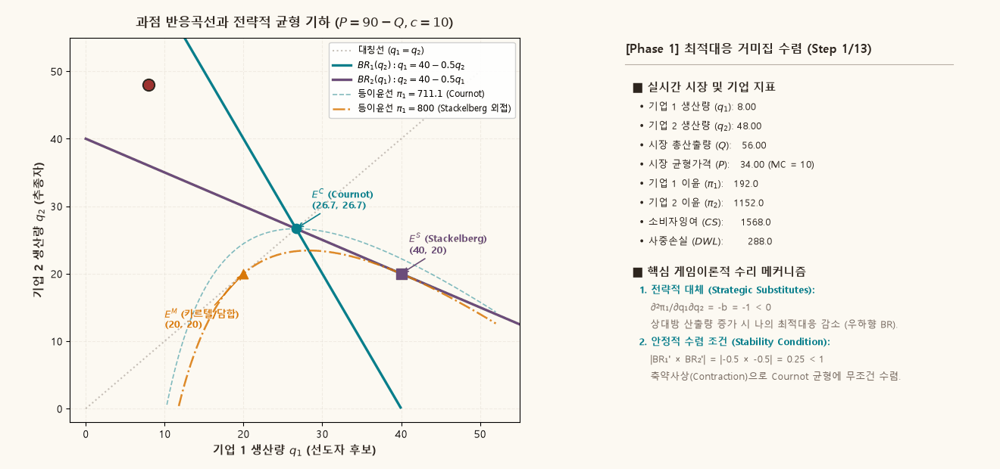
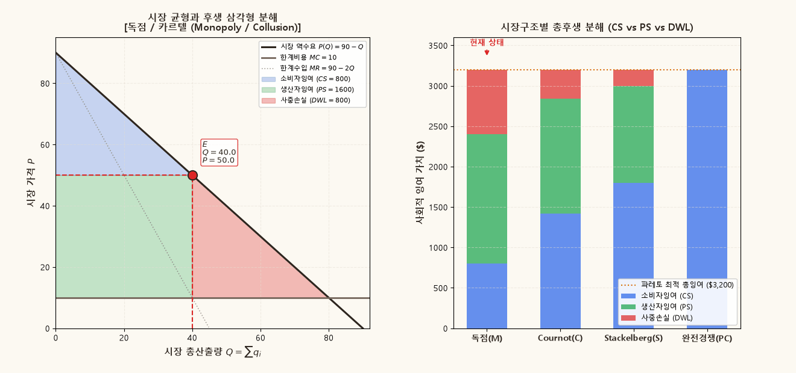

## 1. 개요: 전략적 상호작용과 과점 시장구조

완전경쟁 시장에서 개별 기업은 시장가격에 아무런 영향을 미치지 못하는 가격수용자(Price Taker)이며, 순수 독점 시장에서 단일 기업은 전체 시장수요를 독점적으로 마주하는 가격설정자(Price Setter)이다. 그러나 현실 산업 조직의 대다수를 차지하는 **과점(Oligopoly)** 시장에서는 소수의 대기업들이 서로의 행동을 상호 주시하며 의사결정을 내리는 **전략적 상호의존성(Strategic Interdependence)**이 지배적이다.

어떤 기업의 최적 행동(산출량 또는 가격)은 경쟁 기업이 어떤 선택을 내릴 것인지에 대한 기대에 의존하며, 역으로 자신의 행동 또한 경쟁자의 이윤과 시장 균형을 변화시킨다. 따라서 과점 시장 분석은 미시경제학적 최적화 이론과 비협조 게임이론(Non-cooperative Game Theory)의 필연적인 결합을 요구한다.

본 보충자료는 동일한 시장 수요 및 비용 구조 아래에서 기업들의 전략적 행동 규약(Conduct)이 어떻게 상이한 시장 균형과 후생 결과를 초래하는지 기하학적·동적으로 규명한다:

1. **행동변수의 차이 (수량 vs 가격)**:
   - **Cournot 모형**: 기업들이 산출량(Quantity)을 행동변수로 선택하며, 잔여수요(Residual Demand) 곡선에 기초하여 최적대응을 결정한다.
   - **Bertrand 모형**: 기업들이 가격(Price)을 행동변수로 선택하며, 균일재 환경에서는 치열한 가격 인하 경쟁을 통해 완전경쟁 균형으로 귀결된다.
2. **의사결정 순서의 차이 (동시 vs 순차)**:
   - **Stackelberg 모형**: 선도자(Leader)가 먼저 산출량을 공약(Commitment)하고 추종자(Follower)가 이에 반응할 때, 선도자가 어떻게 추종자의 반응함수를 내부화하여 **선도자 우위(First-Mover Advantage)**를 획득하는지 등이윤곡선의 외접 기하학으로 증명한다.
3. **동학적 안정성과 수렴 (Best-Response Dynamics)**:
   - 임의의 불균형 상태에서 출발했을 때, 기업들의 적응적 최적대응이 Cournot-Nash 균형으로 수렴하기 위한 조건과 위상 평면 거미집 궤적을 분석한다.
4. **사회적 후생(CS, PS, DWL)의 서열**:
   - 독점/담합(Collusion), Cournot, Stackelberg, Bertrand/완전경쟁 시장구조 간의 자원배분 효율성을 비교하고, Cournot 시장에서 기업 수 $N \to \infty$ 극한에서 발생하는 완전경쟁 수렴 정리를 규명한다.

---

## 2. 동시 수량경쟁: Cournot 모형과 최적대응 (Best Response)

### 잔여수요와 개별 이윤극대화

시장 역수요함수가 $P(Q) = a - bQ$ ($a > 0, b > 0$)로 주어지고, 2개의 대칭 기업이 일정한 한계비용 $c$ ($a > c > 0$)로 생산한다고 하자. 총산출량은 $Q = q_1 + q_2$이다.

기업 1이 관측하거나 기대하는 기업 2의 산출량을 $q_2$라 할 때, 기업 1이 직면하는 **잔여수요(Residual Demand)** 함수는 다음과 같다:

$$
P_1(q_1; q_2) = (a - bq_2) - bq_1.
$$

기업 1의 이윤극대화 문제는 다음과 같이 정의된다:

$$
\max_{q_1 \ge 0} \pi_1(q_1, q_2) = \left[ (a - b(q_1 + q_2)) - c \right] q_1.
$$

내부해($q_1 > 0$)에서의 1계 조건(First-Order Condition)은 한계수입과 한계비용의 일치이다:

$$
\frac{\partial \pi_1}{\partial q_1} = (a - b q_2) - 2b q_1 - c = 0.
$$

이를 $q_1$에 대해 정리하면 기업 1의 **최적대응함수(Best-Response Function)**를 얻는다:

$$
BR_1(q_2) = \frac{a - c - b q_2}{2b}.
$$

동일한 방식으로 기업 2의 최적대응함수는 다음과 같이 대칭적으로 도출된다:

$$
BR_2(q_1) = \frac{a - c - b q_1}{2b}.
$$

::: {.callout-important appearance="simple"}
### 정의 2.1 · 전략적 대체 (Strategic Substitutes)

최적대응함수의 미분값은 다음과 같이 음수를 갖는다:
$$
\frac{\partial BR_1(q_2)}{\partial q_2} = -\frac{1}{2} < 0, \qquad \frac{\partial BR_2(q_1)}{\partial q_1} = -\frac{1}{2} < 0.
$$
경쟁 상대가 산출량을 1단위 증가시키면 시장가격이 하락하여 자신의 잔여 한계수입이 감소하므로, 자신의 최적 산출량을 0.5단위 축소한다. 게임이론에서 목적함수의 2계 교차편미분이 음수($\frac{\partial^2 \pi_i}{\partial q_i \partial q_j} = -b < 0$)인 관계를 **전략적 대체(Strategic Substitutes)**라 부른다.
:::

### 등이윤곡선(Isoprofit Curve)의 기하학

기업 1의 등이윤곡선은 특정한 이윤 수준 $\bar{\pi}_1$을 달성하는 평면 $(q_1, q_2)$ 상의 점들의 궤적으로 정의된다:

$$
\pi_1(q_1, q_2) = (a - c - b(q_1 + q_2)) q_1 = \bar{\pi}_1 \iff q_2 = \frac{a - c}{b} - q_1 - \frac{\bar{\pi}_1}{b q_1}.
$$

이 곡선의 접선 기울기는 음함수 미분에 의해 다음과 같이 주어진다:

$$
\left. \frac{dq_2}{dq_1} \right|_{\pi_1 = \bar{\pi}_1} = -\frac{\partial \pi_1 / \partial q_1}{\partial \pi_1 / \partial q_2} = \frac{(a - c - b q_2) - 2b q_1}{b q_1}.
$$

등이윤곡선이 수평 접선($dq_2 / dq_1 = 0$)을 갖는 극값 조건은 정확히 1계 조건 $\partial \pi_1 / \partial q_1 = 0$, 즉 $q_1 = BR_1(q_2)$와 일치한다. 따라서:

- 주어진 $q_2$에 대해 기업 1의 등이윤곡선의 **가장 높은(또는 수평 접선을 갖는) 정점들의 자취가 바로 기업 1의 최적대응선 $BR_1$**이다.
- 기업 1에게 상대방의 생산량 $q_2$가 적을수록 시장가격이 높아지므로, **아래쪽(원점에 가까운 $q_2$)에 위치한 등이윤곡선일수록 더 높은 이윤**을 나타낸다.

### Cournot-Nash 균형의 결정

Cournot 균형은 두 기업이 동시에 상호 최적대응을 달성하는 고정점(Fixed Point) $q_1^C = BR_1(q_2^C)$, $q_2^C = BR_2(q_1^C)$로 결정된다:

$$
q_1^C = \frac{a - c - b q_2^C}{2b}, \qquad q_2^C = \frac{a - c - b q_1^C}{2b}.
$$

연립방정식을 풀면 대칭 Cournot 균형 산출량, 시장 총산출량, 균형가격, 개별 이윤이 도출된다:

$$
q_1^C = q_2^C = \frac{a - c}{3b}, \qquad Q^C = \frac{2(a - c)}{3b}, \qquad P^C = \frac{a + 2c}{3}, \qquad \pi_1^C = \pi_2^C = \frac{(a - c)^2}{9b}.
$$

---

## 3. 순차 수량경쟁: Stackelberg 선도-추종 모형

### 역진귀납법(Backward Induction)과 하위게임 완전균형

순차적 의사결정 게임에서는 기업 1이 먼저 산출량 $q_1$을 시장에 공약(Commitment)하는 **선도자(Leader)**이고, 기업 2는 선도자의 산출량을 관찰한 뒤 자신의 산출량 $q_2$를 결정하는 **추종자(Follower)**이다.

이 동적 게임의 하위게임 완전 내쉬균형(SPNE)은 역진귀납법(Backward Induction)으로 도출된다:

1. **2단계 (추종자의 반응)**:
   추종자인 기업 2는 이미 결정된 $q_1$을 상수로 받아들이고 자신의 1계 조건을 푼다:
   $$
   q_2^*(q_1) = BR_2(q_1) = \frac{a - c - b q_1}{2b}.
   $$
2. **1단계 (선도자의 최적화)**:
   선도자인 기업 1은 추종자의 반응함수 $q_2 = BR_2(q_1)$을 시장수요에 사전에 대입하여 자신의 이윤을 극대화한다:
   $$
   \max_{q_1 \ge 0} \pi_1(q_1, BR_2(q_1)) = \left[ a - b\left( q_1 + \frac{a - c - b q_1}{2b} \right) - c \right] q_1 = \left( \frac{a - c - b q_1}{2} \right) q_1.
   $$

1계 조건을 취하면:

$$
\frac{d \pi_1}{d q_1} = \frac{a - c}{2} - b q_1 = 0 \implies q_1^S = \frac{a - c}{2b}.
$$

이에 따른 추종자의 균형 생산량, 총산출량, 시장가격 및 개별 이윤은 다음과 같다:

$$
q_2^S = BR_2(q_1^S) = \frac{a - c}{4b}, \qquad Q^S = \frac{3(a - c)}{4b}, \qquad P^S = \frac{a + 3c}{4},
$$

$$
\pi_1^S = \frac{(a - c)^2}{8b}, \qquad \pi_2^S = \frac{(a - c)^2}{16b}.
$$

### 선도자 우위(First-Mover Advantage)의 외접 기하학

Stackelberg 균형에서 선도자의 이윤과 Cournot 균형의 이윤을 비교하면:

$$
\pi_1^S = \frac{(a - c)^2}{8b} > \frac{(a - c)^2}{9b} = \pi_1^C, \qquad \pi_2^S = \frac{(a - c)^2}{16b} < \frac{(a - c)^2}{9b} = \pi_2^C.
$$

::: {.callout-important appearance="simple"}
### 정리 3.1 · 선도자 등이윤곡선과 추종자 반응곡선의 외접 (Tangency Condition)

Stackelberg 선도자 균형점 $E^S = (q_1^S, q_2^S)$에서 **선도자(기업 1)의 등이윤곡선은 추종자(기업 2)의 반응곡선 $BR_2(q_1)$에 정확히 외접(tangent)**한다:
$$
\left. \frac{dq_2}{dq_1} \right|_{\pi_1 = \pi_1^S} = BR_2'(q_1) = -\frac{1}{2}.
$$
선도자는 추종자의 최적대응 궤적 $q_2 = BR_2(q_1)$라는 기하학적 제약선 위에서 자신에게 가장 낮은 $q_2$(가장 높은 이윤)를 제공하는 등이윤곡선과의 접점을 선택한다. 산출량이 전략적 대체 관계($BR_2' < 0$)에 있으므로, 선도자는 자신의 산출량을 Cournot 수준($\frac{a-c}{3b}$)보다 공격적인 독점 수준($\frac{a-c}{2b}$)으로 확대하여 추종자의 생산을 위축시키고 더 큰 시장지배력과 이윤을 확보한다.
:::

---

## 4. 동시 가격경쟁: Bertrand 패러독스와 차별화 완화

### 동질재 Bertrand 경쟁과 가격 언더컷(Undercut)

두 기업이 동질재(Homogeneous Goods)를 생산하고 가격을 동시에 결정한다고 하자. 소비자는 완벽한 정보 하에서 가장 저렴한 가격을 제시한 기업에서 전량 구매하며, 가격이 동일하면 시장수요를 균등 분할한다:

$$
q_i(p_i, p_j) = \begin{cases}
D(p_i) & \text{if } p_i < p_j, \\
\frac{1}{2} D(p_i) & \text{if } p_i = p_j, \\
0 & \text{if } p_i > p_j.
\end{cases}
$$

두 기업 모두 $p > c$를 부르면, 한 기업이 $p - \varepsilon$로 미세하게 언더컷(Undercutting)하여 시장 전체 수요를 독식할 강력한 유인이 존재한다. 이 언더컷 동학은 오직 두 기업의 가격이 한계비용으로 수렴할 때에만 멈춘다.

따라서 유일한 Nash 균형은 다음과 같다:

$$
p_1^* = p_2^* = c, \qquad Q^{PC} = \frac{a - c}{b}, \qquad \pi_1^* = \pi_2^* = 0.
$$

단 2개의 기업만으로도 완전경쟁과 동일한 가격과 사회적 후생이 달성된다는 이 결과를 **Bertrand 패러독스(Bertrand Paradox)**라 한다.

### 제품 차별화(Product Differentiation)와 전략적 보완

현실에서 Bertrand 패러독스는 생산용량 제약(Capacity Constraint)이나 제품 차별화(Product Differentiation)에 의해 즉각 완화된다. 두 기업이 차별화된 제품을 생산하여 선형 수요 시스템을 마주한다고 하자:

$$
q_i(p_i, p_j) = a_i - b_i p_i + d_i p_j \quad (b_i > 0, d_i > 0).
$$

여기서 $d_i > 0$는 상대 기업의 가격 인상이 자사 제품의 수요를 증가시키는 대체재(Substitutes) 관계를 나타낸다.

기업 $i$의 이윤함수 $\pi_i = (p_i - c_i)(a_i - b_i p_i + d_i p_j)$로부터 도출되는 최적대응함수는 다음과 같다:

$$
BR_i(p_j) = \frac{a_i + d_i p_j + b_i c_i}{2b_i}.
$$

::: {.callout-important appearance="simple"}
### 정의 4.1 · 전략적 보완 (Strategic Complements)

차별화 가격경쟁에서 최적대응함수의 미분값은 양수이다:
$$
\frac{\partial BR_i(p_j)}{\partial p_j} = \frac{d_i}{2b_i} > 0.
$$
경쟁 상대가 가격을 올리면 자사 제품의 수요가 증가하므로, 자신도 가격을 인상하여 마진을 확보하는 것이 최적이다. 이처럼 목적함수의 교차편미분이 양수($\frac{\partial^2 \pi_i}{\partial p_i \partial p_j} = d_i > 0$)인 관계를 **전략적 보완(Strategic Complements)**이라 한다.
:::

---

## 5. 동적 최적대응 수렴과 안정성 (Stability of Cournot Dynamics)

Cournot 모형에서 기업들이 상대방의 지난 기 산출량에 적응하여 산출량을 결정하는 나이브 적응 과정(Cournot Cobweb Tâtonnement)을 고려하자:

$$
q_1^{(t+1)} = BR_1(q_2^{(t)}) = \frac{a - c - b q_2^{(t)}}{2b}, \qquad q_2^{(t+1)} = BR_2(q_1^{(t)}) = \frac{a - c - b q_1^{(t)}}{2b}.
$$

이 2차원 연립 선형 차분방정식 체계의 자코비안 행렬(Jacobian Matrix)은 다음과 같다:

$$
J = \begin{pmatrix}
0 & \frac{\partial BR_1}{\partial q_2} \\
\frac{\partial BR_2}{\partial q_1} & 0
\end{pmatrix} = \begin{pmatrix}
0 & -\frac{1}{2} \\
-\frac{1}{2} & 0
\end{pmatrix}.
$$

특성방정식 $\det(J - \lambda I) = \lambda^2 - \frac{1}{4} = 0$으로부터 두 고유값은 다음과 같다:

$$
\lambda_1 = \frac{1}{2}, \qquad \lambda_2 = -\frac{1}{2}.
$$

::: {.callout-important appearance="simple"}
### 정리 5.1 · Cournot 동학의 점근적 안정성 (Asymptotic Stability)

두 고유값의 크기가 모두 단위원을 엄격히 내포한다:
$$
|\lambda_1| = |\lambda_2| = \frac{1}{2} < 1.
$$
따라서 2차원 선형 사상은 축약사상(Contraction Mapping)을 이루며, 평면 상의 어떠한 비균형 초기 생산점 $(q_1^0, q_2^0)$에서 출발하더라도 시간 $t \to \infty$에 따라 **Cournot-Nash 균형점 $E^C = (q_1^C, q_2^C)$로 지수적으로 수렴**한다.
:::

---

## 6. 동적 시각화 1: 반응곡선 공간과 등이윤 외접 기하

아래 애니메이션은 $(q_1, q_2)$ 전략적 반응 평면에서 전개되는 과점 게임이론의 핵심 동학을 4단계로 나누어 보여준다:

{.supplement-graphic fig-alt="과점 반응곡선 평면에서 거미집 적응 경로를 따라 Cournot 균형으로 수렴하고, 선도자 등이윤곡선이 추종자 반응선에 외접하며, 카르텔 담합과 이탈 유인이 나타나는 애니메이션"}

#### 도표 독해 가이드:
- **좌측 패널 ($(q_1, q_2)$ 반응 평면)**:
  - 청록색 실선: 기업 1 최적대응선 $BR_1(q_2) = 40 - 0.5q_2$.
  - 보라색 실선: 기업 2 최적대응선 $BR_2(q_1) = 40 - 0.5q_1$.
  - 황금색 일점쇄선: 기업 1의 Stackelberg 등이윤곡선 ($\pi_1 = 800$).
  - **Phase 1 (빨간색 계단선)**: 임의의 초기점 $(8, 48)$에서 출발하여 교대로 최적대응을 조정하며 Cournot 균형점 $E^C \approx (26.67, 26.67)$로 나선형 수렴하는 거미집(Cobweb) 동학.
  - **Phase 2 (황금색 궤적)**: 선도자가 추종자의 반응선 $BR_2$를 따라 산출량을 $40$까지 확장하며 등이윤곡선과의 **외접점(Tangency point)** $E^S = (40, 20)$에 도달하는 과정.
  - **Phase 3 (빨간색 파선 화살표)**: 파레토 최적 담합점 $E^M = (20, 20)$에서 기업 1이 독자 이탈하여 $E^{cheat} = (30, 20)$으로 이동할 때 개별 이윤이 $800$에서 $900$으로 급증하는 죄수의 딜레마 유인.
- **우측 패널 (실시간 경제학적 대시보드)**:
  - 현재 시점의 $(q_1, q_2, Q, P, \pi_1, \pi_2, CS, DWL)$ 지표 실시간 계산 및 전략적 대체, 안정성, 선도자 우위의 수리적 정리 요약.

---

## 7. 동적 시각화 2: 시장구조별 후생(CS·PS·DWL) 및 $N$-기업 수렴 동학

아래 애니메이션은 시장 수요곡선 상에서 시장구조의 변화가 초래하는 자원배분 왜곡 완화와, Cournot 경쟁에서 기업 수 $N$ 증가에 따른 완전경쟁 수렴 과정을 보여준다:

{.supplement-graphic fig-alt="시장 수요공급 공간에서 독점, Cournot, Stackelberg, 완전경쟁으로 시장구조가 전환됨에 따라 사중손실이 축소되고, N-기업 대칭 Cournot에서 기업 수가 증가함에 따라 가격이 한계비용으로 수렴하는 애니메이션"}

#### 도표 독해 가이드:
- **좌측 패널 ($(Q, P)$ 시장 공간)**:
  - 검은색 실선: 시장 역수요곡선 $P = 90 - Q$, 회색 실선: 한계비용 $MC = 10$.
  - 파란색 음영: 소비자잉여 ($CS$).
  - 초록색 음영: 생산자잉여 또는 기업 총이윤 ($PS = \Pi$).
  - 빨간색 음영: 독점력 행사로 인한 사회적 순손실, 즉 **사중손실 ($DWL$)**.
  - 시장구조 전환에 따라 균형점 $E$가 수요곡선을 타고 우하향하며, $CS$가 확장되고 $DWL$이 축소되는 과정을 실시간 면적으로 확인한다.
- **우측 패널 (후생 분해 막대도표 및 $N$-기업 수렴 곡선)**:
  - **전반부 (시장구조별 막대도표)**: 독점($M$) $\to$ Cournot($C$) $\to$ Stackelberg($S$) $\to$ 완전경쟁($PC$)으로 진행함에 따라 총잉여 중 소비자잉여 비중이 증가하고 사중손실이 $800 \to 355.6 \to 200 \to 0$으로 소멸하는 파레토 개선 양상.
  - **후반부 ($N$-기업 Cournot 장기 수렴)**: 대칭 기업 수 $N$이 $1$에서 $25$까지 증가함에 따라 시장가격 $P(N) = 10 + \frac{80}{N+1} \to 10$으로 하락하고 사중손실 $DWL(N) = \frac{3200}{(N+1)^2} \to 0$으로 급감하여 완전경쟁 기준점에 점근하는 동학.

---

## 8. 수치 벤치마크 (Numerical Benchmark)

모형 경제($P(Q) = 90 - Q, c = 10$)에서 4대 기본 시장구조의 균형 지표 정량 비교는 다음과 같다:

| 시장구조 (Market Structure) | 기업 1 산출량 ($q_1$) | 기업 2 산출량 ($q_2$) | 시장 총산출량 ($Q$) | 시장 균형가격 ($P$) | 기업 1 이윤 ($\pi_1$) | 기업 2 이윤 ($\pi_2$) | 산업 총이윤 ($\Pi$) | 소비자잉여 ($CS$) | 사중손실 ($DWL$) |
| :--- | :---: | :---: | :---: | :---: | :---: | :---: | :---: | :---: | :---: |
| **순수 독점 / 카르텔 ($M$)** | $20.00$ | $20.00$ | $40.00$ | $50.00$ | $800.00$ | $800.00$ | $1,600.00$ | $800.00$ | $800.00$ |
| **Cournot 동시 복점 ($C$)** | $26.67$ | $26.67$ | $53.33$ | $36.67$ | $711.11$ | $711.11$ | $1,422.22$ | $1,422.22$ | $355.56$ |
| **Stackelberg 순차 복점 ($S$)** | $40.00$ | $20.00$ | $60.00$ | $30.00$ | $800.00$ | $400.00$ | $1,200.00$ | $1,800.00$ | $200.00$ |
| **Bertrand / 완전경쟁 ($PC$)** | $40.00$ | $40.00$ | $80.00$ | $10.00$ | $0.00$ | $0.00$ | $0.00$ | $3,200.00$ | $0.00$ |

위 정량 수치로부터 다음의 엄격한 시장구조 서열이 성립함을 확인할 수 있다:

1. **총산출량 서열**: $Q^M (40) < Q^C (53.33) < Q^S (60) < Q^{PC} (80)$
2. **시장가격 서열**: $P^M (50) > P^C (36.67) > P^S (30) > P^{PC} (10)$
3. **소비자잉여 서열**: $CS^M (800) < CS^C (1,422.22) < CS^S (1,800) < CS^{PC} (3,200)$
4. **사회적 후생 손실 서열**: $DWL^M (800) > DWL^C (355.56) > DWL^S (200) > DWL^{PC} (0)$

---

## 9. 파이썬 애니메이션 재현 스크립트

본 보충자료에 수록된 고해상도 GIF 애니메이션 2종은 리포지토리의 Python 스크립트를 통해 언제든 100% 동일하게 재생성할 수 있다:

```bash
# 과점 게임이론 동적 시뮬레이션 애니메이션 생성
python scripts/generate_oligopoly_gifs.py
```

스크립트 구조 및 세부 설정:
- `scripts/generate_oligopoly_gifs.py`:
  - `generate_gif_reaction_dynamics()`: 45프레임 타임라인을 통해 거미집 수렴, 선도자 등이윤곡선 외접 탐색, 담합 및 이탈 유인을 실시간 메트릭 대시보드와 함께 생성.
  - `generate_gif_market_welfare()`: 46프레임 타임라인을 통해 시장구조별 가격·수량 및 $CS/PS/DWL$ 면적 변화, $N$-기업 대칭 Cournot의 $N \to \infty$ 완전경쟁 점근 수렴 곡선 생성.
  - Matplotlib `subplots_adjust` 고정 격자 레이아웃을 채택하여 애니메이션 재생 중 프레임 진동이나 크기 왜곡 현상을 완전히 배제한다.

---

## 10. 본문 교재 연계 및 대학원 심화 질문

### 본문 챕터 및 기출문제 바로가기
- [Chapter 03 · 3.2 같은 시장, 다른 conduct](../microeconomics/ch03-partial-equilibrium/02-market-conduct.qmd): 독점, Cournot 수량경쟁, Bertrand 가격경쟁의 일반적 1계조건 및 고정점 이론.
- [Chapter 03 · 3.3 균형과 후생](../microeconomics/ch03-partial-equilibrium/03-equilibrium-welfare.qmd): 소비자잉여, 생산자잉여, 사중손실과 산업 비용함수의 배분적 효율성.
- [대학원 자격시험 · Micro Set 05 풀이](../qual-exam/micro/set-05.qmd): 독점도 지수, Cournot 대칭 복점, Stackelberg 선도자 우위 및 시장구조별 정량 비교 실전 풀이.

### 대학원 수준 심화 질문
1. **Kreps & Scheinkman (1983) 정리와 Cournot 결과의 미시적 기초**:
   기업들이 1단계에서 설비용량(Capacity $k_i$)을 설치하고, 2단계에서 가격을 경쟁하는 2단계 게임을 벌인다고 하자. 효율적 수요배분(Efficient Rationing) 규칙 아래에서 이 2단계 용량제약 가격경쟁 게임의 부분게임 완전 내쉬균형(SPNE)이 왜 정확히 1단계 Cournot 수량경쟁 결과와 일치하게 되는지 설명하라.
2. **무한반복 과점 게임과 암묵적 담합(Tacit Collusion)의 포크 정리(Folk Theorem)**:
   매기 대칭 Cournot 복점 게임이 무한히 반복된다고 하자. 두 기업이 카르텔 산출량 $q_i = 20$을 생산하고, 어느 한 기업이라도 이탈할 경우 영구히 Cournot 균형($q_i = 26.67$)으로 회귀하는 영구적 방아쇠 전략(Grim Trigger Strategy)을 사용할 때, 담합이 부분게임 완전균형으로 유지되기 위한 최소 할인인자 $\delta \ge \frac{9}{17} \approx 0.529$를 유도하라.
