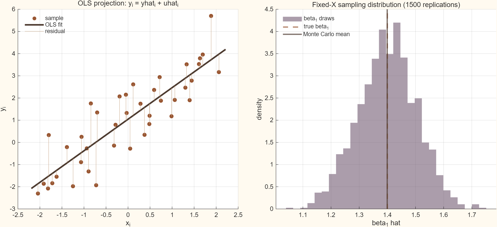

## 목적

OLS를 단순히 계수를 계산하는 공식으로 읽는 대신, 표본 벡터 $y$를 설명변수 행렬 $X$의
column space에 투영하는 과정으로 봅니다. 같은 $X$를 고정하고 오차만 반복 추출하면,
추정량 $\hat\beta_1$의 표본 변동도 함께 확인할 수 있습니다.

관련 본문은 [Chapter 07 · Sample Least Squares and Finite-Sample Geometry](../econometrics/ch07-sample-least-squares/contents.qmd)와
[Chapter 08 · Sampling Theory of Least Squares](../econometrics/ch08-sampling-theory-least-squares/contents.qmd),
[Chapter 09 · Exact Inference](../econometrics/ch09-exact-inference/contents.qmd)입니다.

## 조작 도구

<iframe class="interactive-frame" title="OLS 표본 기하와 표본 변동 탐색 도구" src="interactive/ols-geometry/index.html" loading="lazy"></iframe>

### 읽는 법

- **표본 수**가 커지면 같은 설명변수 범위 아래에서 $\hat\beta_1$의 표본분포가 좁아집니다.
- **오차 표준편차**가 커지면 산점도의 수직 분산과 OLS 표준오차가 함께 커집니다.
- **기울기**를 바꾸면 도구는 새로운 표본과 Monte Carlo 실험을 다시 만듭니다. 오른쪽 분포의
  테라코타 선은 참값 $\beta_1$입니다.
- 첫 그림의 잔차선은 $y_i=\hat y_i+\hat u_i$를 표시합니다. 수치 카드의
  $\max |X'\hat u|$가 거의 0이면 normal equations가 충족됐다는 뜻입니다.

도구와 MATLAB 기준 계산은 다음 모형을 사용합니다.

$$
y_i=\beta_0+\beta_1x_i+u_i,
\qquad
\hat\beta=(X'X)^{-1}X'y,
\qquad
X'\hat u=0.
$$

## 정적 그림

상호작용을 사용할 수 없는 환경을 위한 MATLAB 기준 설정의 투영과 표본분포입니다.

{.supplement-fallback fig-alt="왼쪽에는 OLS 적합선과 잔차, 오른쪽에는 기울기 추정치의 Monte Carlo 분포가 있다."}

## 재현과 범위

- MATLAB 원본: [`supplements/matlab/ols_geometry_monte_carlo.m`](matlab/ols_geometry_monte_carlo.m)
- 기준 표본: [`assets/data/ols-geometry-baseline.csv`](../assets/data/ols-geometry-baseline.csv)
- 실행 메타데이터: [`assets/data/ols-geometry-metadata.json`](../assets/data/ols-geometry-metadata.json)
- 권장 실행환경: MATLAB R2025b (base MATLAB, 별도 toolbox 없음)

프로젝트 루트에서 아래 명령으로 기준 산출물을 다시 생성할 수 있습니다.

```text
matlab -batch "run('supplements/matlab/ols_geometry_monte_carlo.m')"
```

기준 계산은 random seed를 고정하고 $n=40$, $\beta_0=1$, $\beta_1=1.4$,
$\sigma=0.8$, fixed-$X$ Monte Carlo 1,500회를 사용합니다. 이 보충자료는 단일 설명변수,
독립·동분산 정규오차의 기초 실험입니다. 다중회귀, 이분산성 robust inference,
내생성은 각각 이후 Chapter에서 별도로 다룹니다.
