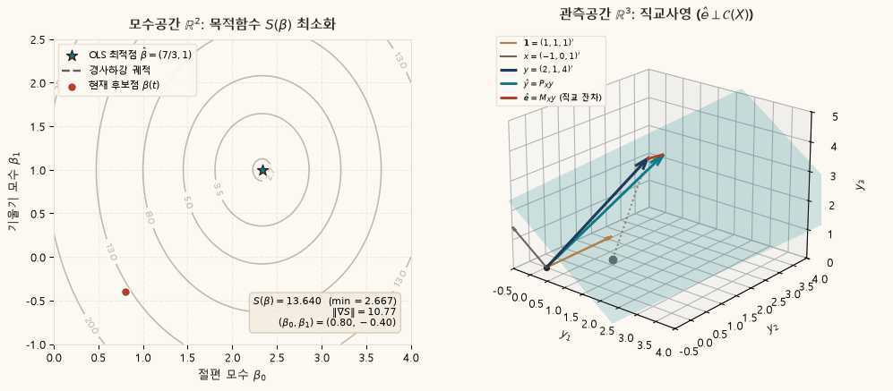
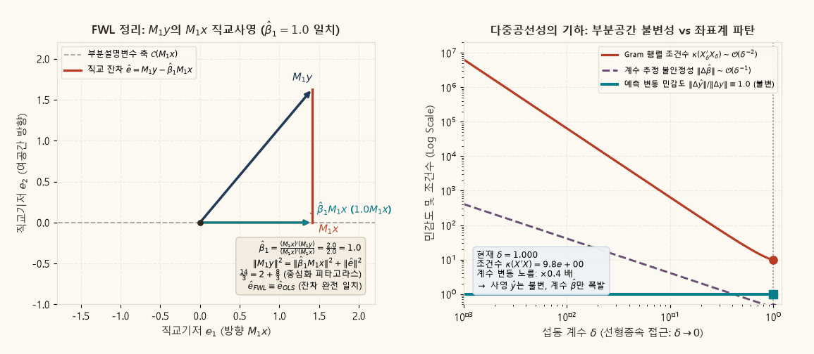

## 목적과 4대 기본 등가성 (Grand Equivalence)

계량경제학에서 최소자승법(Ordinary Least Squares, OLS)은 흔히 표본 데이터의 잔차제곱합을 미분하여 $k$개의 연립방정식을 푸는 대수적 공식으로 학습된다. 그러나 OLS의 본질은 $n$차원 **관측공간(Observation Space)** $\mathbb{R}^n$에서 종속변수 벡터 $y$를 설명변수들이 이루는 $k$차원 부분공간 $\mathcal{C}(X)$로 수직으로 떨어뜨리는 **직교사영(Orthogonal Projection)**이다.

설명변수 행렬 $X$의 열들이 선형독립이라고 가정한다:

$$
\operatorname{rank}(X) = k \le n.
$$

이때 OLS 추정량 $\hat{\beta}$, 적합값 벡터 $\hat{y} = X\hat{\beta}$, 잔차 벡터 $\hat{e} = y - \hat{y}$에 대해 다음 네 가지 진술은 **완전히 동일한 수학적 사실**을 표현한다:

::: {.callout-note appearance="simple"}
### OLS의 4대 기본 등가성 (Grand Equivalence)

$$
\boxed{
\underbrace{\nabla_\beta S(\hat{\beta}) = \mathbf{0}}_{\substack{\text{모수공간 } \mathbb{R}^k \text{의 최적화} \\ \text{(Optimization)}}}
\iff
\underbrace{X'\hat{e} = \mathbf{0}}_{\substack{\text{대수적 정상방정식} \\ \text{(Normal Equations)}}}
\iff
\underbrace{\hat{e} \perp \mathcal{C}(X)}_{\substack{\text{관측공간 } \mathbb{R}^n \text{의 직교기하} \\ \text{(Geometry)}}}
\iff
\underbrace{\hat{y} = P_X y}_{\substack{\text{직교사영 연산자} \\ \text{(Projection Operator)}}}
}
$$
:::

관련 본문은 [Chapter 07 · 표본최소자승법과 유한표본 기하](../econometrics/ch07-sample-least-squares/contents.qmd)의 Section 7.2(정상방정식), Section 7.4(사영행렬과 직교분해), Section 7.5(피타고라스 분해와 $R^2$)에서 다룬다.

---

## 1. 모수공간과 관측공간의 쌍대 대응 (Dual-Panel Geometry)

$n=3$개의 관측치와 $k=2$개의 모수(상수항 + 단일 설명변수)를 갖는 구체적인 수치 예제를 통해 모수공간 $\mathbb{R}^2$와 관측공간 $\mathbb{R}^3$의 상호 대응 관계를 분석한다.

$$
X = \begin{pmatrix} 1 & -1 \\ 1 & 0 \\ 1 & 1 \end{pmatrix} = [\mathbf{1}, x], \qquad y = \begin{pmatrix} 2 \\ 1 \\ 4 \end{pmatrix}.
$$

### 수치 계산과 기하학적 해설

1. **정상방정식의 해 (Normal Equations Solution)**:
   $$
   X'X = \begin{pmatrix} 3 & 0 \\ 0 & 2 \end{pmatrix}, \qquad X'y = \begin{pmatrix} 7 \\ 2 \end{pmatrix} \implies \hat{\beta} = (X'X)^{-1}X'y = \begin{pmatrix} 7/3 \\ 1 \end{pmatrix}.
   $$
2. **적합값과 잔차 벡터 (Fitted Values and Residuals)**:
   $$
   \hat{y} = X\hat{\beta} = \frac{7}{3}\begin{pmatrix} 1 \\ 1 \\ 1 \end{pmatrix} + 1\begin{pmatrix} -1 \\ 0 \\ 1 \end{pmatrix} = \begin{pmatrix} 4/3 \\ 7/3 \\ 10/3 \end{pmatrix}, \qquad \hat{e} = y - \hat{y} = \begin{pmatrix} 2/3 \\ -4/3 \\ 2/3 \end{pmatrix}.
   $$
3. **직교성 검증 (Orthogonality Verification)**:
   $$
   X'\hat{e} = \begin{pmatrix} \mathbf{1}'\hat{e} \\ x'\hat{e} \end{pmatrix} = \begin{pmatrix} 2/3 - 4/3 + 2/3 \\ -2/3 + 0 + 2/3 \end{pmatrix} = \begin{pmatrix} 0 \\ 0 \end{pmatrix}.
   $$
   상수항 $\mathbf{1}$과의 직교성은 잔차의 표본합이 0($\sum_{i=1}^3 \hat{e}_i = 0$)임을 보장하고, 설명변수 $x$와의 직교성은 잔차와 $x$의 표본 공분산이 0임을 의미한다.
4. **모수공간 (Parameter Space $\mathbb{R}^2$)**:
   모수 $\beta = (\beta_0, \beta_1)'$에 대한 목적함수 $S(\beta) = \|y - X\beta\|^2$는 다음과 같이 전개된다:
   $$
   S(\beta) = \frac{8}{3} + 3\left(\beta_0 - \frac{7}{3}\right)^2 + 2(\beta_1 - 1)^2.
   $$
   등고선은 $\hat{\beta} = (7/3, 1)'$를 중심으로 하는 타원군이다. 임의의 후보점에서 OLS 해 $\hat{\beta}$로 이동하는 경로는 목적함수 값을 전역 최소값 $S(\hat{\beta}) = 8/3 \approx 2.667$로 감소시킨다.
5. **관측공간 (Observation Space $\mathbb{R}^3$)**:
   3차원 관측공간에서 설명변수의 열공간 $\mathcal{C}(X) = \operatorname{span}\{\mathbf{1}, x\}$는 원점을 지나는 2차원 평면을 형성한다. 종속변수 벡터 $y = (2, 1, 4)'$는 평면 밖의 점이며, OLS는 $y$에서 평면으로 수선의 발을 내린 점 $\hat{y} = (4/3, 7/3, 10/3)'$를 결정한다. 잔차 벡터 $\hat{e} = y - \hat{y} = (2/3, -4/3, 2/3)'$는 평면 $\mathcal{C}(X)$와 엄밀하게 직교($90^\circ$)한다.

---

## 2. 동적 시각화 1: 3D 관측공간 직교사영과 모수공간 쌍대 최적화

아래 애니메이션은 모수공간 $\mathbb{R}^2$에서의 잔차제곱합 등고선 최적화 궤적과, 3차원 관측공간 $\mathbb{R}^3$에서 열공간 평면 $\mathcal{C}(X)$로 떨어지는 직교사영 벡터 기하를 360도 연속 회전과 함께 동적으로 대비하여 보여준다.

{#fig-ols-projection-3d fig-alt="왼쪽 패널은 모수공간 등고선과 최소점으로 수렴하는 경사하강 궤적을, 오른쪽 패널은 3차원 관측공간에서 열공간 평면으로 떨어지는 직교사영 벡터들의 360도 회전을 보여준다."}

### 동적 시각화 1의 계량경제학적 해설

1. **좌측 패널 (모수공간 $\mathbb{R}^2$ 최적화)**:
   - 초기 후보점 $\beta(0) = (0.8, -0.4)'$에서 출발하여 OLS 전역 최소점 $\hat{\beta} = (7/3, 1)'$로 수렴하는 최적화 경로를 추적한다.
   - 잔차제곱합은 초기 $S(\beta) = 19.47$에서 전역 최소값 $S(\hat{\beta}) = 8/3 \approx 2.667$로 단조 감소하며, 최적점에서 기울기 벡터의 노름 $\|\nabla S\|$는 $0$에 도달한다.
2. **우측 패널 (3D 관측공간 직교사영)**:
   - 기저 벡터 $\mathbf{1} = (1, 1, 1)'$(황금색)과 $x = (-1, 0, 1)'$(회색)이 생성하는 열공간 평면 $\mathcal{C}(X)$(청록색 반투명 면)이 3차원 축을 중심으로 회전한다.
   - 후보 계수 벡터 $X\beta(t)$가 평면 위를 이동하며 최종 적합값 $\hat{y} = P_X y$(청록색 벡터)에 안착할 때, 종속변수 $y$(남색 벡터)와의 거리가 유클리드 노름 의미에서 최소화된다.
   - 카메라가 평면의 모서리(edge-on) 방향을 지날 때, 잔차 벡터 $\hat{e} = M_X y$(적색 벡터)가 평면 $\mathcal{C}(X)$ 전체와 정확히 수직($90^\circ$)을 이루어 정상방정식 $X'\hat{e} = \mathbf{0}$을 기하학적으로 입증한다.

---

## 3. 직교사영행렬 $P_X$와 잔차생성행렬 $M_X$의 대수적 성질

OLS 사영 연산자는 대칭(Symmetric)이고 멱등(Idempotent)인 정방행렬로 정의된다:

$$
P_X = X(X'X)^{-1}X', \qquad M_X = I_n - P_X.
$$

### 4대 기본 대수적 성질

1. **대칭성 (Symmetry)**:
   $$
   P_X' = \left(X(X'X)^{-1}X'\right)' = X(X'X)^{-1}X' = P_X, \qquad M_X' = (I_n - P_X)' = M_X.
   $$
2. **멱등성 (Idempotency)**:
   $$
   P_X^2 = X(X'X)^{-1}(X'X)(X'X)^{-1}X' = X(X'X)^{-1}X' = P_X, \qquad M_X^2 = (I_n - P_X)^2 = M_X.
   $$
   이미 평면에 사영된 벡터를 다시 사영해도 아무런 변화가 발생하지 않는다 ($P_X \hat{y} = \hat{y}$).
3. **상호 직교성과 여공간 (Mutual Orthogonality)**:
   $$
   P_X M_X = P_X(I_n - P_X) = P_X - P_X^2 = \mathbf{0}_{n \times n}.
   $$
   따라서 관측공간 $\mathbb{R}^n$ 전체는 열공간과 그 직교여공간의 직교직합으로 유일하게 분해된다:
   $$
   \mathbb{R}^n = \mathcal{C}(X) \oplus \mathcal{C}(X)^\perp, \qquad y = \underbrace{P_X y}_{\in \mathcal{C}(X)} + \underbrace{M_X y}_{\in \mathcal{C}(X)^\perp}.
   $$
4. **대각합과 부분공간의 차원 (Trace and Subspace Dimension)**:
   $$
   \operatorname{tr}(P_X) = \operatorname{tr}\left((X'X)^{-1}X'X\right) = \operatorname{tr}(I_k) = k, \qquad \operatorname{tr}(M_X) = \operatorname{tr}(I_n) - \operatorname{tr}(P_X) = n - k.
   $$
   멱등행렬의 고윳값은 0 또는 1뿐이므로, 행렬의 계수는 대각합과 일치한다: $\operatorname{rank}(P_X) = k$, $\operatorname{rank}(M_X) = n - k$.

---

## 4. 비중심 피타고라스 분해와 중심화 피타고라스 분해

직교기하를 다룰 때에는 **비중심 제곱합 분해**와 표본평균에 기초한 **중심화 제곱합 분해**의 차이를 명확히 구분해야 한다.

### 1) 비중심 피타고라스 정리 (Uncentered Pythagorean Decomposition)

$P_X$와 $M_X$의 상호 직교성($\hat{y}'\hat{e} = y' P_X M_X y = 0$)에 의해 원점으로부터의 벡터 노름 제곱은 피타고라스 정리를 따른다:

$$
\|y\|^2 = \|\hat{y}\|^2 + \|\hat{e}\|^2.
$$

수치 예제 대입:
$$
\|y\|^2 = 2^2 + 1^2 + 4^2 = 21,
$$
$$
\|\hat{y}\|^2 = \left(\frac{4}{3}\right)^2 + \left(\frac{7}{3}\right)^2 + \left(\frac{10}{3}\right)^2 = \frac{165}{9} = \frac{55}{3} \approx 18.333,
$$
$$
\|\hat{e}\|^2 = \left(\frac{2}{3}\right)^2 + \left(-\frac{4}{3}\right)^2 + \left(\frac{2}{3}\right)^2 = \frac{24}{9} = \frac{8}{3} \approx 2.667.
$$
$$
\boxed{21 = \frac{55}{3} + \frac{8}{3} \iff 21 = 18.333 + 2.667.}
$$

### 2) 중심화 피타고라스 정리와 결정계수 (Centered Decomposition and $R^2$)

상수항 $\mathbf{1}$이 $X$에 포함되어 있으면($\mathbf{1} \in \mathcal{C}(X)$), 잔차합은 $0$이므로 $\mathbf{1}'\hat{e} = 0$이다. 표본평균 $\bar{y} = (2 + 1 + 4)/3 = 7/3$에 대해 $y - \bar{y}\mathbf{1} = (\hat{y} - \bar{y}\mathbf{1}) + \hat{e}$를 제곱하면 교차항이 소거된다:

$$
(\hat{y} - \bar{y}\mathbf{1})'\hat{e} = \hat{y}'\hat{e} - \bar{y}(\mathbf{1}'\hat{e}) = 0 - 0 = 0.
$$

따라서 총제곱합(TSS), 설명제곱합(ESS), 잔차제곱합(RSS) 사이에 정확한 중심화 직교분해가 성립한다:

$$
\underbrace{\|y - \bar{y}\mathbf{1}\|^2}_{TSS} = \underbrace{\|\hat{y} - \bar{y}\mathbf{1}\|^2}_{ESS} + \underbrace{\|\hat{e}\|^2}_{RSS}.
$$

수치 예제 대입:
$$
TSS = \left(2 - \frac{7}{3}\right)^2 + \left(1 - \frac{7}{3}\right)^2 + \left(4 - \frac{7}{3}\right)^2 = \frac{42}{9} = \frac{14}{3} \approx 4.667,
$$
$$
ESS = \left(\frac{4}{3} - \frac{7}{3}\right)^2 + \left(\frac{7}{3} - \frac{7}{3}\right)^2 + \left(\frac{10}{3} - \frac{7}{3}\right)^2 = 2, \qquad RSS = \|\hat{e}\|^2 = \frac{8}{3}.
$$
$$
\boxed{TSS = ESS + RSS \iff \frac{14}{3} = 2 + \frac{8}{3} \iff 4.667 = 2.000 + 2.667.}
$$

결정계수 $R^2$는 총제곱합 중 설명된 변동의 기하학적 비율이다:

$$
R^2 \equiv \frac{ESS}{TSS} = 1 - \frac{RSS}{TSS} = \frac{2}{14/3} = \frac{3}{7} \approx 0.4286.
$$

---

## 5. Frisch–Waugh–Lovell(FWL) 정리와 부분사영의 기하학

설명변수들이 블록으로 나뉘어 있는 다중회귀모형을 고려한다:

$$
y = X_1 \beta_1 + X_2 \beta_2 + u.
$$

Frisch–Waugh–Lovell(FWL) 정리는 $X_1$의 영향을 제거한 잔차 공간에서 $y$를 $X_2$에 단일 회귀할 때, 다중회귀의 회귀계수 $\hat{\beta}_2$ 및 최종 잔차 벡터 $\hat{e}$가 완전히 일치함을 입증한다.

### FWL 정리의 대수적 증명

$X_1$에 대한 소멸행렬을 $M_1 \equiv I_n - X_1(X_1'X_1)^{-1}X_1'$이라 하자. 모형의 양변에 $M_1$을 곱하면 $M_1 X_1 = \mathbf{0}$이므로 $X_1$ 항이 소거된다:

$$
M_1 y = M_1 X_2 \beta_2 + M_1 u.
$$

이 변형된 모형에 OLS를 적용하여 $\beta_2$를 추정하면:

$$
\hat{\beta}_2^{FWL} = \left[(M_1 X_2)'(M_1 X_2)\right]^{-1}(M_1 X_2)'(M_1 y) = (X_2' M_1 X_2)^{-1}X_2' M_1 y.
$$

블록 행렬 역행렬 공식에 의한 전체 OLS 추정량 $\hat{\beta}_2$와 비교하면 두 결과는 항등적으로 일치한다 ($\hat{\beta}_2^{FWL} \equiv \hat{\beta}_2$). 또한 FWL 잔차는 다음과 같다:

$$
\hat{e}^{FWL} = M_1 y - (M_1 X_2)\hat{\beta}_2 = M_1 (y - X_2 \hat{\beta}_2) = M_X y = \hat{e}.
$$

### 동적 시각화 2: FWL 부분사영 및 다중공선성 조건수 폭발

아래 애니메이션은 $X_1 = \mathbf{1}$을 통제한 2차원 잔차 공간에서의 FWL 단계별 직교사영과, 설명변수 간 상관이 극대화될 때 발생하는 다중공선성 조건수 폭발을 대비한다.

{#fig-ols-fwl fig-alt="왼쪽 패널은 M1y를 M1x에 사영하여 다중회귀 계수 beta_1=1.0을 도출하는 FWL 기하를, 오른쪽 패널은 델타 수렴 시 예측 불변성과 조건수 및 계수 폭발을 보여준다."}

### 동적 시각화 2의 계량경제학적 해설

1. **좌측 패널 (FWL 2단계 부분사영 기하)**:
   - $X_1 = \mathbf{1}$로 $y$와 $x$를 각각 사영하여 중심화 잔차 벡터 $M_1 y = (-1/3, -4/3, 5/3)'$와 $M_1 x = (-1, 0, 1)'$를 구성한다.
   - 잔차 공간(평균이 0인 벡터들이 이루는 부분공간)에서 $M_1 y$를 $M_1 x$ 방향 축에 직교사영하면, 추정 계수는 정확히 $\hat{\beta}_1 = \frac{(M_1 x)'(M_1 y)}{\|M_1 x\|^2} = \frac{2}{2} = 1.0$으로 다중회귀 결과와 일치한다.
   - 잔차 벡터 $\hat{e} = M_1 y - \hat{\beta}_1 M_1 x = (2/3, -4/3, 2/3)'$는 다중회귀 OLS 잔차와 완전히 동일하며, 중심화 피타고라스 분할 $\|M_1 y\|^2 = \|\hat{\beta}_1 M_1 x\|^2 + \|\hat{e}\|^2 \iff 14/3 = 2 + 8/3$이 완벽하게 성립한다.
2. **우측 패널 (다중공선성의 기하학적 본질)**:
   - 두 설명변수가 거의 평행해지는 섭동 $x_2(\delta) = x_1 + \delta v$ ($\delta \to 0$) 환경에서 시스템의 거동을 추적한다.
   - **예측 변동 민감도 (청록색 실선)**: $\delta$가 $1.0$에서 $10^{-3}$으로 수렴하더라도 부분공간 $\mathcal{C}(X_\delta) \equiv \mathcal{V}$ 자체가 불변이므로 사영 벡터의 민감도 $\|\Delta\hat{y}\|/\|\Delta y\|$는 정확히 **1.0으로 불변 유지**된다.
   - **계수 불안정성과 조건수 (적색/자주색 곡선)**: 반면 Gram 행렬의 조건수 $\kappa(X'X)$는 $\mathcal{O}(\delta^{-2})$로 폭발하며, 개별 계수 좌표의 민감도 $\|\Delta\hat{\beta}\|$는 $\mathcal{O}(\delta^{-1})$ 속도로 급격히 발산한다.

---

## 6. 설명변수 추가와 부분공간의 중첩성 ($\mathcal{C}(X_0) \subset \mathcal{C}(X_1)$)

설명변수를 추가할 때 잔차제곱합 $RSS$가 어떻게 변화하는지는 부분공간의 포함관계(Subspace Inclusion)를 통해 규명된다.

- **상수항만 있는 모형**: $X_0 = [\mathbf{1}] \implies \mathcal{C}(X_0) = \operatorname{span}\{\mathbf{1}\}$ (1차원 직선)
- **설명변수 $x$를 추가한 모형**: $X_1 = [\mathbf{1}, x] \implies \mathcal{C}(X_1) = \operatorname{span}\{\mathbf{1}, x\}$ (2차원 평면)

분명히 $\mathcal{C}(X_0) \subset \mathcal{C}(X_1)$이다.

### 기하학적 원리와 $R^2$의 단조성

1. **최적화 영역의 확장**:
   사영은 부분공간 내에서 $y$와의 유클리드 거리를 최소화하는 점을 찾는 문제이다:
   $$
   RSS = \min_{z \in \mathcal{C}(X)} \|y - z\|^2.
   $$
   $\mathcal{C}(X_0) \subset \mathcal{C}(X_1)$이므로, 탐색 공간이 직선에서 평면으로 확장되었다. 따라서 더 넓은 집합에서의 최소값은 더 좁은 집합에서의 최소값보다 커질 수 없다:
   $$
   \min_{z \in \mathcal{C}(X_1)} \|y - z\|^2 \le \min_{z \in \mathcal{C}(X_0)} \|y - z\|^2 \implies RSS_1 \le RSS_0.
   $$
2. **수치 결과**:
   - $X_0 = [\mathbf{1}]$: $\hat{y}_0 = P_{\mathbf{1}}y = \bar{y}\mathbf{1} = (7/3, 7/3, 7/3)'$, $RSS_0 = 14/3 \approx 4.667$, $R_0^2 = 0$.
   - $X_1 = [\mathbf{1}, x]$: $\hat{y}_1 = (4/3, 7/3, 10/3)'$, $RSS_1 = 8/3 \approx 2.667$, $R_1^2 = 3/7 \approx 0.429$.
   - 잔차제곱합 감소량: $\Delta RSS = RSS_0 - RSS_1 = 14/3 - 8/3 = 2$.
   - 이는 점 $\hat{y}_0$에서 $\hat{y}_1$로 이동하는 추가 벡터 $\hat{y}_1 - \hat{y}_0 = (-1, 0, 1)'$의 길이 제곱 $\|\hat{y}_1 - \hat{y}_0\|^2 = (-1)^2 + 0^2 + 1^2 = 2$와 정확히 일치한다.
3. **계량경제학적 함의**:
   모형에 변수를 추가하면 **수정되지 않은 $R^2$는 절대 감소하지 않는다**. 설명력이 전혀 없는 무의미한 난수를 추가하더라도 표본 우연에 의해 $\mathcal{C}(X)$가 $y$ 방향으로 기울어지므로 $RSS$는 단조 감소(또는 유지)한다. 이것이 자유도 손실을 반영한 수정 결정계수 $\bar{R}^2$나 정보기준(AIC, BIC)을 병행 평가해야 하는 기하학적 이유이다.

---

## 7. 다중공선성 수치 벤치마크: 부분공간 불변성 vs 좌표계 파탄

$n=6, k=3$의 정밀한 해석적 실험을 통해 다중공선성의 수학적 본질을 실증한다:

$$
\mathbf{1} = \begin{pmatrix} 1 \\ 1 \\ 1 \\ 1 \\ 1 \\ 1 \end{pmatrix}, \qquad
x_1 = \begin{pmatrix} -2 \\ -1 \\ 0 \\ 1 \\ 2 \\ 3 \end{pmatrix}, \qquad
v = \begin{pmatrix} 1 \\ -2 \\ 1 \\ 1 \\ -2 \\ 1 \end{pmatrix}, \qquad
x_2(\delta) = x_1 + \delta v.
$$

여기서 $\mathbf{1}'v = 0$, $x_1'v = 0$, $\|v\|^2 = 12$이다.

### 표: 섭동 파라미터 $\delta$에 따른 수치 민감도 벤치마크

| 섭동 파라미터 ($\delta$) | Gram 조건수 $\kappa(X_\delta' X_\delta)$ | 계수 불안정성 $\|\Delta\hat{\beta}\|_2 / \|\Delta y\|_2$ | 예측 변동 민감도 $\|\Delta\hat{y}\|_2 / \|\Delta y\|_2$ | 사영행렬 차원 계수 $\operatorname{rank}(P_X)$ |
|:---:|:---:|:---:|:---:|:---:|
| **1.000** | $2.84 \times 10^1$ | 0.408 | 1.000 | 3 |
| **0.500** | $1.09 \times 10^2$ | 0.816 | 1.000 | 3 |
| **0.100** | $2.69 \times 10^3$ | 4.082 | 1.000 | 3 |
| **0.050** | $1.08 \times 10^4$ | 8.165 | 1.000 | 3 |
| **0.010** | $2.69 \times 10^5$ | 40.825 | 1.000 | 3 |
| **0.005** | $1.08 \times 10^6$ | 81.650 | 1.000 | 3 |
| **0.001** | $2.69 \times 10^7$ | 408.248 | 1.000 | 3 |

벤치마크 결과가 입증하듯, $\delta$가 $1.0$에서 $0.001$로 축소될 때 Gram 행렬 조건수는 약 $10^6$배 폭발하고 계수 변동 민감도는 $1,000$배 증폭되지만, **예측 변동 민감도는 정확히 1.000을 유지**한다. 다중공선성은 '부분공간(Subspace)'의 결함이 아니라 부분공간 내부에서 위치를 표현하는 '기저 좌표계(Coordinate Basis)'의 결함이다.

---

## 8. 수치 선형대수 모범 관행: 역행렬 회피와 QR 분해

계량경제학 교과서의 수식 $\hat{\beta} = (X'X)^{-1}X'y$와 $P_X = X(X'X)^{-1}X'$를 프로그래밍 언어에서 `inv(X'*X) * X' * y`로 직접 계산하는 것은 수치해석적으로 매우 위험하다.

::: {.callout-tip}
### 왜 `inv(X'*X)`를 피해야 하는가?
행렬 곱 $X'X$를 계산하는 순간 행렬 $X$의 조건수 $\kappa(X)$가 제곱되어 $\kappa(X'X) = [\kappa(X)]^2$가 된다. 만약 데이터에 다중공선성이 있어 $\kappa(X) \approx 10^8$이라면, IEEE 754 배정밀도(약 16자리 유효숫자) 환경에서 $(X'X)$의 조건수는 $10^{16}$에 도달하여 **모든 유효숫자를 상실(Catastrophic Cancellation)**하게 된다.
:::

실제 과학 계산 및 통계 소프트웨어에서는 다음 두 가지 원칙을 준수한다:

1. **좌표 추정 시 Backslash 연산자 활용**:
   $$
   \hat{\beta} = X \backslash y.
   $$
   MATLAB, Python NumPy(`lstsq`), R(`lm.fit`), Julia의 솔버는 내부적으로 Householder 반사 기반의 QR 분해를 사용하여 조건수의 제곱을 원천 차단한다.
2. **사영 연산 시 축소 QR(Thin QR) 분해 활용**:
   $X$의 축소 QR 분해를 $X = Q R$ ($Q \in \mathbb{R}^{n \times k}, Q'Q = I_k, R \in \mathbb{R}^{k \times k}$)이라 하면, 사영행렬은 다음과 같이 단순화된다:
   $$
   P_X = X(X'X)^{-1}X' = (QR)(R'Q'QR)^{-1}(R'Q') = QR(R'R)^{-1}R'Q' = Q Q'.
   $$
   따라서 사영 벡터는 역행렬 연산 없이 $Q$ 행렬과의 내적만으로 극도로 안정적으로 계산된다:
   $$
   \hat{y} = Q(Q' y).
   $$

---

## 9. 재현 코드 및 본문 교재 연계

본 보충자료의 2종 동적 시각화 애니메이션은 프로젝트 루트의 독립 스크립트 [`scripts/generate_ols_projection_gifs.py`](../scripts/generate_ols_projection_gifs.py)를 통해 완전히 재현된다:

```bash
# OLS 직교사영 3D 및 FWL 동적 애니메이션 재생성
python scripts/generate_ols_projection_gifs.py
```

MATLAB 환경을 사용하는 연구자는 단독 실행형 스크립트 [`supplements/matlab/ols_projection_geometry.m`](matlab/ols_projection_geometry.m)을 통해 수치 메타데이터를 추출할 수 있다.

### 본문 교재 연계 안내

1. **[Chapter 07 · 표본최소자승법과 유한표본 기하](../econometrics/ch07-sample-least-squares/contents.qmd)**:
   정상방정식, 직교사영행렬, 피타고라스 분산분해 및 부분회귀 기하학을 다룬다.
2. **[보충자료 · OLS 표본 기하와 표본 변동](ols-geometry.qmd)**:
   Gauss–Markov 최적성(BLUE)의 분산 타원 기하학과 Cochran–Fisher 정리에 기초한 유한표본 정규 표본분포를 심화 탐색한다.
3. **[보충자료 · 도구변수와 약한 도구](iv-weak-instruments.qmd)**:
   설명변수가 오차항과 상관될 때 직교사영 기하가 왜 붕괴하고, 도구변수 공간 $\mathcal{C}(Z)$로의 2단계 사영(2SLS)이 어떻게 일치성을 회복하는지 비교 학습한다.
