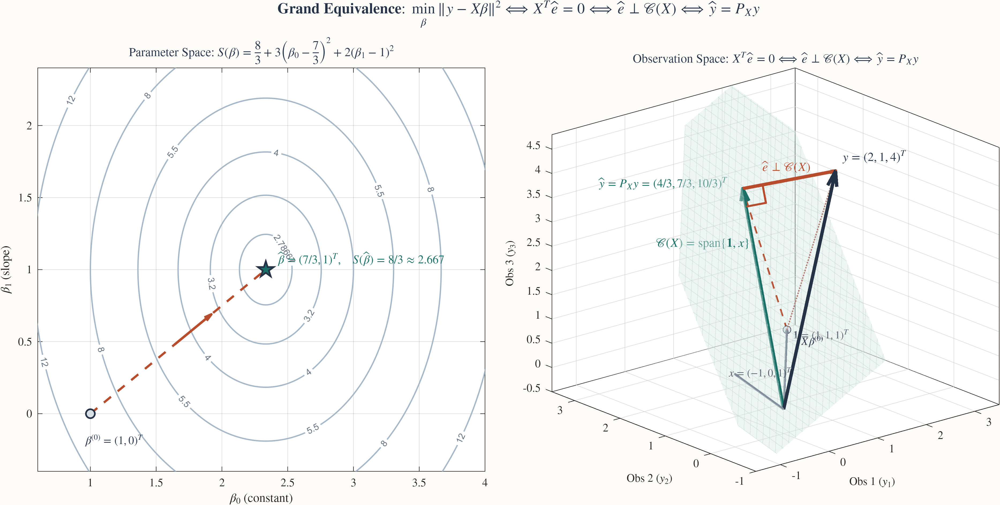
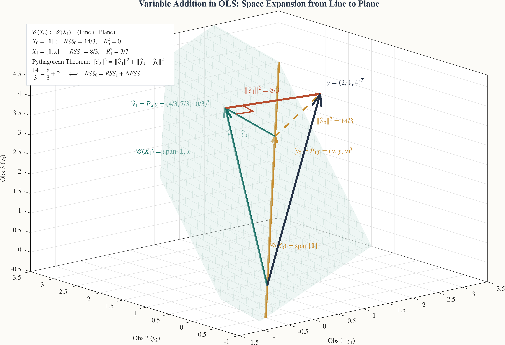
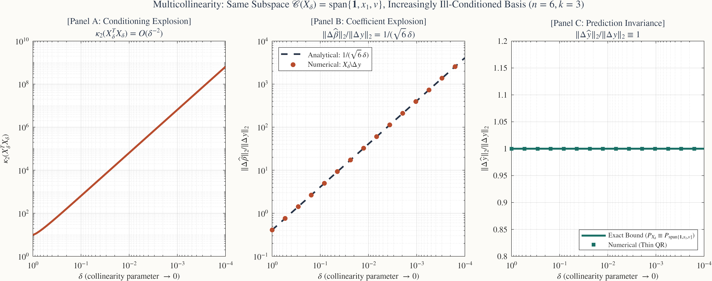

## 목적과 핵심 등가성 (Grand Equivalence)

계량경제학에서 최소제곱법(OLS)은 흔히 표본 데이터의 합을 미분하여 $k$개의 연립방정식을 푸는 대수적 공식으로 학습됩니다. 그러나 OLS의 본질은 $n$차원 **관측공간(Observation Space)** $\mathbb{R}^n$에서 종속변수 벡터 $y$를 설명변수들이 이루는 $k$차원 부분공간 $\mathcal{C}(X)$로 수직으로 떨어뜨리는 **직교사영(Orthogonal Projection)**입니다.

설명변수 행렬 $X$의 열들이 선형독립이라고 가정합니다:
$$
\operatorname{rank}(X) = k \le n.
$$

이때 OLS 추정량 $\hat{\beta}$, 적합값 벡터 $\hat{y} = X\hat{\beta}$, 잔차 벡터 $\hat{e} = y - \hat{y}$에 대해 다음 네 가지 진술은 **완전히 동일한 수학적 사실**을 표현합니다:

::: {.callout-note appearance="simple"}
### OLS의 4대 기본 등가성 (Grand Equivalence)

$$
\boxed{
\underbrace{\nabla_\beta S(\hat{\beta}) = 0}_{\substack{\text{모수공간 } \mathbb{R}^k \text{의 최적화} \\ \text{(Optimization)}}}
\iff
\underbrace{X'\hat{e} = 0}_{\substack{\text{대수적 정상방정식} \\ \text{(Normal Equations)}}}
\iff
\underbrace{\hat{e} \perp \mathcal{C}(X)}_{\substack{\text{관측공간 } \mathbb{R}^n \text{의 직교기하} \\ \text{(Geometry)}}}
\iff
\underbrace{\hat{y} = P_X y}_{\substack{\text{직교사영 연산자} \\ \text{(Projection Operator)}}}
}
$$
:::

관련 본문은 [Chapter 07 · Sample Least Squares and Finite-Sample Geometry](../econometrics/ch07-sample-least-squares/contents.qmd#s72)의 Section 7.2(정상방정식), Section 7.4(사영행렬과 직교분해), Section 7.5(피타고라스 분해와 $R^2$)입니다.

---

## 1. 모수공간과 관측공간의 대응 (Dual-Panel Geometry)

아래 도표는 $n=3$개의 관측치와 $k=2$개의 모수(상수항 + 단일 설명변수)를 갖는 구체적인 수치 예제에서 모수공간 $\mathbb{R}^2$와 관측공간 $\mathbb{R}^3$가 어떻게 일대일로 대응하는지 보여줍니다.

$$
X = \begin{pmatrix} 1 & -1 \\ 1 & 0 \\ 1 & 1 \end{pmatrix} = [\mathbf{1}, x], \qquad y = \begin{pmatrix} 2 \\ 1 \\ 4 \end{pmatrix}.
$$

{#fig-dual-panel .supplement-fallback fig-alt="왼쪽 패널에는 모수공간의 타원 등고선과 최소점, 오른쪽 패널에는 3차원 관측공간에서 열공간 평면으로의 직교사영 벡터들이 그려져 있다."}

### 수치 계산과 기하학적 해설

1. **정규방정식의 해 (Normal Equations Solution)**:
   $$
   X'X = \begin{pmatrix} 3 & 0 \\ 0 & 2 \end{pmatrix}, \qquad X'y = \begin{pmatrix} 7 \\ 2 \end{pmatrix} \implies \hat{\beta} = (X'X)^{-1}X'y = \begin{pmatrix} 7/3 \\ 1 \end{pmatrix}.
   $$
2. **적합값과 잔차 벡터 (Fitted Values and Residuals)**:
   $$
   \hat{y} = X\hat{\beta} = \frac{7}{3}\begin{pmatrix} 1 \\ 1 \\ 1 \end{pmatrix} + 1\begin{pmatrix} -1 \\ 0 \\ 1 \end{pmatrix} = \begin{pmatrix} 4/3 \\ 7/3 \\ 10/3 \end{pmatrix}, \qquad \hat{e} = y - \hat{y} = \begin{pmatrix} 2/3 \\ -4/3 \\ 2/3 \end{pmatrix}.
   $$
3. **직교성 검증 (Orthogonality Verification)**:
   $$
   X'\hat{e} = \begin{pmatrix} \mathbf{1}'\hat{e} \\ x'\hat{e} \end{pmatrix} = \begin{pmatrix} 2/3 - 4/3 + 2/3 \\ -2/3 + 0 + 2/3 \end{pmatrix} = \begin{pmatrix} 0 \\ 0 \end{pmatrix}.
   $$
   상수항 $\mathbf{1}$과의 직교성은 잔차의 합이 0($\sum_{i=1}^3 \hat{e}_i = 0$)임을 보장하고, 설명변수 $x$와의 직교성은 잔차와 $x$의 표본 공분산이 0임을 의미합니다.
4. **왼쪽 패널 (Parameter Space $\mathbb{R}^2$)**:
   모수 $\beta = (\beta_0, \beta_1)'$에 대한 목적함수 $S(\beta) = \|y - X\beta\|^2$는 다음과 같이 전개됩니다:
   $$
   S(\beta) = \frac{8}{3} + 3\left(\beta_0 - \frac{7}{3}\right)^2 + 2(\beta_1 - 1)^2.
   $$
   등고선은 $\hat{\beta} = (7/3, 1)'$를 동심원 중심(바닥)으로 하는 타원군입니다. 임의의 후보점 $\beta^{(0)} = (1, 0)'$에서 $\hat{\beta}$로 이동하는 붉은 점선 경로는 목적함수 값을 $S(\beta^{(0)}) = 10$에서 전역 최소값 $S(\hat{\beta}) = 8/3 \approx 2.667$로 감소시킵니다.
5. **오른쪽 패널 (Observation Space $\mathbb{R}^3$)**:
   3차원 관측공간에서 설명변수의 열공간 $\mathcal{C}(X) = \mathrm{span}\{\mathbf{1}, x\}$는 원점을 지나는 2차원 초록색 평면을 형성합니다. 표준 데카르트 직교좌표계(Obs 1 우하향, Obs 2 좌하향, Obs 3 수직 상향)에서 바라보면 종속변수 벡터 $y = (2, 1, 4)'$는 평면 밖의 점이며, OLS는 $y$에서 평면으로 수선의 발을 내린 점 $\hat{y} = (4/3, 7/3, 10/3)'$를 찾습니다. 잔차 벡터 $\hat{e} = y - \hat{y} = (2/3, -4/3, 2/3)'$는 평면 $\mathcal{C}(X)$와 정확히 직교($90^\circ$)합니다.

---

## 대화형 3D 관측공간 탐색 도구

<iframe class="interactive-frame" title="OLS 직교사영 3D 벡터 기하 탐색 도구" src="interactive/ols-projection-geometry/index.html" loading="lazy"></iframe>

### 3D 관측공간 조작 및 관찰 가이드

3차원 관측공간 $\mathbb{R}^3$을 2차원 화면에 투영할 때, 시점(Camera Azimuth & Elevation)에 따라 벡터 간의 각도와 평면의 기울기가 왜곡되어 보일 수 있습니다. 본 도구는 마우스 드래그 및 터치로 360° 자유 회전이 가능하며, 계량경제학적으로 중요한 4대 핵심 시점 프리셋을 제공합니다.

1. **표준 3D 뷰 (`az = -40°`, `el = 22°`)**:
   - 데카르트 직교좌표계의 기본 방향($y_1$ 우하향, $y_2$ 좌하향, $y_3$ 수직 상향)을 유지하여 공간적 정향(orientation)을 가장 직관적으로 인식할 수 있는 기본 시점입니다.
   - 2차원 열공간 $\mathcal{C}(X) = \mathrm{span}\{\mathbf{1}, x\}$가 경사진 평면으로 펼쳐지며, $y$에서 떨어진 직교사영 $\hat{y}$와 잔차 $\hat{e}$가 분리되어 명확히 관찰됩니다.
2. **피타고라스 정면 뷰 (`az = 135°`, `el = 35°`)**:
   - 모드 ②(변수 추가)에서 세 벡터 $y$, $\hat{y}_1$, $\hat{y}_0$가 이루는 3차원 삼각형의 법선 방향($\mathbf{n}_{\Delta} = (1, 1, 1)^T / \sqrt{3}$)에서 정면으로 바라봅니다.
   - 빗변 $\hat{e}_0 = y - \hat{y}_0$와 두 밑변 $\hat{e}_1 = y - \hat{y}_1$, $\hat{y}_1 - \hat{y}_0$가 화면 상에서 **완벽한 직각삼각형($90^\circ$)**으로 펼쳐져, 분산 분해의 피타고라스 정리 $\|\hat{e}_0\|^2 = \|\hat{e}_1\|^2 + \|\hat{y}_1 - \hat{y}_0\|^2 \iff \frac{14}{3} = \frac{8}{3} + 2$를 왜곡 없이 직접 확인할 수 있습니다.
3. **열공간 평면 뷰 (Top-down onto $\mathcal{C}(X)$)**:
   - 열공간 $\mathcal{C}(X)$의 법선벡터 $\mathbf{n} = (1, -2, 1)^T$ 방향에서 평면을 수직으로 내려다봅니다.
   - 이때 평면 상의 기저 벡터 $\mathbf{1}$과 $x$가 이루는 2차원 부분공간 내부의 기하 구조와 적합값 $\hat{y}$의 위치 좌표를 왜곡 없이 관찰할 수 있습니다.
4. **평면 측면 뷰 (Side View: $\hat{e} \perp \mathcal{C}(X)$)**:
   - 열공간 평면을 모서리(edge-on) 방향으로 바라봅니다. 평면이 하나의 직선 단면으로 압축되면서, OLS 잔차 벡터 $\hat{e}$가 평면 전체와 엄밀하게 $90^\circ$ 직교(Normal Equations: $X'\hat{e} = 0$)함을 즉각 시각적으로 검증할 수 있습니다.

---

## 2. 직교사영행렬 $P_X$와 잔차생성행렬 $M_X$

OLS 사영 연산자는 대칭(Symmetric)이고 멱등(Idempotent)인 정방행렬로 표현됩니다:

$$
P_X = X(X'X)^{-1}X', \qquad M_X = I_n - P_X.
$$

### 기본 대수적 성질

1. **대칭성 (Symmetry)**:
   $$
   P_X' = \left(X(X'X)^{-1}X'\right)' = X(X'X)^{-1}X' = P_X, \qquad M_X' = M_X.
   $$
2. **멱등성 (Idempotency)**:
   $$
   P_X^2 = X(X'X)^{-1}(X'X)(X'X)^{-1}X' = X(X'X)^{-1}X' = P_X, \qquad M_X^2 = M_X.
   $$
   이는 이미 평면에 사영된 벡터를 다시 사영해도 아무런 변화가 없음을 뜻합니다 ($P_X \hat{y} = \hat{y}$).
3. **상호 직교성과 여공간 (Mutual Orthogonality)**:
   $$
   P_X M_X = P_X(I_n - P_X) = P_X - P_X^2 = 0.
   $$
   따라서 관측공간 $\mathbb{R}^n$ 전체는 열공간과 그 직교여공간의 직교직합으로 유일하게 분해됩니다:
   $$
   \mathbb{R}^n = \mathcal{C}(X) \oplus \mathcal{C}(X)^\perp, \qquad y = \underbrace{P_X y}_{\in \mathcal{C}(X)} + \underbrace{M_X y}_{\in \mathcal{C}(X)^\perp}.
   $$
4. **대각합과 부분공간의 차원 (Trace and Subspace Dimension)**:
   $$
   \operatorname{tr}(P_X) = \operatorname{tr}\left((X'X)^{-1}(X'X)\right) = \operatorname{tr}(I_k) = k, \qquad \operatorname{tr}(M_X) = n - k.
   $$

---

## 3. 비중심 피타고라스 분해와 중심화 피타고라스 분해

직교기하를 다룰 때 가장 흔히 혼동하는 지점은 **비중심 제곱합 분해**와 표본분산에 기초한 **중심화 제곱합 분해**의 차이입니다.

### 1) 비중심 피타고라스 정리 (Uncentered Pythagorean Decomposition)

$P_X$와 $M_X$의 상호 직교성($\hat{y}'\hat{e} = y' P_X M_X y = 0$)에 의해 원점으로부터의 벡터 노름 제곱은 피타고라스 정리를 따릅니다:

$$
\|y\|^2 = \|\hat{y}\|^2 + \|\hat{e}\|^2.
$$

우리 수치 예제에서:
$$
\|y\|^2 = 2^2 + 1^2 + 4^2 = 21,
$$
$$
\|\hat{y}\|^2 = \left(\frac{4}{3}\right)^2 + \left(\frac{7}{3}\right)^2 + \left(\frac{10}{3}\right)^2 = \frac{16 + 49 + 100}{9} = \frac{165}{9} = \frac{55}{3},
$$
$$
\|\hat{e}\|^2 = \left(\frac{2}{3}\right)^2 + \left(-\frac{4}{3}\right)^2 + \left(\frac{2}{3}\right)^2 = \frac{4 + 16 + 4}{9} = \frac{24}{9} = \frac{8}{3}.
$$
$$
\boxed{21 = \frac{55}{3} + \frac{8}{3} \iff 21 = 18.333 + 2.667.}
$$

### 2) 중심화 피타고라스 정리와 결정계수 (Centered Decomposition and $R^2$)

상수항 $\mathbf{1}$이 $X$에 포함되어 있으면($\mathbf{1} \in \mathcal{C}(X)$), 잔차합은 $0$이므로 $\mathbf{1}'\hat{e} = 0$입니다. 표본평균 $\bar{y} = (2 + 1 + 4)/3 = 7/3$에 대해 $y - \bar{y}\mathbf{1} = (\hat{y} - \bar{y}\mathbf{1}) + \hat{e}$를 제곱하면 교차항이 소거됩니다:

$$
(\hat{y} - \bar{y}\mathbf{1})'\hat{e} = \hat{y}'\hat{e} - \bar{y}(\mathbf{1}'\hat{e}) = 0 - 0 = 0.
$$

따라서 총제곱합(TSS), 설명제곱합(ESS), 잔차제곱합(RSS) 사이에 정확한 중심화 직교분해가 성립합니다:

$$
\underbrace{\|y - \bar{y}\mathbf{1}\|^2}_{TSS} = \underbrace{\|\hat{y} - \bar{y}\mathbf{1}\|^2}_{ESS} + \underbrace{\|\hat{e}\|^2}_{RSS}.
$$

우리 예제 수치 대입:
$$
TSS = \left(2 - \frac{7}{3}\right)^2 + \left(1 - \frac{7}{3}\right)^2 + \left(4 - \frac{7}{3}\right)^2 = \frac{1}{9} + \frac{16}{9} + \frac{25}{9} = \frac{42}{9} = \frac{14}{3},
$$
$$
ESS = \left(\frac{4}{3} - \frac{7}{3}\right)^2 + \left(\frac{7}{3} - \frac{7}{3}\right)^2 + \left(\frac{10}{3} - \frac{7}{3}\right)^2 = \frac{9}{9} + 0 + \frac{9}{9} = 2 = \frac{6}{3},
$$
$$
RSS = \|\hat{e}\|^2 = \frac{8}{3}.
$$
$$
\boxed{TSS = ESS + RSS \iff \frac{14}{3} = 2 + \frac{8}{3} \iff 4.667 = 2.000 + 2.667.}
$$

결정계수 $R^2$는 총제곱합 중 설명된 비율입니다:
$$
R^2 = \frac{ESS}{TSS} = 1 - \frac{RSS}{TSS} = \frac{2}{14/3} = \frac{3}{7} \approx 0.4286.
$$

---

## 4. 설명변수 추가와 중첩 부분공간 (Variable Addition and Nested Subspaces)

설명변수를 추가할 때 잔차제곱합 $RSS$가 어떻게 변하는지는 부분공간의 포함관계(Subspace Inclusion)를 통해 가장 명확히 이해할 수 있습니다.

- **상수항만 있는 모형**: $X_0 = [\mathbf{1}] \implies \mathcal{C}(X_0) = \mathrm{span}\{\mathbf{1}\}$ (1차원 직선)
- **설명변수 $x$를 추가한 모형**: $X_1 = [\mathbf{1}, x] \implies \mathcal{C}(X_1) = \mathrm{span}\{\mathbf{1}, x\}$ (2차원 평면)

분명히 $\mathcal{C}(X_0) \subset \mathcal{C}(X_1)$입니다.

{#fig-variable-addition .supplement-fallback fig-alt="상수항 단독의 1차원 직선 공간과 설명변수가 추가된 2차원 평면 공간으로의 OLS 사영 비교. 평면으로의 사영이 더 가까워 잔차제곱합이 14/3에서 8/3으로 감소한다."}

### 기하학적 원리와 $R^2$ 단조성

1. **최적화 영역의 확장**:
   사영은 부분공간 내에서 $y$와의 유클리드 거리를 최소화하는 점을 찾는 문제입니다:
   $$
   RSS = \min_{z \in \mathcal{C}(X)} \|y - z\|^2.
   $$
   $\mathcal{C}(X_0) \subset \mathcal{C}(X_1)$이므로, 탐색 공간이 직선에서 평면으로 확장되었습니다. 따라서 더 넓은 집합에서의 최소값은 결코 더 좁은 집합에서의 최소값보다 커질 수 없습니다:
   $$
   \min_{z \in \mathcal{C}(X_1)} \|y - z\|^2 \le \min_{z \in \mathcal{C}(X_0)} \|y - z\|^2 \implies RSS_1 \le RSS_0.
   $$
2. **수치 결과**:
   - $X_0 = [\mathbf{1}]$: $\hat{y}_0 = P_{\mathbf{1}}y = \bar{y}\mathbf{1} = (7/3, 7/3, 7/3)'$, $RSS_0 = 14/3 \approx 4.667$, $R_0^2 = 0$.
   - $X_1 = [\mathbf{1}, x]$: $\hat{y}_1 = (4/3, 7/3, 10/3)'$, $RSS_1 = 8/3 \approx 2.667$, $R_1^2 = 3/7 \approx 0.429$.
   - 잔차제곱합 감소량: $\Delta RSS = RSS_0 - RSS_1 = 14/3 - 8/3 = 2$.
   - 이는 점 $\hat{y}_0$에서 $\hat{y}_1$로 이동하는 추가 벡터 $\hat{y}_1 - \hat{y}_0 = (-1, 0, 1)'$의 길이 제곱 $\|\hat{y}_1 - \hat{y}_0\|^2 = (-1)^2 + 0^2 + 1^2 = 2$와 정확히 일치합니다.
3. **계량경제학적 함의**:
   모형에 어떤 변수를 추가하든 **수정되지 않은 $R^2$는 절대 감소하지 않습니다**. 설명력이 전혀 없는 무의미한 난수를 추가하더라도 표본 우연에 의해 $\mathcal{C}(X)$가 $y$ 쪽으로 기울어지므로 $RSS$는 단조 감소(또는 유지)합니다. 이것이 자유도 조정을 반영한 수정 결정계수 $\bar{R}^2$나 정보기준(AIC, BIC)을 고려해야 하는 기하학적 이유입니다.

---

## 5. 다중공선성의 기하: 부분공간의 불변성과 기저 좌표계의 파탄

다중공선성(Multicollinearity)은 OLS에서 가장 빈번하게 오해되는 주제입니다. 많은 경우 "다중공선성이 있으면 OLS 예측이 부정확해진다"고 잘못 생각합니다. 그러나 벡터 공간 기하학은 정반대의 사실을 명확히 보여줍니다:

::: {.callout-important}
### 다중공선성의 핵심 진실
**다중공선성은 '부분공간(Subspace)'의 문제가 아니라 '기저 좌표계(Coordinate Basis)'의 문제입니다.**
설명변수들 사이에 강한 선형관계가 있어도 그들이 펼치는 열공간 $\mathcal{C}(X)$ 자체는 거의 변하지 않으므로 사영 벡터 $\hat{y}$와 예측값은 수학적으로 매우 안정적입니다. 오직 그 부분공간 안에서 위치를 표현하는 계수 좌표 $\hat{\beta}$만이 극도로 불안정해집니다.
:::

이를 입증하기 위해 $n=6, k=3$의 정밀한 해석적 실험을 설계합니다.

$$
\mathbf{1} = \begin{pmatrix} 1 \\ 1 \\ 1 \\ 1 \\ 1 \\ 1 \end{pmatrix}, \qquad
x_1 = \begin{pmatrix} -2 \\ -1 \\ 0 \\ 1 \\ 2 \\ 3 \end{pmatrix}, \qquad
v = \begin{pmatrix} 1 \\ -2 \\ 1 \\ 1 \\ -2 \\ 1 \end{pmatrix}.
$$

여기서 $v$는 $\mathbf{1}$ 및 $x_1$과 완벽히 직교하도록 설계되었습니다:
$$
\mathbf{1}'v = 0, \qquad x_1'v = 0, \qquad \|v\|^2 = 12.
$$

이제 두 번째 설명변수 $x_2$를 $x_1$에 매우 가까운 벡터로 정의합니다:
$$
x_2(\delta) = x_1 + \delta v \qquad (\delta \to 0).
$$
설명변수 행렬은 $X_\delta = [\mathbf{1}, x_1, x_2(\delta)]$입니다.

{#fig-multicollinearity .supplement-fallback fig-alt="패널 A는 조건수 폭발, 패널 B는 델타 역수에 비례하는 계수 폭발, 패널 C는 델타와 무관하게 1로 고정된 예측 불변성을 보여주는 3연 도표."}

### 수학적 해석

1. **동일한 부분공간 (Identical Subspace)**:
   임의의 $\delta \neq 0$에 대해, $x_2$는 $x_1$과 $v$의 선형결합이므로 열공간은 $\delta$의 크기와 완전히 무관하게 일정합니다:
   $$
   \mathcal{C}(X_\delta) = \operatorname{span}\{\mathbf{1}, x_1, x_1 + \delta v\} = \operatorname{span}\{\mathbf{1}, x_1, v\} \equiv \mathcal{V}.
   $$
   따라서 직교사영행렬 자체도 $\delta$에 의존하지 않습니다:
   $$
   P_{X_\delta} \equiv P_{\mathcal{V}} \qquad (\forall \delta \neq 0).
   $$
2. **예측의 절대적 안정성 (Prediction Invariance, Panel C)**:
   데이터에 임의의 외생적 섭동 $\Delta y \in \mathcal{V}$가 발생했을 때 적합값의 변동은 다음과 같습니다:
   $$
   \Delta\hat{y} = P_{X_\delta} \Delta y = \Delta y \implies \frac{\|\Delta\hat{y}\|_2}{\|\Delta y\|_2} \equiv 1.
   $$
   $\Delta y$가 $\mathcal{V}$에 완전히 포함되지 않더라도, 직교사영 연산자의 유클리드 노름은 $\|P_{X_\delta}\|_2 = 1$이므로 항상 다음이 성립합니다:
   $$
   \|\Delta\hat{y}\|_2 = \|P_{X_\delta}\Delta y\|_2 \le \|P_{X_\delta}\|_2 \|\Delta y\|_2 = \|\Delta y\|_2.
   $$
   **사영 벡터는 절대 오차를 증폭시키지 않습니다.** Panel C에서 확인하듯 $\delta$가 $1$에서 $10^{-4}$까지 작아져도 예측 변동 비율은 정확히 $1.0$에 고정됩니다.
3. **계수 좌표의 폭발 (Coefficient Explosion, Panel B)**:
   반면 $\hat{\beta} = (\beta_0, \beta_1, \beta_2)'$는 기저 $\{ \mathbf{1}, x_1, x_2 \}$를 통해 $\hat{y}$를 표현하는 좌표입니다:
   $$
   \hat{y} = \beta_0 \mathbf{1} + \beta_1 x_1 + \beta_2 (x_1 + \delta v) = \beta_0 \mathbf{1} + (\beta_1 + \beta_2) x_1 + (\delta \beta_2) v.
   $$
   $\delta \to 0$일 때 $v$ 방향의 성분을 맞추기 위해서는 $\beta_2$가 $1/\delta$의 속도로 폭발해야 하며, $x_1$ 방향의 합 $(\beta_1 + \beta_2)$을 유지하기 위해 $\beta_1$은 반대 방향으로 똑같이 폭발합니다.
   섭동 $\Delta y = \varepsilon \frac{v}{\sqrt{12}}$에 대해 이론적 계수 변동 비율은 다음과 같습니다:
   $$
   \frac{\|\Delta\hat{\beta}\|_2}{\|\Delta y\|_2} = \frac{1}{\sqrt{6}|\delta|} = O(\delta^{-1}).
   $$
   Panel B의 log-log 도표에서 이론 곡선(점선)과 MATLAB backslash(`\`)를 통한 수치 계산(원형 마커)이 기울기 $-1$의 직선상에서 완벽히 일치함을 볼 수 있습니다. $\delta = 10^{-4}$에서 계수 노름은 입력 오차 대비 $4,000$배 이상 증폭됩니다.
4. **Gram 행렬의 조건수 악화 (Conditioning Explosion, Panel A)**:
   정규방정식의 역행렬을 요구하는 Gram 행렬 $X_\delta'X_\delta$의 2-노름 조건수 $\kappa_2(X_\delta'X_\delta)$는 $O(\delta^{-2})$로 악화됩니다:
   $$
   \delta = 10^{-2} \implies \kappa \sim 10^5, \qquad \delta = 10^{-4} \implies \kappa \sim 10^9.
   $$

---

## 6. 수치 선형대수 모범 관행: 역행렬 회피와 QR 분해

계량경제학 교과서의 수식 $\hat{\beta} = (X'X)^{-1}X'y$와 $P_X = X(X'X)^{-1}X'$를 프로그래밍 언어에서 그대로 `inv(X'*X) * X' * y`로 구현하는 것은 수치해석적으로 매우 위험합니다.

::: {.callout-tip}
### 왜 `inv(X'*X)`를 피해야 하는가?
행렬 곱 $X'X$를 계산하는 순간 본래 행렬 $X$의 조건수 $\kappa(X)$가 제곱되어 $\kappa(X'X) = [\kappa(X)]^2$가 됩니다. 만약 데이터에 약한 다중공선성이 있어 $\kappa(X) \approx 10^8$이라면, IEEE 754 배정밀도(약 16자리 유효숫자) 환경에서 $(X'X)$의 조건수는 $10^{16}$에 도달하여 **모든 유효숫자를 상실(Catastrophic Cancellation)**하게 됩니다.
:::

실제 과학 계산 및 실증 분석에서는 다음 두 가지 원칙을 준수합니다:

1. **좌표 추정 시 Backslash 연산자 활용**:
   $$
   \hat{\beta} = X \backslash y.
   $$
   MATLAB/Octave, Julia, R의 선형방정식 풀이기는 내부적으로 Householder 반사 기반의 QR 분해나 피벗팅 Cholesky 분해를 사용하여 condition number의 제곱을 원천 차단합니다.
2. **사영 연산 시 Thin QR 분해 활용**:
   $X$의 축소 QR 분해를 $X = Q R$ ($Q \in \mathbb{R}^{n \times k}, Q'Q = I_k$)이라 하면, 열공간의 직교사영행렬은 다음과 같이 단순화됩니다:
   $$
   P_X = X(X'X)^{-1}X' = (QR)(R'Q'QR)^{-1}(R'Q') = QR(R'R)^{-1}R'Q' = Q Q'.
   $$
   따라서 사영 벡터는 역행렬 계산 없이 다음과 같이 극도로 안정적으로 구해집니다:
   ```matlab
   [Q, ~] = qr(X, 0);       % Thin QR decomposition
   y_hat = Q * (Q' * y);     % Orthogonal projection without matrix inversion
   ```

---

## 재현 코드 및 데이터

본 보충자료의 모든 기하학적 계산과 3종의 출판용 도표는 첨부된 MATLAB 스크립트 하나로 완전히 재현됩니다.

- **MATLAB 원본 스크립트**: [`supplements/matlab/ols_projection_geometry.m`](matlab/ols_projection_geometry.m)
- **생성된 수치 메타데이터**: [`assets/data/ols-projection-metadata.json`](../assets/data/ols-projection-metadata.json)
- **권장 실행환경**: MATLAB R2025b (Base MATLAB, 추가 toolbox 불필요) 또는 GNU Octave 7.0+

프로젝트 루트 디렉토리에서 다음 명령을 실행하여 모든 도표와 메타데이터를 다시 생성할 수 있습니다:

```bash
matlab -batch "run('supplements/matlab/ols_projection_geometry.m')"
```
