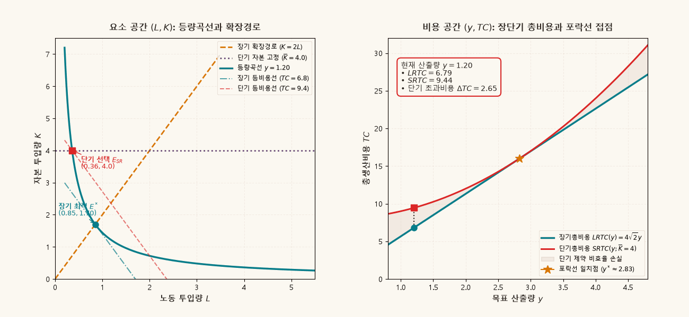
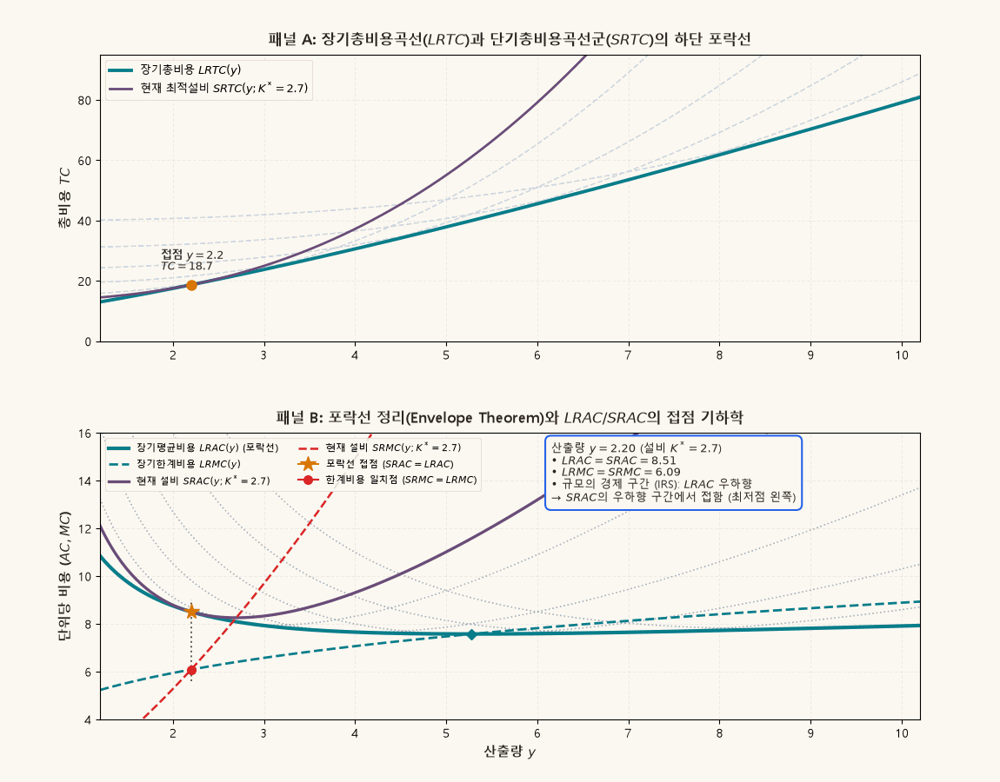

## 1. 개요: 기술적 제약에서 경제적 비용 함수로

생산자이론(Producer Theory)의 핵심 목표는 공학적·물리적 생산함수 $y = f(L, K)$로 기술되는 가능 집합에서 출발하여, 주어진 요소가격 체계 하에서 시장 경쟁과 공급 의사결정의 기초가 되는 **비용함수(Cost Function)**를 유도하는 데 있다.

본 보충자료는 2요소 생산 환경에서 다음의 세 가지 구조적 질문을 기하학과 동적 시각화로 해명한다:

1. **장기 비용최소화와 확장경로**: 기업이 장기적으로 노동($L$)과 자본($K$)을 모두 자유롭게 조절할 수 있을 때, 요소가격비율($w/r$)과 한계기술대체율($MRTS$)의 일치가 그리는 **확장경로(Expansion Path)**는 어떻게 도출되는가?
2. **단기 제약과 비용 비효율**: 자본 설비가 $K = \bar{K}$로 고정된 단기에는 왜 항상 장기보다 같거나 높은 총비용($SRTC \ge LRTC$)이 발생하는가?
3. **포락선 정리(Envelope Theorem)**: 수많은 단기 평균비용곡선($SRAC$)들이 어떻게 장기 평균비용곡선($LRAC$)의 아래에서 매끄럽게 외접(tangent)하며 포락선을 형성하며, 각 산출량 수준에서 장기 한계비용($LRMC$)과 단기 한계비용($SRMC$)은 어떤 일치 관계를 갖는가?

---

## 2. 생산기술과 한계기술대체율 ($MRTS$)

노동 $L$과 자본 $K$를 투입하여 단일 산출물 $y$를 생산하는 매끄러운 생산함수를 $y = f(L, K)$라 하자.

목표 산출량 $y$를 달성하는 요소 투입 묶음들의 집합을 **등량곡선(Isoquant)** $Q(y)$라 한다:

$$
Q(y) = \left\{ (L, K) \in \mathbb{R}_+^2 \;\middle|\; f(L, K) = y \right\}.
$$

등량곡선의 접선 기울기 크기는 노동을 1단위 추가할 때 동일한 산출량을 유지하기 위해 포기해야 하는 자본의 크기를 나타내며, 이를 **한계기술대체율(Marginal Rate of Technical Substitution, $MRTS$)**이라 정의한다:

$$
MRTS_{LK}(L, K) = -\left. \frac{dK}{dL} \right|_{f(L, K)=y} = \frac{\partial f / \partial L}{\partial f / \partial K} = \frac{MP_L}{MP_K}.
$$

생산함수가 준오목(quasiconcave)하면 등량곡선은 원점에 대해 볼록(strictly convex)하며, 노동 투입이 증가할수록 $MRTS$는 체감한다.

---

## 3. 장기 비용최소화와 확장경로 (Expansion Path)

### 장기 비용최소화 문제 (CMP)

요소시장 가격이 임금 $w > 0$, 자본임대료 $r > 0$로 주어져 있을 때, 기업의 장기 비용최소화 문제(Cost Minimization Problem)는 다음과 같다:

$$
\min_{L \ge 0, \, K \ge 0} wL + rK \quad \text{subject to} \quad f(L, K) \ge y.
$$

내부해($L^* > 0, K^* > 0$)에서 1계 조건(First-Order Condition)은 등량곡선과 등비용선(Isocost line)의 접선 조건으로 귀결된다:

$$
MRTS_{LK}(L^*, K^*) = \frac{w}{r} \iff \frac{MP_L}{w} = \frac{MP_K}{r}.
$$

즉, 각 생산요소에 지출된 마지막 1원당 한계생산이 균등해지도록 투입 비율을 결정한다.

### 확장경로 (Expansion Path)

요소가격 $(w, r)$이 고정되어 있을 때, 산출량 $y$를 $0$에서 무한대로 증가시키면서 위 1계 조건을 만족하는 최적 요소 투입점 $(L^*(y), K^*(y))$들을 연결한 자취를 **장기 확장경로(Long-Run Expansion Path)**라 한다.

동차(homogeneous) 생산함수(예: Cobb–Douglas 기술 $y = A L^\alpha K^\beta$)의 경우, 확장경로는 원점을 지나는 선형 방사선(linear ray) 형태를 취한다:

$$
\frac{\alpha K}{\beta L} = \frac{w}{r} \implies K^*(y) = \left( \frac{\beta w}{\alpha r} \right) L^*(y).
$$

이 확장경로 상에서의 최소비용이 바로 **장기 총비용함수(Long-Run Total Cost, $LRTC$)**이다:

$$
LRTC(y; w, r) = w L^*(y) + r K^*(y).
$$

---

## 4. 단기 설비 제약과 단기 비용곡선군

현실의 기업은 산출량을 변경할 때 모든 요소를 즉시 유연하게 바꿀 수 없다. 자본 설비 규모가 $K = \bar{K}$로 고정되어 있는 기간을 **단기(Short-run)**라 한다.

### 단기 총비용 ($SRTC$)

단기에는 목표 산출량 $y$를 생산하기 위해 오직 가변요소인 노동만을 조정해야 한다. 목표 산출 제약 $f(L, \bar{K}) = y$를 풀면 단기 노동 수요함수 $L_{SR}(y; \bar{K})$가 유도된다:

$$
SRTC(y; \bar{K}) = \underbrace{w L_{SR}(y; \bar{K})}_{\text{단기 가변비용 } SRVC} + \underbrace{r \bar{K}}_{\text{단기 고정비용 } SFC}.
$$

장기에는 요소 투입 비율을 $w/r$에 맞추어 최적화할 수 있는 반면, 단기에는 강제로 수평선 $K = \bar{K}$ 위에서 생산해야 하므로 기술적 유연성이 제약된다. 따라서 임의의 $y$와 $\bar{K}$에 대해 다음의 기본 부등식이 성립한다:

$$
SRTC(y; \bar{K}) \ge LRTC(y) \quad (\forall y, \bar{K}).
$$

등호는 오직 산출량 $y$가 해당 자본 설비 $\bar{K}$를 장기적으로 최적 선택하는 수준, 즉 $\bar{K} = K^*(y)$일 때에만 성립한다.

---

## 5. 포락선 정리(Envelope Theorem)와 장단기 비용의 기하학

### 포락선 정리의 해석적 유도

장기 총비용함수는 각 산출량 $y$에 대해 단기 자본 규모 $K$를 최적 선택하는 문제의 가치함수(Value Function)로 표현할 수 있다:

$$
LRTC(y) = \min_{K > 0} SRTC(y; K) = \min_{K > 0} \left[ w L_{SR}(y; K) + rK \right].
$$

최적 설비 규모를 결정하는 1계 조건은 다음과 같다:

$$
\left. \frac{\partial SRTC(y; K)}{\partial K} \right|_{K = K^*(y)} = 0 \iff w \frac{\partial L_{SR}(y; K)}{\partial K} + r = 0.
$$

이제 포락선 정리(Envelope Theorem)를 $y$에 대해 적용하면, 장기 한계비용($LRMC$)은 단기 총비용을 산출량 $y$로 편미분한 뒤 최적 자본 $K^*(y)$를 대입한 값과 정확히 일치한다:

$$
LRMC(y) = \frac{d LRTC(y)}{dy} = \left. \frac{\partial SRTC(y; K)}{\partial y} \right|_{K = K^*(y)} = SRMC(y; K^*(y)).
$$

::: {.callout-important appearance="simple"}
### 정리 5.1 · 장단기 한계비용 및 평균비용의 포락선 일치

임의의 산출량 $y$에서 장기 최적 자본 설비를 $K^* = K^*(y)$라 할 때:

1. **평균비용 외접**: 단기 평균비용은 항상 장기 평균비용 이상이며, 최적 산출점에서 정확히 일치한다:
   $$
   SRAC(y; K^*) = LRAC(y), \qquad SRAC(y'; K^*) > LRAC(y') \quad (\forall y' \ne y).
   $$
2. **한계비용 교차**: 해당 산출량에서 장기 한계비용과 단기 한계비용은 완벽하게 일치한다:
   $$
   LRMC(y) = SRMC(y; K^*).
   $$
:::

### 접점 위치의 비대칭성 (Tangency vs. Minimum)

많은 입문 경제학도들이 "단기 평균비용곡선($SRAC$)의 최저점들이 모여 장기 평균비용곡선($LRAC$)을 이룬다"고 오해한다. 그러나 이는 일반적으로 성립하지 않는다.

$SRAC(y; K) = \frac{SRTC(y; K)}{y}$이므로, 산출량 $y$에 대해 미분하면:

$$
\frac{\partial SRAC}{\partial y} = \frac{1}{y} \left( SRMC - SRAC \right).
$$

마찬가지로 $LRAC(y) = \frac{LRTC(y)}{y}$에 대해:

$$
\frac{d LRAC}{dy} = \frac{1}{y} \left( LRMC - LRAC \right).
$$

$K = K^*(y)$인 접점에서는 $SRAC = LRAC$이고 $SRMC = LRMC$이므로:

$$
\left. \frac{\partial SRAC(y; K)}{\partial y} \right|_{K=K^*(y)} = \frac{d LRAC(y)}{dy}.
$$

이 미분 방정식은 다음의 세 가지 기하학적 귀결을 낳는다:

1. **규모의 경제 구간 ($LRAC$ 우하향, $d LRAC / dy < 0$)**:
   - $\partial SRAC / \partial y < 0$이어야 하므로, $SRAC$가 **우하향하는 영역(최저점의 왼쪽)**에서 $LRAC$와 접한다.
   - 이때 $SRMC < LRMC = SRAC = LRAC$이 성립한다.
2. **최적조업규모 ($LRAC$ 최저점, $d LRAC / dy = 0$)**:
   - $\partial SRAC / \partial y = 0$이므로, $SRAC$의 **최저점**과 $LRAC$의 **최저점**이 정확히 일치한다.
   - 이때 $LRMC = LRAC = SRMC = SRAC$라는 4중 일치가 달성된다.
3. **규모의 비경제 구간 ($LRAC$ 우상향, $d LRAC / dy > 0$)**:
   - $\partial SRAC / \partial y > 0$이어야 하므로, $SRAC$가 **우상향하는 영역(최저점의 오른쪽)**에서 $LRAC$와 접한다.
   - 이때 $SRMC > LRMC = SRAC = LRAC$이 성립한다.

---

## 6. 동적 시각화 1: 확장경로와 단기 제약 비용 쐐기

아래 애니메이션은 목표 산출량 $y$의 변화에 따라 요소 투입 공간 $(L, K)$에서 등량곡선이 확장할 때, 장기 최적점(확장경로)과 단기 고정 설비($\bar{K} = 4.0$)에서의 선택점 괴리, 그리고 우측 패널의 총비용 차이($\Delta TC = SRTC - LRTC \ge 0$)를 보여준다.

{.supplement-graphic fig-alt="요소 공간에서 등량곡선이 팽창함에 따라 장기 확장경로와 단기 자본 고정선 사이의 괴리가 발생하고, 우측 총비용 공간에서 단기 총비용이 장기 총비용 위에 외접하는 애니메이션"}

#### 도표 독해 가이드:
- **좌측 패널 ($(L, K)$ 요소 투입 공간)**:
  - 황금색 파선: 장기 확장경로 ($K = 2L$). 요소가격비율 $w/r = 2.0$과 $MRTS$가 일치하는 최적 자취이다.
  - 청록색 실선: 목표 산출량 $y$에 대응하는 등량곡선 $f(L, K) = y$.
  - 보라색 점선: 단기 자본 설비 제약선 ($K = \bar{K} = 4.0$).
  - 초록색 원 ($E^*$): 장기 비용최소화 투입점.
  - 빨간색 사각 ($E_{SR}$): 단기 투입점. $y = 2.83$일 때를 제외하면 항상 장기 등비용선보다 바깥쪽(빨간 파선)에 위치한다.
- **우측 패널 ($(y, TC)$ 비용 공간)**:
  - 청록색 실선: 장기 총비용 $LRTC(y) = 4\sqrt{2} y$ (원점을 지나는 직선).
  - 빨간색 곡선: 단기 총비용 $SRTC(y; \bar{K}=4) = y^2 + 8$ (아래로 볼록한 포물선).
  - 황금색 별표: $y^* \approx 2.83$에서 $SRTC$가 $LRTC$에 접하며 단기 비용 초과분이 $0$이 된다. 붉은 음영 영역은 단기 제약으로 인한 비효율 비용 손실을 나타낸다.

---

## 7. 동적 시각화 2: $U$자형 비용곡선군과 포락선(Envelope) 동학

아래 애니메이션은 5개의 대표 설비 규모($K_1 < K_2 < K_3 < K_4 < K_5$)를 가진 기업이 산출량 $y$를 확장함에 따라, 연속적인 단기 평균비용곡선($SRAC$)들이 어떻게 장기 평균비용곡선($LRAC$) 포락선을 형성하는지 보여준다.

{.supplement-graphic fig-alt="산출량이 변화함에 따라 단기 평균비용곡선군이 장기 평균비용곡선 포락선에 외접하며, 규모의 경제 구간에서는 우하향 영역, MES에서는 최저점, 규모의 비경제 구간에서는 우상향 영역에서 접하는 애니메이션"}

#### 도표 독해 가이드:
- **패널 A ($(y, TC)$ 총비용 공간)**:
  - 청록색 실선: 장기 총비용곡선 $LRTC(y)$.
  - 회색 파선군: 각 설비 규모별 단기 총비용곡선 $SRTC(y; K)$.
  - 보라색 곡선: 현재 산출량 $y$에 가장 적합한 최적 설비 규모 $K^*(y)$의 $SRTC$. 황금색 점에서 $LRTC$와 정확히 접한다.
- **패널 B ($(y, AC/MC)$ 단위당 비용 공간)**:
  - 두꺼운 청록색 실선: 장기 평균비용곡선 $LRAC(y)$ (모든 $SRAC$의 하단 포락선).
  - 청록색 파선: 장기 한계비용곡선 $LRMC(y)$. $LRAC$의 최저점인 최적조업규모(MES, $y_{MES} \approx 5.28$)에서 $LRAC$를 아래에서 뚫고 올라간다.
  - 두꺼운 보라색 실선: 현재 산출량에 최적화된 설비의 $SRAC(y; K^*(y))$.
  - 붉은색 파선: 현재 설비의 단기 한계비용곡선 $SRMC$.
  - **접점의 위치 이동 관찰**:
    - **$y < y_{MES}$ (규모의 경제 구간)**: 포락선 접점(황금색 별)이 $SRAC$의 **우하향 구간**에 위치한다.
    - **$y = y_{MES}$ (최적조업규모)**: $SRAC$의 최저점과 $LRAC$의 최저점이 완벽하게 일치한다 ($LRMC = LRAC = SRMC = SRAC$).
    - **$y > y_{MES}$ (규모의 비경제 구간)**: 포락선 접점(황금색 별)이 $SRAC$의 **우상향 구간**에 위치한다.
    - 모든 산출량에서 **빨간색 원($SRMC$)과 청록색 파선($LRMC$)은 동일한 수직선 상에서 일치**하여 포락선 정리($LRMC = SRMC$)를 시각적으로 증명한다.

---

## 8. 수치 벤치마크 (Numerical Benchmark)

모형 경제($y = L^{0.4} K^{0.4}$, $w = 2$, $r = 2$, $F_0 = 8$)의 주요 기준점들과 설비 규모별 비용 지표는 다음과 같다.

| 지표 / 산출량 상태 | 소규모 설비 ($K=3.5$) | 최적조업규모 ($MES, K=8.0$) | 대규모 설비 ($K=16.0$) |
| :--- | :---: | :---: | :---: |
| **최적 산출량 ($y^* = K^{0.8}$)** | $2.73$ | $5.28$ | $9.19$ |
| **장기 평균비용 ($LRAC$)** | $8.07$ | $7.58$ (최저점) | $8.28$ |
| **장기 한계비용 ($LRMC$)** | $6.43$ | $7.58$ | $8.72$ |
| **단기 평균비용 ($SRAC(y^*)$)** | $8.07$ (접점) | $7.58$ (접점) | $8.28$ (접점) |
| **단기 한계비용 ($SRMC(y^*)$)** | $6.43$ (일치) | $7.58$ (일치) | $8.72$ (일치) |
| **$SRAC$ 최저점 산출량** | $3.57$ | $5.28$ | $7.78$ |
| **접점과 $SRAC$ 최저점 비교** | 접점이 최저점 **왼쪽** | 접점과 최저점 **완전 일치** | 접점이 최저점 **오른쪽** |
| **규모수익 특성** | 규모의 경제 ($IRS$) | 최적규모 ($CRS$) | 규모의 비경제 ($DRS$) |

---

## 9. 파이썬 애니메이션 재현 스크립트

본 보충자료에 수록된 고해상도 GIF 애니메이션 2종은 리포지토리의 Python 스크립트를 통해 재현할 수 있다:

```bash
# 생산자이론 및 비용 포락선 애니메이션 생성
python scripts/generate_producer_envelope_gifs.py
```

스크립트 구조 및 파라미터:
- `scripts/generate_producer_envelope_gifs.py`:
  - `generate_gif_expansion_path()`: 요소 공간 $(L, K)$ 등량곡선 확장, 확장경로, 단기 자본 고정선 및 총비용 쐐기 애니메이션 생성.
  - `generate_gif_cost_envelope()`: 총비용 공간 및 단위당 비용 공간에서 5대 설비 규모별 $SRAC$와 $LRAC$ 포락선, $LRMC/SRMC$ 일치 동학 애니메이션 생성.
  - Matplotlib `subplots_adjust` 고정 레이아웃을 적용하여 프레임 간 크기 왜곡이나 깜빡임 현상을 방지한다.

---

## 10. 본문 교재 연계 및 심화 질문

### 본문 챕터 바로가기
- [Chapter 02 · 2.2 생산기술의 기하와 규모](../microeconomics/ch02-producer/02-geometry-scale.qmd): 등량곡선, $MRTS$, 오일러 정리와 규모수익의 엄밀한 정의.
- [Chapter 02 · 2.3 비용최소화](../microeconomics/ch02-producer/03-cost-minimization.qmd): 비용최소화 문제의 KKT 조건, 조건부 요소수요함수, 비용함수의 오목성.
- [Chapter 02 · 2.4 생산의 duality](../microeconomics/ch02-producer/04-production-duality.qmd): 비용함수로부터의 기술 복원(Shephard's Lemma)과 포락선 정리.

### 심화 사고 질문
1. **자본의 불가분성과 포락선의 불연속성**:
   현실에서 설비 규모 $K$가 연속적이지 않고 이산적(discrete, 예: 공장 1개, 2개, 3개)으로만 선택 가능하다면, 장기 평균비용곡선 $LRAC$는 매끄러운 곡선이 아닌 부러진 톱니 모양(scalloped envelope)을 띠게 된다. 이때 $LRMC$의 형태는 어떻게 변화하며, $LRMC = SRMC$ 조건은 어떻게 수정되어야 하는가?
2. **자연독점(Natural Monopoly)과 서브애디티비티(Subadditivity)**:
   어떤 산업에서 $LRAC$가 시장 수요 전 구간에서 지속적으로 우하향한다면(강한 규모의 경제), 하나의 기업이 전체 시장 수요를 생산하는 것이 여러 기업이 나누어 생산하는 것보다 비용 면에서 우월하다. 이것이 비용함수의 열가법성(Subadditivity)과 자연독점의 규제 필요성으로 이어지는 논리를 설명하라.
