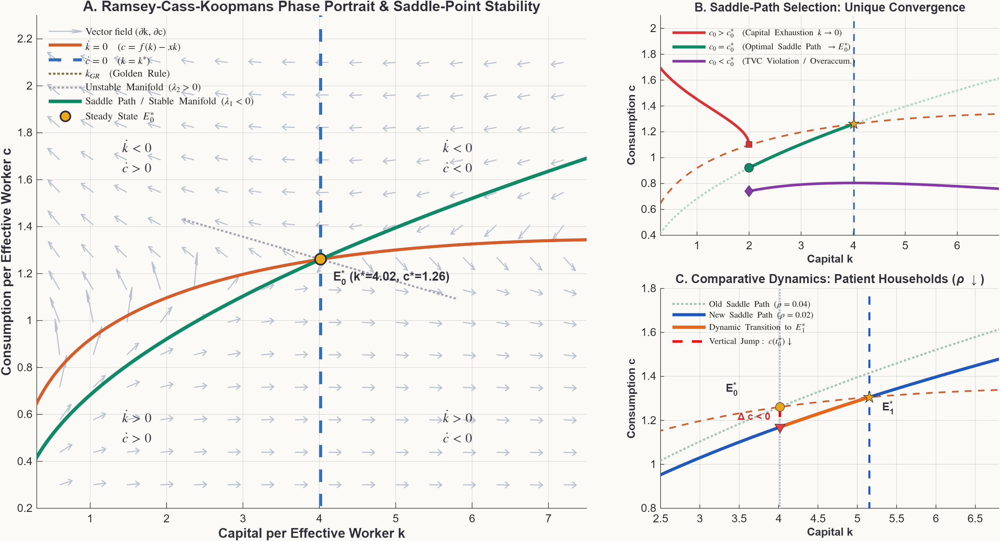
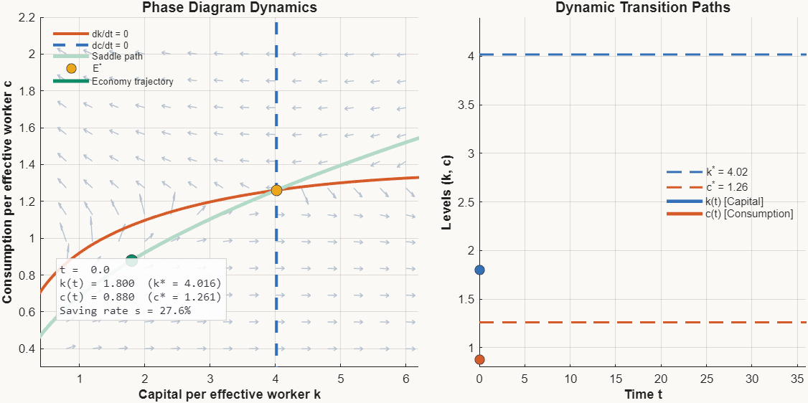
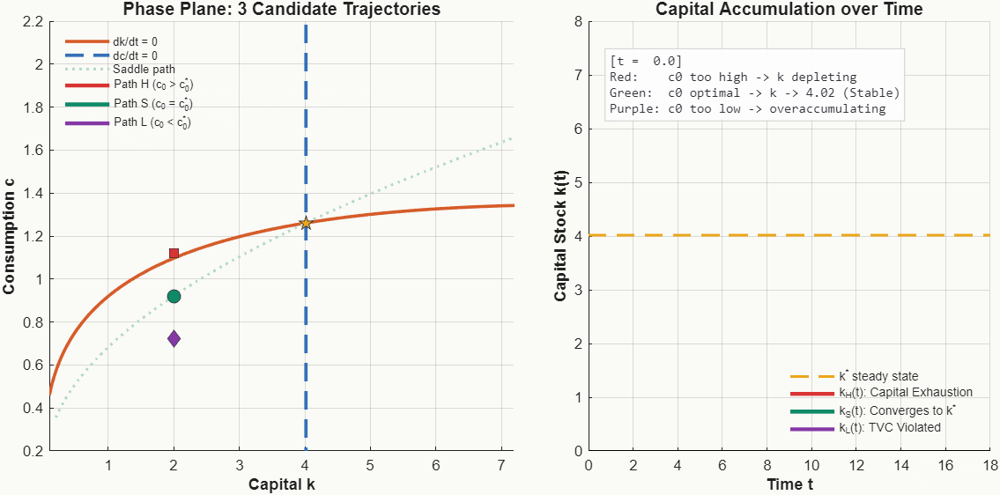
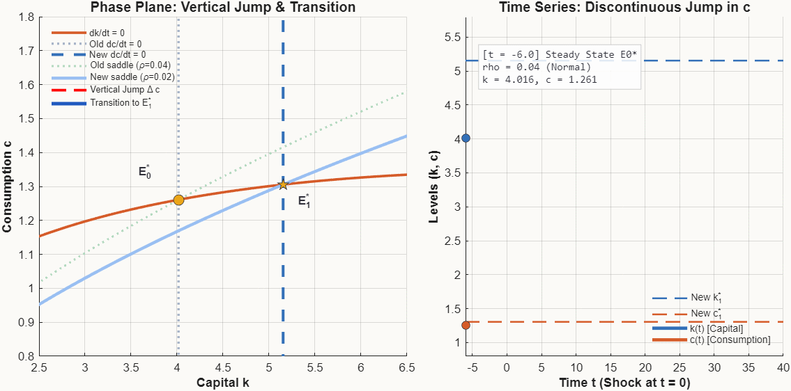

## 목적과 핵심 동학 원리

신고전학파 성장론의 정점인 **Ramsey–Cass–Koopmans (RCK) 모형**은 가계의 시계열적 소비-저축 최적화(Euler 방정식)와 기업의 이윤극대화 기술(신고전학파 생산함수)이 결합된 일반균형 동학 체계이다.

Solow 모형에서는 저축률 $s$가 외생적 상수로 고정되었으나, Ramsey 모형에서는 시장 이자율 $r_t$와 시간선호율 $\rho$의 관계에 따라 가계가 최적 저축률 $s_t$를 내생적으로 결정한다. 이 동학 체계는 수학적으로 **안장점 안정성(Saddle-Path Stability)**이라는 특수한 기하학적 구조를 갖는다.

::: {.callout-note appearance="simple"}
### Ramsey 모형의 3대 핵심 명제

1. **안장점 안정성 (Saddle-Point Stability)**:
   정상상태 $(k^*, c^*)$ 근방의 야코비 행렬은 서로 다른 부호의 고유치 $\lambda_1 < 0 < \lambda_2$를 가진다. 따라서 임의의 초기 자본 $k_0$에 대해 경제가 장기 균형으로 수렴하는 궤적은 오직 1차원 곡선인 **안장경로(Saddle Path / Stable Manifold)**뿐이다.

2. **변수의 성격 분화 (Predetermined vs. Jump Variable)**:
   - **자본 $k_t$ (상태변수, State Variable)**: 과거 투자의 누적물이므로 시간에 대해 연속적이어야 하며 순간적으로 점프할 수 없다 ($k(t_0^+) = k(t_0^-)$).
   - **소비 $c_t$ (도약변수, Jump Variable / Costate Variable)**: 미래 경로에 대한 가계의 기대와 정보에 의해 충격 발생 즉시 **수직으로 도약(jump)**하여 새로운 안장경로에 안착한다.

3. **초기소비의 유일성 (Saddle-Path Selection)**:
   만약 초기 소비를 안장경로보다 미세하게라도 높게 잡으면($c_0 > c_0^*$) 자본이 유한 시간 내 고갈되어 경제가 붕괴하며, 낮게 잡으면($c_0 < c_0^*$) 비효율적 과잉축적으로 횡단성 조건(Transversality Condition, TVC)을 위반한다. 따라서 오직 단 하나의 $c_0$만이 최적 경로로 선택된다.
:::

관련 교재 본문은 [Chapter 07 · Ramsey–Cass–Koopmans 성장모형](../macroeconomics/ch07-ramsey-cks/contents.qmd#s04)의 해당 Section에서 가계 최적화와 오일러 방정식, 위상도와 안장경로, 수정 황금률을 다룬다.

---

## 1. 모형의 미분방정식 체계와 정상상태

유효노동 1단위당 자본 $k_t = K_t / (A_t L_t)$와 유효노동 1단위당 소비 $c_t = C_t / (A_t L_t)$의 동학은 다음 비선형 미분방정식계로 주어진다:

$$
\begin{cases}
\dot{k}_t = f(k_t) - c_t - x k_t, & \quad x \equiv n + g + \delta \\
\dot{c}_t = \dfrac{c_t}{\theta}\left[ f'(k_t) - (\rho + \delta + \theta g) \right]
\end{cases}
$$

여기서 $n$은 인구증가율, $g$는 기술진보율, $\delta$는 감가상각률, $\rho$는 시간선호율, $\theta$는 상대적 위험회피계수(CRRA 파라미터)이다.

수치 계산을 위한 기준 모수 셋업은 다음과 같다:
- 생산함수: $f(k) = k^\alpha$ ($\alpha = 0.33$)
- 유효 감가상각률: $x = n + g + \delta = 0.01 + 0.02 + 0.05 = 0.08$
- 효용함수: $u(c) = \dfrac{c^{1-\theta}-1}{1-\theta}$ ($\theta = 2.0$)
- 기준 시간선호율: $\rho_0 = 0.04$

### 0-경사선 (Nullclines)

1. **자본 0-경사선 ($\dot{k} = 0$)**:
   $$
   c = f(k) - x k = k^{0.33} - 0.08 k.
   $$
   원점에서 출발하여 황금률 자본 $k_{GR}$에서 극대점을 갖고 우하향하는 역U자형 곡선이다. 곡선 위에서는 $\dot{k} < 0$(소비 과다로 자본 잠식), 곡선 아래에서는 $\dot{k} > 0$(저축 풍부로 자본 축적)이다.

2. **소비 0-경사선 ($\dot{c} = 0$)**:
   $$
   f'(k^*) = \alpha (k^*)^{\alpha-1} = \rho + \delta + \theta g \iff k^* = \left( \frac{\alpha}{\rho + \delta + \theta g} \right)^{\frac{1}{1-\alpha}}.
   $$
   소비 수준 $c$와 무관하게 수직선 $k = k^*$로 나타난다. 수직선의 좌측($k < k^*$)에서는 한계생산물이 높아 $\dot{c} > 0$(소비 증가), 우측($k > k^*$)에서는 $\dot{c} < 0$(소비 감소)이다.

### 정상상태와 황금률 비교

$$
\begin{aligned}
k_0^* &= \left( \frac{0.33}{0.04 + 0.05 + 2 \times 0.02} \right)^{\frac{1}{0.67}} = \left( \frac{0.33}{0.13} \right)^{1.4925} \approx 4.0164, \\
c_0^* &= (4.0164)^{0.33} - 0.08 \times 4.0164 \approx 1.5822 - 0.3213 = 1.2609, \\
k_{GR} &= \left( \frac{0.33}{0.08} \right)^{1.4925} \approx 8.2898.
\end{aligned}
$$

$k_0^* \approx 4.016 < k_{GR} \approx 8.290$이므로 경제는 **수정 황금률(Modified Golden Rule)** 하에서 동태적으로 효율적인(dynamically efficient) 영역에 위치한다.

---

## 2. 위상도와 국소 야코비 행렬 분석 (Static Multi-Panel)

정상상태 $E_0^* = (k_0^*, c_0^*)$ 주위에서 1계 테일러 전개로 선형화한 야코비 행렬 $J$는 다음과 같다:

$$
J(k_0^*, c_0^*) =
\begin{pmatrix}
\dfrac{\partial \dot{k}}{\partial k} & \dfrac{\partial \dot{k}}{\partial c} \\
\dfrac{\partial \dot{c}}{\partial k} & \dfrac{\partial \dot{c}}{\partial c}
\end{pmatrix}_{(k_0^*, c_0^*)}
=
\begin{pmatrix}
f'(k_0^*) - x & -1 \\
\dfrac{c_0^*}{\theta} f''(k_0^*) & 0
\end{pmatrix}
=
\begin{pmatrix}
\widetilde{\rho} & -1 \\
J_{21} & 0
\end{pmatrix}.
$$

여기서 $\widetilde{\rho} \equiv \rho + (\theta-1)g - n = 0.04 + 0.02 - 0.01 = 0.05 > 0$이며, $J_{21} = \frac{c_0^*}{\theta} \alpha(\alpha-1)(k_0^*)^{\alpha-2} \approx -0.0137 < 0$이다.

행렬식은:
$$
\det(J) = 0 - (-1) J_{21} = J_{21} < 0.
$$

행렬식이 엄밀히 음수이므로, 두 고유치는 **부호가 서로 반대**이다:
$$
\lambda_1 = -0.0946 < 0 \quad (\text{안정 고유치}), \qquad \lambda_2 = +0.1446 > 0 \quad (\text{불안정 고유치}).
$$

음의 고유치 $\lambda_1$에 대응하는 고유벡터 $v_1 = (v_{1k}, v_{1c})'$는:
$$
(\widetilde{\rho} - \lambda_1) v_{1k} - v_{1c} = 0 \implies \frac{v_{1c}}{v_{1k}} = \widetilde{\rho} - \lambda_1 = 0.05 - (-0.0946) = +0.1446 > 0.
$$

따라서 안장경로는 $(k, c)$ 위상평면에서 **엄밀히 우상향하는 기울기**를 가진다.

{#fig-ramsey-static .supplement-fallback fig-alt="패널 A는 위상도와 벡터장, 4개 분면의 방향 및 안장경로를 보여주며, 패널 B는 3가지 초기소비 궤적의 발산과 수렴, 패널 C는 할인율 하락 충격에 따른 소비의 수직 점프를 보여준다."}

---

## 3. 핵심 동학: Saddle-Path 수렴 애니메이션 (GIF 1)

초기 자본이 정상상태보다 낮은 개발도상 경제($k_0 = 1.8 < k_0^* \approx 4.02$)가 최적 안장경로를 따라 균형으로 수렴하는 동학과 시간경로를 관찰한다.

{#fig-gif-convergence fig-alt="왼쪽 패널에서는 경제 상태점이 안장경로를 따라 우상향으로 이동하여 정상상태로 수렴하고, 오른쪽 패널에서는 자본과 소비가 시간 경과에 따라 정상상태 수준으로 단조 수렴한다."}

### 동학 해설

1. **상태점의 이동**:
   경제는 초기점 $(k_0, c_0) = (1.80, 0.88)$에서 출발하여 제1사분면($\dot{k} > 0, \dot{c} > 0$) 내부의 안장경로를 따라 오른쪽 위로 이동한다.
2. **단조성(Monotonicity)**:
   자본 축적이 진행됨에 따라 한계생산물 $f'(k_t)$는 점차 하락하지만, 여전히 할인율 및 감가상각률의 합보다 크므로($f'(k_t) > \rho + \delta + \theta g$) 소비는 계속 증가한다.
3. **저축률의 점진적 조정**:
   초기에는 자본 축적 유인이 매우 높아 생산량 중 상당 부분을 투자(저축)로 전환하며, 정상상태 $E_0^*$에 근접할수록 저축률은 장기 정상상태 수준($s^* \approx 20.3\%$)으로 수렴한다.

---

## 4. 안장경로 선택 원리: 왜 유일한 초기소비인가? (GIF 2)

Ramsey 모형을 처음 접할 때 가장 빈번히 발생하는 질문은 **"임의의 $k_0$에서 왜 소비 $c_0$는 오직 안장경로 위의 한 점 $c_0^*$로만 결정되어야 하는가?"**라는 의문이다.

아래 애니메이션은 동일한 초기 자본 $k_0 = 2.0$에서 서로 다른 세 가지 초기 소비 $c_0$를 선택했을 때의 경제 궤적을 비교한다:
- **경로 H (적색, $c_0^H = c_0^* + 0.20$)**: 과다 소비
- **경로 S (녹색, $c_0^* = 0.9212$)**: 유일한 안장경로 최적 소비
- **경로 L (자색, $c_0^L = c_0^* - 0.20$)**: 과소 소비

{#fig-gif-divergence fig-alt="초기소비가 너무 높으면 자본이 0으로 급락하여 경제가 붕괴하고, 너무 낮으면 자본이 과잉축적되어 횡단성 조건을 위반하며, 오직 안장경로만이 안정적으로 수렴한다."}

### 수학적 거부 사유 (Elimination of Non-Saddle Trajectories)

::: {.callout-warning}
### 비-안장경로가 균형이 될 수 없는 이유

1. **경로 H ($c_0 > c_0^*$) $\implies$ 자본 고갈 및 자원제약 위배**:
   초기 소비를 조금이라도 높게 설정하면 $\dot{k} < 0$ 영역으로 깊이 들어가 유한한 시간 $T < \infty$ 내에 $k(T) = 0$에 도달한다. 비음(non-negativity) 조건 $k_t \ge 0$과 Inada 조건($\lim_{c\to 0} u'(c) = \infty$)에 의해 자본이 고갈된 후에는 소비가 지속될 수 없으므로 가계의 평생 효용이 극단적으로 붕괴한다. 이는 가계의 최적화 행동과 양립할 수 없다.

2. **경로 L ($c_0 < c_0^*$) $\implies$ 횡단성 조건 (Transversality Condition) 위배**:
   초기 소비를 너무 낮게 설정하면 자본이 끝없이 축적되어 수직선 $k = k^*$를 통과한 뒤 $\dot{c} < 0, \dot{k} > 0$ 영역으로 진입한다. 이때 자본은 $k \to k_{max}$로 치솟지만 소비는 $c \to 0$으로 소멸한다.
   Hamiltonian 체계의 필수 최적성 조건인 **횡단성 조건**:
   $$
   \lim_{t \to \infty} e^{-\widetilde{\rho} t} \lambda_t k_t = \lim_{t \to \infty} e^{-\widetilde{\rho} t} u'(c_t) k_t = 0
   $$
   에서, $c_t \to 0$이면 한계효용 $u'(c_t) \to \infty$로 폭발하여 위 극한값이 0이 되지 못하고 양의 무한대로 발산한다. 즉, 영원히 소비되지 않을 자본을 무한히 축적하는 비효율적인 과잉저축이므로 최적해가 아니다.
:::

따라서 합리적 기대를 하는 가계들은 오직 장기적으로 생존 가능하고 횡단성 조건을 만족하는 유일한 초기 소비 $c_0 = c_0^*$를 정확히 선택한다.

---

## 5. 비교동학: 인내심 증가 충격과 소비의 수직 도약 (GIF 3) {#sec-comparative-dynamics}

가계의 시간선호율(할인율)이 영구적으로 하락하는 충격($\rho_0 = 0.04 \to \rho_1 = 0.02$, 즉 가계가 미래를 더 중시하고 인내심이 강해짐)을 분석한다.

### 충격의 수학적 효과

1. **소비 0-경사선의 우측 이동**:
   $$
   f'(k_1^*) = \rho_1 + \delta + \theta g = 0.02 + 0.05 + 0.04 = 0.11 < 0.13 \implies k_1^* \approx 5.1537 > k_0^* \approx 4.0164.
   $$
   미래를 더 소중히 여기므로 장기 목표 자본 수준이 $4.02$에서 $5.15$로 크게 증가한다.
2. **자본 0-경사선**: 생산기술 및 감가상각률($x$)은 불변이므로 위치가 변하지 않는다.
3. **새로운 안장경로**: 전체적으로 오른쪽으로 이동하며, 기존 자본 수준 $k_0^*$ 위치에서는 새로운 안장경로의 소비가 기존 소비보다 낮아진다 ($c(t_0^+) \approx 1.1693 < c_0^* \approx 1.2609$).

{#fig-gif-shock fig-alt="충격 순간 자본은 연속적으로 유지되지만 소비는 수직으로 하락하여 새로운 안장경로에 안착하고, 이후 자본이 축적되면서 소비도 함께 증가하여 더 높은 신규 정상상태로 도달한다."}

### 시간 구조와 도약 변수의 본질

::: {.callout-tip}
### 왜 자본은 점프하지 못하고 소비는 수직 점프하는가?

- **$k$의 사전결정성 (Predetermined)**:
  자본은 순투자 $\dot{k}_t = I_t - x k_t$의 누적 적분치이므로, 순간적인 시간 $\Delta t \to 0$ 동안 유한한 투자율로는 자본스톡을 비연속적으로 점프시킬 수 없다:
  $$
  k(t_0^+) - k(t_0^-) = \lim_{\epsilon \to 0} \int_{t_0 - \epsilon}^{t_0 + \epsilon} \dot{k}_s ds = 0.
  $$
  따라서 위상평면에서 경제 상태점은 **절대로 수평으로 점프할 수 없다**.

- **$c$의 도약변수(Jump Variable) 성격**:
  소비는 과거의 누적물이 아니라 **가계가 매 순간 즉각 결정하는 의사결정 변수**이다. 가계가 더 인내심을 갖게 되면, 미래의 더 큰 자본과 소비를 만들기 위해 충격 순간 즉각 소비를 $1.261$에서 $1.169$로 **수직 점프 하락($\Delta c \approx -0.092$)**시킨다.
  이로 인해 저축률이 순간적으로 치솟고, $\dot{k} > 0$가 되어 자본 축적이 시작된다. 장기적으로 경제는 $E_1^* = (5.154, 1.306)$에 도달하여 자본뿐만 아니라 소비도 초기보다 더 높은 풍요를 누리게 된다.
:::

---

## 6. 수치해석: 슈팅 알고리즘 (Shooting Algorithm) (GIF 4)

해석적으로 비선형 saddle path의 닫힌 형태(closed form) 해를 구할 수 없는 일반적인 DSGE 모형에서, 컴퓨터는 수치 탐색 알고리즘을 통해 안장경로를 추적한다.

이 문제는 초기 조건 $k(0) = k_0$와 종단 조건 $\lim_{t\to\infty} k(t) = k^*$를 갖는 **2점 경계값 문제(Two-Point Boundary Value Problem, BVP)**이다.

가장 직관적이고 강력한 수치 알고리즘이 바로 **슈팅법(Shooting Method with Bisection)**이다:

```
Algorithm: Bisection Shooting Method for Saddle Path
Input: Initial capital k0, target steady state k*, tolerance eps
Search bracket: [c_low, c_high]

While (c_high - c_low) > eps:
    c_guess = (c_low + c_high) / 2
    Integrate ODE forward from [k0, c_guess] over [0, T]
    
    If trajectory hits k -> 0 (capital exhaustion):
        // Fired too high!
        c_high = c_guess
    Else If trajectory crosses k > k* with c -> 0 (TVC violation):
        // Fired too low!
        c_low = c_guess
        
Return c_guess as c0* on the saddle path
```

![슈팅 알고리즘: (좌) 목표 정상상태 $E^*$를 향해 발사되는 탄도 궤적들, (우) 탐색 구간 $[c_{low}, c_{high}]$의 지수적 수렴 ($2^{-j}$)](../assets/gif/ramsey-shooting-algorithm.gif){#fig-gif-shooting fig-alt="왼쪽 패널에서는 과다 슈팅과 과소 슈팅 궤적들이 번갈아 발사되다가 점점 정상상태로 수렴하고, 오른쪽 패널에서는 상한과 하한이 지수적으로 좁혀진다."}

위 애니메이션에서 볼 수 있듯이, 6회의 이분법 반복만으로 오차는 $|c_0^{(j)} - c_0^*| < 0.003$ 이하로 급격히 축소되며, 매 반복마다 탄도 궤적이 안장경로에 머무는 시간 $T$가 지수적으로 길어진다.

---

## 7. 모형 파라미터 및 수치 메타데이터

본 시각화에 사용된 파라미터와 정상상태 계산값은 [`assets/data/ramsey-saddle-path-metadata.json`](../assets/data/ramsey-saddle-path-metadata.json)에 기록되어 있다:

| 구분 | 기호 | 기준 균형 ($E_0^*$) | 충격 후 균형 ($E_1^*$) | 황금률 ($k_{GR}$) |
|:---|:---:|:---:|:---:|:---:|
| 시간선호율 | $\rho$ | $0.04$ | $0.02$ | - |
| 자본 분배율 | $\alpha$ | $0.33$ | $0.33$ | $0.33$ |
| 상대적 위험회피계수 | $\theta$ | $2.00$ | $2.00$ | - |
| 유효 감가상각률 | $x = n + g + \delta$ | $0.08$ | $0.08$ | $0.08$ |
| **정상상태 자본스톡** | $k^*$ | **$4.0164$** | **$5.1537$** | **$8.2898$** |
| **정상상태 유효소비** | $c^*$ | **$1.2609$** | **$1.3056$** | **$1.3465$** |
| 정상상태 유효생산 | $y^* = (k^*)^\alpha$ | $1.5822$ | $1.7179$ | $2.0097$ |
| 정상상태 저축률 | $s^* = xk^* / y^*$ | $20.31\%$ | $24.00\%$ | $33.00\%$ |
| 안정 고유치 | $\lambda_1$ | $-0.0946$ | $-0.0828$ | - |
| 불안정 고유치 | $\lambda_2$ | $+0.1446$ | $+0.1228$ | - |
| 충격 시 수직 소비도약 | $\Delta c$ | - | **$-0.0916$** ($1.261 \to 1.169$) | - |

: Ramsey–Cass–Koopmans 모형 수치 시뮬레이션 주요 지표 요약 {#tbl-ramsey-summary}

---

## 8. MATLAB 재현 스크립트 안내

본 문서의 모든 정적 도표와 4개 GIF 애니메이션은 단 하나의 독립 MATLAB 스크립트 [`supplements/matlab/ramsey_saddle_path.m`](../supplements/matlab/ramsey_saddle_path.m)에 의해 재현된다.

```bash
# MATLAB R2025b 또는 GNU Octave 환경에서 실행
matlab -batch "run('supplements/matlab/ramsey_saddle_path.m')"
```

### 코드 설계의 핵심 기술적 특징
1. **역시간 적분 (Reverse-Time Integration)**:
   수치적으로 불안정한 안장점 문제를 해결하기 위해, 음의 고유치에 해당하는 고유벡터 방향으로 시간의 부호를 반전($\tau = -t$)시켜 수치 오차 없이 기계 정밀도로 전역 비선형 안장경로를 안정적으로 추출한다.
2. **배경 객체 불변 원칙**:
   애니메이션 렌더링 시 quiver 벡터장, nullcline, 축 등 정적 요소를 매 프레임 다시 그리지 않고 상태점 및 궤적 선의 좌표(`XData`, `YData`)만을 갱신하여 깜빡임 없는 최고 화질의 GIF를 생성한다.
3. **이벤트 함수(ODE Events)**:
   비선형 궤적이 자본 고갈($k \le 0.08$)이나 상한을 초과할 때 적분을 즉시 중단하도록 `odeset`의 `Events` 속성을 구성하여 수치 발산 및 무한 루프를 방지한다.
