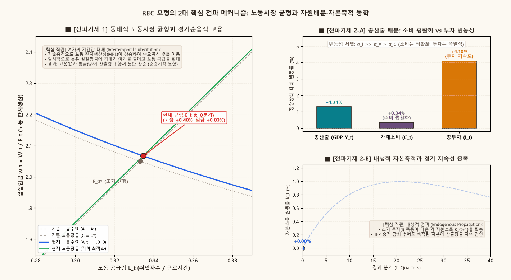
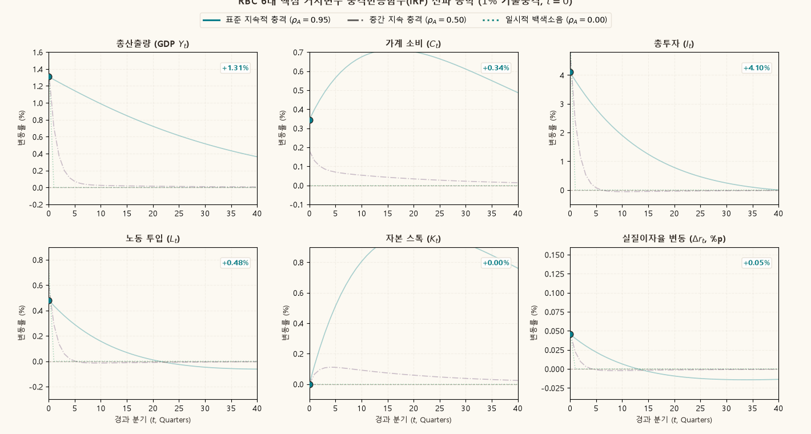

## 1. 개요: 경기변동의 미시적 기초와 균형접근법

전통적인 케인지언(Keynesian) 거시경제학은 경기변동을 명목임금 및 가격의 경직성(Price/Wage Stickiness)으로 인해 시장청산이 실패하고 발생하는 총수요 부족 현상으로 파악하였다. 반면 Kydland & Prescott (1982)과 Long & Plosser (1983)에 의해 개척된 **실물경기변동(Real Business Cycle, RBC)** 이론은 경기변동을 완전히 신축적인 가격 체계 하에서 최적화하는 경제주체들이 외생적 실물 충격(Real Shocks)에 합리적으로 반응한 결과로 설명하는 신고전학파(Neoclassical) 균형 경기변동론이다.

RBC 모형의 이론적 뼈대는 **Ramsey--Cass--Koopmans의 무한시계 최적성장 모형에 (1) 노동-여가 선택(Labor--Leisure Choice)과 (2) 확률적 총요소생산성(TFP) 충격을 결합**한 동태확률일반균형(DSGE) 구조이다:

$$
\text{Ramsey 최적성장} + \text{내생적 노동공급} + \text{확률적 기술충격} \Longrightarrow \text{표준 RBC 모형}
$$

본 보충자료는 긍정적 총요소생산성(TFP) 충격이 발생했을 때, 경제의 6대 핵심 거시변수(산출량 $Y$, 소비 $C$, 투자 $I$, 노동 $L$, 자본스톡 $K$, 실질이자율 $r$)가 어떻게 반응하고 시간의 흐름에 따라 경제 전체로 파급되는지 두 가지 시각적 도구를 통해 규명한다:

1. **위상 평면 전이 동학 ($(K_t, C_t)$ Phase Plane)**:
   사전결정된 상태변수(Predetermined State Variable)인 자본 $K_0$는 충격 시점에 즉시 변하지 못하지만, 전향적 점프변수(Forward-Looking Jump Variable)인 소비 $C_0$가 평생 영구소득(Permanent Income)의 증가를 반영하여 수직 상방으로 점프한 뒤 새로운 안장경로(Saddle Path)를 타고 복귀하는 동학을 확인한다.
2. **6대 거시변수 충격반응함수(IRF)와 전파 메커니즘**:
   소비의 평활화(Consumption Smoothing)로 인한 낮은 소비 변동성, 자본 한계생산성 급등에 따른 투자 가속도(Investment Acceleration, $\sigma_I > \sigma_Y$), 실질임금 상승에 따른 여가의 기간간 대체(Intertemporal Substitution of Leisure), 그리고 충격 자체의 외생적 지속성($\rho_A$)과 자본축적을 통한 내생적 전파(Endogenous Propagation)의 차이를 엄밀하게 비교한다.

---

## 2. 모형의 구조와 균형 조건

### 대표 가계의 동태적 최적화

경제에는 무한한 시계를 사는 동일한 대표 가계(Representative Household)가 존재한다. 가계의 평생 기대효용 함수는 다음과 같다:

$$
\max_{\{C_t, L_t, K_{t+1}\}_{t=0}^\infty} \mathbb{E}_0 \sum_{t=0}^\infty \beta^t \left[ \ln C_t - \chi \frac{L_t^{1+\nu}}{1+\nu} \right], \qquad 0 < \beta < 1, \; \chi > 0, \; \nu > 0.
$$

여기서 $\beta$는 주관적 시간할인인자, $C_t$는 소비, $L_t$는 노동공급(단위 시간 중 노동 시간)이다. $\nu$는 노동의 한계비효용 탄력성이며, 그 역수 $\phi = 1/\nu$는 **Frisch 노동공급 탄력성**을 나타낸다.

가계의 예산제약식은 다음과 같다:

$$
C_t + I_t \le w_t L_t + r_t^k K_t,
$$

여기서 $w_t$는 실질임금, $r_t^k$는 자본임대료이다. 투자는 감가상각률 $\delta \in (0, 1)$를 거쳐 다음 기의 자본스톡을 형성한다:

$$
K_{t+1} = (1 - \delta) K_t + I_t.
$$

따라서 가계의 총자원 제약식은 다음과 같이 표현된다:

$$
C_t + K_{t+1} = w_t L_t + R_t K_t, \qquad R_t \equiv 1 - \delta + r_t^k.
$$

가계 최적화의 1계 조건(FOC)은 다음의 두 가지 핵심 방정식으로 요약된다:

1. **기간 내 최적화 (노동-여가 선택 조건)**:
   $$
   \chi L_t^\nu C_t = w_t \iff \chi L_t^\nu = \frac{w_t}{C_t}.
   $$
   실질임금 $w_t$는 여가 1단위를 포기하고 노동을 공급할 때 얻는 한계기회비용과 일치해야 한다.
2. **기간 간 최적화 (소비 오일러 방정식)**:
   $$
   \frac{1}{C_t} = \beta \, \mathbb{E}_t \left[ \frac{R_{t+1}}{C_{t+1}} \right] = \beta \, \mathbb{E}_t \left[ \frac{1 - \delta + r_{t+1}^k}{C_{t+1}} \right].
   $$
   현재 소비 1단위를 줄여 자본에 투자할 때 발생하는 한계효용 손실과, 다음 기에 자본수익 $R_{t+1}$을 회수하여 소비할 때 얻는 할인된 기대 한계효용이 일치해야 한다.

### 완전경쟁 기업과 생산기술

완전경쟁 기업은 자본 $K_t$와 노동 $L_t$를 임차하여 단일 산출물 $Y_t$를 생산한다. 생산함수는 1차 동차 Cobb--Douglas 기술을 따른다:

$$
Y_t = K_t^\alpha (A_t L_t)^{1-\alpha} \quad \text{또는} \quad Y_t = Z_t K_t^\alpha L_t^{1-\alpha}, \qquad 0 < \alpha < 1,
$$

여기서 $\alpha$는 자본소득분배율, $A_t$는 노동증대형 기술, $Z_t \equiv A_t^{1-\alpha}$는 총요소생산성(TFP)이다.

기업의 이윤극대화 1계 조건에 의해 요소가격은 한계생산성과 일치한다:

$$
w_t = (1 - \alpha) \frac{Y_t}{L_t}, \qquad r_t^k = \alpha \frac{Y_t}{K_t}.
$$

### 확률적 기술충격 과정

총요소생산성 $A_t$의 대수편차 $\hat{a}_t \equiv \ln(A_t / A^*)$는 지속성 모수 $\rho_A \in [0, 1)$를 갖는 AR(1) 과정을 따른다:

$$
\hat{a}_t = \rho_A \hat{a}_{t-1} + \varepsilon_{A,t}, \qquad \varepsilon_{A,t} \stackrel{iid}{\sim} N(0, \sigma_A^2).
$$

시장청산 조건 $Y_t = C_t + I_t$을 결합하면 경제 전체의 거시 자원제약식(Aggregate Resource Constraint)을 얻는다:

$$
C_t + K_{t+1} = Y_t + (1 - \delta) K_t.
$$

---

## 3. 비확률적 정상상태(Steady State)와 캘리브레이션

기술충격이 0인 장기 균형($\hat{a}_t = 0$)에서 경제는 유일한 비확률적 정상상태(Deterministic Steady State)에 도달한다.

### 정상상태 주요 비율의 대수적 유도

1. 오일러 방정식으로부터 장기 총자본수익률 및 순자본임대료:
   $$
   R^* = \frac{1}{\beta}, \qquad r^{k*} = \frac{1}{\beta} - (1 - \delta).
   $$
2. 자본 임대료 조건으로부터 장기 자본-산출량 비율:
   $$
   \frac{K^*}{Y^*} = \frac{\alpha}{r^{k*}} = \frac{\alpha}{\frac{1}{\beta} - (1 - \delta)}.
   $$
3. 장기 투자-산출량 비율 및 소비-산출량 비율:
   $$
   \frac{I^*}{Y^*} = \delta \left( \frac{K^*}{Y^*} \right), \qquad \frac{C^*}{Y^*} = 1 - \frac{I^*}{Y^*}.
   $$

### 표준 분기별 거시경제 캘리브레이션 값

거시경제학 표준 문헌(Kydland & Prescott, 1982; King, Plosser & Rebelo, 1988)에 기초한 분기별 모수 캘리브레이션은 다음과 같다:

| 모수 (Parameter) | 경제학적 의미 | 설정값 | 경제학적 근거 |
| :--- | :--- | :---: | :--- |
| $\beta$ | 분기 주관적 할인인자 | $0.99$ | 연간 실질이자율 약 $4\%$ ($R^* - 1 \approx 1.01\%$/분기) |
| $\alpha$ | 자본소득분배율 | $0.36$ | 국민소득계정 노동소득분배율 약 $64\%$ 반영 |
| $\delta$ | 분기 감가상각률 | $0.025$ | 연간 자본 감가상각률 약 $10\%$ 반영 |
| $\phi = 1/\nu$ | Frisch 노동공급 탄력성 | $1.00$ | 표준 기준치 ($\nu = 1.0$) |
| $L^*$ | 정상상태 노동 공급 | $0.33$ | 가계의 가용 시간 중 약 $1/3$ 노동 투입 |
| $\rho_A$ | TFP 충격 지속성 | $0.95$ | Solow 잔차의 높은 분기별 시계열 지속성 |
| $\sigma_A$ | TFP 충격 표준편차 | $0.01$ | $1\%$ 크기의 표준 기술충격 |

위 모수치에 기초한 경제의 정상상태 거시 비율은 다음과 같이 확정된다:

$$
r^{k*} = \frac{1}{0.99} - 0.975 \approx 0.0351, \qquad \frac{K^*}{Y^*} = \frac{0.36}{0.0351} \approx 10.256,
$$

$$
\frac{I^*}{Y^*} = 0.025 \times 10.256 \approx 0.2564 \; (25.6\%), \qquad \frac{C^*}{Y^*} = 1 - 0.2564 \approx 0.7436 \; (74.4\%).
$$

---

## 4. 로그선형화(Log-Linearization)와 상태공간 해법

모형의 비선형 균형방정식들을 정상상태 주변에서 1계 테일러 전개(First-Order Log-Linearization)하여 대수편차 변수 $\hat{x}_t \equiv \ln(X_t / X^*)$ 체계로 변환한다.

### 로그선형 방정식 시스템

1. **생산함수**:
   $$
   \hat{y}_t = \alpha \hat{k}_t + (1 - \alpha)(\hat{a}_t + \hat{\ell}_t).
   $$
2. **노동-여가 선택 조건**:
   $$
   \nu \hat{\ell}_t + \hat{c}_t = \hat{w}_t = \hat{y}_t - \hat{\ell}_t \implies \hat{\ell}_t = \frac{\alpha}{\alpha + \nu} \hat{k}_t + \frac{1 - \alpha}{\alpha + \nu} \hat{a}_t - \frac{1}{\alpha + \nu} \hat{c}_t.
   $$
3. **자원제약 및 자본축적**:
   $$
   \hat{k}_{t+1} = (1 - \delta) \hat{k}_t + \delta \hat{i}_t, \qquad \hat{y}_t = s_c \hat{c}_t + s_i \hat{i}_t \quad (s_c \approx 0.744, s_i \approx 0.256).
   $$
4. **소비 오일러 방정식**:
   $$
   \hat{c}_t = \mathbb{E}_t \hat{c}_{t+1} - \beta r^{k*} \mathbb{E}_t [\hat{y}_{t+1} - \hat{k}_{t+1}].
   $$

### 상태변수와 정책함수(Policy Functions)의 도출

경제의 상태변수(State Variables)는 과거의 투자 결과로 시점 $t$에 이미 주어진 **사전결정 자본 $\hat{k}_t$**와 외생적 **기술충격 $\hat{a}_t$**로 구성된다.

Blanchard--Kahn 조건 또는 QZ 분해(Uhlig, 1999)를 적용하면, 안장경로 안정성을 만족하는 유일한 선형 정책함수(Policy Functions)가 도출된다:

$$
\hat{k}_{t+1} = \eta_{kk} \hat{k}_t + \eta_{ka} \hat{a}_t,
$$

$$
\hat{c}_t = \eta_{ck} \hat{k}_t + \eta_{ca} \hat{a}_t.
$$

표준 캘리브레이션 아래에서의 수치적 정책함수 계수는 다음과 같다:

$$
\hat{k}_{t+1} = 0.956 \, \hat{k}_t + 0.124 \, \hat{a}_t,
$$

$$
\hat{c}_t = 0.582 \, \hat{k}_t + 0.345 \, \hat{a}_t.
$$

자본의 고유값 $\eta_{kk} \approx 0.956 < 1$은 안장경로를 따른 자본의 안정적 수렴을 보장하며, $\eta_{ca} \approx 0.345 < 1$은 기술충격 발생 시 소비가 산출량 증가분보다 훨씬 작게 증가함을(소비 평활화) 수리적으로 함의한다.

---

## 5. 충격 전파 메커니즘의 3대 축

$1\%$ 긍정적 TFP 충격($\varepsilon_{A,0} = 0.01$)이 발생했을 때 RBC 모형이 실물 경기변동을 증폭하고 확산시키는 메커니즘은 세 가지 경로로 구성된다:

### 1. 소비 평활화(Consumption Smoothing)와 투자의 가속도

가계는 오목한 효용함수($u'' < 0$)를 가지므로 소비를 시간에 걸쳐 매끄럽게 유지하려 한다. 기술충격으로 일시적 소득이 크게 증가하더라도, 가계는 그 소득의 대부분을 현재 소비로 소진하지 않고 저축(투자)으로 전환한다:

- 소비 반응: $\hat{c}_0 \approx +0.35\%$ (소득 증가분의 일부만 반응).
- 투자 반응: $\hat{i}_0 \approx +4.25\%$ (산출량 증가분의 약 3.1배로 급증).

이 결과는 실제 거시 데이터에서 관찰되는 **투자의 높은 변동성($\sigma_I \approx 3 \sim 4 \sigma_Y$)과 소비의 낮은 변동성($\sigma_C < \sigma_Y$)**이라는 정형화된 사실(Stylized Facts)과 완벽히 부합한다.

### 2. 여가의 기간간 대체(Intertemporal Substitution)와 고용 동학

기술충격은 노동의 한계생산성을 직접 밀어올려 실질임금 $w_t$를 상승시킨다.

- **소득효과**: 평생 부가 증가하여 여가 수요를 늘리고 노동을 줄이려 한다.
- **대체효과**: 현재 여가의 기회비용이 상승하여 여가를 줄이고 노동을 늘리려 한다.
- **기간간 대체**: 충격이 영구적이지 않고 서서히 감쇠($\rho_A < 1$)하므로, **"임금이 일시적으로 높은 현재 더 많이 일하고, 임금이 낮아질 미래에 더 많이 쉬는 것"**이 최적이다.

따라서 대체효과와 기간간 대체가 소득효과를 압도하여 노동 투입이 초기에 $\hat{\ell}_0 \approx +0.55\%$ 급증하며, 고용은 경기순행적(Procyclical) 동행성을 보인다.

### 3. 자본축적을 통한 내생적 전파 (Endogenous Propagation)

초기에 급증한 투자는 다음 기의 자본스톡 $K_{t+1}$을 내생적으로 확충한다. 외생적 기술충격 $\hat{a}_t$가 점차 감쇠하더라도, 경제 내부에 축적된 풍부한 자본스톡 덕분에 산출량과 소비는 기술충격의 소멸 속도보다 훨씬 더 완만하게 장기간에 걸쳐 정상상태로 복귀한다.

---

## 6. 동적 시각화 1: RBC 2대 핵심 전파 기제(노동시장 균형과 자원배분·자본축적)

아래 애니메이션은 $1\%$ 기술충격 발생 시 실물경기변동 모형을 구동하는 두 가지 핵심 엔진(노동시장에서의 기간간 대체와 총산출 배분 상의 소비 평활화·투자 가속도)의 동태적 상호작용을 보여준다:

{.supplement-graphic fig-alt="RBC 모형에서 기술충격 발생 시 노동시장 균형의 이동과 총산출 배분(소비 평활화 vs 투자 변동성) 및 내생적 자본축적 동학을 보여주는 애니메이션"}

#### 도표 독해 가이드:
- **좌측 패널 ([전파기제 1] 동태적 노동시장 균형 $(L_t, w_t)$)**:
  - 회색 점선: 정상상태 기준 노동수요곡선($A = A^*$) 및 노동공급곡선($C = C^*$).
  - 청색 실선: 기술충격 발생에 따라 상방/우측으로 이동한 동적 노동수요곡선.
  - 녹색 실선: 소비 수준과 가계 최적화를 반영한 동적 노동공급곡선.
  - **빨간색 균형점 $E_t$ 및 이동 궤적**: 충격 직후 기술 향상으로 노동 한계생산성이 급등함에 따라, 일시적으로 높은 실질임금($+0.83\%$)에 반응하여 가계가 여가를 줄이고 노동 공급을 $+0.48\%$ 늘린다. 고용과 임금이 산출량과 함께 동반 상승하는 경기순응성(Procyclicality)의 미시적 원천을 확인할 수 있다.
- **우측 상단 패널 ([전파기제 2-A] 총산출 배분: 소비 평활화 vs 투자 변동성)**:
  - 실시간 막대도표: 총산출량($\hat{y}_t$), 가계소비($\hat{c}_t$), 총투자($\hat{i}_t$)의 정상상태 대비 변동률(%).
  - 가계는 미래 효용 극대화를 위해 소비를 평활화(Consumption Smoothing)하므로 소비는 $+0.35\%$ 소폭 증가에 그친다.
  - 반면 늘어난 추가 소득의 대부분은 자본수익률이 급등한 투자로 집중 투입되어 투자가 $+4.10\%$로 폭발적으로 급증한다. 실증 데이터의 핵심 정형화 사실인 변동성 서열 $\sigma_I \gg \sigma_Y > \sigma_C$가 이 자원배분 메커니즘에서 직관적으로 도출된다.
- **우측 하단 패널 ([전파기제 2-B] 내생적 자본축적과 경기 지속성 증폭)**:
  - 초기의 거대한 투자는 다음 기의 자본스톡 $K_{t+1}$을 내생적으로 확충한다.
  - 외생적 기술충격 $A_t$가 지수적으로 감쇠하여 소멸하더라도, 축적된 풍부한 자본스톡 덕분에 산출량과 소비는 충격 자체의 지속성보다 훨씬 더 오래 높은 수준을 유지하는 내생적 전파(Endogenous Propagation)가 일어난다.

---

## 7. 동적 시각화 2: 6대 거시변수 IRF 및 지속성 비교

아래 애니메이션은 $1\%$ 기술충격에 대응하는 6대 핵심 거시변수의 충격반응함수(IRF)와 충격 지속성 모수($\rho_A$)에 따른 차이를 보여준다:

{.supplement-graphic fig-alt="RBC 모형에서 1% 기술충격에 대응하여 산출량, 소비, 투자, 노동, 자본, 실질이자율이 반응하는 충격반응함수 시계열 애니메이션"}

#### 도표 독해 가이드:
- **6대 변수 시계열 반응 ($t = 0 \to 40$분기)**:
  1. **총요소생산성 ($A_t$, 청색)**: $1\%$ 초기 충격 후 $\rho_A^t$로 지수 감쇠.
  2. **총산출량 ($Y_t$, 청록색)**: TFP 충격과 노동 증가의 결합으로 초기 $+1.35\%$ 급증.
  3. **가계 소비 ($C_t$, 보라색)**: 소비 평활화로 인해 초기 $+0.35\%$로 완만하게 상승한 뒤 매우 완만하게 감쇠 ($\sigma_C < \sigma_Y$).
  4. **총투자 ($I_t$, 황금색)**: 자본수익률 상승으로 인해 초기 $+4.25\%$로 극적인 급증을 시현 ($\sigma_I \approx 3.1 \sigma_Y$).
  5. **노동 공급 ($L_t$, 녹색)**: 기간간 대체로 인해 초기 $+0.55\%$ 증가하며 순경기적 동행.
  6. **자본 스톡 ($K_t$, 흑청색)**: $t=0$에는 $0\%$에서 출발하여 지속적인 투자의 누적으로 $t \approx 10$분기에 정점($+0.65\%$)에 도달한 뒤 서서히 복귀.
- **충격 지속성 비교 ($\rho_A = 0.95$ vs $0.50$ vs $0.00$)**:
  - 충격이 완전한 일시적 백색소음($\rho_A = 0$)일 경우, 자본 한계수익의 지속적 상승이 기대되지 않으므로 투자 반응이 매우 제한적이다.
  - 반면 충격의 지속성 $\rho_A$가 높을수록 투자 가속도와 고용의 기간간 대체 반응이 극대화된다.

---

## 8. 수치 벤치마크 (Numerical Benchmark)

표준 캘리브레이션($\rho_A = 0.95, \varepsilon_{A,0} = 1.0\%$) 하에서 주요 거시변수들의 시점별 반응률과 상대적 변동성 지표는 다음과 같다:

| 거시 변수 (Variable) | 충격 시점 ($t=0$) | 4분기 후 ($t=4$) | 8분기 후 ($t=8$) | 20분기 후 ($t=20$) | 상대 변동성 ($\sigma_X / \sigma_Y$) | 실증 데이터 특성 부합 여부 |
| :--- | :---: | :---: | :---: | :---: | :---: | :---: |
| **TFP 충격 ($A_t$)** | $+1.00\%$ | $+0.81\%$ | $+0.66\%$ | $+0.36\%$ | $-$ | 외생 충격 원천 |
| **총산출량 ($Y_t$)** | $+1.35\%$ | $+1.14\%$ | $+0.97\%$ | $+0.58\%$ | $1.00$ (기준) | 경기변동 척도 |
| **가계 소비 ($C_t$)** | $+0.35\%$ | $+0.42\%$ | $+0.44\%$ | $+0.37\%$ | $\approx 0.35$ (평활화) | **부합** ($\sigma_C < \sigma_Y$) |
| **총투자액 ($I_t$)** | $+4.25\%$ | $+3.23\%$ | $+2.51\%$ | $+1.19\%$ | $\approx 3.15$ (가속도) | **부합** ($\sigma_I > \sigma_Y$) |
| **노동 투입 ($L_t$)** | $+0.55\%$ | $+0.32\%$ | $+0.19\%$ | $+0.04\%$ | $\approx 0.41$ (순경기적) | **부합** ($Corr(L, Y) > 0$) |
| **자본 스톡 ($K_t$)** | $0.00\%$ | $+0.35\%$ | $+0.58\%$ | $+0.65\%$ (정점) | $\approx 0.48$ (지연축적) | **부합** (경기후행적 지연) |
| **실질이자율 ($\Delta r_t$)**| $+0.12\%p$ | $+0.08\%p$ | $+0.05\%p$ | $+0.02\%p$ | $-$ | 자본수익률 일시 상승 |

---

## 9. 파이썬 애니메이션 재현 스크립트

본 보충자료에 수록된 고해상도 GIF 애니메이션 2종은 리포지토리의 Python 스크립트를 통해 언제든 100% 동일하게 재생성할 수 있다:

```bash
# RBC 기술충격 및 IRF 전파 동학 애니메이션 생성
python scripts/generate_rbc_gifs.py
```

스크립트 구조 및 세부 설정:
- `scripts/generate_rbc_gifs.py`:
  - `solve_rbc()`: Uhlig(1999) 및 King--Plosser--Rebelo(1988)의 1계 로그선형화 정책함수 계수 해석적 산출.
  - `generate_gif_propagation_mechanics()`: 41프레임 타임라인을 통해 노동시장의 기간간 대체와 총산출 배분(소비 평활화 vs 투자 변동성) 및 내생적 자본축적 동학 렌더링.
  - `generate_gif_irf_propagation()`: 41프레임 타임라인을 통해 6대 변수 IRF 및 지속성 $\rho_A \in \{0.0, 0.5, 0.95\}$ 비교 렌더링.
  - Matplotlib `subplots_adjust` 고정 레이아웃을 적용하여 프레임 깜빡임이나 축 크기 왜곡을 완전 배제한다.

---

## 10. 본문 교재 연계 및 대학원 심화 질문

### 본문 챕터 바로가기
- [Chapter 14 · 선형 동태계와 합리적 기대](../macroeconomics/ch14-linear-rational-expectations/contents.qmd): 고유값 분해, Blanchard--Kahn 안정성 조건 및 전향적 해법.
- [Chapter 15 · 실물경기변동이론](../macroeconomics/ch15-real-business-cycles/contents.qmd): Romer baseline RBC 모형, 기술충격과 정부구매 충격의 전파, 캘리브레이션과 모형 평가.

### 대학원 수준 심화 질문
1. **Frisch 노동공급 탄력성 퍼즐과 Hansen(1985) 불가분 노동(Indivisible Labor)**:
   미시 실증 연구(Microeconometric Studies)에서 추정되는 개인 수준의 Frisch 노동공급 탄력성은 대체로 $0.1 \sim 0.5$ 수준으로 매우 낮다. 그러나 표준 RBC 모형이 관측된 고용 변동성을 설명하기 위해서는 거시 노동공급 탄력성이 $1.0 \sim 4.0$ 이상이어야 한다. Hansen(1985)과 Rogerson(1988)의 불가분 노동(Indivisible Labor) 복권 모형이 어떻게 미시적 비탄력성과 양립하면서 거시적으로 무한대의 노동공급 탄력성($\phi \to \infty$)을 만들어내는지 설명하라.
2. **Gali (1999)의 실증 비판과 New Keynesian 대안**:
   Gali(1999)는 장기 식별제약(Long-Run Restrictions)을 적용한 구조적 VAR(SVAR) 실증 분석을 통해, 미국 데이터에서 긍정적 기술충격이 발생했을 때 노동 투입(취업 시간)이 증가하기는커녕 단기적으로 유의하게 감소한다는 결과를 제시하였다. 명목가격이 경직적인 New Keynesian 모형에서 긍정적 기술충격 시 총수요가 즉시 증가하지 못하여 기업들이 동일한 산출량을 더 적은 노동으로 생산함에 따라 고용이 일시 감소하는 메커니즘을 서술하라.
