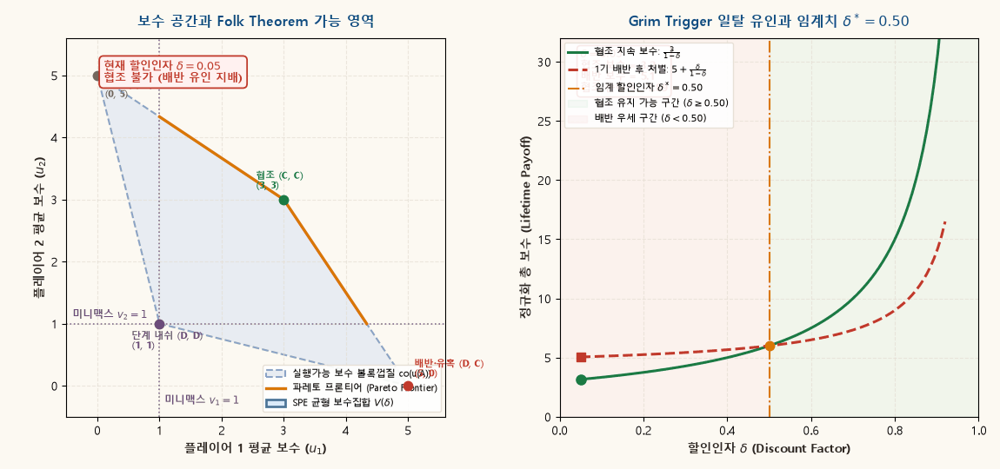
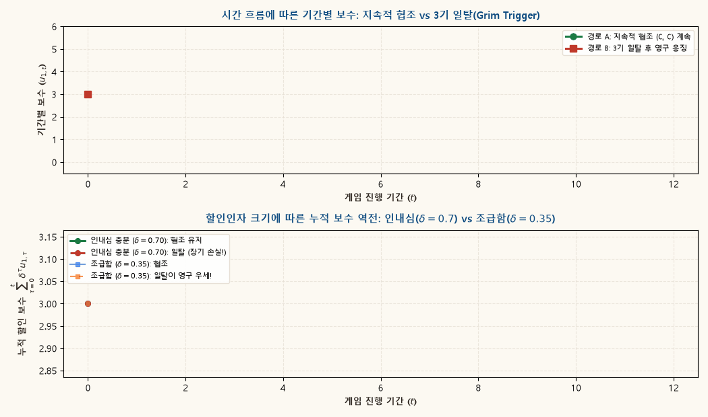

## 1. 개요: 1회성 게임의 딜레마와 무한반복의 힘

1회성 죄수의 딜레마(Prisoner's Dilemma)에서 각 플레이어는 상대방의 선택과 무관하게 배반(Defect, $D$)하는 것이 엄격한 우월전략(Strictly Dominant Strategy)이다. 그 결과 유일한 내쉬 균형인 $(D, D)$는 상호 협조 $(C, C)$에 비해 파레토 비효율적인 비극적 귀결을 낳는다. 유한 횟수 $T$번 반복되는 게임에서도 후진귀납법(Backward Induction)에 의해 마지막 기의 배반이 첫 기까지 역진 전파되어 어떠한 협조도 성립할 수 없다.

그러나 현실의 기업 간 경쟁, 국제 외교, 고용 관계, 금융 거래는 일회성으로 끝나지 않으며, **관계의 종료 시점이 불확실하거나 미래가 지속되는 무한반복(Infinitely Repeated)** 환경에서 전개된다. 내일 이후의 상호작용이 약속되어 있을 때, 플레이어는 단기적인 배반의 유혹(Short-run temptation)과 장기적인 보복에 따른 미래 보수 손실(Long-run punishment)을 저울질하게 된다.

본 보충자료는 무한반복게임(Infinitely Repeated Game)에서 비협조적 개인들이 어떻게 장기적 협조(Cooperation)를 제도나 외부 집행자 없이 자생적으로 유지할 수 있는지 그 수리적·기하학적 원리를 규명한다:

1. **실행가능 보수 집합과 볼록껍질(Convex Hull)**:
   - 순수 행동 프로파일들의 보수 벡터들이 이루는 볼록 결합 $\text{co}(u(A))$의 기하학적 형태를 정의한다.
2. **미니맥스(Minimax) 보수와 개인적 합리성(Individual Rationality)**:
   - 상대방들이 공모하여 줄 수 있는 최악의 보수인 미니맥스 수준 $v_i$와, 합리적 행위자가 장기적으로 수용할 수 있는 하한선을 도출한다.
3. **포크 정리(Folk Theorems)**:
   - 플레이어들이 미래를 충분히 중요하게 여길 때(할인인자 $\delta \to 1$), 실행가능하고 엄격히 개인적으로 합리적인 모든 보수 벡터가 부분게임 완전균형(SPE)으로 달성될 수 있음을 증명한다 (Friedman 1971; Fudenberg and Maskin 1986).
4. **동적 시각화와 일탈 유인(Incentive Constraints)**:
   - 2종의 고해상도 시뮬레이션을 통해 $\delta$의 증가에 따른 SPE 보수 집합의 팽창 기하학과, Grim Trigger 전략 아래에서의 일탈 유인 및 임계 할인인자 $\delta^*$의 역학을 직관적으로 탐색한다.

---

## 2. 무한반복게임의 기본 객체와 시간 선호

### 단계게임(Stage Game) $G$

기본이 되는 정적 2인 전략형 게임을 $G = \langle \{1, 2\}, (A_i)_{i=1,2}, (u_i)_{i=1,2} \rangle$라 하자.
- $A_i$: 플레이어 $i$의 유한 행동 집합 ($A = A_1 \times A_2$).
- $u_i: A \to \mathbb{R}$: 플레이어 $i$의 단계게임 보수함수.

표준 죄수의 딜레마 보수행렬을 다음과 같이 설정하자:

| 플레이어 1 \ 2 | 협조 ($C$) | 배반 ($D$) |
|:---:|:---:|:---:|
| **협조 ($C$)** | $(3, 3)$ | $(0, 5)$ |
| **배반 ($D$)** | $(5, 0)$ | $(1, 1)$ |

단기 내쉬 균형은 $(D, D)$이며 균형 보수는 $(1, 1)$, 협조적 결과는 $(C, C)$로 보수는 $(3, 3)$이다.

### 무한반복게임 $G(\delta)$와 이력(Histories)

게임은 이산적인 시간 $t = 0, 1, 2, \dots$에 걸쳐 무한히 반복된다.
- **$t$기 이력(History)** $h^t = (a^0, a^1, \dots, a^{t-1}) \in H^t$: $t$기 이전까지 실현된 모든 순차적 행동 프로파일의 기록 ($H^0 = \{\emptyset\}$).
- **순수 전략(Strategy)** $s_i = (s_{i,t})_{t=0}^\infty$: 각 시점 $t$마다 과거의 모든 이력 $h^t$에 대해 현재의 행동을 지정하는 함수 $s_{i,t}: H^t \to A_i$.

### 할인인자 $\delta$와 정규화된 평균 보수(Average Discounted Payoff)

플레이어는 미래 보수를 할인인자 $\delta \in (0, 1)$로 평가한다. 할인인자는 미래에 대한 주관적 인내심이자, 다음 기에 게임이 계속 지속될 확률로 해석할 수 있다.

경로 $\{a^t\}_{t=0}^\infty$로부터 발생하는 플레이어 $i$의 할인 총 보수는 다음과 같다:

$$
U_i = \sum_{t=0}^\infty \delta^t u_i(a^t).
$$

단위의 비교를 용이하게 하기 위해, 공비급수의 합 $\sum_{t=0}^\infty \delta^t = \frac{1}{1-\delta}$로 정규화한 **평균 할인보수(Normalized Average Discounted Payoff)** $V_i$를 정의한다:

$$
V_i = (1 - \delta) \sum_{t=0}^\infty \delta^t u_i(a^t).
$$

::: {.callout-note appearance="simple"}
### 성질 2.1 · 평균 할인보수의 정규화 특성
만약 모든 기에 동일한 보수 $\bar{u}$가 일정하게 발생한다면:
$$
V_i = (1 - \delta) \sum_{t=0}^\infty \delta^t \bar{u} = (1 - \delta) \cdot \frac{\bar{u}}{1 - \delta} = \bar{u}.
$$
즉, 정규화된 평균 할인보수는 단계게임 보수와 동일한 척도(Scale)를 갖는다.
:::

---

## 3. 실행가능 보수 집합과 볼록껍질(Convex Hull)

무한반복게임에서는 공공 신호(Public Correlation)나 시간 교대(Time Sharing)를 통해 순수 행동 프로파일들의 볼록 결합(Convex Combination)을 보수로 달성할 수 있다.

::: {.callout-important appearance="simple"}
### 정의 3.1 · 실행가능 보수 집합 (Feasible Payoff Set)
단계게임 $G$의 실행가능 보수 집합 $\mathcal{V}$는 순수 행동 프로파일들이 제공하는 보수 벡터 집합 $u(A) = \{ (u_1(a), u_2(a)) \mid a \in A \}$의 **볼록껍질(Convex Hull)**로 정의된다:
$$
\mathcal{V} = \text{co}(u(A)) = \left\{ \sum_{a \in A} \lambda(a) u(a) \;\middle|\; \lambda(a) \ge 0, \sum_{a \in A} \lambda(a) = 1 \right\}.
$$
:::

죄수의 딜레마에서 순수 행동 결과의 보수 벡터는 다음 4개의 점이다:
$$
u(C, C) = (3, 3), \quad u(D, C) = (5, 0), \quad u(C, D) = (0, 5), \quad u(D, D) = (1, 1).
$$

이 4개 점의 볼록껍질 $\text{co}(u(A))$은 $(1, 1)$, $(5, 0)$, $(3, 3)$, $(0, 5)$를 꼭짓점으로 하는 볼록 사각형이다:
- 상단 경계선: $(0, 5)$와 $(3, 3)$을 잇는 선분 $u_2 = 5 - \frac{2}{3} u_1$.
- 우측 경계선: $(3, 3)$과 $(5, 0)$을 잇는 선분 $u_2 = \frac{15}{2} - \frac{3}{2} u_1$.
- 하단 경계선: $(1, 1)$과 $(5, 0)$을 잇는 선분 및 $(1, 1)$과 $(0, 5)$를 잇는 선분.

이 사각형 내부의 모든 점은 적절한 전략(예: $k$기는 $(C, C)$, $m$기는 $(D, C)$를 번갈아 수행)을 통해 장기 평균 보수로 실현 가능하다.

---

## 4. 미니맥스(Minimax) 보수와 엄격한 개인적 합리성

장기 게임이라 할지라도, 어떤 플레이어도 자신이 스스로 보장받을 수 있는 하한선 이하의 보수를 감수하면서까지 균형에 머무르지는 않는다.

::: {.callout-important appearance="simple"}
### 정의 4.1 · 미니맥스 보수 (Minimax Payoff / Reservation Payoff)
플레이어 $i$의 미니맥스 보수 $v_i$는 상대방(들)이 플레이어 $i$를 가장 가혹하게 응징하고자 할 때, 플레이어 $i$가 최적대응을 통해 확보할 수 있는 최대 보수로 정의된다:
$$
v_i = \min_{\alpha_{-i} \in \Delta(A_{-i})} \max_{a_i \in A_i} u_i(a_i, \alpha_{-i}).
$$
:::

죄수의 딜레마에서:
- 상대방이 $a_2 = D$를 택하면, 플레이어 1의 최적대응은 $a_1 = D$이며 보수는 $u_1(D, D) = 1$이다.
- 상대방이 $a_2 = C$를 택하면, 플레이어 1의 최적대응은 $a_1 = D$이며 보수는 $u_1(D, C) = 5$이다.
- 상대방은 플레이어 1의 보수를 최소화하기 위해 $a_2 = D$를 선택하므로:
$$
v_1 = \min \{ 1, 5 \} = 1, \qquad v_2 = 1.
$$

따라서 각 플레이어의 유보 보수(Reservation Utility)는 $v_1 = v_2 = 1$이다.

::: {.callout-important appearance="simple"}
### 정의 4.2 · 엄격히 개인적으로 합리적인 실행가능 보수 집합 ($V^*$)
실행가능 보수 중 각 플레이어가 자신의 미니맥스 보수보다 엄격히 더 높은 보수를 얻는 부분집합을 $V^*$라 정의한다:
$$
V^* = \{ (v_1, v_2) \in \mathcal{V} \mid v_1 > v_1^{\text{minimax}}, \; v_2 > v_2^{\text{minimax}} \}.
$$
:::

죄수의 딜레마에서 $V^*$는 $u_1 > 1$, $u_2 > 1$을 만족하는 $\mathcal{V}$ 내부의 다각형 영역이다. 이 영역의 꼭짓점은 $(1, 1)$, $\left(\frac{13}{3}, 1\right)$, $(3, 3)$, $\left(1, \frac{13}{3}\right)$이다.

---

## 5. 포크 정리(Folk Theorems)

포크 정리(Folk Theorem)라는 명칭은 1950~60년대 게임이론 학계에서 명시적인 논문 출판 이전부터 널리 구전(Oral Tradition)되어 알려져 있던 정리라는 데서 유래했다.

### 5.1 Nash Folk Theorem

::: {.callout-important appearance="simple"}
### 정리 5.1 · Nash Folk Theorem
단계게임 $G$의 실행가능 보수 집합 $\mathcal{V}$와 미니맥스 벡터 $v = (v_1, \dots, v_n)$에 대해, 임의의 $u \in V^*$가 주어졌다고 하자.
할인인자 $\delta$가 충분히 1에 가까우면($\exists \underline{\delta} < 1$ such that $\forall \delta > \underline{\delta}$), $u$를 평균 할인보수로 생성하는 무한반복게임 $G(\delta)$의 **내쉬 균형(Nash Equilibrium)**이 존재한다.
:::

**아이디어**: 원하는 보수 $u$를 생성하는 경로를 따르되, 누구든 이탈하면 나머지 플레이어들이 영구히 미니맥스 행동을 취해 이탈자를 응징한다. 이탈자는 미니맥스 수준 $v_i$로 전락하므로 $u_i > v_i$인 한 충분한 인내심 아래에서 일탈 유인이 억제된다.

### 5.2 Friedman의 SPE Folk Theorem (1971)

Nash Folk Theorem의 약점은 응징 경로에서 응징자 자신도 큰 손실을 볼 수 있어, 응징 행동이 부분게임 완전(Subgame Perfect)하지 않을 수 있다는 점이다. Friedman(1971)은 단계게임의 내쉬 균형(Nash Equilibrium)으로 회귀하는 위협(Nash Reversal)을 도입하여 SPE를 구축했다.

::: {.callout-important appearance="simple"}
### 정리 5.2 · Friedman (1971) SPE Folk Theorem
단계게임 $G$가 순수 내쉬 균형 $a^N$을 갖고 그 보수를 $e = u(a^N)$이라 하자.
$u \in \mathcal{V}$가 모든 $i$에 대해 $u_i > e_i$를 만족하는 강파레토 우위(Strictly Pareto-dominating) 보수라면,
충분히 큰 $\delta < 1$에 대해 $u$를 평균 보수로 산출하는 **부분게임 완전균형(SPE)**이 존재한다.
:::

**증명 스케치**:
플레이어들은 매 기 목표 행동 프로파일 $a^*$를 플레이한다. 만약 어느 한 플레이어가 일탈하면, 다음 기부터 **영구히 단계 내쉬 균형 $a^N$을 플레이**한다.
$a^N$은 단계게임 자체의 내쉬 균형이므로 모든 부분게임에서 상호 최적대응이 되어 처벌의 실행이 신뢰성(Credible)을 갖는다.

### 5.3 Fudenberg–Maskin 완전 포크 정리 (1986)

Friedman의 정리는 처벌 수준이 단계 내쉬 보수 $e_i$에 묶여 있어, $e_i$보다 낮지만 미니맥스 $v_i$보다 높은 영역은 SPE로 설명하지 못한다. Fudenberg and Maskin(1986)은 상호 응징과 회개(Mutual Punishment & Penance) 구조를 설계하여 차원 조건(Full Dimension Condition) 하에서 $V^*$ 전체를 SPE로 확장했다.

::: {.callout-important appearance="simple"}
### 정리 5.3 · Fudenberg–Maskin (1986) 완전 포크 정리
실행가능 보수 집합 $\mathcal{V}$가 차원 조건($\dim(\mathcal{V}) = n$)을 만족한다고 하자.
임의의 $u \in V^*$에 대해, $\delta$가 1에 충분히 가까우면 $u$를 지지하는 **부분게임 완전균형(SPE)**이 존재한다.
:::

---

## 6. 지속 메커니즘과 일탈 유인: Grim Trigger 전략

협조를 유지하는 가장 단순하면서도 강력한 전략은 **비정형 방아쇠 전략(Grim Trigger Strategy)**이다.

### 전략의 형식적 정의

플레이어 $i$의 Grim Trigger 전략 $s_i^{GT}$는 다음과 같이 정의된다:
$$
s_{i,t}(h^t) = \begin{cases}
C & \text{if } t = 0 \text{ or } h^t = ((C, C), (C, C), \dots, (C, C)), \\
D & \text{otherwise}.
\end{cases}
$$

즉, 최초에 협조로 시작하여 양측 모두 협조를 지속하는 한 $C$를 유지하지만, **단 한 번이라도 배반이 관측되면 영구히 $D$로 전환**한다.

### One-Shot Deviation Principle (OSDP)에 의한 균형 조건

무한반복게임은 연속체 할인 합을 가지므로 유한 단계 이탈 원리(OSDP)가 성립한다. 협조 상태에서 플레이어 1이 일탈하지 않을 필요충분조건은 다음과 같다:

1. **협조 유지 시 총 할인보수**:
   $$
   U_1^{\text{coop}} = 3 + 3\delta + 3\delta^2 + \dots = \frac{3}{1 - \delta}.
   $$

2. **최적 일탈 시 총 할인보수**:
   현재 기에 $D$를 선택하여 최대 보수 5를 획득하고, 다음 기부터는 상대방의 Grim Trigger 발동으로 영구히 $(D, D)$에 갇혀 매 기 1을 얻는다:
   $$
   U_1^{\text{defect}} = 5 + 1\delta + 1\delta^2 + \dots = 5 + \frac{\delta}{1 - \delta}.
   $$

3. **일탈 억제 유인 제약식 (Incentive Compatibility Constraint)**:
   $$
   \frac{3}{1 - \delta} \ge 5 + \frac{\delta}{1 - \delta}.
   $$

양변에 $(1 - \delta)$를 곱하여 정리하면:
$$
3 \ge 5(1 - \delta) + \delta = 5 - 4\delta \iff 4\delta \ge 2 \iff \delta \ge \frac{1}{2}.
$$

::: {.callout-important appearance="simple"}
### 정리 6.1 · Grim Trigger의 임계 할인인자
죄수의 딜레마에서 양 플레이어가 Grim Trigger를 사용할 때 상호 협조 $(C, C)$가 부분게임 완전균형(SPE)을 이루기 위한 필요충분조건은 다음과 같다:
$$
\delta \ge \delta^* = \frac{1}{2}.
$$
- $\delta \ge 0.5$: 미래의 처벌로 인한 손실($\frac{2\delta}{1-\delta}$)이 단기 유혹($5 - 3 = 2$) 이상이므로 협조가 완전히 안정적이다.
- $\delta < 0.5$: 플레이어가 너무 조급하여 장기 손실을 감수하고 즉각 배반한다.
:::

---

## 7. 동적 시각화 1: 보수 볼록껍질과 $\delta$에 따른 SPE 보수집합의 확장

아래 시뮬레이션은 죄수의 딜레마 보수 공간 $(u_1, u_2)$에서 할인인자 $\delta$가 0에서 1로 상승함에 따라 SPE로 지속 가능한 균형 보수 집합 $V(\delta)$가 어떻게 단계 내쉬 균형점 $(1, 1)$에서 출발하여 전체 실행가능·개인적 합리성 영역 $V^*$로 팽창하는지 보여준다:

{.supplement-graphic fig-alt="할인인자 delta의 증가에 따라 보수 공간 상에서 SPE 균형 보수집합이 볼록껍질 내부를 채워나가는 애니메이션과 우측 패널의 협조 보수 대 배반 보수 곡선"}

#### 도표 독해 가이드:
- **좌측 패널 (보수 공간 평면)**:
  - **회색 점선 사각형**: 순수 행동 4개의 볼록껍질 $\mathcal{V} = \text{co}(u(A))$.
  - **보라색 점선**: 미니맥스 하한선 ($v_1 = 1, v_2 = 1$).
  - **황금색 선분**: 파레토 프론티어(Pareto Frontier). 상호 협조점 $(3, 3)$을 정점으로 양측의 최대 배분 경계.
  - **푸른색 영역 $V(\delta)$**: 할인인자 $\delta$에서 SPE로 달성 가능한 정규화 평균 보수 집합.
  - $\delta < 0.50$일 때는 상호 협조점 $(3, 3)$이 영역 밖에 머물지만, $\delta \ge 0.50$이 되는 순간 $(3, 3)$이 균형 집합에 편입된다.
- **우측 패널 (유인 제약과 임계치 $\delta^*$)**:
  - **녹색 실선**: 협조 유지 시 라이프타임 보수 $\frac{3}{1-\delta}$.
  - **적색 파선**: 1기 배반 후 영구 처벌 보수 $5 + \frac{\delta}{1-\delta}$.
  - 두 곡선은 $\delta^* = 0.50$에서 정확히 교차하며, $\delta > 0.50$ 구간에서는 녹색 곡선이 상단을 지배한다.

---

## 8. 동적 시각화 2: 일탈 유인과 누적 보수 역전 동학

아래 애니메이션은 시간 $t=0, 1, \dots, 12$의 흐름에 따라 **협조를 유지하는 경로(경로 A)**와 **3기에 단기 유혹에 넘어가 배반한 경로(경로 B)**의 보수 흐름 및 누적 가치를 대조한다:

{.supplement-graphic fig-alt="상단 패널에서 3기 일탈 후 4기부터 영구 내쉬 처벌이 발생하는 기간별 보수 타임라인과, 하단 패널에서 인내심 delta=0.7과 조급함 delta=0.35의 누적 할인보수 역전 곡선"}

#### 도표 독해 가이드:
- **상단 패널 (기간별 즉각 보수 타임라인)**:
  - **경로 A (녹색)**: 매 기 $u_1 = 3$의 협조 보수를 안정적으로 획득.
  - **경로 B (적색)**: $t=3$에서 $u_1 = 5$로 일시적 급등(Temptation spike)을 경험하지만, $t=4$부터 상대방의 방아쇠 전략이 발동되어 영구히 $u_1 = 1$로 추락.
- **하단 패널 (누적 할인 보수 동학)**:
  - **인내심 있는 주체 ($\delta = 0.70 > 0.50$)**:
    - $t=3$ 직후에는 배반자의 누적 보수가 일시적으로 앞서지만, $t=5$ 이후 장기 협조의 누적 보수가 배반 경로를 **역전(Overtaking)**하여 영구적인 우위를 확립한다.
  - **조급한 주체 ($\delta = 0.35 < 0.50$)**:
    - 미래 보수의 할인 폭이 너무 커서, $t=3$에서의 일회성 이득(5)이 미래의 영구적 손실을 압도하므로 배반 경로가 끝까지 우세하다.

---

## 9. 경제학적 응용: 과점 시장의 암묵적 담합(Tacit Collusion)

Folk Theorem의 가장 대표적인 응용 분야는 과점 시장에서의 **카르텔 및 암묵적 담합(Tacit Collusion)**이다.

### Cournot 복점 시장에서의 담합 유지 조건

시장 역수요 $P = a - Q$, 한계비용 $c$인 2기업 Cournot 시장을 고려하자.
단순화를 위해 $a - c = 1$이라 두면:

1. **독점/담합(Collusion) 시**:
   - 총생산량 $Q^M = 1/2$, 개별 생산량 $q_i^M = 1/4$.
   - 개별 이윤: $\pi_i^M = \frac{1}{8} = 0.125$.

2. **Cournot-Nash 균형 시**:
   - 개별 생산량 $q_i^C = 1/3$.
   - 개별 이윤: $\pi_i^C = \frac{1}{9} \approx 0.111$.

3. **담합 상태에서의 일탈(Defection)**:
   - 상대가 $q_2 = 1/4$를 생산할 때 최적 일탈 생산량:
     $$
     q_1^D = BR_1(1/4) = \frac{1 - 1/4}{2} = \frac{3}{8}.
     $$
   - 시장 총공산량 $Q = 1/4 + 3/8 = 5/8$, 가격 $P = 1 - 5/8 = 3/8$.
   - 일탈 기업 이윤:
     $$
     \pi_1^D = \frac{3}{8} \times \frac{3}{8} = \frac{9}{64} \approx 0.1406.
     $$

4. **담합 지속을 위한 유인 조건**:
   Grim Trigger를 적용할 때:
   $$
   \frac{\pi_i^M}{1 - \delta} \ge \pi_i^D + \frac{\delta \pi_i^C}{1 - \delta}.
   $$
   수치를 대입하면:
   $$
   \frac{1/8}{1 - \delta} \ge \frac{9}{64} + \frac{\delta (1/9)}{1 - \delta}.
   $$
   양변에 $(1 - \delta)$를 곱하여 풀면:
   $$
   \frac{1}{8} \ge \frac{9}{64}(1 - \delta) + \frac{1}{9}\delta \iff \delta \ge \delta^* = \frac{9}{17} \approx 0.5294.
   $$

::: {.callout-note appearance="simple"}
### 정책적 함의
- **시장 참여자 수 $N$**: 기업 수 $N$이 증가할수록 일탈 시 독식하는 단기 이윤에 비해 분배받는 담합 이윤이 급감하므로 $\delta^*$가 상승하여 담합 유지가 현저히 어려워진다.
- **가격경쟁(Bertrand)**: Bertrand 환경에서는 내쉬 균형 이윤이 0이 되므로 처벌이 극도로 가혹해져 $\delta^* = 1/2$로 Cournot($\delta^* \approx 0.53$)보다 담합 유지가 더 용이하다.
:::

---

## 10. 연습문제

### 문제 1 (Tit-for-Tat의 균형성 검증)
죄수의 딜레마 게임에서 상대방이 **눈에는 눈(Tit-for-Tat, TFT)** 전략을 취하고 있다고 하자. TFT는 0기에 $C$를 선택하고, $t \ge 1$기에는 상대방의 직전 기 행동 $a_{t-1}$을 그대로 모방한다.
1. 상대방이 TFT를 쓸 때, 플레이어 1이 영구히 협조($C$)를 유지하기 위한 최소 할인인자 $\delta^*$를 구하라.
2. Grim Trigger와 TFT 중 어느 전략이 협조를 유지하기 위해 더 높은 인내심($\delta$)을 요구하는지 비교하고 경제학적 직관을 서술하라.

::: {.callout-tip collapse="true"}
### 해설
1. **일탈 경로 분석**:
   상대가 TFT를 쓸 때 플레이어 1이 $t=0$에 $D$로 일탈하면:
   - $t=0$: 플레이어 1은 $D$, 상대는 $C$이므로 보수 5.
   - $t=1$: 상대는 직전 1의 행동인 $D$를 모방. 플레이어 1이 다시 $C$로 회개(Penance)하면 보수 0, 상대는 5.
   - $t=2$: 상대는 1의 회개 행동 $C$를 모방하여 다시 $(C, C)$로 복귀.
   따라서 가장 매력적인 1기 일탈-복귀 경로의 평균 보수는 $5 + 0\delta + 3\delta^2 + \dots$이다.
   협조 지속 조건:
   $$
   3 + 3\delta \ge 5 + 0\delta \iff 3\delta \ge 2 \iff \delta \ge \frac{2}{3}.
   $$
   (만약 영구히 $D$를 선택한다면 $5 + \frac{\delta}{1-\delta} \le \frac{3}{1-\delta} \iff \delta \ge \frac{1}{2}$).
   따라서 1기 이탈 후 복귀 유인까지 차단하려면 $\delta \ge \frac{2}{3}$이어야 한다.
2. **비교와 직관**:
   Grim Trigger의 임계치는 $\delta^* = 1/2$인 반면 TFT는 $\delta^* = 2/3$이다.
   Grim Trigger의 처벌(영구 내쉬)이 TFT의 처벌(1기 맞대응 후 용서)보다 훨씬 가혹하므로, 가혹한 처벌을 가하는 Grim Trigger 아래에서 더 낮은 할인인자로도 협조를 억제할 수 있다.
:::

### 문제 2 (비대칭 보수와 협조)
어느 2인 반복게임의 단계게임 보수가 다음과 같이 비대칭적으로 주어져 있다:

| 플레이어 1 \ 2 | $L$ | $R$ |
|:---:|:---:|:---:|
| **$U$** | $(4, 2)$ | $(0, 0)$ |
| **$D$** | $(6, 0)$ | $(1, 1)$ |

1. 단계게임의 순수 내쉬 균형과 미니맥스 보수 벡터 $(v_1, v_2)$를 구하라.
2. Grim Trigger 전략을 통해 파레토 우위인 $(U, L)$을 SPE로 유지하기 위한 플레이어 1과 플레이어 2의 개별 임계 할인인자 $\delta_1^*$, $\delta_2^*$를 각각 구하라.
3. 이 게임에서 상호 협조가 달성되기 위한 시장 공통 할인인자 $\delta$의 필요충분조건을 명시하라.

::: {.callout-tip collapse="true"}
### 해설
1. **단계 내쉬 및 미니맥스**:
   - $D$는 플레이어 1의 우월전략 ($6>4, 1>0$).
   - 1이 $D$를 택할 때 2의 최적대응은 $R$ ($1>0$). 따라서 유일한 순수 내쉬 균형은 $(D, R)$이며 보수는 $(1, 1)$이다.
   - 미니맥스: 상대가 1을 처벌하려면 $R$을 택하여 1의 보수는 $\max\{0, 1\}=1$. 1이 2를 처벌하려면 $D$를 택하여 2의 보수는 $\max\{0, 1\}=1$. 따라서 $v_1 = 1, v_2 = 1$.
2. **개별 임계 할인인자**:
   - **플레이어 1**:
     협조 보수 4, 일탈 시 $U \to D$로 변경하여 보수 6. 처벌 시 내쉬 보수 1.
     $$
     \frac{4}{1 - \delta_1} \ge 6 + \frac{\delta_1}{1 - \delta_1} \iff 4 \ge 6(1 - \delta_1) + \delta_1 = 6 - 5\delta_1 \iff 5\delta_1 \ge 2 \iff \delta_1^* = \frac{2}{5} = 0.40.
     $$
   - **플레이어 2**:
     협조 보수 2, 일탈 시 $L \to R$로 변경하려 하나 1이 $U$를 택할 때 2의 보수는 $L$에서 2, $R$에서 0이므로 일탈 유인 자체가 없다 ($2 > 0$).
     따라서 플레이어 2는 $\delta_2^* = 0$.
3. **공통 할인인자 조건**:
   두 플레이어의 유인 제약이 모두 충족되어야 하므로:
   $$
   \delta \ge \max\{\delta_1^*, \delta_2^*\} = 0.40.
   $$
:::

---

## 11. 주요 참고 문헌

- James W. Friedman (1971), "A Non-cooperative Equilibrium for Supergames", *Review of Economic Studies*, 38(1), 1–12.
- Drew Fudenberg and Eric Maskin (1986), "The Folk Theorem in Repeated Games with Discounting, or with Incomplete Information", *Econometrica*, 54(3), 533–554.
- Robert Gibbons (1992), *Game Theory for Applied Economists*, Princeton University Press, Chapter 2.
- Drew Fudenberg and Jean Tirole (1991), *Game Theory*, MIT Press, Chapters 4 & 5.
- Andreu Mas-Colell, Michael D. Whinston, and Jerry R. Green (1995), *Microeconomic Theory*, Oxford University Press, Chapter 12.
- Martin J. Osborne and Ariel Rubinstein (1994), *A Course in Game Theory*, MIT Press, Chapter 8.
