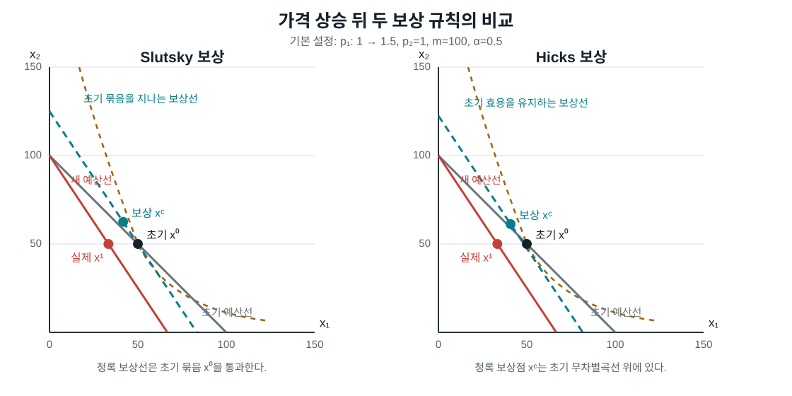

## 목적

가격 변화 뒤의 수요 변화는 대체효과와 소득효과로 나눌 수 있다. 다만 **보상소득을
어떻게 정의하는가**에 따라 유한 변화의 분해식은 달라진다. 아래 도구는 두 재화
Cobb--Douglas 소비자에서 가격, 소득, 선호를 직접 바꾸며 Slutsky 보상과 Hicks
보상을 비교한다.

이 도구는 [1.5 소비자수요의 성질](../microeconomics/ch01-consumer/05-demand-properties.qmd)의
유한 변화 분해를 그림으로 확인하기 위한 보충자료다.

## 조작 도구

<iframe class="interactive-frame" title="Slutsky와 Hicks 보상 비교 도구" src="interactive/slutsky-decomposition/index.html" loading="lazy"></iframe>

### 읽는 법

- 검은 점은 초기 Marshall 수요 \(x^0=d(p^0,m)\), 빨간 점은 가격 변화 뒤의 실제
  Marshall 수요 \(x^1=d(p^1,m)\)이다.
- 청록 점은 선택한 보상소득에서의 수요다. 초기점에서 청록점까지가 대체효과,
  청록점에서 실제점까지가 소득효과다.
- **Slutsky 보상**은 초기 묶음 \(x^0\)을 새 가격에서 살 수 있게
  \(m^S=p^1\cdot x^0\)를 준다. 따라서 초기 효용을 정확히 유지할 필요는 없다.
- **Hicks 보상**은 초기 효용 \(u^0\)를 유지하는 최소지출
  \(m^H=e(p^1,u^0)\)를 준다. 그래서 청록점은 초기 무차별곡선 위에 놓인다.

모형은 \(p_2=1\), \(u(x_1,x_2)=x_1^{\alpha}x_2^{1-\alpha}\)로 고정한다.
Marshall 수요는
\[
d(p,m)=\left(\frac{\alpha m}{p_1},(1-\alpha)m\right)
\]
이고, Hicks 보상은
\[
m^H=\frac{u^0 p_1^{\alpha}}
{\alpha^{\alpha}(1-\alpha)^{1-\alpha}}
\]
로 계산한다.

## 정적 그림

상호작용을 사용할 수 없는 환경을 위한 기본 설정의 비교 그림이다. 왼쪽의
Slutsky 보상선은 초기 묶음을 지나며, 오른쪽의 Hicks 보상점은 초기
무차별곡선 위에 놓인다.

{.supplement-fallback fig-alt="Slutsky와 Hicks 보상을 나란히 비교하는 정적 예산선 그림"}

## 재현과 범위

- 계산 규칙과 기본값은 [메타데이터](../assets/data/slutsky-decomposition-metadata.json)에 기록했다.
- 도구는 외부 라이브러리나 서버를 사용하지 않는 HTML, CSS, JavaScript 파일이다.
- Cobb--Douglas에서는 두 분해를 투명하게 비교할 수 있지만, 일반 효용함수의
  수요를 자동으로 계산하는 도구는 아니다. 일반적인 정의와 부호 조건은
  [1.5절](../microeconomics/ch01-consumer/05-demand-properties.qmd)을 따른다.
