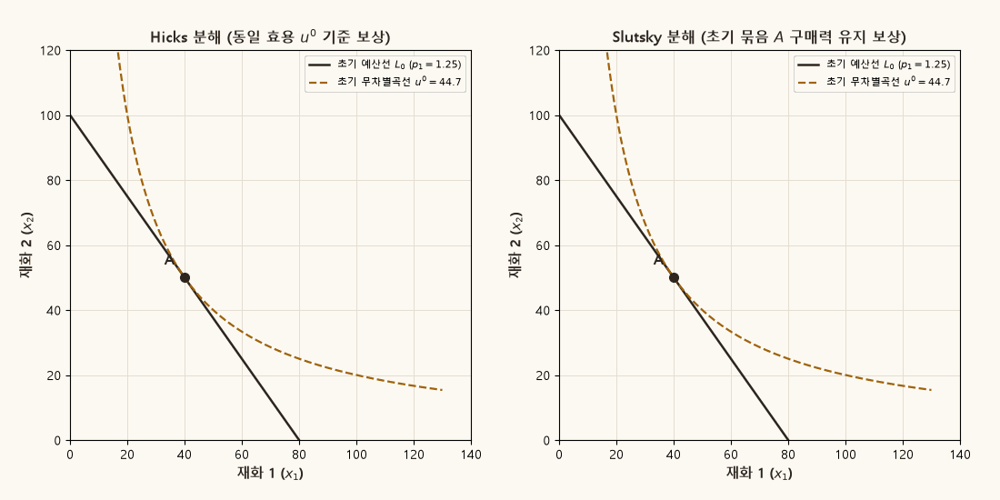
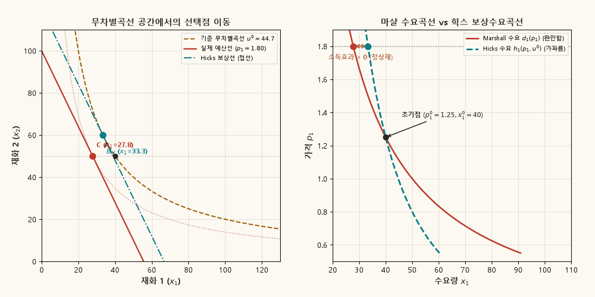

## 목적과 3대 핵심 동학 원리

미시경제학 소비자이론에서 특정 재화의 가격 변화는 두 가지 상이한 경제적 경로를 통해 소비자의 의사결정에 영향을 미칩니다:
1. **상대가격의 변화(Relative Price Effect)**: 다른 재화에 비해 해당 재화가 상대적으로 비싸지거나 저렴해지는 효과.
2. **실질구매력의 변화(Real Purchasing Power Effect)**: 소비자의 명목소득이 일정하더라도 가격 변화로 인해 기회집합(Budget Set)의 크기가 확장되거나 수축하는 효과.

총가격효과(Total Price Effect)를 **대체효과(Substitution Effect)**와 **소득효과(Income Effect)**로 분리해 분석하는 기법은 20세기 경제학의 가장 중요한 방법론적 성취 중 하나입니다. 그러나 **"가격 변화 뒤에 소비자의 실질구매력을 어떻게 보상(Compensation)할 것인가?"**에 대한 조작적 정의에 따라 **Hicks(1939) 분해**와 **Slutsky(1915) 분해**의 두 가지 대표적인 접근법이 존재합니다.

::: {.callout-note appearance="simple"}
### 가격효과 분해의 3대 핵심 명제

1. **보상 규칙과 과정보상 정리 (Over-compensation Theorem)**:
   - **Hicks 보상**: 가격 변화 후에도 소비자가 **원래의 효용 수준($u^0$)을 정확히 유지**하도록 소득을 조정합니다 ($m^H = e(p^1, u^0)$). 이때 보상선은 초기 무차별곡선에 다시 접합니다.
   - **Slutsky 보상**: 가격 변화 후에도 소비자가 **원래의 소비묶음($x^0$)을 정확히 구매**할 수 있도록 소득을 조정합니다 ($m^S = p^1 \cdot x^0$).
   - 소비자의 선호가 강볼록(strictly convex)하다면, 임의의 유한 가격 변화($p^1 \neq p^0$)에서 항상 지출극소화 정리에 의해 **$m^S > m^H$**가 성립합니다. 즉, Slutsky 보상은 소비자를 항상 과잉보상(Over-compensation)하여 초기보다 더 높은 효용($u^S > u^0$)을 누리게 만듭니다.

2. **미분 슬러츠키 방정식과 극한 수렴 (Infinitesimal Equivalence)**:
   가격 변화가 무한소($dp \to 0$)인 국소적(local) 극한에서는 지출함수의 2계 테일러 전개에 의해 Slutsky 대체효과와 Hicks 대체효과가 정확히 일치합니다. 따라서 미분 Slutsky 방정식은 관측 불가능한 힉스 대체효과($\partial h_i / \partial p_j$)를 관측 가능한 마샬 가격탄력성과 소득탄력성으로 환산하는 쌍대성(Duality)의 가교 역할을 합니다.

3. **보상수요의 법칙과 수요곡선의 기울기 (Law of Compensated Demand)**:
   지출함수 $e(p, u)$의 오목성(concavity)에 의해 자기가격 대체효과는 항상 음(또는 0)입니다 ($s_{ii} = \partial h_i / \partial p_i \le 0$). 정상재(Normal Good)의 경우 소득효과가 대체효과와 동일한 방향으로 작용하여 가격효과를 증폭시키므로, **마샬 수요곡선($d_i$)은 힉스 보상수요곡선($h_i$)보다 완만한 기울기(높은 가격탄력성)**를 갖습니다.
:::

관련 교재 본문은 [Chapter 01 · 1.5 소비자수요의 성질](../microeconomics/ch01-consumer/05-demand-properties.qmd)에서 쌍대성(Duality), 지출함수, 셰퍼드 보조정리(Shephard's Lemma) 및 보상수요의 법칙을 다룹니다.

---

## 1. 유한 가격변화와 두 가지 보상 규칙

소비자가 소득 $m$을 가지고 두 재화 $x_1, x_2$를 가격 $p = (p_1, p_2)$에서 소비하고 있다고 가정합니다. 초기 균형점은 마샬 수요 $x^0 = d(p^0, m)$이며, 이때 달성되는 간접효용은 $u^0 = v(p^0, m)$입니다.

이제 1재화의 가격이 $p_1^0$에서 $p_1^1$로 변화했다고 합시다 ($p^0 \to p^1$). 마샬 수요의 총변화(Total Effect)는 다음과 같습니다:

$$
\Delta x = d(p^1, m) - d(p^0, m) = x^1 - x^0.
$$

이 총변화를 분해하기 위해 가격 변화 후 가상의 보상소득 $m^c$를 설정하여, 가상의 중간 선택점 $x^c = d(p^1, m^c)$를 경유합니다:

$$
x^1 - x^0 = \underbrace{\bigl[ d(p^1, m^c) - d(p^0, m) \bigr]}_{\text{대체효과 (Substitution Effect)}} + \underbrace{\bigl[ d(p^1, m) - d(p^1, m^c) \bigr]}_{\text{소득효과 (Income Effect)}}.
$$

보상소득 $m^c$를 어떻게 정의하느냐에 따라 힉스 분해와 슬러츠키 분해로 구분됩니다.

### Hicksian Decomposition: 동일 효용 기준 보상

존 힉스(John Hicks)는 실질소득 불변을 **"소비자가 초기와 동일한 만족도(효용 $u^0$)를 유지하는 것"**으로 정의했습니다. 새 가격체계 $p^1$ 하에서 효용 $u^0$를 달성하는 최소 지출액은 지출함수(Expenditure Function) $e(p, u)$로 주어집니다:

$$
m^H \equiv e(p^1, u^0).
$$

이때의 보상수요는 힉스 수요(Hicksian Compensated Demand) $h(p^1, u^0)$와 정확히 일치합니다:

$$
x^H = d(p^1, m^H) = h(p^1, u^0).
$$

따라서 **힉스 분해(Hicksian Decomposition)**는 다음과 같이 정의됩니다:

$$
x^1 - x^0 = \underbrace{\bigl[ h(p^1, u^0) - d(p^0, m) \bigr]}_{\text{Hicks 대체효과 } (\Delta x^H)} + \underbrace{\bigl[ d(p^1, m) - h(p^1, u^0) \bigr]}_{\text{Hicks 소득효과 } (\Delta x^{H, inc})}.
$$

- **Hicks 대체효과 ($A \to B_H$)**: 동일한 무차별곡선 $u^0$ 상에서 상대가격의 기울기 변화에 따라 접점이 미끄러져 이동하는 순수한 대체 반응입니다.
- **Hicks 소득효과 ($B_H \to C$)**: 새 상대가격을 유지한 채 소득이 $m^H$에서 실제 소득 $m$으로 복원될 때 발생하는 평행이동 반응입니다.

### Slutsky Decomposition: 동일 구매력 기준 보상

에브게니 슬러츠키(Evgeny Slutsky)는 효용함수가 관측 불가능하다는 점에 주목하여, 실질소득 불변을 **"소비자가 초기 소비묶음 $x^0$를 새 가격에서도 정확히 다시 살 수 있는 구매력을 유지하는 것"**으로 정의했습니다:

$$
m^S \equiv p^1 \cdot x^0 = p_1^1 x_1^0 + p_2^1 x_2^0 = m + (p^1 - p^0) \cdot x^0.
$$

따라서 **슬러츠키 분해(Slutsky Decomposition)**는 다음과 같습니다:

$$
x^1 - x^0 = \underbrace{\bigl[ d(p^1, m^S) - d(p^0, m) \bigr]}_{\text{Slutsky 대체효과 } (\Delta x^S)} + \underbrace{\bigl[ d(p^1, m) - d(p^1, m^S) \bigr]}_{\text{Slutsky 소득효과 } (\Delta x^{S, inc})}.
$$

- **Slutsky 대체효과 ($A \to B_S$)**: 초기 소비묶음 $A$를 회전축으로 하여 예산선을 새 가격비율로 회전(pivot)시켰을 때 소비자가 새롭게 선택하는 최적점 $B_S$로의 이동입니다.
- **Slutsky 소득효과 ($B_S \to C$)**: 회전된 가상 예산선을 실제 소득 $m$의 원래 위치로 평행이동(shift)시켰을 때의 이동입니다.

---

## 2. 과정보상 정리 (Over-compensation Theorem)

소비자이론의 핵심 정리 중 하나는 **"임의의 유한 가격 변화에서 Slutsky 보상소득은 항상 Hicks 보상소득보다 엄밀히 크다"**는 사실입니다.

::: {.callout-important appearance="simple"}
### 정리: Slutsky 보상의 과잉보상성 (Over-compensation)

소비자의 선호가 연속적이고 국소 불포화(LNS)를 만족하며 강단조적(strictly monotonic), 강볼록적(strictly convex)이라 하자.
상대가격이 실제로 변화한 임의의 유한 가격 변화($p^1 \neq \lambda p^0$)에 대하여 다음이 성립한다:

1. **보상소득의 부등식**:
   $$
   m^S > m^H \iff p^1 \cdot x^0 > e(p^1, u^0).
   $$
2. **효용 수준의 부등식**:
   $$
   u(x^S) = v(p^1, m^S) > u^0 = v(p^1, m^H).
   $$
:::

::: {.callout-tip collapse="true"}
### 증명 (Proof)
지출함수의 정의에 의해 $e(p^1, u^0)$는 가격 $p^1$ 하에서 효용 $u \ge u^0$를 달성하는 최소 비용입니다:

$$
e(p^1, u^0) \equiv \min_{x} \left\{ p^1 \cdot x \;\middle|\; u(x) \ge u^0 \right\}.
$$

초기 묶음 $x^0$는 $u(x^0) = u^0$를 만족하므로 위 지출극소화 문제의 실현 가능한(feasible) 소비묶음 중 하나입니다. 따라서 정의상:

$$
e(p^1, u^0) \le p^1 \cdot x^0 = m^S.
$$

또한 선호가 강볼록하므로, 새 상대가격 $p^1$ 하에서 $u^0$를 달성하는 최적 해 $x^H = h(p^1, u^0)$는 유일(unique)합니다. 상대가격이 변했으므로 $x^H \neq x^0$입니다. 최적 해가 유일하므로 다른 임의의 실현 가능한 점 $x^0$에서의 지출액은 최소 지출액보다 엄밀히 큽니다:

$$
p^1 \cdot x^0 > p^1 \cdot x^H = e(p^1, u^0) = m^H.
$$

따라서 $m^S > m^H$가 성립합니다. 선호의 강단조성에 의해 간접효용함수는 소득에 대해 엄밀히 증가하므로:

$$
v(p^1, m^S) > v(p^1, m^H) = u^0. \quad \blacksquare
$$
:::

이 정리는 매우 중요한 경제적 의미를 갖습니다. 소비자에게 가격 변화 후 과거의 소비묶음을 살 수 있을 만큼의 명목소득을 전액 보전해 주는 Slutsky 보상은, 소비자로 하여금 상대적으로 저렴해진 재화로 소비를 재배분(대체)할 수 있는 기회를 허용하기 때문에 **실제로는 소비자를 가격 변화 전보다 더 부유하게(더 높은 효용 상태로) 만듭니다.**

---

## 3. 동적 기하학 비교: Hicks vs. Slutsky (Animation)

아래 애니메이션은 Cobb–Douglas 소비자($\alpha=0.5, m=100, p_2=1$)에서 1재화의 가격이 $p_1^0 = 1.25$에서 $p_1^1 = 0.625$로 $50\%$ 급락할 때 발생하는 Hicks 분해와 Slutsky 분해의 전 과정을 나란히 비교하여 보여줍니다.

{#fig-slutsky-hicks .supplement-fallback fig-alt="좌측 패널은 동일 효용 곡선 u0 상에서 접점을 찾는 Hicks 분해를, 우측 패널은 초기 묶음 A를 관통하는 예산선에서 더 높은 효용을 찾는 Slutsky 분해를 보여준다."}

### 애니메이션으로 읽는 두 분해의 단계별 차이

1. **좌측 패널 (Hicks 분해)**:
   - 초기점 $A = (40.0, 50.0)$, 초기 효용 $u^0 \approx 44.72$.
   - 새 가격선 기울기($-p_1^1/p_2 = -0.625$)를 유지하면서 초기 무차별곡선 $u^0$에 접할 때까지 평행이동하면 보상선 $L_H$($m^H \approx 70.71$)와 접점 **$B_H = (56.57, 35.36)$**을 얻습니다.
   - **Hicks 대체효과 ($A \to B_H$)**: $\Delta x_1^H = 56.57 - 40.0 = +16.57$.
   - **Hicks 소득효과 ($B_H \to C$)**: $\Delta x_1^{H, inc} = 80.0 - 56.57 = +23.43$.

2. **우측 패널 (Slutsky 분해)**:
   - 새 가격선이 초기 소비묶음 $A = (40.0, 50.0)$을 반드시 통과하도록 보상소득 $m^S = 0.625 \times 40 + 1 \times 50 = 75.0$을 지급합니다.
   - 보상선 $L_S$는 무차별곡선 $u^0$를 가르고 지나가므로, 소비자는 더 높은 무차별곡선 $u^S \approx 47.43$ 상의 점 **$B_S = (60.0, 37.5)$**를 선택합니다.
   - **Slutsky 대체효과 ($A \to B_S$)**: $\Delta x_1^S = 60.0 - 40.0 = +20.0$.
   - **Slutsky 소득효과 ($B_S \to C$)**: $\Delta x_1^{S, inc} = 80.0 - 60.0 = +20.0$.

3. **기하학적 대조의 핵심**:
   - $B_S(60.0)$는 $B_H(56.57)$보다 더 오른쪽에 위치합니다 ($x_1^S > x_1^H$).
   - Slutsky 보상이 추가적인 소득($m^S - m^H = 75.0 - 70.71 = 4.29$)을 과잉 지급했기 때문에, Slutsky 대체효과 안에는 이미 약간의 소득효과가 내포되어 있습니다.

---

## 4. 미분 Slutsky 방정식의 엄밀한 유도

유한 변화에서는 Hicks와 Slutsky 보상이 서로 다르지만, 가격 변화의 폭이 무한소($dp_j \to 0$)로 축소되는 미분 환경에서는 두 개념이 수학적으로 완전히 수렴합니다.

### 쌍대성(Duality)과 Shephard 보조정리

마샬 수요 $d(p, m)$와 힉스 수요 $h(p, u)$ 사이에는 다음과 같은 기본 쌍대성 항등식이 성립합니다:

$$
h_i(p, \bar{u}) \equiv d_i\bigl(p, e(p, \bar{u})\bigr).
$$

이 식의 양변을 가격 $p_j$에 대하여 편미분하면 연쇄법칙(Chain Rule)에 의해:

$$
\frac{\partial h_i(p, \bar{u})}{\partial p_j} = \frac{\partial d_i\bigl(p, e(p, \bar{u})\bigr)}{\partial p_j} + \frac{\partial d_i\bigl(p, e(p, \bar{u})\bigr)}{\partial m} \frac{\partial e(p, \bar{u})}{\partial p_j}.
$$

여기에 포락선 정리(Envelope Theorem)의 귀결인 **Shephard의 보조정리(Shephard's Lemma)**를 적용합니다:

$$
\frac{\partial e(p, \bar{u})}{\partial p_j} = h_j(p, \bar{u}).
$$

기준 효용을 현재 소득에서 달성되는 간접효용 $\bar{u} = v(p, m)$로 평가하면, $e(p, v(p, m)) = m$이고 $h_j(p, v(p, m)) = d_j(p, m) = x_j$가 성립합니다. 이를 대입하여 이항하면 유명한 **미분 Slutsky 방정식(Differential Slutsky Equation)**이 도출됩니다:

$$
\frac{\partial d_i(p, m)}{\partial p_j} = \underbrace{\frac{\partial h_i(p, u)}{\partial p_j}}_{\text{대체효과 } (s_{ij})} - \underbrace{x_j \frac{\partial d_i(p, m)}{\partial m}}_{\text{소득효과}}.
$$

특히 자기 자신의 가격 변화($i = j$)에 대해서는:

$$
\frac{\partial d_i}{\partial p_i} = \frac{\partial h_i}{\partial p_i} - x_i \frac{\partial d_i}{\partial m}.
$$

---

## 5. Slutsky 대체행렬의 3대 수학적 성질

힉스 수요의 가격 미분들로 구성된 $n \times n$ 행렬 $S = [s_{ij}]$를 **Slutsky 대체행렬(Slutsky Substitution Matrix)**이라 합니다:

$$
s_{ij} \equiv \frac{\partial h_i(p, u)}{\partial p_j} = \frac{\partial^2 e(p, u)}{\partial p_i \partial p_j}.
$$

소비자의 합리적 효용극대화 행동은 Slutsky 행렬에 대해 다음 3가지 강력한 수학적 제약을 부여합니다:

### 1. 음의 준정부호성 (Negative Semi-Definiteness)
지출함수 $e(p, u)$는 가격 벡터 $p$에 대해 **오목함수(Concave)**입니다. 오목함수의 헤시안 행렬(Hessian Matrix)은 항상 음의 준정부호(Negative Semi-Definite)이어야 하므로, 임의의 벡터 $v \in \mathbb{R}^n$에 대해:

$$
v^T S v \le 0.
$$

대각원소($v = e_i$)에 대해 이는 **보상수요의 법칙(Compensated Law of Demand)**을 의미합니다:

$$
s_{ii} = \frac{\partial h_i}{\partial p_i} \le 0.
$$

즉, **보상수요곡선은 예외 없이 반드시 우하향(또는 수평)**합니다. 보상수요에는 기펜재(Giffen good)와 같은 역설이 절대 존재할 수 없습니다.

### 2. 대칭성 (Symmetry)
지출함수가 $C^2$급으로 연속 미분가능하다면, 편미분의 순서 교환에 관한 Clairaut/Young 정리에 의해:

$$
s_{ij} = \frac{\partial^2 e}{\partial p_i \partial p_j} = \frac{\partial^2 e}{\partial p_j \partial p_i} = s_{ji}.
$$

이는 $j$재 가격 변화가 $i$재 보상수요에 미치는 영향과, $i$재 가격 변화가 $j$재 보상수요에 미치는 영향이 완전히 동일함을 의미합니다.

### 3. 0차 동차성에 따른 직교성 (Homogeneity of Degree Zero)
힉스 수요함수는 가격에 대해 0차 동차($h(tp, u) = h(p, u)$)이므로, 오일러 정리(Euler's Theorem)에 의해:

$$
\sum_{j=1}^n p_j \frac{\partial h_i}{\partial p_j} = \sum_{j=1}^n p_j s_{ij} = 0.
$$

---

## 6. 마샬 수요곡선 vs. 힉스 보상수요곡선 (Geometry & Elasticity)

미분 Slutsky 방정식의 자기가격 관계식 $\frac{\partial d_1}{\partial p_1} = \frac{\partial h_1}{\partial p_1} - x_1 \frac{\partial d_1}{\partial m}$은 마샬 수요곡선과 힉스 보상수요곡선의 기하학적 형태를 결정합니다.

재화 1이 **정상재(Normal Good, $\partial d_1 / \partial m > 0$)**인 경우:
- 소득효과 항 $-x_1 \frac{\partial d_1}{\partial m}$은 엄밀히 음수($< 0$)입니다.
- 대체효과 $\frac{\partial h_1}{\partial p_1}$ 역시 음수($\le 0$)입니다.
- 따라서 마샬 가격 민감도는 힉스 가격 민감도보다 더 큰 음수 값을 갖습니다:
  $$
  \frac{\partial d_1}{\partial p_1} < \frac{\partial h_1}{\partial p_1} < 0 \implies \left| \frac{\partial d_1}{\partial p_1} \right| > \left| \frac{\partial h_1}{\partial p_1} \right|.
  $$

일반적인 경제학 그래프는 세로축에 가격 $p_1$, 가로축에 수량 $x_1$을 놓는 역수요(Inverse Demand) 형식을 취합니다. 이 평면에서 곡선의 기울기는 미분의 역수($dp_1 / dx_1$)이므로:

$$
\left| \frac{dp_1}{dx_1} \right|_{\text{Hicks}} = \frac{1}{\left| \frac{\partial h_1}{\partial p_1} \right|} > \frac{1}{\left| \frac{\partial d_1}{\partial p_1} \right|} = \left| \frac{dp_1}{dx_1} \right|_{\text{Marshall}}.
$$

따라서 **정상재의 힉스 보상수요곡선은 마샬 수요곡선보다 그래프 상에서 더 가파르게(비탄력적으로) 그려집니다.**

아래 애니메이션은 가격 $p_1$이 $1.8$에서 $0.6$까지 연속적으로 하락할 때, 상단 패널의 무차별곡선 공간에서의 예산선 회전과 하단 패널의 가격-수요 평면에서 두 수요곡선이 도출되는 동기화 궤적을 보여줍니다.

{#fig-slutsky-demand .supplement-fallback fig-alt="상단 패널은 가격 하락에 따른 실제 예산선과 힉스 보상선의 회전을, 하단 패널은 초기점에서 교차하는 가파른 힉스 수요곡선과 완만한 마샬 수요곡선을 보여준다."}

---

## 7. 재화의 3대 분류와 기펜의 역설 (Giffen's Paradox)

마샬 수요에 대한 자기가격 효과의 부호는 대체효과와 소득효과의 상대적 방향과 크기에 의해 결정됩니다:

$$
\begin{array}{l|c|c|c|l}
\hline
\textbf{재화의 유형} & \textbf{대체효과 } (s_{11}) & \textbf{소득효과 } \left(-x_1 \frac{\partial d_1}{\partial m}\right) & \textbf{총가격효과 } \left(\frac{\partial d_1}{\partial p_1}\right) & \textbf{수요곡선의 형태} \\
\hline
\text{정상재 (Normal Good)} & (-) & (-) \quad [\partial d_1/\partial m > 0] & (-) & \text{우하향 (대체+소득 강화)} \\
\text{일반 열등재 (Inferior Good)} & (-) & (+) \quad [\partial d_1/\partial m < 0] & (-) & \text{우하향 (|대체| > |소득|)} \\
\text{기펜재 (Giffen Good)} & (-) & (+) \quad [\partial d_1/\partial m \ll 0] & (+) & \textbf{우상향} \text{ (|대체| < |소득|)} \\
\hline
\end{array}
$$

::: {.callout-note appearance="simple"}
### 기펜재가 성립하기 위한 2대 필수조건
1. 해당 재화가 강한 **열등재($\partial d_1 / \partial m \ll 0$)**여야 합니다.
2. 해당 재화가 전체 소비지출에서 차지하는 비중(지출비중 $s_1 = p_1 x_1 / m$)이 매우 커서, 가격 변화에 따른 실질소득 변동의 충격($x_1$)이 극대화되어야 합니다.
:::

---

## 8. Cobb–Douglas 경제의 닫힌 해 (Analytical Benchmark)

보충자료의 인터랙티브 도구와 애니메이션에서 사용된 기준 모형은 다음과 같은 2재화 Cobb–Douglas 선호 체계입니다:

$$
u(x_1, x_2) = x_1^{\alpha} x_2^{1-\alpha}, \qquad 0 < \alpha < 1.
$$

### 대수적 폐쇄형 해의 요약

1. **마샬 수요함수**:
   $$
   d_1(p, m) = \frac{\alpha m}{p_1}, \qquad d_2(p, m) = \frac{(1-\alpha) m}{p_2}.
   $$
2. **간접효용함수**:
   $$
   v(p, m) = \left( \frac{\alpha}{p_1} \right)^\alpha \left( \frac{1-\alpha}{p_2} \right)^{1-\alpha} m.
   $$
3. **지출함수**:
   $$
   e(p, u) = \left( \frac{p_1}{\alpha} \right)^\alpha \left( \frac{p_2}{1-\alpha} \right)^{1-\alpha} u.
   $$
4. **힉스 보상수요함수**:
   $$
   h_1(p, u) = \frac{\partial e}{\partial p_1} = \left( \frac{\alpha p_2}{(1-\alpha) p_1} \right)^{1-\alpha} u, \qquad h_2(p, u) = \frac{\partial e}{\partial p_2} = \left( \frac{(1-\alpha) p_1}{\alpha p_2} \right)^\alpha u.
   $$

### 기준 수치 셋업의 계산표 ($\alpha=0.5, m=100, p_2=1$)

#### 시나리오 1: 가격 하락 ($p_1^0 = 1.25 \to p_1^1 = 0.625$) — 애니메이션 기준

| 구분 | 초기 균형 ($A$) | Hicks 보상 ($B_H$) | Slutsky 보상 ($B_S$) | 최종 실제 균형 ($C$) |
|:---|:---:|:---:|:---:|:---:|
| **가격 $p_1$** | $1.25$ | $0.625$ | $0.625$ | $0.625$ |
| **소득 $m$** | $100.0$ | $m^H \approx 70.71$ | $m^S = 75.0$ | $100.0$ |
| **1재화 소비 $x_1$** | $40.0$ | $56.57$ | $60.0$ | $80.0$ |
| **2재화 소비 $x_2$** | $50.0$ | $35.36$ | $37.5$ | $50.0$ |
| **효용 $u$** | $u^0 \approx 44.72$ | $u^0 \approx 44.72$ | $u^S \approx 47.43$ | $u^1 \approx 63.25$ |
| **대체효과 ($\Delta x_1$)** | — | **+16.57** | **+20.00** | — |
| **소득효과 ($\Delta x_1$)** | — | **+23.43** | **+20.00** | — |
| **총가격효과 ($\Delta x_1$)** | — | **+40.00** | **+40.00** | **+40.00** ($80.0 - 40.0$) |

#### 시나리오 2: 가격 상승 ($p_1^0 = 1.0 \to p_1^1 = 1.5$)

| 구분 | 초기 균형 ($A$) | Hicks 보상 ($B_H$) | Slutsky 보상 ($B_S$) | 최종 실제 균형 ($C$) |
|:---|:---:|:---:|:---:|:---:|
| **가격 $p_1$** | $1.0$ | $1.5$ | $1.5$ | $1.5$ |
| **소득 $m$** | $100.0$ | $m^H \approx 122.47$ | $m^S = 125.0$ | $100.0$ |
| **1재화 소비 $x_1$** | $50.0$ | $40.82$ | $41.67$ | $33.33$ |
| **2재화 소비 $x_2$** | $50.0$ | $61.24$ | $62.50$ | $50.00$ |
| **효용 $u$** | $50.0$ | $50.0$ | $u^S \approx 51.03$ | $u^1 \approx 40.82$ |
| **대체효과 ($\Delta x_1$)** | — | **-9.18** | **-8.33** | — |
| **소득효과 ($\Delta x_1$)** | — | **-7.49** | **-8.33** | — |
| **총가격효과 ($\Delta x_1$)** | — | **-16.67** | **-16.67** | **-16.67** ($33.33 - 50.0$) |

---

## 9. 파이썬 애니메이션 재현 안내

본 문서에 수록된 2종의 출판급 동적 애니메이션 GIF는 독립 파이썬 스크립트 [`scripts/generate_slutsky_gifs.py`](../scripts/generate_slutsky_gifs.py)를 통해 언제든지 재생성할 수 있습니다:

```bash
python scripts/generate_slutsky_gifs.py
```
