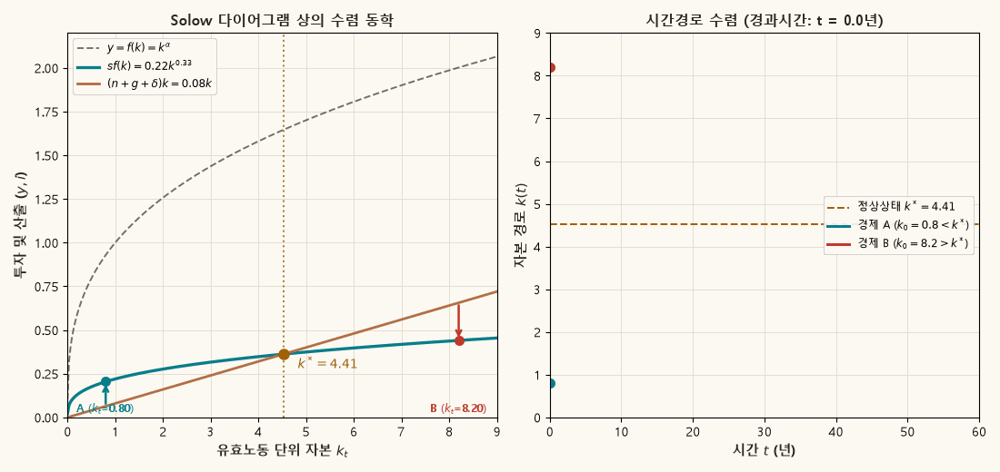
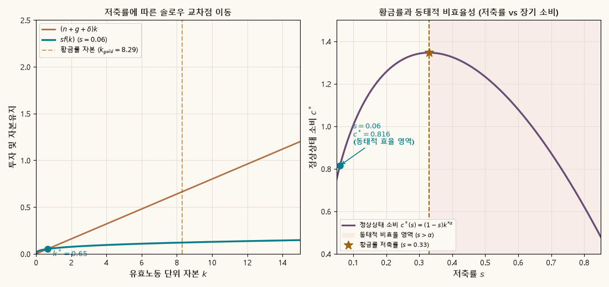
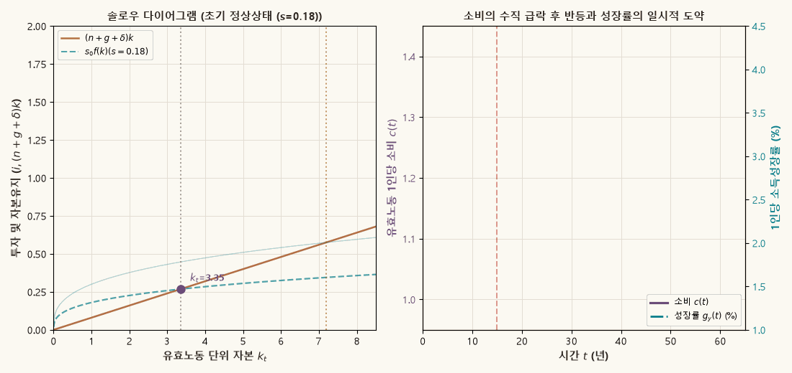

## 목적과 3대 핵심 동학 원리

신고전학파 경제성장론의 출발점인 **Solow–Swan 모형**(Solow 1956, Swan 1956)은 생산요소(자본과 노동) 간의 부드러운 대체 가능성(smooth factor substitutability)을 도입하여, 고정 투입계수를 가정한 Harrod–Domar 모형의 '칼날 균형(knife-edge problem)'을 극복한 획기적인 균형 동학 체계입니다.

Solow 모형에서 경제는 외생적으로 주어진 저축률 $s$와 감가상각률 $\delta$, 인구증가율 $n$, 노동체화 기술진보율 $g$ 하에서 스스로 장기 균형인 **정상상태(Steady State)**로 수렴합니다. 이 동학 체계는 수학적으로 1차원 비선형 상미분방정식(ODE)으로 기술되며, 대역적 안정성(global stability)과 뚜렷한 비교동학적 함의를 갖습니다.

::: {.callout-note appearance="simple"}
### Solow 모형의 3대 핵심 동학 명제

1. **유일성과 대역적 안정성 (Uniqueness & Global Stability)**:
   Inada 조건이 성립하는 신고전학파 생산함수 하에서, 유효노동 1단위당 자본 $k^*$는 양수 구간에서 유일하게 존재하며 **대역적으로 안정적(Globally Asymptotically Stable)**입니다. 즉, 경제가 어떤 임의의 양의 초기 자본 $k_0 > 0$에서 출발하더라도 시간의 경과에 따라 반드시 단 하나의 정상상태 $k^*$로 수렴합니다. (Ramsey 모형과 달리 도약변수(jump variable)가 없으며, 자본 축적 방정식 자체가 단조 수렴하는 1차원 안정 노드(stable node)를 형성합니다.)

2. **수준 효과 vs. 성장 효과 (Level Effect vs. Growth Effect)**:
   저축률 $s$의 영구적인 증가는 장기 정상상태 자본량 $k^*$와 소득 수준 $y^*$를 높이는 **수준 효과(Level Effect)**를 발생시키지만, 장기 정상상태에서의 1인당 소득성장률($g$) 자체는 영구적으로 변화시키지 못합니다. 저축률 상승에 따른 소득성장률의 도약은 새로운 정상상태로 이행하는 과도기(전이경로) 동안에만 일시적으로 나타나는 **이행기 성장 효과(Transitional Growth Effect)**에 불과합니다.

3. **황금률과 동태적 비효율성 (Golden Rule & Dynamic Inefficiency)**:
   정상상태 소비 $c^*$를 극대화하는 자본 스톡을 **황금률 자본($k_{gold}$)**이라 하며, Cobb–Douglas 생산함수에서 이는 저축률이 자본분배율과 일치할 때($s_{gold} = \alpha$) 달성됩니다. 만약 경제의 저축률이 황금률보다 높은 경우($s > \alpha$)에는 자본 과잉축적으로 인해 자본 감가상각 및 희석비용이 한계생산물을 초과하게 되며, 저축률을 낮추는 것만으로도 현재와 미래 모든 세대의 소비를 동시에 늘릴 수 있는 **동태적 비효율성(Dynamic Inefficiency)**에 빠지게 됩니다.
:::

관련 교재 본문은 [Chapter 05 · Solow–Swan 성장모형](../macroeconomics/ch05-solow-swan/contents.qmd)에서 기술진보와 자본축적, 솔로우 잔차(Solow residual) 및 회계적 성장 분해를 다룹니다.

---

## 1. 모형의 환경과 미분방정식 체계

총산출 $Y_t$는 물리적 자본 $K_t$와 유효 노동(Effective Labor) $A_t L_t$를 결합하는 신고전학파 1차 동차(Constant Returns to Scale) 생산함수로 생성됩니다:

$$
Y_t = F(K_t, A_t L_t) = K_t^{\alpha}(A_t L_t)^{1-\alpha}, \qquad 0 < \alpha < 1.
$$

노동 $L_t$와 외생적 노동체화 기술(Harrod-neutral technology) $A_t$는 각각 일정한 비율로 연속시간에서 성장합니다:

$$
\frac{\dot{L}_t}{L_t} = n, \qquad \frac{\dot{A}_t}{A_t} = g.
$$

### 유효노동 단위 변수의 정의와 자본축적식

분석의 편의를 위해 모든 거시 변수를 **유효노동 1단위당(per unit of effective labor)** 값으로 정규화합니다:

$$
k_t \equiv \frac{K_t}{A_t L_t}, \qquad y_t \equiv \frac{Y_t}{A_t L_t} = F\left(\frac{K_t}{A_t L_t}, 1\right) = f(k_t) = k_t^{\alpha}.
$$

자본 $k_t$의 정의식 양변에 자연로그를 취하고 시간에 대해 미분하면:

$$
\ln k_t = \ln K_t - \ln A_t - \ln L_t \implies \frac{\dot{k}_t}{k_t} = \frac{\dot{K}_t}{K_t} - \frac{\dot{A}_t}{A_t} - \frac{\dot{L}_t}{L_t} = \frac{\dot{K}_t}{K_t} - g - n.
$$

총자본의 물리적 축적은 총투자 $I_t = s Y_t$와 물리적 감가상각 $\delta K_t$의 차이이므로:

$$
\dot{K}_t = s Y_t - \delta K_t \implies \frac{\dot{K}_t}{K_t} = s \frac{Y_t}{K_t} - \delta = s \frac{y_t}{k_t} - \delta.
$$

이를 대입하여 정리하면 Solow 모형의 기본 연속시간 미분방정식이 도출됩니다:

$$
\dot{k}_t = s f(k_t) - (n + g + \delta) k_t = s k_t^{\alpha} - (n + g + \delta) k_t.
$$

### 자본유지선과 3중 희석 효과 (Dilution Effects)

항 $(n + g + \delta) k_t$는 유효노동 1단위당 자본량 $k_t$를 일정하게 유지하기 위해 필요한 최소한의 투자(자본유지비용, Break-even Investment)를 의미합니다:

1. **물리적 감가상각 ($\delta k_t$)**: 기계와 건물의 물리적 마모 및 폐기를 보충하기 위한 투자.
2. **인구 증가에 따른 희석 ($n k_t$)**: 매기 새롭게 경제활동에 유입되는 신규 노동자들에게 기존 노동자와 동일한 장비를 지급하기 위한 투자.
3. **기술 진보에 따른 유효노동 희석 ($g k_t$)**: 노동자 1인의 생산 효율성이 높아짐에 따라 유효노동 1단위당 자본 비율을 유지하기 위해 추가로 요구되는 투자.

### 이산시간(Discrete-Time) 표현

시뮬레이션과 수치 분석에서 흔히 활용되는 이산시간 모형에서는 $K_{t+1} = (1-\delta)K_t + s Y_t$와 $A_{t+1} = (1+g)A_t$, $L_{t+1} = (1+n)L_t$의 관계로부터 다음 차분방정식을 얻습니다:

$$
k_{t+1} = \frac{(1-\delta)k_t + s k_t^{\alpha}}{(1+n)(1+g)}.
$$

---

## 2. Cobb–Douglas 경제의 닫힌 해 (Closed-Form Solution)

Solow 방정식 $\dot{k} = s k^\alpha - (n+g+\delta)k$는 일반적으로 비선형이지만, Cobb–Douglas 생산함수에서는 **베르누이 미분방정식(Bernoulli ODE)** 형태를 띠므로 테일러 근사 없이도 전역적으로 엄밀한 닫힌 형태의 해석적 해(exact closed-form solution)를 구할 수 있습니다.

### 베르누이 치환적분 유도

방정식 양변을 $k^\alpha$로 나누면:

$$
k^{-\alpha} \dot{k} + (n+g+\delta) k^{1-\alpha} = s.
$$

새로운 상태변수 $z(t) \equiv k_t^{1-\alpha}$를 정의하면, 시간도함수는 $\dot{z} = (1-\alpha) k^{-\alpha} \dot{k}$가 됩니다. 양변에 $(1-\alpha)$를 곱해 대입하면 다음과 같은 1계 선형 미분방정식(linear ODE)으로 변환됩니다:

$$
\dot{z}_t + (1-\alpha)(n+g+\delta) z_t = (1-\alpha) s.
$$

수렴 속도 모수(speed of convergence)를 $\lambda \equiv (1-\alpha)(n+g+\delta)$로 정의하고, 정상상태 $z^*$를 구하면:

$$
\dot{z}^* = 0 \implies z^* = \frac{(1-\alpha)s}{\lambda} = \frac{s}{n+g+\delta} = (k^*)^{1-\alpha}.
$$

적분인자(integrating factor) $e^{\lambda t}$를 곱하여 적분하면 $z(t)$의 일반해는:

$$
z(t) = z^* + \left( z(0) - z^* \right) e^{-\lambda t}.
$$

이를 원래의 자본 변수 $k(t) = z(t)^{\frac{1}{1-\alpha}}$로 환원하면, 임의의 초기 자본 $k_0$로부터 시작하는 Solow 경제의 정확한 시간경로 해를 얻습니다:

$$
k(t) = \left[ (k^*)^{1-\alpha} + \left( k_0^{1-\alpha} - (k^*)^{1-\alpha} \right) e^{-(1-\alpha)(n+g+\delta)t} \right]^{\frac{1}{1-\alpha}}.
$$

이 해석적 해는 근사 오차가 전혀 없는 엄밀한 식으로, 뒤에서 다룰 선형화 근사와 반감기 계산의 수학적 기초가 됩니다.

---

## 3. 솔로우 다이어그램 상의 동태적 수렴 (Animation)

Solow 다이어그램은 $(k, y)$ 평면에서 실제 투자 곡선 $s f(k)$와 필수 자본유지선 $(n+g+\delta)k$의 교차를 통해 정상상태 $k^*$와 동태적 궤적을 직관적으로 보여줍니다.

- **$k_t < k^*$ (자본 부족 경제)**: 실제 투자가 자본유지선보다 크므로($s f(k_t) > (n+g+\delta)k_t$), 순투자 $\dot{k}_t > 0$가 되어 자본이 오른쪽으로 축적됩니다.
- **$k_t > k^*$ (자본 과잉 경제)**: 실제 투자가 감가상각과 희석을 감당하지 못하므로($s f(k_t) < (n+g+\delta)k_t$), 순투자 $\dot{k}_t < 0$가 되어 자본이 왼쪽으로 감소합니다.

아래 애니메이션은 기준 모수($\alpha=0.33, s=0.22, n=0.01, g=0.02, \delta=0.05$, 정상상태 $k^* \approx 4.41$) 하에서, 자본이 부족한 경제 A($k_0 = 0.8$)와 자본이 과잉된 경제 B($k_0 = 8.2$)가 각각 $k^*$를 향해 대역적으로 수렴하는 동학을 보여줍니다.

{#fig-solow-convergence .supplement-fallback fig-alt="패널 1은 솔로우 다이어그램 상의 투자곡선과 희석선 및 자본축적 방향 화살표를 보여주고, 패널 2는 시간경과에 따른 자본의 안정적 수렴 궤적을 보여준다."}

---

## 4. 황금률(Golden Rule)과 동태적 비효율성

Solow 모형에서 저축률 $s$는 외생적으로 주어지지만, 정책입안자의 관점에서 **"장기 정상상태에서 유효노동 1인당 소비 $c^*$를 극대화하는 저축률은 얼마인가?"**라는 규범적 질문을 던질 수 있습니다.

### 황금률 자본과 황금률 저축률 유도

정상상태에서 유효노동 1인당 소비는 총생산에서 총투자를 뺀 잔여분입니다:

$$
c^* = f(k^*) - s f(k^*) = f(k^*) - (n+g+\delta) k^*.
$$

소비 $c^*$를 $k^*$에 대해 미분하여 1계 조건(First-Order Condition)을 구하면:

$$
\frac{dc^*}{dk^*} = f'(k^*) - (n+g+\delta) = 0 \iff f'(k_{gold}) = n+g+\delta.
$$

즉, **자본의 한계생산물($f'(k^*)$)이 유효 감가상각률($n+g+\delta$)과 일치하는 수준**에서 장기 소비가 극대화되며, 이 자본량을 **황금률 자본($k_{gold}$)**이라 합니다.

Cobb–Douglas 생산함수 $f(k) = k^\alpha$의 경우, 한계생산물은 $f'(k^*) = \alpha k^{*\alpha-1} = \alpha \frac{y^*}{k^*}$입니다. 한편 정상상태 조건에 의해 $(n+g+\delta) = s \frac{y^*}{k^*}$이므로:

$$
\alpha \frac{y^*}{k^*} = s \frac{y^*}{k^*} \iff s_{gold} = \alpha.
$$

따라서 **황금률 저축률은 생산함수의 자본소득 분배율 $\alpha$와 정확히 일치**합니다.

### 동태적 효율성과 과잉축적의 비효율

$$
\begin{array}{l|c|c|l}
\hline
\textbf{영역 구분} & \textbf{자본 수준} & \textbf{저축률} & \textbf{경제적 함의} \\
\hline
\text{동태적 효율 (Modified/Sub-Golden)} & k^* < k_{gold} & s < \alpha & \text{소비 증대를 위해 저축을 늘리려면 단기 소비 희생 필요} \\
\text{황금률 (Golden Rule)} & k^* = k_{gold} & s = \alpha & \text{정상상태 1인당 소비의 대역적 극대치 달성} \\
\text{동태적 비효율 (Over-accumulation)} & k^* > k_{gold} & s > \alpha & \text{과잉자본 유지비용 과다; 저축을 줄이면 즉시 파레토 개선} \\
\hline
\end{array}
$$

만약 $s > \alpha$라면 경제는 자본을 유지하기 위해 산출물보다 더 많은 자본을 낭비하고 있는 상태입니다. 이때 저축률을 낮추면 **충격 당기부터 소비가 즉시 수직으로 증가하고 장기 정상상태 소비 또한 증가**하므로, 모든 세대가 더 잘살게 되는 엄밀한 **파레토 개선(Pareto Improvement)**이 일어납니다.

아래 애니메이션은 저축률 $s$를 $0.08$부터 $0.52$까지 스윕(sweep)할 때 솔로우 다이어그램 교차점의 이동과, 정상상태 소비 $c^*(s)$의 역U자형 포물선 궤적 및 $s > 0.33$에서 발생하는 동태적 비효율 영역을 시각화합니다.

{#fig-solow-golden .supplement-fallback fig-alt="패널 1은 저축률 변화에 따른 솔로우 균형점 이동을, 패널 2는 저축률 대비 정상상태 소비의 역U자형 곡선과 동태적 비효율 영역을 보여준다."}

---

## 5. 테일러 선형화, 수렴 속도 및 반감기

현실 경제에서 가난한 나라가 부유한 나라의 소득 수준을 따라잡는 속도(수렴 속도, Speed of Convergence)를 정량화하기 위해, 정상상태 $k^*$ 주변에서 1계 테일러 전개(Taylor expansion)를 수행합니다.

### 수렴 속도 $\lambda$의 도출

자본축적 미분방정식을 $\dot{k} = G(k) \equiv s f(k) - (n+g+\delta)k$라 둘 때, $k^*$ 근방에서 전개하면:

$$
\dot{k} \approx G(k^*) + G'(k^*)(k - k^*) = 0 + \left[ s f'(k^*) - (n+g+\delta) \right](k - k^*).
$$

정상상태 조건 $s = \frac{(n+g+\delta)k^*}{f(k^*)}$를 대입하면:

$$
G'(k^*) = (n+g+\delta)\left[ \frac{f'(k^*)k^*}{f(k^*)} - 1 \right] = (n+g+\delta)(\alpha - 1) = -(1-\alpha)(n+g+\delta) \equiv -\lambda.
$$

따라서 선형화된 자본 동학은 다음과 같습니다:

$$
\dot{k}_t \approx -\lambda (k_t - k^*) \implies k_t - k^* \approx (k_0 - k^*) e^{-\lambda t}.
$$

### 반감기(Half-Life) 공식

초기 자본 격차 $(k_0 - k^*)$의 절반이 해소되는 데 걸리는 시간 $t_{1/2}$는 다음과 같이 계산됩니다:

$$
e^{-\lambda t_{1/2}} = \frac{1}{2} \iff -\lambda t_{1/2} = -\ln 2 \iff t_{1/2} = \frac{\ln 2}{\lambda} \approx \frac{0.693}{\lambda}.
$$

### 모수 계산과 MRW (1992) 인적자본 퍼즐의 해소

교재의 표준 거시 모수 셋업($\alpha = 0.33, n = 0.01, g = 0.02, \delta = 0.05$)을 적용하면:

$$
\begin{aligned}
\lambda &= (1 - 0.33)(0.01 + 0.02 + 0.05) = 0.67 \times 0.08 = 0.0536 \quad (5.36\%/\text{년}), \\
t_{1/2} &= \frac{0.6931}{0.0536} \approx 12.93\text{년}.
\end{aligned}
$$

즉, 전통적 Solow 모형은 경제가 매년 격차의 약 $5.4\%$를 좁히며, 약 13년이면 격차의 절반이 해소된다고 예측합니다.

::: {.callout-note appearance="simple"}
### Mankiw–Romer–Weil (1992) 실증 퍼즐과 광의의 자본

실제 국가 간 횡단면 데이터(Barro & Sala-i-Martin 1992, Mankiw, Romer & Weil 1992)에서 측정된 조건부 수렴 속도는 **연간 약 $2\%$** 내외에 불과하여, 전통적 Solow 모형의 예측($5.4\%$)보다 현저히 느립니다.

MRW(1992)는 물적 자본 외에 **인적 자본(Human Capital, $H$)**을 모형에 포함하여 이를 해결했습니다 ($Y = K^\alpha H^\beta (AL)^{1-\alpha-\beta}$):
- 물적 자본 분배율 $\alpha \approx 1/3$, 인적 자본 분배율 $\beta \approx 1/3$
- 광의의 자본 분배율: $\alpha + \beta \approx 2/3$
- 수정된 수렴 속도: $\lambda_{MRW} = (1 - \alpha - \beta)(n+g+\delta) = \left(1 - \frac{2}{3}\right) \times 0.08 \approx 2.67\%/\text{년}$
- 수정된 반감기: $t_{1/2} = \frac{0.693}{0.0267} \approx 26.0\text{년}$

자본의 수확체감 강도가 완화됨으로써 실증 데이터의 완만한 수렴 속도와 정확히 일치하게 됩니다.
:::

---

## 6. 전이 동학과 모수 충격 시나리오 (Saving Rate Shock)

경제가 초기 저축률 $s_0 = 0.18$에서 장기 정상상태 $k_0^* \approx 3.32$에 도달해 있던 중, $t = 15$ 시점에 정부의 조세 유인이나 국민적 저축 성향 변화로 저축률이 $s_1 = 0.30$으로 영구히 상승하는 충격이 발생했다고 가정합니다.

### 충격 직후와 전이경로의 변수별 거동

1. **충격 발생 순간 ($t = 15$)**:
   - 자본 $k_{15}$는 과거 투자의 누적물인 상태변수이므로 순간적으로 도약할 수 없습니다 ($k(15^+) = k(15^-)$).
   - 따라서 산출 $y_{15} = k_{15}^\alpha$ 역시 순간적으로 불변입니다.
   - 반면 소비 $c_t = (1-s)y_t$는 저축률이 $0.18$에서 $0.30$으로 상승함에 따라 **즉각적으로 수직 급락(downward jump)**합니다:
     $$
     c(15^-) = (1 - 0.18) y_{15} = 0.82 y_{15} \quad \longrightarrow \quad c(15^+) = (1 - 0.30) y_{15} = 0.70 y_{15}.
     $$
   - 투자는 급증하여 $s_1 f(k) > (n+g+\delta)k$가 되므로, 자본축적이 가속화됩니다 ($\dot{k} > 0$).

2. **전이 과정 ($t > 15$)**:
   - 자본 $k(t)$가 새로운 정상상태 $k_1^* \approx 6.84$를 향해 점진적으로 축적됩니다.
   - 산출 $y(t)$와 1인당 소득성장률은 일시적으로 장기 추세인 $g$를 크게 웃돌며 도약했다가, 자본 한계생산성 체감에 따라 점차 원래의 기술진보율 $g$로 복귀합니다.
   - 소비 $c(t)$는 급락한 바닥에서부터 완만히 반등하여, $s_1 < s_{gold}$이므로 장기적으로는 초기 소비 수준을 능가하는 새로운 균형에 도달합니다.

아래 애니메이션은 저축률 도약 시 솔로우 다이어그램 상의 투자곡선 상방 이동과, 유효노동 1인당 소비의 '급락 후 반등' 궤적 및 소득성장률의 일시적 도약(수준 효과와 성장 효과의 대조)을 명쾌하게 보여줍니다.

{#fig-solow-shock .supplement-fallback fig-alt="패널 1은 저축률 상승에 따른 투자곡선 도약과 자본축적 진행을, 패널 2는 소비의 즉각적 하락 후 반등과 경제성장률의 일시적 도약 후 복귀를 보여준다."}

---

## 7. 대화형 전이경로 탐색 도구

아래 인터랙티브 시뮬레이터는 저축률 $s$, 감가상각률 $\delta$, 초기 자본 $k_0$을 조작하면서 실시간으로 계산되는 자본 및 산출의 이행 경로를 직접 관찰할 수 있는 도구입니다.

<iframe class="interactive-frame" title="Solow 성장모형 전이경로 탐색 도구" src="interactive/solow-growth/index.html" loading="lazy"></iframe>

### 컨트롤 조작과 관찰 포인트

- **저축률 ($s$) 슬라이더**: 저축률을 높이면 투자곡선이 상승하여 정상상태 자본 $k^*$와 산출 $y^*$가 증가하지만, 장기 정상상태 성장률은 변하지 않는 수준 효과를 확인하십시오.
- **감가상각률 ($\delta$) 슬라이더**: 감가상각률이 높아질수록 자본유지선 기울기가 가팔라져 정상상태 자본이 대폭 축소됩니다.
- **초기 자본 ($k_0$) 선택**: 초기 자본이 $k^*$보다 낮으면 상향 수렴, 높으면 하향 수렴하지만, 궁극적인 장기 도착점은 오직 모수들에 의해서만 결정됨을 확인하십시오.

도구에서 사용하는 이산시간 전이식은 다음과 같습니다:

$$
k_{t+1}=\frac{(1-\delta)k_t+s k_t^{\alpha}}{(1+n)(1+g)}, \qquad y_t=k_t^{\alpha}.
$$

---

## 8. 정적 시각화 및 재현 환경

상호작용 캔버스를 지원하지 않는 PDF 출력 또는 모바일 환경을 위한 기본 설정의 정적 전이경로 벤치마크입니다.

{.supplement-fallback fig-alt="Solow 성장모형의 자본 전이경로"}

### 데이터 및 계산 원본 코드

- R 계산 스크립트: [`supplements/r/solow-growth.R`](r/solow-growth.R)
- 시나리오 데이터셋: [`assets/data/solow-growth-scenarios.json`](../assets/data/solow-growth-scenarios.json)
- 모수 메타데이터: [`assets/data/solow-growth-metadata.json`](../assets/data/solow-growth-metadata.json)
- 파이썬 동학 애니메이션 생성기: [`scripts/generate_solow_gifs.py`](../scripts/generate_solow_gifs.py)

프로젝트 루트에서 R 환경이 설정되어 있는 경우 아래 명령어로 격자 데이터와 정적 SVG를 재현할 수 있습니다:

```bash
Rscript supplements/r/solow-growth.R
```

파이썬 애니메이션 GIF 3종은 다음 명령어로 언제든지 재생성할 수 있습니다:

```bash
python scripts/generate_solow_gifs.py
```

---

## 9. 확장 모형과의 연계 안내

Solow 모형은 외생적 저축률과 균일한 기술을 가정하는 단순한 뼈대이지만, 이후 거시경제학 발전의 핵심 징검다리 역할을 합니다:

- **가계의 내생적 소비-저축 최적화**: 저축률이 이자율에 반응하는 일반균형 동학과 안장점 수렴은 [Chapter 07 · Ramsey–Cass–Koopmans 모형](../macroeconomics/ch07-ramsey-cks/contents.qmd) 및 [보충자료 · Ramsey 모형 안장경로](ramsey-saddle-path.qmd)에서 탐색할 수 있습니다.
- **기술진보의 내생화**: 지속적 성장의 원동력인 R&D와 지식 축적은 [Chapter 08 · 내생적 성장모형](../macroeconomics/ch08-endogenous-growth/contents.qmd)에서 다룹니다.
