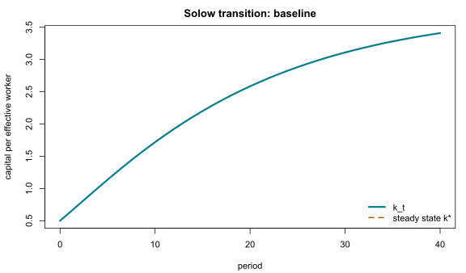

## 목적

Solow 모형에서 저축률 $s$, 감가상각률 $\delta$, 그리고 초기 자본 $k_0$은
서로 다른 역할을 한다. 이 보충자료는 효율노동 단위 자본의 전이식과
정상상태를 분리해 읽기 위해 R로 계산한 시나리오를 제공한다.

관련 본문은 [Chapter 05 · Solow–Swan 성장모형](../macroeconomics/ch05-solow-swan/contents.qmd)이다.

## 조작 도구

<iframe class="interactive-frame" title="Solow 성장모형 전이경로 탐색 도구" src="interactive/solow-growth/index.html" loading="lazy"></iframe>

### 읽는 법

- **저축률**이 높아지면 투자와 정상상태 자본이 증가한다. 이 기준모형에서
  장기 성장률 자체는 바뀌지 않는다.
- **감가상각률**이 높아지면 유지투자가 커져 정상상태 자본이 감소한다.
- **초기 자본**은 전이경로를 바꾸지만, 다른 모수가 같다면 정상상태를 바꾸지 않는다.

도구는 다음 이산시간 전이식을 사용한다.

$$
k_{t+1}=\frac{(1-\delta)k_t+s k_t^{\alpha}}{(1+n)(1+g)},
\qquad y_t=k_t^{\alpha}.
$$

여기서 $k_t$와 $y_t$는 각각 효율노동 단위 자본과 산출이다. 고정된 기준값은
$\alpha=0.33$, $n=0.01$, $g=0.02$이며, 도구는 미리 계산한 저축률·감가상각률·초기자본의
격자에서 경로를 선택한다.

## 정적 그림

상호작용을 사용할 수 없는 환경을 위한 기본 설정의 자본 전이경로다.

{.supplement-fallback fig-alt="Solow 성장모형의 자본 전이경로"}

## 재현과 범위

- 계산 원본: [`supplements/r/solow-growth.R`](r/solow-growth.R)
- 시나리오 데이터: [`assets/data/solow-growth-scenarios.json`](../assets/data/solow-growth-scenarios.json)
- 모수와 실행환경: [`assets/data/solow-growth-metadata.json`](../assets/data/solow-growth-metadata.json)

프로젝트 루트에서 아래 명령으로 데이터와 SVG를 다시 생성할 수 있다.

```r
Rscript supplements/r/solow-growth.R
```

이 도구는 Cobb--Douglas 생산함수와 외생적인 저축률을 가정한 Solow 기준경제다.
내생적 저축, 이행기 후생, 성장률 자체의 결정은 [Chapter 07](../macroeconomics/ch07-ramsey-cks/contents.qmd)와
[Chapter 08](../macroeconomics/ch08-endogenous-growth/contents.qmd)에서 별도로 다룬다.
