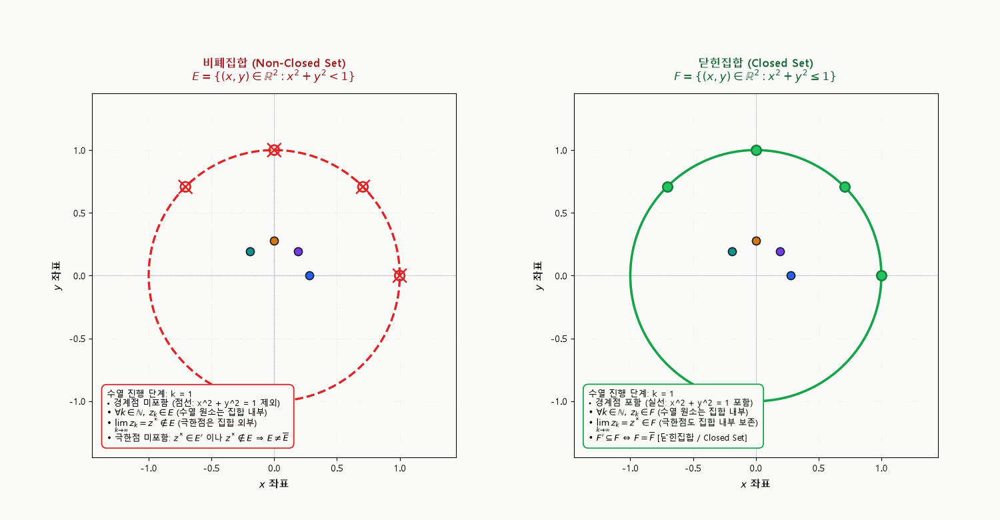
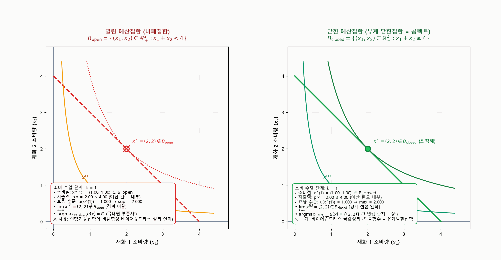

## 목적과 3대 핵심 위상수학 명제

대학원 경제학(미시경제이론·거시경제학·계량경제학) 전반에서 최적화 문제의 해의 존재성(Existence of Solutions), 일반균형의 존재(Arrow–Debreu), 내시 균형의 존재(Nash Equilibrium), 그리고 M-추정량의 일치성(Consistency)을 증명할 때 가장 빈번하게 요구되는 기본 가정이 바로 **집합의 닫힘성(Closedness)**과 **콤팩트성(Compactness)**이다.

그러나 실수선($\mathbb{R}^1$)의 닫힌 구간 $[a, b]$에 머물러 있는 직관만으로는 2차원 이상의 상품 공간($\mathbb{R}_+^L$), 전략 공간($S_i$), 모수 공간($\Theta$)에서 마주치는 기하학적 성질을 온전히 다루기 어렵다. 2차원 평면($\mathbb{R}^2$)에서는 경계 곡선, 내부의 결손점(Punctured points), 고립점(Isolated points), 그리고 다차원 경로를 따라 수렴하는 수열들의 동학이 집합의 구조를 결정하기 때문이다.

본 보충자료는 실수선 예시를 지양하고 **2차원 유클리드 공간($\mathbb{R}^2$)**을 기본 무대로 삼아, **닫힌집합(Closed Set), 폐포(Closure, $\overline{E}$), 도집합(Derived Set, $E'$)**의 상호관계를 수열적 수렴(Sequential Convergence)의 관점에서 엄밀히 정립한다.

::: {.callout-note appearance="simple"}
### 닫힌집합과 위상수학적 극한의 3대 핵심 명제

1. **수열적 완비성과 닫힌집합의 본질**:
   - 집합 $E \subseteq \mathbb{R}^2$가 닫힌집합(Closed set)이라는 것은, $E$의 원소들로 구성된 임의의 수렴 수열 $(z_k)_{k=1}^\infty \subseteq E$에 대해 그 극한점 $z^* = \lim_{k \to \infty} z_k$가 반드시 $E$의 원소로 보존됨($z^* \in E$)과 동치이다.
   - 즉, 닫힌집합은 **"수열의 극한 연산에 대해 닫혀 있는 집합(Closed under sequential limits)"**이다.

2. **도집합($E'$)과 폐포($\overline{E}$)의 유기적 분해**:
   - **도집합(Derived Set, $E'$)**은 집합 $E$ 내부의 서로 다른 점들을 밟으며 다가갈 수 있는 **모든 집적점(Accumulation points)들의 모임**이다. 유클리드 공간에서 도집합 $E'$은 그 자체로 항상 닫힌집합이다($(E')' \subseteq E'$).
   - **폐포(Closure, $\overline{E}$)**는 원래 집합 $E$에 도집합 $E'$을 합집합한 것($\overline{E} = E \cup E'$)이자, $E$를 포함하는 **가장 작은 닫힌 확대집합(Smallest closed superset)**이다. 고립점은 도집합에는 속하지 않지만 원래 집합의 원소이므로 폐포에는 보존된다.

3. **바이어슈트라스 극값정리와 경제학적 필연성**:
   - 목적함수가 연속이더라도 실행가능집합(Feasible set)이 닫혀 있지 않으면, 극대화 수열의 극한이 경계 밖으로 이탈하여 **상한(Supremum, $\sup$)만 존재하고 극대원(Maximizer, $\operatorname{argmax}$)이 존재하지 않는 근본적 실패**가 발생한다.
   - 예산집합이나 생산집합의 닫힘성은 수학적 편의가 아니라 최적 선택과 시장 균형이 물리적으로 존재하기 위한 최소한의 공리적 조건이다.
:::

관련 교재 본문은 [경제학을 위한 수학 제1장 유클리드 공간의 위상](../math-economics/ch01-euclidean-topology/index.qmd)에서 유클리드 위상과 콤팩트성의 공리적 체계를 다루며, [제6장 정적 최적화](../math-economics/ch06-optimization/index.qmd) 및 [제7장 대응과 최대정리](../math-economics/ch07-correspondences/index.qmd)에서 최적화 이론으로 이어진다.

---

## 1. 2차원 유클리드 공간 $\mathbb{R}^2$에서의 기본 위상 구조

### 1.1 유클리드 거리와 열린 공(Open Ball)

2차원 유클리드 공간 $\mathbb{R}^2$ 위의 두 점 $z_1 = (x_1, y_1)$, $z_2 = (x_2, y_2)$ 사이의 거리는 표준 유클리드 노름(Euclidean norm)으로 정의된다:

$$
\|z_1 - z_2\| = \sqrt{(x_1 - x_2)^2 + (y_1 - y_2)^2}.
$$

임의의 중심점 $z_0 \in \mathbb{R}^2$와 반경 $\varepsilon > 0$에 대해, $z_0$를 중심으로 하는 **열린 공(Open Ball)** 또는 $\varepsilon$-근방은 다음과 같다:

$$
B_\varepsilon(z_0) \equiv \{ z \in \mathbb{R}^2 : \|z - z_0\| < \varepsilon \}.
$$

2차원 평면에서 열린 공은 경계 원을 포함하지 않는 원판(Open Disk)을 의미한다.

### 1.2 내점, 외점, 경계점의 위상적 분해

임의의 부분집합 $E \subseteq \mathbb{R}^2$가 주어졌을 때, 전체 공간 $\mathbb{R}^2$의 모든 점 $z$는 $E$와의 상호 관계에 따라 상호 배타적인 세 영역 중 정확히 하나로 분류된다:

1. **내점 (Interior Point)**:
   - 점 $z$를 중심으로 하는 충분히 작은 열린 공 전체가 $E$에 온전히 포함되는 점:
     $$
     z \in \operatorname{int}(E) \iff \exists \varepsilon > 0 \text{ such that } B_\varepsilon(z) \subseteq E.
     $$
2. **외점 (Exterior Point)**:
   - 점 $z$를 중심으로 하는 충분히 작은 열린 공이 $E$와 전혀 만나지 않는 점:
     $$
     z \in \operatorname{ext}(E) \iff \exists \varepsilon > 0 \text{ such that } B_\varepsilon(z) \cap E = \emptyset \iff z \in \operatorname{int}(E^c).
     $$
3. **경계점 (Boundary Point)**:
   - 점 $z$를 중심으로 아무리 작은 열린 공을 잡아도, 그 공이 $E$의 원소와 $E$ 외부의 원소($E^c$)를 동시에 포함하는 점:
     $$
     z \in \partial E \iff \forall \varepsilon > 0, \; B_\varepsilon(z) \cap E \neq \emptyset \quad \text{and} \quad B_\varepsilon(z) \cap E^c \neq \emptyset.
     $$

따라서 전체 공간은 $\mathbb{R}^2 = \operatorname{int}(E) \cup \partial E \cup \operatorname{ext}(E)$로 비연접(disjoint) 분해된다.

### 1.3 열린집합과 닫힌집합의 여집합 정의

::: {.callout-note appearance="simple"}
#### 정의: 열린집합과 닫힌집합 (Open and Closed Sets)
1. 부분집합 $U \subseteq \mathbb{R}^2$가 **열린집합(Open Set)**이라는 것은, $U$의 모든 원소가 내점인 것($U = \operatorname{int}(U)$)을 의미한다:
   $$
   U \text{ is open} \iff \forall z \in U, \; \exists \varepsilon > 0 \text{ such that } B_\varepsilon(z) \subseteq U.
   $$
2. 부분집합 $F \subseteq \mathbb{R}^2$가 **닫힌집합(Closed Set)**이라는 것은, 그 여집합 $F^c = \mathbb{R}^2 \setminus F$가 열린집합인 것으로 정의된다:
   $$
   F \text{ is closed} \iff F^c \text{ is open}.
   $$
:::

> **주의 (Common Misconception)**: 일상 언어에서 '열림'과 '닫힘'은 반의어이지만, 위상수학에서 열린집합과 닫힌집합은 상호 배타적이지 않다.
> - 전체 공간 $\mathbb{R}^2$와 공집합 $\emptyset$은 열린집합인 동시에 닫힌집합(Clopen Set)이다.
> - 반면, 평면 위의 반열린 영역이나 경계의 일부만 포함하는 집합 등 대부분의 임의의 부분집합은 **열린집합도 아니고 닫힌집합도 아니다(Neither open nor closed)**.

---

## 2. 집적점, 고립점, 그리고 도집합($E'$)

### 2.1 집적점(Accumulation Point)의 정의

::: {.callout-note appearance="simple"}
#### 정의: 집적점 / 극한점 (Accumulation Point / Limit Point)
부분집합 $E \subseteq \mathbb{R}^2$와 점 $z \in \mathbb{R}^2$에 대해, $z$를 제외한 임의의 천공 열린 공(Punctured Open Ball) $B_\varepsilon(z) \setminus \{z\}$이 $E$의 원소를 적어도 하나 포함할 때, $z$를 $E$의 **집적점(Accumulation Point)** 또는 **극한점(Limit Point)**이라 한다:

$$
z \in E' \iff \forall \varepsilon > 0, \; \left( B_\varepsilon(z) \setminus \{z\} \right) \cap E \neq \emptyset.
$$
:::

기하학적으로 집적점 $z$는 $z$ 자신을 제외하더라도, $z$의 임의의 근방 안에 $E$의 점들이 무한히 밀집되어 있는 점을 뜻한다.
- **핵심 유의점**: 집적점 $z$는 **원래 집합 $E$에 속할 수도 있고, 속하지 않을 수도 있다**. 예컨대 열린 단위 원판의 경계점들은 집합 $E$에는 없지만 모두 $E$의 집적점이다.

### 2.2 고립점(Isolated Point)의 정의

::: {.callout-note appearance="simple"}
#### 정의: 고립점 (Isolated Point)
점 $z \in E$에 대해, $z$가 $E$의 집적점이 아닐 때($z \notin E'$), $z$를 $E$의 **고립점(Isolated Point)**이라 한다:

$$
z \in E \setminus E' \iff \exists \varepsilon > 0 \text{ such that } B_\varepsilon(z) \cap E = \{z\}.
$$
:::

고립점은 **반드시 원래 집합 $E$의 원소여야 한다**. 충분히 작은 반경 $\varepsilon$을 잡으면 그 공 안에는 자기 자신 외에 $E$의 다른 점이 단 하나도 존재하지 않는다.

### 2.3 집적점의 수열적 동치 정리

::: {.callout-note appearance="simple"}
#### 정리 1: 집적점의 수열적 특성화 (Sequential Characterization of Accumulation Points)
점 $z \in \mathbb{R}^2$가 부분집합 $E \subseteq \mathbb{R}^2$의 집적점인 것($z \in E'$)은, $E$ 내부의 점들 중 $z$와 서로 다른 점들로 이루어진 수열 $(z_k)_{k=1}^\infty \subseteq E \setminus \{z\}$이 존재하여 $z$로 수렴하는 것과 동치이다:

$$
z \in E' \iff \exists (z_k)_{k=1}^\infty \subseteq E \setminus \{z\} \text{ such that } \lim_{k \to \infty} z_k = z.
$$
:::

::: {.callout-tip collapse="true"}
#### 증명 (Proof)

- **$(\Rightarrow)$ 방향**: $z \in E'$라 가정하자.
  각 자연수 $k \in \mathbb{N}$에 대해 반경 $\varepsilon_k = \frac{1}{k} > 0$를 잡는다. 집적점의 정의에 의해, 각 $k$마다
  $$
  z_k \in \left( B_{1/k}(z) \setminus \{z\} \right) \cap E
  $$
  인 원소 $z_k$를 적어도 하나 선택할 수 있다.
  구성상 모든 $k$에 대해 $z_k \in E$이고 $z_k \neq z$이며, $\|z_k - z\| < \frac{1}{k}$이다.
  $k \to \infty$일 때 $\frac{1}{k} \to 0$이므로 조임 정리(Squeeze Theorem)에 의해 $\|z_k - z\| \to 0$, 즉 $\lim_{k \to \infty} z_k = z$이다.

- **$(\Leftarrow)$ 방향**: 수열 $(z_k) \subseteq E \setminus \{z\}$이 존재하여 $z_k \to z$라 하자.
  임의의 $\varepsilon > 0$를 취한다. 수열의 수렴성 정의에 의해, 어떤 자연수 $K \in \mathbb{N}$가 존재하여 모든 $k \ge K$에 대해 $\|z_k - z\| < \varepsilon$이다.
  따라서 $z_K \in B_\varepsilon(z)$이다.
  그런데 애초에 수열의 모든 항은 $z_K \in E$이고 $z_K \neq z$이므로,
  $$
  z_K \in \left( B_\varepsilon(z) \setminus \{z\} \right) \cap E \neq \emptyset.
  $$
  $\varepsilon > 0$가 임의의 양수이므로 $z$는 $E$의 집적점이다 ($z \in E'$). $\blacksquare$
:::

### 2.4 도집합의 닫힘성 정리

::: {.callout-note appearance="simple"}
#### 정리 2: 도집합 자체의 닫힘성 (Closedness of the Derived Set)
임의의 부분집합 $E \subseteq \mathbb{R}^2$에 대해, 그 도집합 $E'$은 항상 닫힌집합이다:
$$
(E')' \subseteq E' \iff E' \text{ is closed in } \mathbb{R}^2.
$$
:::

::: {.callout-tip collapse="true"}
#### 증명 (Proof)

$(E')^c = \mathbb{R}^2 \setminus E'$가 열린집합임을 보이면 충분하다.
임의의 점 $p \in (E')^c$를 택하자. 즉 $p \notin E'$이다.
집적점의 정의의 부정에 의해, 어떤 반경 $r > 0$가 존재하여
$$
\left( B_r(p) \setminus \{p\} \right) \cap E = \emptyset
$$
이다. 즉, $B_r(p)$ 내부에는 $p$ 자신을 제외하면 $E$의 점이 전혀 없다.

이제 임의의 점 $q \in B_r(p)$를 생각하자. $B_r(p)$는 열린집합이므로, 어떤 $\delta > 0$가 존재하여 $B_\delta(q) \subseteq B_r(p)$이다.
그러면 $B_\delta(q) \setminus \{q\} \subseteq B_r(p) \setminus \{p\}$가 성립하므로,
$$
\left( B_\delta(q) \setminus \{q\} \right) \cap E \subseteq \left( B_r(p) \setminus \{p\} \right) \cap E = \emptyset.
$$
이는 $q$ 역시 $E$의 집적점이 될 수 없음($q \notin E'$)을 의미한다.
따라서 $B_r(p) \subseteq (E')^c$가 성립하며, $p$는 $(E')^c$의 내점이다.
$p$가 임의의 점이었으므로 $(E')^c$는 열린집합이며, 그 여집합인 $E'$은 닫힌집합이다. $\blacksquare$
:::

---

## 3. 폐포(Closure, $\overline{E}$)의 3대 동치 특성화

폐포(Closure, $\overline{E}$ 또는 $\operatorname{cl}(E)$)는 위상수학에서 집합 $E$에 '빠져 있는 모든 극한점'들을 보충하여 닫힌집합으로 완성하는 가장 기초적인 연산이다.

::: {.callout-note appearance="simple"}
#### 정리 3: 폐포의 3대 동치 특성화 (Three Equivalent Characterizations of Closure)
임의의 부분집합 $E \subseteq \mathbb{R}^2$에 대해 다음 세 가지 정의는 완전히 동치이다:

1. **위상적 정의 (Topological Characterization)**:
   $E$를 포함하는 모든 닫힌집합들의 교집합 (즉, $E$를 포함하는 가장 작은 닫힌집합):
   $$
   \overline{E}^{(1)} \equiv \bigcap \{ F \subseteq \mathbb{R}^2 : E \subseteq F \text{ and } F \text{ is closed} \}.
   $$

2. **도집합적 정의 (Derived Set Characterization)**:
   원래 집합 $E$와 그 도집합 $E'$의 합집합:
   $$
   \overline{E}^{(2)} \equiv E \cup E'.
   $$

3. **수열적 정의 (Sequential Characterization)**:
   $E$의 원소로 이루어진 모든 수렴 수열들의 극한점들의 집합:
   $$
   \overline{E}^{(3)} \equiv \left\{ z \in \mathbb{R}^2 : \exists (z_k)_{k=1}^\infty \subseteq E \text{ such that } \lim_{k \to \infty} z_k = z \right\}.
   $$
:::

::: {.callout-tip collapse="true"}
#### 동치성 증명 (Proof of Equivalence)

우리는 $\overline{E}^{(2)} \subseteq \overline{E}^{(3)} \subseteq \overline{E}^{(1)} \subseteq \overline{E}^{(2)}$의 순환 포함관계를 보여 세 집합이 동일함을 증명한다.

- **단계 1 ($\overline{E}^{(2)} \subseteq \overline{E}^{(3)}$)**:
  $z \in \overline{E}^{(2)} = E \cup E'$라 하자.
  - $z \in E$인 경우: 모든 $k$에 대해 $z_k = z \in E$인 상수 수열을 잡으면 $z_k \to z$이므로 $z \in \overline{E}^{(3)}$이다.
  - $z \in E'$인 경우: 정리 1에 의해 $z_k \to z$인 수열 $(z_k) \subseteq E \setminus \{z\} \subseteq E$가 존재하므로 $z \in \overline{E}^{(3)}$이다.
  따라서 $\overline{E}^{(2)} \subseteq \overline{E}^{(3)}$.

- **단계 2 ($\overline{E}^{(3)} \subseteq \overline{E}^{(1)}$)**:
  $z \in \overline{E}^{(3)}$라 하자. 즉 $z_k \to z$인 수열 $(z_k) \subseteq E$가 존재한다.
  이제 $E$를 포함하는 임의의 닫힌집합 $F$ ($E \subseteq F$)를 택하자.
  $(z_k) \subseteq E \subseteq F$이므로 수열 $(z_k)$는 닫힌집합 $F$의 원소들로 이루어져 있다.
  $F$가 닫힌집합이므로 수열의 극한 역시 $F$에 속해야 한다 ($z \in F$).
  이 사실은 $E$를 포함하는 모든 닫힌집합 $F$에 대해 성립하므로, $z \in \bigcap \{ F : E \subseteq F, F \text{ closed} \} = \overline{E}^{(1)}$이다.
  따라서 $\overline{E}^{(3)} \subseteq \overline{E}^{(1)}$.

- **단계 3 ($\overline{E}^{(1)} \subseteq \overline{E}^{(2)}$)**:
  $\overline{E}^{(2)} = E \cup E'$ 자체가 닫힌집합임을 보이면, $\overline{E}^{(2)}$는 $E$를 포함하는 닫힌집합 중 하나이므로 정의상 교집합 $\overline{E}^{(1)}$를 포함하게 된다.
  $E \cup E'$의 도집합을 취하면:
  $$
  (E \cup E')' = E' \cup (E')'.
  $$
  정리 2에 의해 $E'$은 닫힌집합이므로 $(E')' \subseteq E'$이다.
  따라서 $(E \cup E')' = E' \subseteq E \cup E'$이다.
  자신의 도집합을 포함하는 집합은 닫힌집합이므로(정리 4 참조), $E \cup E'$는 $E$를 포함하는 닫힌집합이다.
  따라서 $\overline{E}^{(1)} \subseteq \overline{E}^{(2)}$이다.

세 단계에 의해 $\overline{E}^{(1)} = \overline{E}^{(2)} = \overline{E}^{(3)}$가 성립한다. $\blacksquare$
:::

### 3.4 닫힌집합의 4대 동치 판별 조건

::: {.callout-note appearance="simple"}
#### 정리 4: 닫힌집합의 동치 판별 조건 (Equivalent Conditions for Closed Sets)
임의의 부분집합 $E \subseteq \mathbb{R}^2$에 대해 다음 조건들은 상호 동치이다:

1. $E$는 닫힌집합이다 ($E^c$ is open).
2. $E$는 자신의 모든 집적점을 포함한다 ($E' \subseteq E$).
3. $E$는 자신의 폐포와 일치한다 ($E = \overline{E}$).
4. **수열적 닫힘성**: $E$의 원소로 이루어진 임의의 수열 $(z_k) \subseteq E$가 어떤 점 $z^* \in \mathbb{R}^2$로 수렴하면, 그 극한점 $z^*$는 반드시 $E$에 속한다 ($z^* \in E$).
:::

---

## 4. 동적 시뮬레이션으로 보는 수열적 닫힘성과 폐포 연산

이상의 위상수학적 정리를 2차원 평면 $\mathbb{R}^2$ 상에서 직접 검증하기 위해, 경계 포함 여부만 다르고 형태가 동일한 두 집합을 대조하는 동적 시뮬레이션을 제작하였다.

### 4.1 비폐집합 vs 닫힌집합의 수열 충돌 시뮬레이션

{#fig-seq-closedness fig-align="center" width="96%"}

#### 시각자료 구조 및 읽는 법 (Reading Guide)

1. **좌측 패널: 비폐집합 (Non-Closed Set)**
   - **대상 집합**: 열린 단위 원판 $E = \{(x, y) \in \mathbb{R}^2 : x^2 + y^2 < 1\}$.
   - **경계선 표기**: 경계 $x^2 + y^2 = 1$이 집합에서 제외되어 있으므로 붉은색 점선(Dashed curve)으로 렌더링된다.
   - **수열의 동학 ($k = 1, \dots, 20$)**:
     내부의 서로 다른 방향에서 4개의 수열 $z_k^{(1)}, z_k^{(2)}, z_k^{(3)}, z_k^{(4)}$가 각각 경계점 $(1, 0)$, $(0, 1)$, $(1/\sqrt{2}, 1/\sqrt{2})$, $(-1/\sqrt{2}, 1/\sqrt{2})$를 향해 전진한다.
   - **극한점의 이탈 판정**:
     모든 단계 $k \in \mathbb{N}$에서 $z_k \in E$이지만, 수열의 극한점 $z^* = \lim_{k \to \infty} z_k$는 점선 경계 위에 위치하여 **원래 집합에 속하지 않는다 ($z^* \notin E$)**.
     이 극한점들은 모두 도집합의 원소($z^* \in E'$)이므로, 도집합이 원래 집합에 포함되지 않는다 ($E' \not\subseteq E$). 따라서 정리 4에 의해 $E$는 닫힌집합이 아니다.
   - **폐포 연산 단계 (프레임 21~28)**:
     폐포 연산 $\overline{E} = E \cup E'$가 적용되는 순간, 도집합 $E'$에 속하는 경계 원이 실선으로 결합되면서 이탈했던 극한점들이 온전히 집합 내부로 포섭된다 ($z^* \in \overline{E}$).

2. **우측 패널: 닫힌집합 (Closed Set Benchmark)**
   - **대상 집합**: 닫힌 단위 원판 $F = \{(x, y) \in \mathbb{R}^2 : x^2 + y^2 \leq 1\}$.
   - **경계선 표기**: 경계 $x^2 + y^2 = 1$이 포함되어 있으므로 견고한 녹색 실선(Solid curve)으로 렌더링된다.
   - **수열의 보존 판정**:
     좌측과 완전히 동일한 수열들이 동일한 속도로 경계선에 도달하지만, 극한점 $z^*$가 실선 경계 위에 안착하여 **집합 $F$의 원소로 보존된다 ($z^* \in F$)**.
     따라서 $F' \subseteq F \iff F = \overline{F}$가 항등적으로 성립하며, 집합 $F$는 수열의 극한에 대해 완전히 닫혀 있다.

---

## 5. 2차원 평면에서의 대표 벤치마크 예시

### 5.1 예시 1: 결손점(Puncture)과 고립점(Isolated Point)을 포함하는 복합 집합

2차원 평면에서 내부, 경계, 도집합, 폐포의 상호관계를 가장 명확히 보여주는 벤치마크 집합을 정의하자:

$$
E = \underbrace{\left\{ (x, y) \in \mathbb{R}^2 : x^2 + y^2 < 4, \; (x, y) \neq (0, 0) \right\}}_{\text{원점이 결손된 열린 원판}} \;\cup\; \underbrace{\{(3, 2)\}}_{\text{평면 상의 고립점}}.
$$

이 집합의 4대 위상 요소를 분해하면 다음과 같다:

1. **내점 집합 (Interior)**:
   $$
   \operatorname{int}(E) = \left\{ (x, y) \in \mathbb{R}^2 : 0 < x^2 + y^2 < 4 \right\}.
   $$
   원점 $(0, 0)$은 $E$에 속하지 않으므로 내점이 될 수 없고, 고립점 $(3, 2)$는 주위의 임의의 열린 공이 집합 $E$ 밖의 점을 포함하므로 내점이 아니다.
2. **도집합 (Derived Set, $E'$)**:
   - $0 < x^2 + y^2 < 4$인 모든 내점은 집적점이다.
   - 외곽 경계점 $x^2 + y^2 = 4$는 $z_k = \left(2 - \frac{1}{k}\right)(\cos \theta, \sin \theta) \in E$의 수렴 극한이므로 집적점이다.
   - **원점 $(0, 0)$**: 수열 $w_k = \left(\frac{1}{k}, 0\right) \in E \setminus \{(0, 0)\}$이 원점으로 수렴하므로 원점 역시 집적점이다 ($(0, 0) \in E'$).
   - **고립점 $(3, 2)$**: 반경 $\varepsilon = 0.5$를 잡으면 $B_{0.5}(3, 2) \cap E = \{(3, 2)\}$이므로, $(3, 2)$와 다른 $E$의 점으로 이루어진 수열은 존재할 수 없다. 따라서 $(3, 2) \notin E'$이다.
   - 종합하면 도집합은 원점 결손이 메워진 닫힌 원판 전체이다:
     $$
     E' = \left\{ (x, y) \in \mathbb{R}^2 : x^2 + y^2 \leq 4 \right\}.
     $$
3. **폐포 (Closure, $\overline{E} = E \cup E'$)**:
   $$
   \overline{E} = \left\{ (x, y) \in \mathbb{R}^2 : x^2 + y^2 \leq 4 \right\} \cup \{(3, 2)\}.
   $$
   도집합 $E'$에는 속하지 못했던 고립점 $(3, 2)$가 원래 집합 $E$에 포함되어 있었으므로 폐포에 완벽히 보존된다.
4. **경계 (Boundary, $\partial E = \overline{E} \setminus \operatorname{int}(E)$)**:
   $$
   \partial E = \left\{ (x, y) : x^2 + y^2 = 4 \right\} \cup \{(0, 0)\} \cup \{(3, 2)\}.
   $$
   외곽 원주뿐 아니라 중심의 결손점 $(0, 0)$과 외톨이 고립점 $(3, 2)$ 역시 경계점에 속한다.

### 5.2 예시 2: 2차원 격자 수열 집합 (2D Grid Sequence Set)

실수선의 조화수열 집합 $\{1/n\}$을 2차원 평면으로 확장한 다음 집합을 고려하자:

$$
S = \left\{ \left(\frac{1}{m}, \; \frac{1}{n}\right) \in \mathbb{R}^2 : m, n \in \mathbb{N} \right\} \subset \mathbb{R}^2.
$$

1. **모든 원소의 고립성**:
   임의의 점 $z_{m, n} = (1/m, 1/n) \in S$에 대해, 가장 가까운 이웃과의 거리는 양수이다. 반경 $\varepsilon_{m, n} = \min\left\{ \frac{1}{m(m+1)}, \frac{1}{n(n+1)} \right\} > 0$를 취하면 $B_\varepsilon(z_{m, n}) \cap S = \{z_{m, n}\}$이므로, $S$의 **모든 원소는 고립점**이다.
2. **도집합 $S'$의 축 수렴**:
   - $n$을 고정하고 $m \to \infty$로 보내면: $\left(\frac{1}{m}, \frac{1}{n}\right) \to \left(0, \frac{1}{n}\right)$. 따라서 $y$축 위의 점 $\left(0, \frac{1}{n}\right) \in S'$.
   - $m$을 고정하고 $n \to \infty$로 보내면: $\left(\frac{1}{m}, \frac{1}{n}\right) \to \left(\frac{1}{m}, 0\right)$. 따라서 $x$축 위의 점 $\left(\frac{1}{m}, 0\right) \in S'$.
   - $m, n \to \infty$가 동시에 성립하면: $\left(\frac{1}{m}, \frac{1}{n}\right) \to (0, 0)$. 따라서 원점 $(0, 0) \in S'$.
   - 종합하면 도집합은 다음과 같다:
     $$
     S' = \left( \left\{ \frac{1}{m} : m \in \mathbb{N} \right\} \times \{0\} \right) \cup \left( \{0\} \times \left\{ \frac{1}{n} : n \in \mathbb{N} \right\} \right) \cup \{(0, 0)\}.
     $$
3. **폐포 $\overline{S} = S \cup S'$**:
   원래 격자점들과 양 좌표축 상의 극한점들, 그리고 원점이 모두 포함된 집합이 폐포가 된다.

---

## 6. 경제학으로의 확장: 바이어슈트라스 극값정리와 최적화의 수학적 토대

위상수학에서 정립된 닫힌집합의 수열적 완비성은 경제학의 소비자이론과 생산자이론에서 **"극대화 문제의 해가 과연 존재하는가?"**를 판가름하는 절대적인 분수령이 된다.

### 6.1 바이어슈트라스 극값정리 (Weierstrass Extreme Value Theorem)

::: {.callout-note appearance="simple"}
#### 정리 5: 바이어슈트라스 극값정리 (Weierstrass Extreme Value Theorem)
유클리드 공간 $\mathbb{R}^n$의 공집합이 아닌 부분집합 $K \subseteq \mathbb{R}^n$가 **콤팩트(Compact, 즉 유계 닫힌집합)**이고, 함수 $f: K \to \mathbb{R}$가 $K$ 위에서 **연속(Continuous)**이면, $f$는 $K$ 위에서 반드시 최댓값(Maximum)과 최솟값(Minimum)을 달성한다:

$$
\exists x^* \in K \text{ such that } f(x^*) = \max_{x \in K} f(x) = \sup_{x \in K} f(x),
$$
$$
\exists x_* \in K \text{ such that } f(x_*) = \min_{x \in K} f(x) = \inf_{x \in K} f(x).
$$
:::

이 정리에서 목적함수의 연속성만큼이나 결정적인 전제가 바로 **정의역 $K$의 닫힘성(Closedness)**이다. 정의역이 닫혀 있지 않으면, 연속함수라 할지라도 최댓값을 달성하지 못하고 상한(Supremum)에만 무한히 접근하다가 경계 밖으로 이탈하게 된다.

### 6.2 2재화 평면에서의 소비자 최적화 시뮬레이션

이를 입증하기 위해 2재화 평면 $(x_1, x_2) \in \mathbb{R}_+^2$에서 동일한 Cobb–Douglas 효용함수 $u(x_1, x_2) = x_1^{1/2} x_2^{1/2}$와 동일한 가격·소득 체계($p_1=1, p_2=1, w=4$) 하에서, **열린 예산집합**과 **닫힌 예산집합**에서의 소비자 행동을 비교하는 시뮬레이션을 제작하였다.

{#fig-budget-weierstrass fig-align="center" width="96%"}

#### 시뮬레이션의 경제학적 메커니즘 분석

1. **좌측 패널: 열린 예산집합 (Open Budget Set, $B_{\text{open}}$)**
   - **실행가능집합**: $B_{\text{open}} = \{(x_1, x_2) \in \mathbb{R}_+^2 : x_1 + x_2 < 4\}$.
   - **예산선**: $x_1 + x_2 = 4$가 엄격한 부등식으로 인해 제외되어 **붉은색 점선**으로 표시된다.
   - **소비 수열의 전개**:
     소비자는 효용을 높이기 위해 예산 한계에 최대한 근접하는 합리적 수열을 선택한다:
     $$
     x^{(k)} = \left( 1 - \frac{1}{k+1} \right) (2, 2) = \left( 2 - \frac{2}{k+1}, \; 2 - \frac{2}{k+1} \right).
     $$
     모든 단계 $k$에서 지출액은 $p \cdot x^{(k)} = 4 - \frac{4}{k+1} < 4$이므로 $x^{(k)} \in B_{\text{open}}$이다.
     소비자의 효용은 $u(x^{(k)}) = 2 - \frac{2}{k+1}$로 단조증가하며 상한 $\sup_{x \in B_{\text{open}}} u(x) = 2.0$에 수렴한다.
   - **극대해의 부존재 (Non-existence of Maximizer)**:
     수열의 극한점은 $x^* = \lim_{k \to \infty} x^{(k)} = (2, 2)$이다.
     그러나 이 점에서의 지출액은 $1(2) + 1(2) = 4 \nless 4$이므로 **극한점 $x^*$는 열린 예산집합에 속하지 않는다 ($x^* \notin B_{\text{open}}$)**.
     임의의 실행가능한 소비점 $\tilde{x} \in B_{\text{open}}$을 제시하더라도, 그보다 지출액이 조금 더 커서 더 높은 효용을 주는 다른 점이 항상 존재하므로,
     $$
     \operatorname{argmax}_{x \in B_{\text{open}}} u(x) = \emptyset.
     $$
     즉, **상한($\sup$)은 2로 유한하게 존재하지만, 최댓값($\max$)을 주는 극대소비묶음은 존재하지 않는다**.

2. **우측 패널: 닫힌 예산집합 (Closed Budget Set, $B_{\text{closed}}$)**
   - **실행가능집합**: $B_{\text{closed}} = \overline{B_{\text{open}}} = \{(x_1, x_2) \in \mathbb{R}_+^2 : x_1 + x_2 \leq 4\}$.
   - **예산선**: $x_1 + x_2 = 4$가 포함되어 **녹색 실선**으로 표시된다.
   - **바이어슈트라스 정리의 충족**:
     $B_{\text{closed}}$는 $\mathbb{R}_+^2$의 유계 닫힌집합(Bounded and Closed set)이므로 하이네–보렐 정리(Heine–Borel Theorem)에 의해 콤팩트 집합이다.
     소비 수열의 극한점 $x^* = (2, 2)$는 실선 예산선과 무차별곡선의 접점에 정확히 안착하며, $x^* \in B_{\text{closed}}$이다.
     따라서 바이어슈트라스 극값정리에 의해
     $$
     \max_{x \in B_{\text{closed}}} u(x) = 2.0, \qquad \operatorname{argmax}_{x \in B_{\text{closed}}} u(x) = \{(2, 2)\}
     $$
     가 성립하여 최적 소비선택이 유일하게 존재함을 보장받는다.

---

## 7. 대학원 경제학에서의 심화 응용

### 7.1 선호의 연속성과 상위등위집합(Upper Contour Set)의 닫힘성

소비자의 선호관계 $\succsim$가 연속적(Continuous)이라는 공리는 소비 공간 $X = \mathbb{R}_+^L$의 임의의 점 $x$에 대해 다음 두 등위집합이 모두 $X$에서 닫힌집합(Closed sets)인 것으로 정의된다:

1. **상위등위집합 (Upper Contour Set)**: $U_\succsim(x) \equiv \{ y \in X : y \succsim x \}$.
2. **하위등위집합 (Lower Contour Set)**: $L_\succsim(x) \equiv \{ y \in X : x \succsim y \}$.

만약 상위등위집합의 닫힘성이 깨지면, $y_k \succsim x$인 소비 수열 $y_k$가 $y$로 수렴하더라도 극한에서 선호역전이 발생할 수 있다. 대표적인 반례인 **사전편찬식 선호(Lexicographic Preferences)**에서는 상위등위집합이 닫혀 있지 않아(경계의 일부가 누락됨), 이를 표현하는 연속 효용함수 $u(x)$ 자체가 수학적으로 결코 존재할 수 없다 (Debreu 표현 정리 실패).

### 7.2 생산가능집합(Production Set)의 닫힘성과 기술적 실현가능성

생산자이론에서 기업의 기술적 제약을 나타내는 생산가능집합 $Y \subseteq \mathbb{R}^L$의 표준 공리 중 첫 번째는 **$Y$는 닫힌집합이다**이다.
- 경제학적 함의: 실현 가능한 투입–산출 계획들의 수열 $(y_k)_{k=1}^\infty \subseteq Y$가 어떤 한계 계획 $y^*$로 수렴한다면, 그 극한 계획 $y^*$ 역시 기술적으로 실현 가능해야 한다($y^* \in Y$).
- 만약 $Y$가 닫혀 있지 않다면, 기업은 한계비용을 초과하는 이윤을 향해 무한히 접근하면서도 정작 최적 생산계획을 결정할 수 없는 조업 중단 모순에 직면한다.

### 7.3 대응의 닫힌 그래프 성질(Closed Graph Property)과 카쿠타니 고정점 정리

일반균형이론(Arrow–Debreu)과 게임이론(Nash Equilibrium)에서 핵심 도구로 쓰이는 **카쿠타니 고정점 정리(Kakutani's Fixed Point Theorem)**는 다음과 같이 서술된다:

::: {.callout-note appearance="simple"}
#### 카쿠타니 고정점 정리 (Kakutani's Fixed Point Theorem)
$S \subseteq \mathbb{R}^n$가 공집합이 아닌 콤팩트 볼록 집합이고, 대응 $F: S \rightrightarrows S$가 모든 $x \in S$에 대해 공집합이 아닌 닫힌 볼록값(non-empty, closed, convex values)을 가지며, **닫힌 그래프(Closed Graph)**를 만족하면, $F$는 고정점(Fixed point)을 갖는다:
$$
\exists x^* \in S \text{ such that } x^* \in F(x^*).
$$
:::

여기서 대응 $F$가 닫힌 그래프를 가진다는 조건은 정확히 수열적 닫힘성으로 정의된다:

$$
\operatorname{gph}(F) = \{ (x, y) \in S \times S : y \in F(x) \} \text{ is closed} \iff \left[ x_k \to x, \; y_k \to y, \; y_k \in F(x_k) \implies y \in F(x) \right].
$$

수요대응이나 최적대응의 그래프가 닫혀 있지 않다면, 시장 청산 가격 수열이나 상대방 전략에 대한 최적반응 수열의 극한에서 균형조건이 이탈하여 경제학적 균형의 존재 자체가 성립할 수 없다.

---

## 8. 연습 문제 및 자기 평가 (Exercises & Analytical Challenges)

::: {.callout-note collapse="true" title="📝 문제 1. 2차원 평면 집합의 위상적 분해"}
2차원 평면 $\mathbb{R}^2$ 위의 부분집합
$$
A = \left\{ (x, y) \in \mathbb{R}^2 : x \in (0, 1) \cap \mathbb{Q}, \; y = x^2 \right\}
$$
에 대해 다음 질문에 답하시오.

1. 내점 집합 $\operatorname{int}(A)$를 구하시오.
2. 도집합 $A'$을 구하시오.
3. 폐포 $\overline{A}$를 구하고, $A$가 닫힌집합인지 판별하시오.

::: {.callout-tip collapse="true" title="💡 풀이 및 해설"}
1. **내점 집합**: 임의의 점 $z \in A$를 중심으로 하는 임의의 반경 $\varepsilon > 0$의 원판 $B_\varepsilon(z)$은 무리수 $x$ 좌표를 갖는 점을 반드시 포함하므로 $B_\varepsilon(z) \not\subseteq A$이다. 따라서 $\operatorname{int}(A) = \emptyset$.
2. **도집합**: 실수의 조밀성(Density of $\mathbb{Q}$ in $\mathbb{R}$)에 의해, 임의의 $x^* \in [0, 1]$에 대해 $x_k \to x^*$인 유리수 수열 $(x_k) \subseteq (0, 1) \cap \mathbb{Q}$ ($x_k \neq x^*$)을 구성할 수 있다. 포물선 함수 $f(x)=x^2$의 연속성에 의해 $z_k = (x_k, x_k^2) \to (x^*, (x^*)^2)$이다. 따라서 도집합은 닫힌 포물선 호(arc) 전체이다:
   $$
   A' = \left\{ (x, y) \in \mathbb{R}^2 : x \in [0, 1], \; y = x^2 \right\}.
   $$
3. **폐포**: $\overline{A} = A \cup A' = A'$.
   무리수 좌표를 갖는 점들은 $A'$에 속하지만 $A$에는 속하지 않으므로 $A' \not\subseteq A$이다. 따라서 $A \neq \overline{A}$이며, $A$는 닫힌집합이 아니다.
:::
:::

::: {.callout-note collapse="true" title="📝 문제 2. 폐포와 합집합·교집합의 연산 성질"}
임의의 두 부분집합 $A, B \subseteq \mathbb{R}^2$에 대해 다음 명제를 증명하거나 반례를 제시하시오.

1. $\overline{A \cup B} = \overline{A} \cup \overline{B}$.
2. $\overline{A \cap B} = \overline{A} \cap \overline{B}$.

::: {.callout-tip collapse="true" title="💡 풀이 및 해설"}
1. **증명 ($\overline{A \cup B} = \overline{A} \cup \overline{B}$)**:
   - $(\supseteq)$: $A \subseteq A \cup B$이므로 $\overline{A} \subseteq \overline{A \cup B}$이다. 동일하게 $\overline{B} \subseteq \overline{A \cup B}$이다. 따라서 $\overline{A} \cup \overline{B} \subseteq \overline{A \cup B}$.
   - $(\subseteq)$: $\overline{A}$와 $\overline{B}$는 닫힌집합이므로 유한합집합인 $\overline{A} \cup \overline{B}$ 역시 닫힌집합이다. 또한 $A \subseteq \overline{A}$이고 $B \subseteq \overline{B}$이므로 $A \cup B \subseteq \overline{A} \cup \overline{B}$이다. 폐포 $\overline{A \cup B}$는 $A \cup B$를 포함하는 최소의 닫힌집합이므로, $\overline{A \cup B} \subseteq \overline{A} \cup \overline{B}$가 성립한다.
   따라서 양방향에 의해 등호가 성립한다.

2. **반례 (교집합 등호의 불성립)**:
   일반적으로 $\overline{A \cap B} \subseteq \overline{A} \cap \overline{B}$만 성립하고 역방향은 성립하지 않는다.
   - **반례**: 2차원 평면에서 $A = \{(x, y) : y > 0\}$ (상반평면), $B = \{(x, y) : y < 0\}$ (하반평면)을 잡자.
     - $A \cap B = \emptyset$이므로 $\overline{A \cap B} = \overline{\emptyset} = \emptyset$이다.
     - 반면 $\overline{A} = \{(x, y) : y \geq 0\}$, $\overline{B} = \{(x, y) : y \leq 0\}$이므로,
       $$
       \overline{A} \cap \overline{B} = \{ (x, y) : y = 0 \} = x\text{축 전체} \neq \emptyset.
       $$
     따라서 $\overline{A \cap B} \subsetneq \overline{A} \cap \overline{B}$이다.
:::
:::

---

[← 보충자료 목록으로 돌아가기](index.qmd)
